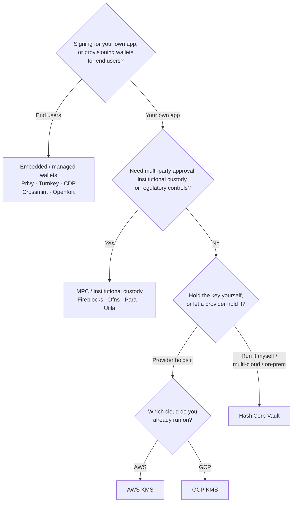

Keychain cung cấp một giao diện `SolanaSigner` thống nhất trên mọi backend, vì
vậy việc lựa chọn mang tính vận hành, không phải kiến trúc — bạn có thể thay đổi
sau thông qua cấu hình. Vì lý do đó, **hãy bắt đầu từ yêu cầu của bạn, không
phải từ một sản phẩm.** Hai câu hỏi quyết định phần lớn: _khóa riêng tư được lưu
ở đâu, và ai được phép ủy quyền chữ ký với nó?_

Không có backend nào là tốt nhất. Mỗi backend phù hợp hơn với một tập hợp các
ràng buộc nhất định — đám mây bạn đang vận hành, liệu bạn có muốn tự quản lý hạ
tầng khóa hay không, và các kiểm soát giám sát và phê duyệt mà bạn cần tuân thủ.
Luồng bên dưới ánh xạ các ràng buộc đó tới một backend.

<Callout type="info">
  Hướng dẫn này đề cập đến việc ký phía backend (server-side). Khi người dùng
  cuối ký giao dịch của họ trên trình duyệt, hãy sử dụng ví thông qua Wallet
  Standard — xem [Ký trong Môi trường
  Production](/docs/core/transactions/signing-in-production).
</Callout>

## Luồng quyết định

<Callout type="info">
  Quá trình phát triển và kiểm thử cục bộ không cần bất kỳ điều nào trong số này
  — hãy sử dụng backend **Memory** để tạo mẫu, sau đó chuyển sang một trong các
  backend production ở trên thông qua cấu hình.
</Callout>

## Đi qua từng câu hỏi

<Steps>

<Step>

### Bạn đang ký cho ứng dụng của chính mình, hay cho người dùng cuối?

Nếu bạn cấp ví mà **người dùng cuối** sở hữu và vận hành (ứng dụng tiêu dùng,
các luồng giới thiệu), hãy sử dụng backend **ví nhúng / được quản lý** — Privy,
Turnkey, CDP, Crossmint, hoặc Openfort. Những backend này quản lý ví theo từng
người dùng và xác thực thay cho bạn.

Nếu bạn đang ký với tư cách là **ứng dụng của chính mình** — một fee payer, một
treasury, hoặc hệ thống tự động hóa backend — hãy tiếp tục bên dưới.

</Step>

<Step>

### Bạn có cần phê duyệt đa bên, lưu ký tổ chức, hoặc kiểm soát tuân thủ không?

Nếu các chữ ký phải được thông qua chính sách phê duyệt, hạn mức chi tiêu, hoặc
quy trình tuân thủ trước khi được tạo ra — hoặc bạn cần một custodian được quản
lý theo quy định nắm giữ khóa — hãy sử dụng backend **MPC / lưu ký tổ chức**:
Fireblocks, Dfns, Para, hoặc Utila. Các giải pháp này phân tách hoặc lưu ký khóa
và đồng ký theo chính sách của bạn.

Nếu bạn chỉ cần một khóa ký theo yêu cầu, hãy tiếp tục bên dưới.

</Step>

<Step>

### Bạn muốn tự nắm giữ khóa, hay để nhà cung cấp nắm giữ?

Nếu bạn muốn nhà cung cấp đám mây nắm giữ khóa trong hạ tầng được hỗ trợ bởi
phần cứng và chính sách IAM của bạn kiểm soát ai có thể ký, hãy sử dụng KMS của
đám mây đó:

- **Chạy trên AWS** → AWS KMS
- **Chạy trên GCP** → GCP KMS

Nếu bạn muốn tự vận hành hạ tầng khóa — hoặc bạn đang dùng đa đám mây hay
on-prem — hãy sử dụng **HashiCorp Vault**. Bạn tự vận hành và kiểm toán; khóa
được lưu bên trong Transit engine và ký theo yêu cầu.

</Step>

</Steps>

## Các mô hình lưu ký

Các backend được nhóm thành năm mô hình lưu ký. Quy trình ở trên sẽ đưa bạn đến
một trong số đó.

- **Tự lưu ký (in-process)** — ứng dụng của bạn nắm giữ khóa riêng tư thô. Tiện
  lợi cho môi trường phát triển, nhưng không phù hợp cho môi trường sản xuất.
  Backend: **Memory**.
- **Quản lý khóa tự vận hành** — bạn tự vận hành hạ tầng khóa; khóa được lưu bên
  trong đó và ký theo yêu cầu. Backend: **HashiCorp Vault**.
- **Cloud KMS / HSM** — nhà cung cấp đám mây lưu trữ khóa trong hạ tầng được hỗ
  trợ bởi phần cứng; khóa không bao giờ rời khỏi dịch vụ và chính sách IAM của
  bạn kiểm soát ai có thể ký. Backends: **AWS KMS**, **GCP KMS**.
- **MPC & lưu ký tổ chức** — khóa được phân tách hoặc lưu ký qua một nhà cung
  cấp, đơn vị này đồng ký theo chính sách của bạn (phê duyệt, hạn mức).
  Backends: **Fireblocks**, **Dfns**, **Para**, **Utila**.
- **Ví nhúng & được quản lý** — nhà cung cấp quản lý ví thay mặt bạn, thường để
  onboard người dùng cuối. Backends: **Privy**, **Turnkey**, **CDP**,
  **Crossmint**, **Openfort**.

## So sánh Backend

| Backend         | Mô hình lưu ký               | Phù hợp nhất cho                                | Ghi chú                                                            |
| --------------- | ---------------------------- | ----------------------------------------------- | ------------------------------------------------------------------ |
| Memory          | Tự lưu ký (trong tiến trình) | Phát triển cục bộ, kiểm thử, CI                 | Khóa thô trong tiến trình — không dùng trong môi trường production |
| HashiCorp Vault | Quản lý khóa tự lưu trữ      | Nhóm vận hành hạ tầng khóa riêng                | Transit engine; bạn tự vận hành và kiểm toán                       |
| AWS KMS         | Cloud KMS / HSM              | Backend chạy trên AWS                           | Khóa không bao giờ rời khỏi KMS; IAM kiểm soát việc ký             |
| GCP KMS         | Cloud KMS / HSM              | Backend chạy trên GCP                           | Khóa không bao giờ rời khỏi KMS; IAM kiểm soát việc ký             |
| Fireblocks      | MPC / lưu ký tổ chức         | Quỹ, sàn giao dịch, lưu ký có kiểm soát         | Policy engine và quy trình phê duyệt                               |
| Dfns            | Hạ tầng ví MPC               | Ví lập trình với kiểm soát chính sách           | Ký Ed25519                                                         |
| Para            | Ví MPC                       | Ứng dụng muốn dùng ví được hỗ trợ bởi MPC       | API key + wallet ID                                                |
| Utila           | MPC custody + đồng ký        | Ví Solana được quản lý bởi Utila                | `signMessage` không được hỗ trợ; bạn tự phát sóng tx               |
| Privy           | Ví nhúng                     | Ứng dụng tiêu dùng onboarding người dùng vào ví | Ví nhúng do ứng dụng quản lý                                       |
| Turnkey         | Quản lý khóa phi lưu ký      | Ký lập trình có kiểm soát chính sách            | Quản lý khóa phi lưu ký                                            |
| CDP             | Ví được quản lý (Coinbase)   | Ứng dụng trên Coinbase Developer Platform       | `signMessage` chỉ nhận payload UTF-8                               |
| Crossmint       | Ví được quản lý              | Marketplace và ứng dụng ví được quản lý         | Ví `smart` và `mpc`; `signMessage` không được hỗ trợ               |
| Openfort        | Ví backend nhúng             | Ví phía server                                  | Khóa lưu trữ trong TEE                                             |

## Các kịch bản doanh nghiệp

Một ứng dụng thường cần nhiều hơn một trong số các tính năng này cùng một lúc.
Vì giao diện hoàn toàn giống nhau, bạn có thể chạy một backend khác nhau cho
từng vai trò mà không cần thay đổi các điểm gọi.

- **Vận hành ngân quỹ** — tách biệt bộ ký "nóng" vận hành với bộ ký "lạnh" của
  ngân quỹ. Hỗ trợ ngân quỹ bằng lưu ký MPC hoặc HSM đám mây và yêu cầu chính
  sách phê duyệt trước khi thực hiện chữ ký có giá trị cao.
- **Quy trình phê duyệt** — các backend MPC và lưu ký (ví dụ: Fireblocks) thực
  thi phê duyệt đa bên trước khi tạo chữ ký.
- **Tuân thủ và kiểm toán** — KMS đám mây (AWS/GCP) và Vault phát sinh nhật ký
  kiểm toán ký; các tổ chức lưu ký thêm chức năng thực thi chính sách và báo
  cáo.
- **Môi trường được quản lý** — lưu trữ tài liệu khóa trong HSM, KMS hoặc tổ
  chức lưu ký để khóa thô không bao giờ tiếp xúc với ứng dụng của bạn.

Xem
[Các phương pháp hay nhất cho môi trường sản xuất](/docs/tools/keychain/production-best-practices)
để vận hành các backend này một cách an toàn.

<Cards>
  <Card title="Hướng dẫn Rust" href="/docs/tools/keychain/getting-started/rust">
    Cấu hình từng backend trong Rust.
  </Card>
  <Card
    title="Hướng dẫn TypeScript"
    href="/docs/tools/keychain/getting-started/typescript"
  >
    Cấu hình từng backend trong TypeScript.
  </Card>
</Cards>
