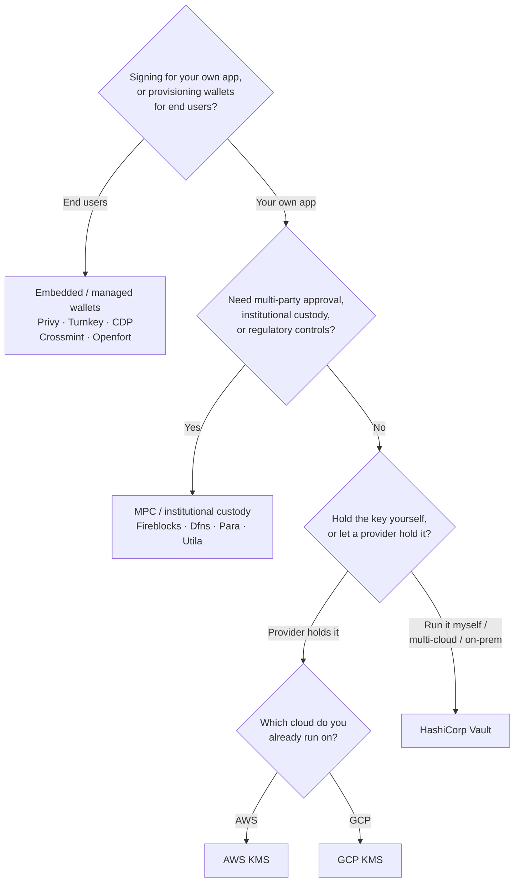

Keychain cung cấp một giao diện `SolanaSigner` duy nhất trên mọi backend, vì vậy
việc lựa chọn mang tính vận hành, không phải kiến trúc — bạn có thể thay đổi sau
này thông qua cấu hình. Vì lý do đó, **hãy bắt đầu từ yêu cầu của bạn, không
phải từ một sản phẩm.** Hai câu hỏi quyết định phần lớn: _khóa riêng tư lưu ở
đâu, và ai được phép ủy quyền chữ ký với nó?_

Không có backend nào là tốt nhất tuyệt đối. Mỗi backend phù hợp hơn với một tập
hợp ràng buộc cụ thể — nền tảng đám mây bạn đang sử dụng, việc bạn có muốn vận
hành cơ sở hạ tầng khóa hay không, và các yêu cầu về quyền giám hộ và kiểm soát
phê duyệt bạn cần đáp ứng. Sơ đồ bên dưới ánh xạ các ràng buộc đó tới một
backend.

<Callout type="info">
  Hướng dẫn này đề cập đến việc ký phía backend (phía máy chủ). Khi người dùng
  cuối ký các giao dịch của họ trên trình duyệt, hãy sử dụng ví thông qua Wallet
  Standard thay thế — xem [Ký trong Môi trường
  Production](/docs/core/transactions/signing-in-production).
</Callout>

## Sơ đồ quyết định

<Callout type="info">
  Môi trường phát triển cục bộ và kiểm thử không cần bất kỳ điều này — hãy sử
  dụng backend **Memory** để tạo mẫu thử nghiệm, sau đó chuyển sang một trong
  các backend production ở trên thông qua cấu hình.
</Callout>

## Xem xét từng câu hỏi

<Steps>

<Step>

### Bạn đang ký cho ứng dụng của chính mình, hay cho người dùng cuối?

Nếu bạn cung cấp ví mà **người dùng cuối** sở hữu và vận hành (ứng dụng dành cho
người tiêu dùng, các luồng onboarding), hãy sử dụng backend **ví nhúng / được
quản lý** — Privy, Turnkey, CDP, Crossmint hoặc Openfort. Các dịch vụ này quản
lý ví theo từng người dùng và xác thực thay mặt bạn.

Nếu bạn đang ký với tư cách là **ứng dụng của chính mình** — người trả phí, kho
bạc, tự động hóa backend — hãy tiếp tục bên dưới.

</Step>

<Step>

### Bạn có cần phê duyệt đa bên, lưu ký tổ chức hay kiểm soát tuân thủ quy định không?

Nếu chữ ký phải được thông qua chính sách phê duyệt, hạn mức chi tiêu hoặc quy
trình tuân thủ trước khi được tạo ra — hoặc bạn cần một đơn vị lưu ký được quản
lý giữ khóa — hãy sử dụng backend **MPC / lưu ký tổ chức**: Fireblocks, Dfns,
Para hoặc Utila. Các giải pháp này phân tách hoặc lưu ký khóa và đồng ký theo
chính sách của bạn.

Nếu bạn chỉ cần một khóa ký theo yêu cầu, hãy tiếp tục bên dưới.

</Step>

<Step>

### Bạn muốn tự giữ khóa, hay để nhà cung cấp giữ?

Nếu nhà cung cấp đám mây nên giữ khóa trong cơ sở hạ tầng được hỗ trợ bởi phần
cứng và chính sách IAM của bạn kiểm soát ai có thể ký, hãy sử dụng KMS của nhà
cung cấp đám mây đó:

- **Chạy trên AWS** → AWS KMS
- **Chạy trên GCP** → GCP KMS

Nếu bạn muốn tự vận hành cơ sở hạ tầng khóa — hoặc bạn đang dùng đa đám mây hay
triển khai tại chỗ — hãy sử dụng **HashiCorp Vault**. Bạn tự vận hành và kiểm
tra; khóa nằm bên trong Transit engine và ký theo yêu cầu.

</Step>

</Steps>

## Các mô hình lưu ký

Các backend được nhóm thành năm mô hình lưu ký. Quy trình trên sẽ đưa bạn vào
một trong số đó.

- **Tự lưu ký (trong tiến trình)** — ứng dụng của bạn giữ khóa riêng tư thô.
  Tiện lợi cho phát triển, nhưng không phù hợp cho môi trường sản xuất. Backend:
  **Memory**.
- **Quản lý khóa tự lưu trữ** — bạn tự vận hành cơ sở hạ tầng khóa; khóa nằm bên
  trong và ký theo yêu cầu. Backend: **HashiCorp Vault**.
- **Cloud KMS / HSM** — nhà cung cấp đám mây lưu trữ khóa trong cơ sở hạ tầng
  được hỗ trợ bởi phần cứng; khóa không bao giờ rời khỏi dịch vụ và chính sách
  IAM của bạn kiểm soát ai có thể ký. Backends: **AWS KMS**, **GCP KMS**.
- **MPC & lưu ký tổ chức** — khóa được phân tách hoặc lưu ký qua nhà cung cấp,
  đơn vị này đồng ký theo chính sách của bạn (phê duyệt, hạn mức). Backends:
  **Fireblocks**, **Dfns**, **Para**, **Utila**.
- **Ví nhúng & được quản lý** — nhà cung cấp quản lý ví thay mặt bạn, thường để
  giúp người dùng cuối tham gia. Backends: **Privy**, **Turnkey**, **CDP**,
  **Crossmint**, **Openfort**.

## So sánh Backend

| Backend         | Mô hình lưu ký               | Phù hợp nhất cho                           | Ghi chú                                                            |
| --------------- | ---------------------------- | ------------------------------------------ | ------------------------------------------------------------------ |
| Memory          | Tự lưu ký (trong tiến trình) | Phát triển cục bộ, kiểm thử, CI            | Khóa thô trong tiến trình — không dùng trong môi trường production |
| HashiCorp Vault | Quản lý khóa tự lưu trữ      | Nhóm vận hành hạ tầng khóa riêng           | Transit engine; bạn tự vận hành và kiểm toán                       |
| AWS KMS         | Cloud KMS / HSM              | Backend chạy trên AWS                      | Khóa không bao giờ rời KMS; IAM kiểm soát ký số                    |
| GCP KMS         | Cloud KMS / HSM              | Backend chạy trên GCP                      | Khóa không bao giờ rời KMS; IAM kiểm soát ký số                    |
| Fireblocks      | MPC / lưu ký tổ chức         | Quỹ, sàn giao dịch, lưu ký được quản lý    | Policy engine và quy trình phê duyệt                               |
| Dfns            | Hạ tầng ví MPC               | Ví lập trình với kiểm soát chính sách      | Ký số Ed25519                                                      |
| Para            | Ví MPC                       | Ứng dụng muốn ví được hỗ trợ bởi MPC       | API key + wallet ID                                                |
| Utila           | MPC custody + đồng ký        | Ví Solana hiện có do Utila quản lý         | `signMessage` không được hỗ trợ; bạn tự broadcast tx               |
| Privy           | Ví nhúng                     | Ứng dụng tiêu dùng giúp người dùng dùng ví | Ví nhúng do ứng dụng quản lý                                       |
| Turnkey         | Quản lý khóa không lưu ký    | Ký số lập trình, kiểm soát bởi chính sách  | Quản lý khóa không lưu ký                                          |
| CDP             | Ví được quản lý (Coinbase)   | Ứng dụng trên Coinbase Developer Platform  | `signMessage` chỉ chấp nhận payload UTF-8                          |
| Crossmint       | Ví được quản lý              | Marketplace và ứng dụng ví được quản lý    | Ví `smart` và `mpc`; `signMessage` không được hỗ trợ               |
| Openfort        | Ví backend nhúng             | Ví phía máy chủ                            | Khóa được lưu trong TEE                                            |

## Các tình huống doanh nghiệp

Một ứng dụng thường cần nhiều hơn một trong số này cùng một lúc. Vì giao diện là
giống nhau, bạn có thể chạy một backend khác nhau cho mỗi vai trò mà không cần
thay đổi các điểm gọi.

- **Hoạt động kho bạc** — tách biệt bộ ký "nóng" vận hành khỏi bộ ký "lạnh" của
  kho bạc. Hỗ trợ kho bạc bằng MPC custody hoặc cloud HSM và yêu cầu chính sách
  phê duyệt trước các chữ ký có giá trị cao.
- **Quy trình phê duyệt** — các backend MPC và custody (ví dụ: Fireblocks) thực
  thi phê duyệt đa bên trước khi chữ ký được tạo ra.
- **Tuân thủ và kiểm toán** — cloud KMS (AWS/GCP) và Vault phát sinh nhật ký
  kiểm toán ký; các tổ chức lưu ký thêm vào thực thi chính sách và báo cáo.
- **Môi trường được quản lý** — giữ tài liệu khóa trong HSM, KMS, hoặc tổ chức
  lưu ký để khóa thô không bao giờ chạm đến ứng dụng của bạn.

Xem
[Các phương pháp tốt nhất cho môi trường sản xuất](/docs/tools/keychain/production-best-practices)
để vận hành các backend này một cách an toàn.

<Cards>
  <Card title="Hướng dẫn Rust" href="/docs/tools/keychain/getting-started/rust">
    Cấu hình từng backend trong Rust.
  </Card>
  <Card
    title="Hướng dẫn TypeScript"
    href="/docs/tools/keychain/getting-started/typescript"
  >
    Cấu hình từng backend trong TypeScript.
  </Card>
</Cards>
