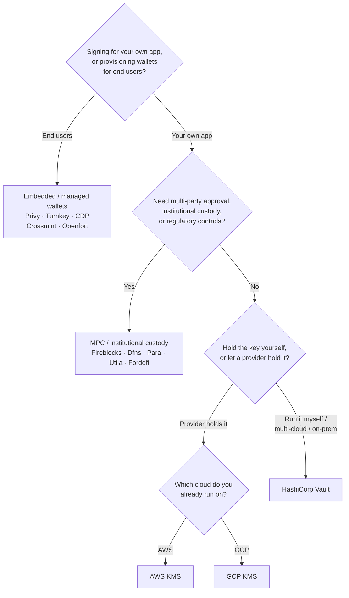

Keychain cung cấp một giao diện cơ sở `SolanaSigner` duy nhất cho mọi backend, nên với
phần lớn các backend, việc lựa chọn mang tính vận hành chứ không phải kiến trúc: bạn có thể thay đổi nó
sau này thông qua cấu hình. Ngoại lệ là dạng giao dịch (transaction shape). Crossmint
và chế độ native auto của Fordefi ký và phát sóng giao dịch ở phía máy chủ, còn chế độ native
manual của Fordefi sẽ viết lại giao dịch trước khi ký, vì vậy việc chuyển sang hoặc rời khỏi một
trong số đó sẽ thay đổi cách bạn gọi signer. Do đó, **hãy bắt đầu từ yêu cầu của bạn, không phải từ một sản phẩm.** Hai câu hỏi quyết định phần lớn lựa chọn: _khóa riêng tư được lưu ở đâu, và ai được phép ủy quyền một chữ ký bằng khóa đó?_

Mọi backend ngoại trừ Ledger đều có sẵn trong cả bốn ngôn ngữ (Rust, TypeScript,
Python và Go). Ledger chỉ hỗ trợ Rust, đằng sau tính năng `ledger` cần bật thủ công.

Không có backend nào là tốt nhất cho mọi trường hợp. Mỗi backend phù hợp hơn với một tập
ràng buộc cụ thể: nền tảng đám mây bạn đang chạy, việc bạn có muốn tự vận hành hạ tầng khóa hay không,
và các cơ chế kiểm soát lưu ký và phê duyệt mà bạn bắt buộc phải có.
Lưu đồ dưới đây ánh xạ các ràng buộc đó tới một backend.

<Callout type="info">
  Hướng dẫn này đề cập đến việc ký ở backend (phía máy chủ). Khi người dùng cuối tự ký
  giao dịch của họ trong trình duyệt, hãy dùng ví thông qua Wallet Standard
  thay thế. Xem [Signing in
  Production](/docs/core/transactions/signing-in-production).
</Callout>

## Luồng quyết định

```mermaid title="Choosing a Keychain backend"
flowchart TD
    Start{Signing for your own app,<br/>or provisioning wallets<br/>for end users?}
    Start -->|End users| Managed[Embedded / managed wallets<br/>Privy · Turnkey · CDP<br/>Crossmint · Openfort]
    Start -->|Your own app| Q2{Need multi-party approval,<br/>institutional custody,<br/>or regulatory controls?}
    Q2 -->|Yes| MPC[MPC / institutional custody<br/>Fireblocks · Dfns · Para · Utila · Fordefi]
    Q2 -->|No| Q3{Hold the key yourself,<br/>or let a provider hold it?}
    Q3 -->|Provider holds it| Q4{Which cloud do you<br/>already run on?}
    Q4 -->|AWS| AWS[AWS KMS]
    Q4 -->|GCP| GCP[GCP KMS]
    Q3 -->|Run it myself /<br/>multi-cloud / on-prem| Vault[HashiCorp Vault]
```

<Callout type="info">
  Môi trường phát triển cục bộ và kiểm thử không cần đến những điều này: hãy dùng backend **Memory**
  để tạo nguyên mẫu, sau đó chuyển sang một trong các backend production ở trên thông qua
  cấu hình.
</Callout>

## Đi qua từng câu hỏi

<Steps>

<Step>

### Bạn ký cho ứng dụng của chính mình hay cho người dùng cuối?

Nếu bạn cấp phát các ví do **người dùng cuối** sở hữu và vận hành (ứng dụng dành cho người tiêu dùng,
quy trình onboarding), hãy dùng backend **ví nhúng / ví được quản lý**: Privy, Turnkey,
CDP, Crossmint hoặc Openfort. Các backend này quản lý ví và xác thực theo từng người dùng
thay cho bạn.

Nếu bạn ký với tư cách **chính ứng dụng của mình** (người trả phí, kho quỹ, tự động hóa
backend), hãy tiếp tục bên dưới.

</Step>

<Step>

### Bạn có cần phê duyệt đa bên, lưu ký tổ chức hoặc các cơ chế kiểm soát tuân thủ quy định không?

Nếu chữ ký phải vượt qua chính sách phê duyệt, hạn mức chi tiêu hoặc quy trình tuân thủ
trước khi được tạo ra, hoặc bạn cần một đơn vị lưu ký được cấp phép nắm giữ
khóa, hãy dùng backend **MPC / lưu ký tổ chức**: Fireblocks, Dfns, Para,
Utila hoặc Fordefi. Các backend này chia nhỏ hoặc lưu ký khóa và đồng ký theo
chính sách của bạn.

Nếu bạn chỉ cần một khóa ký theo yêu cầu, hãy tiếp tục bên dưới.

</Step>

<Step>

### Bạn muốn tự nắm giữ khóa hay để nhà cung cấp nắm giữ?

Nếu một nhà cung cấp đám mây nên nắm giữ khóa trong hạ tầng được bảo vệ bằng phần cứng và
chính sách IAM của bạn kiểm soát ai có thể ký, hãy dùng KMS của đám mây đó:

- **Chạy trên AWS** → AWS KMS
- **Chạy trên GCP** → GCP KMS

Nếu bạn muốn tự vận hành hạ tầng khóa, hoặc bạn dùng đa đám mây hay
on-prem, hãy dùng **HashiCorp Vault**. Bạn tự vận hành và kiểm toán nó; khóa nằm lại bên trong
Transit engine và ký theo yêu cầu.

</Step>

</Steps>

## Các mô hình lưu ký

Các backend được chia thành sáu mô hình lưu ký. Lưu đồ ở trên sẽ đưa bạn đến một trong số
đó.

- **Tự lưu ký (trong tiến trình)**: ứng dụng của bạn nắm giữ khóa riêng tư dạng thô.
  Tiện lợi cho phát triển, nhưng không phù hợp cho production. Backend:
  **Memory**.
- **Tự lưu ký (ví phần cứng)**: khóa không bao giờ rời khỏi thiết bị Ledger, và
  một người xác nhận mọi chữ ký trên màn hình của thiết bị. Phù hợp để operator ký
  tương tác, không phù hợp cho các dịch vụ chạy không giám sát. Chỉ hỗ trợ Rust, cần bật thủ công và không nằm trong phạm vi
  kiểm toán. Backend: **Ledger**.
- **Quản lý khóa tự lưu trữ**: bạn vận hành hạ tầng khóa; khóa
  nằm lại bên trong đó và ký theo yêu cầu. Backend: **HashiCorp Vault**.
- **KMS / HSM trên đám mây**: nhà cung cấp đám mây lưu khóa trong hạ tầng
  được bảo vệ bằng phần cứng; khóa không bao giờ rời khỏi dịch vụ và chính sách IAM của bạn kiểm soát
  ai có thể ký. Backend: **AWS KMS**, **GCP KMS**.
- **MPC & lưu ký tổ chức**: khóa được chia nhỏ hoặc lưu ký tại một
  nhà cung cấp, đơn vị này đồng ký theo chính sách của bạn (phê duyệt, hạn mức).
  Backend: **Fireblocks**, **Dfns**, **Para**, **Utila**, **Fordefi**.
- **Ví nhúng & ví được quản lý**: nhà cung cấp quản lý ví thay cho bạn,
  thường để onboard người dùng cuối. Backend: **Privy**, **Turnkey**, **CDP**,
  **Crossmint**, **Openfort**.

## So sánh Backend

| Backend         | Mô hình lưu ký                  | Phù hợp nhất cho                                     | Ghi chú                                                                                                              |
| --------------- | ------------------------------ | -------------------------------------------- | ------------------------------------------------------------------------------------------------------------------ |
| Memory          | Tự lưu ký (trong tiến trình)      | Phát triển cục bộ, kiểm thử, CI                 | Khóa thô nằm trong tiến trình; không dùng cho production                                                                       |
| Ledger          | Tự lưu ký (ví phần cứng) | Operator ký tương tác từ các công cụ Rust | Chỉ hỗ trợ Rust, cần bật tính năng `ledger`, chưa được kiểm toán; mọi chữ ký đều được xác nhận trên thiết bị                                 |
| HashiCorp Vault | Quản lý khóa tự lưu trữ     | Nhóm vận hành hạ tầng khóa riêng   | Transit engine; bạn tự vận hành và kiểm toán                                                                           |
| AWS KMS         | Cloud KMS / HSM                | Backend chạy trên AWS                      | Khóa không bao giờ rời khỏi KMS; IAM kiểm soát việc ký                                                                         |
| GCP KMS         | Cloud KMS / HSM                | Backend chạy trên GCP                      | Khóa không bao giờ rời khỏi KMS; IAM kiểm soát việc ký                                                                         |
| Fireblocks      | MPC / lưu ký tổ chức    | Quỹ, sàn giao dịch, lưu ký có kiểm soát     | Policy engine và quy trình phê duyệt                                                                               |
| Dfns            | Hạ tầng ví MPC      | Ví lập trình với kiểm soát chính sách    | Ký Ed25519                                                                                                    |
| Para            | Ví MPC                    | Ứng dụng muốn dùng ví được hỗ trợ bởi MPC            | API key + wallet ID                                                                                                |
| Utila           | MPC custody + đồng ký        | Ví Solana được quản lý bởi Utila        | `signMessage` không được hỗ trợ; bạn tự phát sóng tx                                                                    |
| Fordefi         | MPC / lưu ký tổ chức    | Lưu ký tổ chức với kiểm soát chính sách   | Hộp đen: bạn gửi. Native auto: Fordefi viết lại và gửi. Native manual: Fordefi viết lại, bạn gửi kết quả |
| Privy           | Ví nhúng               | Ứng dụng tiêu dùng onboarding người dùng vào ví    | Ví nhúng do ứng dụng quản lý                                                                                       |
| Turnkey         | Quản lý khóa phi lưu ký   | Ký lập trình có kiểm soát chính sách           | Quản lý khóa phi lưu ký                                                                                       |
| CDP             | Ví được quản lý (Coinbase)      | Ứng dụng trên Coinbase Developer Platform      | `signMessage` chỉ nhận payload UTF-8                                                                          |
| Crossmint       | Ví được quản lý                | Marketplace và ứng dụng ví được quản lý         | Chỉ gửi: phát sóng ở phía máy chủ, có thể viết lại để tài trợ phí gas; không hỗ trợ `signMessage`                   |
| Openfort        | Ví backend nhúng       | Ví phía server                          | Khóa lưu trữ trong TEE                                                                                                    |

## Dạng năng lực

Ngoài mô hình lưu ký, mỗi backend có một dạng giao dịch, và dạng này quyết định cách bạn
gọi signer:

- **Sign**: nhà cung cấp ký các byte bạn đã dựng và bạn tự phát sóng chúng. Hầu hết
  các backend, bao gồm Ledger và chế độ hộp đen của Fordefi.
- **Rewrite and sign**: nhà cung cấp viết lại giao dịch, rồi ký
  mà không phát sóng. Hãy tiếp tục từ giao dịch được trả về. Chế độ native
  manual của Fordefi.
- **Sign and broadcast**: nhà cung cấp ký và phát sóng ở phía máy chủ, nên một
  lỗi không có nghĩa là không có gì được ghi nhận. Crossmint và chế độ native auto của Fordefi.

Bảng năng lực của signer trong README của từng ngôn ngữ liệt kê dạng giao dịch của mọi
backend; phần
[mô hình bảo mật](https://github.com/solana-foundation/solana-keychain/blob/main/docs/SECURITY_MODEL.md)
giải thích mỗi dạng đảm bảo điều gì.

## Các kịch bản doanh nghiệp

Một ứng dụng đơn lẻ thường cần nhiều hơn một trong số này cùng lúc. Vì
giao diện được dùng chung, bạn có thể chạy một backend khác nhau cho từng vai trò mà không cần thay đổi
nơi gọi, miễn là các backend có cùng dạng năng lực.

- **Vận hành ngân quỹ** — tách biệt bộ ký "nóng" vận hành với bộ ký "lạnh" của
  ngân quỹ. Hỗ trợ ngân quỹ bằng lưu ký MPC hoặc HSM đám mây và yêu cầu chính
  sách phê duyệt trước khi thực hiện chữ ký có giá trị cao.
- **Quy trình phê duyệt** — các backend MPC và lưu ký (ví dụ: Fireblocks) thực
  thi phê duyệt đa bên trước khi tạo chữ ký.
- **Tuân thủ và kiểm toán** — KMS đám mây (AWS/GCP) và Vault phát sinh nhật ký
  kiểm toán ký; các tổ chức lưu ký thêm chức năng thực thi chính sách và báo
  cáo.
- **Môi trường được quản lý** — lưu trữ tài liệu khóa trong HSM, KMS hoặc tổ
  chức lưu ký để khóa thô không bao giờ tiếp xúc với ứng dụng của bạn.

Xem
[Các phương pháp hay nhất cho môi trường sản xuất](/docs/tools/keychain/production-best-practices)
để vận hành các backend này một cách an toàn.

<Cards>
  <Card title="Hướng dẫn Rust" href="/docs/tools/keychain/getting-started/rust">
    Cấu hình từng backend trong Rust.
  </Card>
  <Card
    title="Hướng dẫn TypeScript"
    href="/docs/tools/keychain/getting-started/typescript"
  >
    Cấu hình từng backend trong TypeScript.
  </Card>
</Cards>
