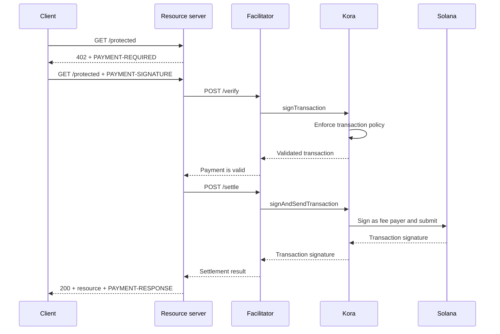

Kora có thể cung cấp lớp ký Solana, chính sách giao dịch và tài trợ phí đằng sau một [facilitator x402 V2](/docs/tools/x402-facilitator). Facilitator triển khai API HTTP x402; Kora xác thực, ký và gửi các giao dịch thanh toán mà nó chấp nhận.

Hướng dẫn này khởi động facilitator Kora tham chiếu trên Solana Devnet. Đây là môi trường phát triển để kiểm thử tích hợp, không phải triển khai sản xuất.

## Kiến trúc



Bốn vai trò ứng dụng vẫn được tách biệt:

- **Client** chọn một yêu cầu thanh toán và ký ủy quyền thanh toán.
- **Resource server** định giá một tuyến đường và thực hiện nó chỉ sau khi xác minh và thanh toán thành công.
- **Facilitator** công khai các endpoint `/supported`, `/verify` và `/settle` của x402.
- **Kora** chỉ ký các giao dịch được phép theo chính sách của nó và có thể tài trợ phí mạng Solana cho chúng.

Kora không thay thế giao thức x402. Đây là ranh giới ký và chính sách được sử dụng bởi triển khai facilitator này.

## Khởi động facilitator tham chiếu

Bạn cần Git và [Docker với Compose](https://docs.docker.com/compose/). Clone bản phát hành Kora ổn định mới nhất và vào thư mục demo x402:

```bash
git clone --branch v2.0.5 --depth 1 https://github.com/solana-foundation/kora.git
cd kora/examples/x402/demo
cp .env.example .env
```

Đặt `KORA_PRIVATE_KEY` trong `.env` thành một keypair Devnet dùng một lần. Cấu hình trình ký của demo chấp nhận một secret base58, một keypair mảng byte, hoặc đường dẫn đến tệp keypair JSON. Nạp SOL Devnet vào địa chỉ công khai của nó để có thể tài trợ phí giao dịch.

<Callout type="caution" title="Sử dụng trình ký Devnet dùng một lần">
  Demo Docker tải trình ký Kora từ một biến môi trường. Không đặt khóa ký sản xuất vào demo này hoặc commit tệp `.env`.
</Callout>

Khởi động Kora và facilitator:

```bash
docker compose up --build
```

Lần build đầu tiên có thể mất vài phút. Khi cả hai kiểm tra sức khỏe đều vượt qua, hãy kiểm tra các khả năng được quảng bá của facilitator từ một terminal khác:

```bash
curl http://127.0.0.1:3000/supported
```

Phản hồi sẽ quảng bá x402 phiên bản `2`, scheme `exact`, và định danh mạng CAIP-2 của Devnet:

```json
{
  "kinds": [
    {
      "x402Version": 2,
      "scheme": "exact",
      "network": "solana:EtWTRABZaYq6iMfeYKouRu166VU2xqa1",
      "extra": {
        "feePayer": "<KORA_SIGNER_ADDRESS>"
      }
    }
  ]
}
```

Kora lắng nghe trên `127.0.0.1:8080` và facilitator lắng nghe trên `127.0.0.1:3000` theo mặc định. Dừng demo bằng `Ctrl+C`.

## Kết nối resource server

Cấu hình resource server x402 để sử dụng facilitator cục bộ và địa chỉ công khai của trình ký Kora làm người nhận:

```bash
FACILITATOR_URL=http://127.0.0.1:3000
SOLANA_PAY_TO=<KORA_SIGNER_ADDRESS>
```

Sau đó làm theo [x402 trên Solana](/docs/payments/agentic-payments/x402) để thêm middleware x402 V2 vào một tuyến Express. Một yêu cầu chưa thanh toán nhận `PAYMENT-REQUIRED`, lần thử lại mang `PAYMENT-SIGNATURE`, và phản hồi thành công mang `PAYMENT-RESPONSE`.

Không sao chép các ví dụ sử dụng `X-PAYMENT`, `X-PAYMENT-RESPONSE`, hoặc tên mạng `solana-devnet`. Những trường đó thuộc về x402 V1.

Kho lưu trữ Kora cũng bao gồm một API được bảo vệ và client nhận biết thanh toán trong cùng thư mục `examples/x402/demo`. Sử dụng những ứng dụng đó khi bạn cần kiểm tra toàn bộ luồng cục bộ.

## Cấu hình chính sách Kora

Tệp `kora/kora.toml` tham chiếu được thiết kế có chủ đích hẹp. Chính sách xác thực của nó kiểm soát:

- những chương trình Solana nào mà trình ký cho phép;
- những token mint SPL nào có thể được sử dụng;
- số lamport và số chữ ký được tài trợ tối đa;
- những thao tác fee-payer nào bị cấm; và
- những extension Token-2022 nào bị từ chối.

Demo chỉ bật các phương thức RPC của Kora mà facilitator cần: `signTransaction`, `signAndSendTransaction`, `getBlockhash`, `getPayerSigner`, `getConfig` và `getVersion`.

Coi chính sách là ranh giới bảo mật cho khóa fee-payer. Đối với dịch vụ sản xuất:

1. Chỉ cho phép những chương trình, token mint và dạng giao dịch mà scheme x402 của bạn tạo ra.
2. Từ chối các lệnh chuyển tiền, thay đổi quyền, đóng tài khoản và các lệnh khác có thể chuyển giá trị từ trình ký Kora.
3. Đặt giới hạn giao dịch và sử dụng để hạn chế tổn thất từ một thông tin đăng nhập facilitator bị xâm phạm.
4. Sử dụng backend trình ký được quản lý thay vì khóa riêng tư được lưu trong biến môi trường.

## Bảo mật kết nối từ facilitator đến Kora

Demo bật xác thực API key của Kora. Facilitator gửi giá trị của `KORA_API_KEY`, phải khớp với `[kora.auth].api_key` trong `kora.toml`.

Đối với sản xuất, cũng cần:

- giữ Kora trên một mạng riêng và kết thúc TLS tại một ranh giới đáng tin cậy;
- lưu trữ thông tin đăng nhập API trong trình quản lý bí mật và luân phiên chúng;
- xem xét xác thực yêu cầu HMAC của Kora để bảo vệ chống giả mạo và phát lại;
- tách biệt các khóa fee-payer và người nhận thanh toán khi mô hình kế toán của bạn yêu cầu; và
- cảnh báo về các lần từ chối chính sách, lỗi thanh toán, mức tiêu thụ phí và số dư trình ký.

## Tăng cường bảo mật thanh toán

Kora xác thực giao dịch Solana, nhưng facilitator và resource server vẫn chịu trách nhiệm về tính đúng đắn của giao thức x402. Trước khi phục vụ một tài nguyên, hãy thực thi:

- phiên bản x402, scheme, mạng, tài sản, số tiền và người nhận đã được chọn;
- thời gian tồn tại của ủy quyền và bố cục lệnh Solana chính xác;
- bảo vệ phát lại nguyên tử và thanh toán idempotent;
- xác nhận ở mức cam kết mà sản phẩm yêu cầu; và
- ánh xạ bền vững giữa giao dịch mua, kết quả thanh toán và thực hiện.

Không trả về nội dung đã thanh toán chỉ vì Kora đã chấp nhận một giao dịch để ký. Chỉ thực hiện sau khi facilitator trả về kết quả thanh toán thành công.

## Tài nguyên liên quan

- [Kho lưu trữ Kora và demo x402](https://github.com/solana-foundation/kora/tree/main/examples/x402/demo)
- [Cấu hình vận hành Kora](/docs/tools/kora/operators/configuration)
- [Backend trình ký Kora](/docs/tools/kora/operators/signers)
- [Kiểm tra bảo mật Kora](/docs/tools/kora/security-audits)
- [Đặc tả x402 V2](https://github.com/x402-foundation/x402/blob/main/specs/x402-specification-v2.md)
- [Tổng quan về thanh toán tác nhân](/docs/payments/agentic-payments)
