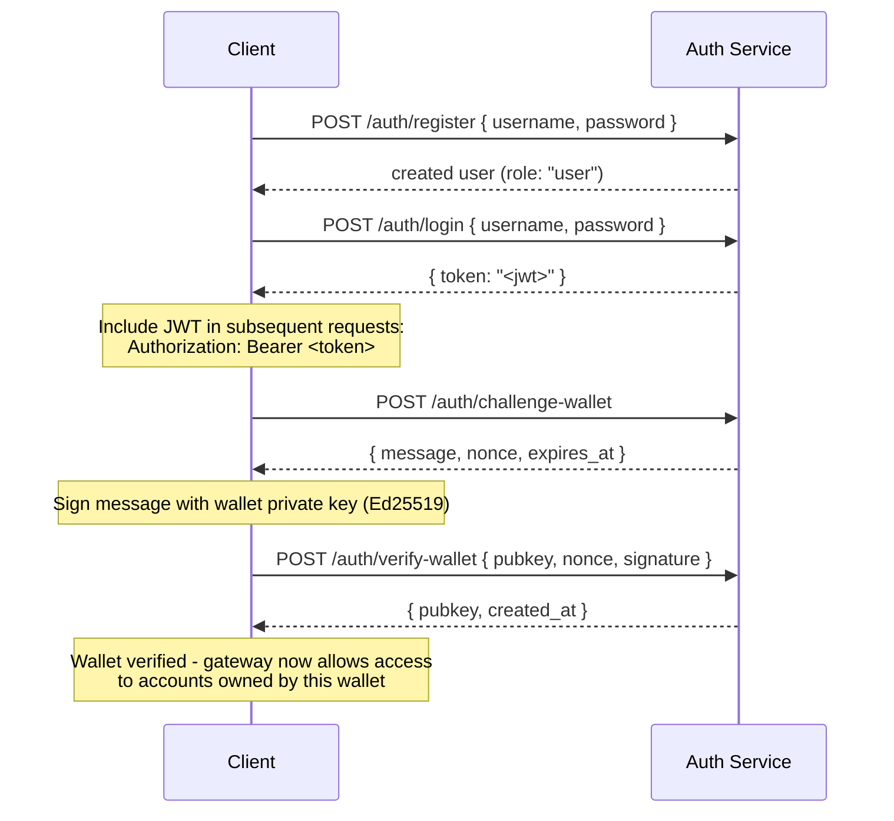

## Tổng quan

Private Channels bao gồm một Auth Service tùy chọn giúp kiểm soát quyền truy cập gateway
bằng xác thực JWT và kiểm soát truy cập dựa trên vai trò (RBAC). Khi
xác thực bị tắt, gateway chấp nhận tất cả các kết nối. Khi được bật,
client phải cung cấp JWT hợp lệ trong mỗi yêu cầu.

Trang này dành cho cả hai đối tượng:

- **Nhà phát triển** - đăng ký, đăng nhập, xác minh ví, và thực hiện
  các yêu cầu đã xác thực
- **Người vận hành** - bật auth service, cấu hình `JWT_SECRET`, và
  cấp phát vai trò `operator`

## Bật tính năng xác thực

Xác thực được bật bằng cách thiết lập `JWT_SECRET` (khác rỗng) cho cả
gateway và Auth Service. Auth Service cũng yêu cầu
`AUTH_DATABASE_URL`.

Khi `JWT_SECRET` không được thiết lập, gateway hoạt động ở chế độ mở; không cần token.

> **Docker Compose:** Auth service là một Docker Compose profile và **mặc định
> không được khởi động**. Để bao gồm nó, hãy truyền `--profile auth` vào lệnh
> `docker compose` của bạn, bao gồm `--env-file .env` để các secret như
> `JWT_SECRET` và `POSTGRES_PASSWORD` được phân giải đúng (Compose tắt tính năng
> tự động tải `.env` khi có bất kỳ cờ `--env-file` nào được truyền vào):
>
> ```bash
> docker compose -f docker-compose.devnet.yml --env-file versions.env --env-file .env.devnet --env-file .env --profile auth up -d
> ```

## API Auth Service

Tất cả các endpoint đều nằm dưới `/auth`. Auth service lắng nghe trên `AUTH_PORT`
(mặc định là `8903`).

### `POST /auth/register`

Tạo tài khoản mới. Tất cả người dùng được đăng ký với vai trò `user`.

```json
{ "username": "alice", "password": "hunter2" }
```

- Tên người dùng: 5-32 ký tự, chữ và số cộng với `_` và `-`
- Mật khẩu: 6-128 ký tự
- Trả về người dùng vừa tạo; mật khẩu không bao giờ được trả về

### `POST /auth/login`

Xác thực và nhận JWT đã ký có hiệu lực trong 24 giờ.

```json
{ "username": "alice", "password": "hunter2" }
```

Trả về `{ "token": "<jwt>" }`. Cả tên người dùng sai và mật khẩu sai đều trả về
`401` để ngăn chặn việc liệt kê tên người dùng.

### `POST /auth/challenge-wallet`

Yêu cầu một thách thức ký để chứng minh quyền sở hữu ví Solana. Yêu cầu
JWT hợp lệ.

Trả về một thông điệp, nonce và thời gian hết hạn. Thách thức hết hạn sau 10 phút.

```json
{
  "message": "PrivateChannel wallet verification\nuser: <uuid>\nnonce: <uuid>\nexpires: <unix>",
  "nonce": "<uuid>",
  "expires_at": "<iso8601>"
}
```

### `POST /auth/verify-wallet`

Gửi thách thức đã ký để đăng ký ví như đã được xác minh. Yêu cầu JWT hợp lệ.

```json
{
  "pubkey": "<base58 pubkey>",
  "nonce": "<uuid from challenge>",
  "signature": "<base58 Ed25519 signature>"
}
```

Service tái tạo thông điệp thách thức, xác minh chữ ký Ed25519,
và lưu trữ ví. Mỗi nonce chỉ có thể được sử dụng một lần; các lần phát lại sẽ
bị từ chối.

Trả về `{ "pubkey": "<base58>", "created_at": "<iso8601>" }`.

### `GET /auth/wallets`

Liệt kê tất cả các ví đã xác minh của người dùng đã xác thực. Yêu cầu JWT hợp lệ.

### `DELETE /auth/wallets/{pubkey}`

Xóa một ví đã xác minh khỏi tài khoản của người dùng đã xác thực. Yêu cầu JWT hợp lệ.

### `GET /health`

Kiểm tra trạng thái hoạt động. Trả về `200 ok`. Không yêu cầu xác thực.

## Cấu trúc JWT

Token sử dụng thuật toán HS256 và hết hạn sau 24 giờ kể từ khi phát hành.

| Claim  | Giá trị                           |
| ------ | ------------------------------- |
| `sub`  | UUID người dùng                       |
| `role` | `"user"` hoặc `"operator"`        |
| `iss`  | `"private-channel-auth"`        |
| `aud`  | `"private-channel-gateway"`     |
| `exp`  | Unix timestamp (24 giờ từ khi phát hành) |

> `iss` và `aud` có mặt trong payload JWT nhưng được xác thực bởi
> cấu hình JWT của gateway, không được deserialize vào struct claims của ứng dụng.
> Code tầng ứng dụng chỉ có quyền truy cập vào `sub`, `role` và `exp`.

Truyền token trong header `Authorization`:

```
Authorization: Bearer <JWT_TOKEN>
```

## Vai trò

### user

Vai trò mặc định khi đăng ký.

- Quyền truy cập bị giới hạn chỉ với các ví đã xác minh của chính người dùng
- Bị chặn: `getBlock`, `getTransaction`, `simulateTransaction`
- Có thể: gọi `Deposit` trên Escrow Program, khởi tạo rút tiền qua
  `WithdrawFunds`

### operator

Vai trò nâng cao. Phải được cấp phát trực tiếp; không có con đường tự phục vụ để
nâng cấp từ `user` lên `operator`.

**Cấp vai trò**, thông qua Admin CLI (`private-channel-auth-admin`):

```bash
private-channel-auth-admin set-role --username alice --role operator
```

hoặc bằng SQL trực tiếp:

<Callout type="warning">
  Đây là một thao tác cơ sở dữ liệu có đặc quyền. Hãy hạn chế quyền truy cập vào cơ sở dữ liệu Auth Service
  tương ứng và kiểm tra mọi thay đổi vai trò.
</Callout>

```sql
UPDATE private_channel_auth.users SET role = 'operator' WHERE username = 'alice';
```

**Đăng ký ví mà không cần quy trình tự xác minh (Admin CLI,
`private-channel-auth-admin`):**

```bash
private-channel-auth-admin attach-wallet --username alice --pubkey <base58-pubkey>
```

Lệnh này chèn trực tiếp một ví đã xác minh vào bảng `verified_wallets`,
bỏ qua quy trình challenge/verify. Áp dụng ràng buộc duy nhất trên
`(user_id, pubkey)`. Lệnh này **không** cấp vai trò `operator` theo mặc định; hãy dùng
`set-role` hoặc lệnh SQL cập nhật ở trên cho mục đích đó. Lệnh này dùng để gắn một
ví vào một tài khoản (ví dụ: tài khoản dịch vụ) mà không yêu cầu quy trình
challenge/verify tương tác.

**Khả năng:**

- Bỏ qua tất cả các kiểm tra quyền sở hữu ví
- Toàn quyền truy cập vào tất cả các phương thức RPC của gateway, bao gồm `getBlock`,
  `getTransaction`, `simulateTransaction`
- Bắt buộc cho: `ReleaseFunds`, `ResetSmtRoot`

## Luồng xác thực đầy đủ



## Thực hiện các yêu cầu đã xác thực

```typescript
const response = await fetch("http://localhost:8899/", {
  method: "POST",
  headers: {
    "Content-Type": "application/json",
    Authorization: `Bearer ${jwtToken}`
  },
  body: JSON.stringify({
    jsonrpc: "2.0",
    id: 1,
    method: "getBalance",
    params: [walletAddress]
  })
});
const data = await response.json();
```

## Các endpoint của Gateway

Các endpoint sau không yêu cầu xác thực:

| Endpoint  | Phương thức | Mô tả                               | Thành công                  | Thất bại                     |
| --------- | ------ | ----------------------------------------- | ------------------------ | --------------------------- |
| `/health` | GET    | Kiểm tra trạng thái hoạt động                            | `200 {"status":"ok"}`    | -                           |
| `/ready`  | GET    | Kiểm tra sẵn sàng sâu; thăm dò cả node ghi và đọc | `200 {"status":"ready"}` | `503 {"status":"degraded"}` |

Để tham khảo biến môi trường `JWT_SECRET` và gateway, xem
[Tài liệu tham khảo cấu hình](/docs/tools/private-channels/operators/configuration).

## Ma trận quyền truy cập phương thức RPC

Các phương thức sau được gateway nhận diện. Khi `JWT_SECRET` được thiết lập,
quyền truy cập phụ thuộc vào vai trò JWT:

| Phương thức                        | Route      | Không có JWT | `user`           | `operator` |
| ----------------------------- | ---------- | ------ | ---------------- | ---------- |
| `sendTransaction`             | Node ghi | ✓      | ✓                | ✓          |
| `getLatestBlockhash`          | Node đọc  | ✓      | ✓                | ✓          |
| `getSlot`                     | Node đọc  | ✓      | ✓                | ✓          |
| `getRecentBlockhash`          | Node đọc  | ✓      | ✓                | ✓          |
| `getSignatureStatuses`        | Node đọc  | ✓      | ✓                | ✓          |
| `getTransactionCount`         | Node đọc  | ✓      | ✓                | ✓          |
| `getFirstAvailableBlock`      | Node đọc  | ✓      | ✓                | ✓          |
| `getBlocks`                   | Node đọc  | ✓      | ✓                | ✓          |
| `getEpochInfo`                | Node đọc  | ✓      | ✓                | ✓          |
| `getEpochSchedule`            | Node đọc  | ✓      | ✓                | ✓          |
| `getRecentPerformanceSamples` | Node đọc  | ✓      | ✓                | ✓          |
| `getBlockTime`                | Node đọc  | ✓      | ✓                | ✓          |
| `getVoteAccounts`             | Node đọc  | ✓      | ✓                | ✓          |
| `getSupply`                   | Node đọc  | ✓      | ✓                | ✓          |
| `getSlotLeaders`              | Node đọc  | ✓      | ✓                | ✓          |
| `isBlockhashValid`            | Node đọc  | ✓      | ✓                | ✓          |
| `getAccountInfo`              | Node đọc  | 401    | kiểm soát quyền sở hữu¹ | ✓          |
| `getTokenAccountBalance`      | Node đọc  | 401    | kiểm soát quyền sở hữu¹ | ✓          |
| `getSignaturesForAddress`     | Node đọc  | 401    | kiểm soát quyền sở hữu¹ | ✓          |
| `getBlock`                    | Node đọc  | 401    | 403              | ✓          |
| `getTransaction`              | Node đọc  | 401    | 403              | ✓          |
| `simulateTransaction`         | Node đọc  | 401    | 403              | ✓          |

¹ **Kiểm soát quyền sở hữu**: đối với một SPL Token account (trường owner là `TokenkegQ...`
hoặc `TokenzQ...`, dữ liệu ít nhất 165 byte), gateway kiểm tra xem trường
`owner` hoặc `delegate` có khớp với một trong các ví đã xác minh của người dùng đã xác thực hay không. Đối với bất kỳ loại tài khoản nào khác (một ví System Program, hoặc một PDA không xác định), gateway kiểm tra xem pubkey được truy vấn có nằm trong số các ví đã xác minh của người dùng hay không, vì các tài khoản đó không có trường owner/delegate để kiểm tra.
Nếu một trong hai kiểm tra thất bại, trả về 403.
