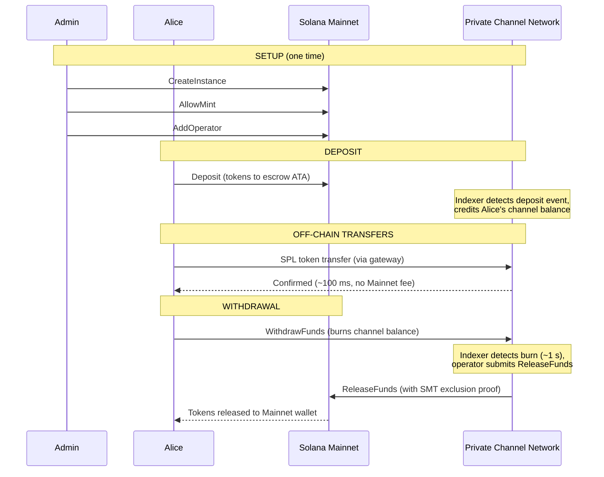
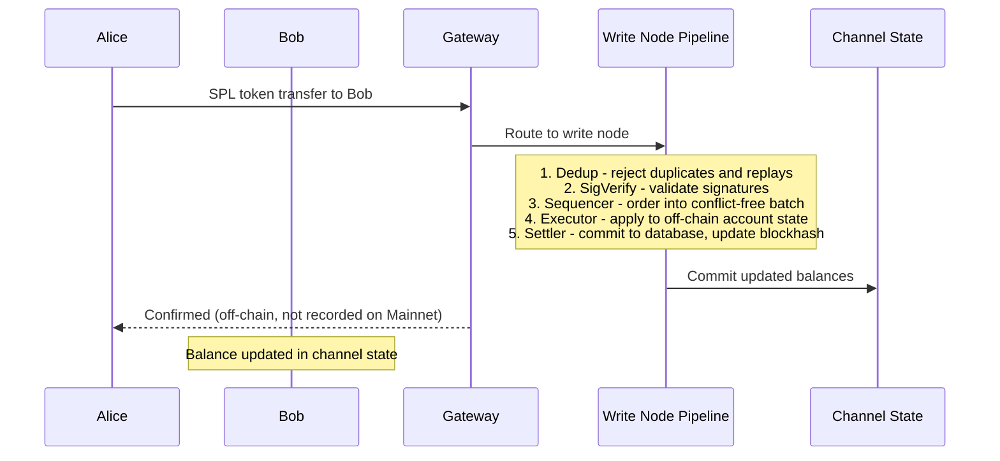
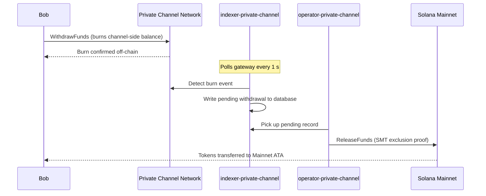

## Kênh Riêng Tư là gì?

Kênh riêng tư là một mạng thanh toán off-chain được neo vào Solana. Người dùng
gửi token SPL vào một chương trình ký quỹ on-chain, sau đó thực hiện giao dịch off-chain
thông qua một gateway với tốc độ cao và không tốn phí cho mỗi lần chuyển. Việc thanh toán trở lại
Solana Mainnet diễn ra thông qua bằng chứng Sparse Merkle Tree, đảm bảo rằng tiền luôn
có thể được rút và không thể xảy ra tình trạng chi tiêu gian lận.

Không giống như luồng thanh toán gốc của Solana, các giao dịch trong kênh sẽ không xuất hiện
on-chain cho đến khi người dùng rút tiền. Mạng kênh vận hành pipeline giao dịch riêng
(dedup -> sig verify -> sequencer -> executor -> settler) để
xử lý các giao dịch độc lập với thời gian khối của Solana.

## Các Bên Tham Gia

### Admin Phiên Bản

Admin triển khai PDA `Instance` thông qua `CreateInstance` và kiểm soát các loại mint SPL
token nào được chấp nhận (`AllowMint` / `BlockMint`). Admin cấp phép và
thu hồi quyền operator thông qua `AddOperator` / `RemoveOperator`, và có thể chuyển quyền admin
thông qua `SetNewAdmin`. Mỗi phiên bản chỉ có một admin. Việc chuyển quyền admin
là không thể đảo ngược trong một bước duy nhất: admin hiện tại không thể lấy lại vai trò
mà không có sự hợp tác của admin mới.

### Operators

Operator được cấp phép bởi admin. Họ sở hữu một PDA `Operator` và là
các tài khoản duy nhất được phép gọi `ReleaseFunds` (để thanh toán lệnh rút về
Mainnet) và `ResetSmtRoot` (để xoay vòng Sparse Merkle Tree). Operator bỏ qua
tất cả các kiểm tra quyền sở hữu trong gateway và có quyền truy cập vào tất cả các phương thức JSON-RPC
bao gồm `getBlock`, `getTransaction` và `simulateTransaction`. Vai trò JWT:
`"operator"`. Operator phải được cấp phép trực tiếp trong cơ sở dữ liệu; không có
quy trình tự leo thang đặc quyền. Xem
[hướng dẫn Operators](/docs/tools/private-channels/operators) để biết thông tin triển khai và
cấu hình chi tiết.

### Người Dùng

Người dùng tự đăng ký thông qua Dịch vụ Xác thực. Vai trò JWT: `"user"`. Người dùng có thể gọi
`Deposit` trực tiếp trên Escrow Program và khởi tạo lệnh rút thông qua
lệnh `WithdrawFunds` phía kênh trên Withdraw Program. Quyền truy cập gateway
chỉ giới hạn ở các ví đã xác minh của họ; họ không thể gọi `getBlock`,
`getTransaction` hoặc `simulateTransaction`.

## Vòng Đời Kênh

1. **Tạo phiên bản** - Admin gọi `CreateInstance`, tạo PDA `Instance`
   và cấu hình các mint được phép.
2. **Nạp tiền** - Người dùng nạp token SPL vào ký quỹ thông qua lệnh `Deposit`.
   Token được chuyển đến associated token account của phiên bản.
3. **Chuyển tiền off-chain** - Người dùng gửi giao dịch thông qua gateway. Các giao dịch
   được sắp xếp thứ tự và thực thi trên mạng kênh mà không tác động đến Mainnet.
4. **Khởi tạo lệnh rút** - Người dùng gọi `WithdrawFunds` trên Withdraw
   Program (phía kênh) để đốt số dư và báo hiệu lệnh rút.
5. **Thanh toán trên Mainnet** - Operator cung cấp bằng chứng loại trừ SMT hợp lệ và
   gọi `ReleaseFunds` trên Escrow Program (Mainnet), giải phóng token về
   ví của người dùng.
6. **Xoay vòng cây** - Khi SMT đến gần giới hạn (65.536 lá), operator
   gọi `ResetSmtRoot` để xoay vòng cây và bắt đầu một epoch mới.

### Chuyển Tiền

### Rút Tiền

## Khi Nào Nên Dùng Kênh Riêng Tư

Sử dụng kênh riêng tư khi ứng dụng của bạn cần:

- **Thông lượng off-chain** - khối lượng giao dịch của bạn có thể làm bão hòa TPS của Solana hoặc
  bạn cần xác nhận dưới một giây
- **Quyền riêng tư** - danh tính các bên và số tiền giao dịch không được hiển thị
  on-chain
- **Không tốn phí cho mỗi lần chuyển** - chuyển tiền thường xuyên khi chi phí SOL
  cho mỗi giao dịch là quá cao

Sử dụng giao dịch SPL gốc thay thế khi:

- **Khả năng kết hợp on-chain** là bắt buộc (DeFi, hoán đổi, cho vay; các chương trình
  khác phải có khả năng quan sát hoặc hành động dựa trên giao dịch)
- **Thanh toán một lần** là đủ và quyền riêng tư không phải là mối quan tâm
- **Không có cơ sở hạ tầng gateway** nào khả dụng hoặc khả thi về mặt vận hành
