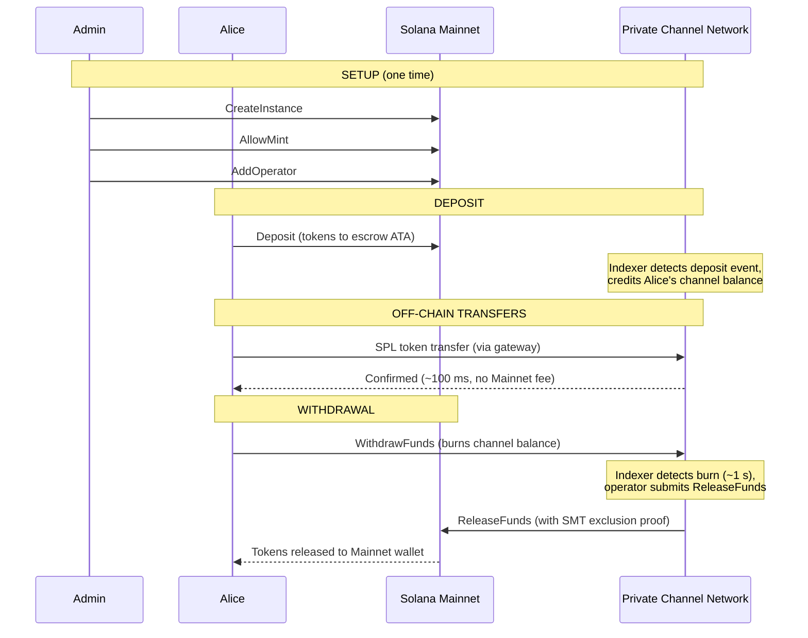
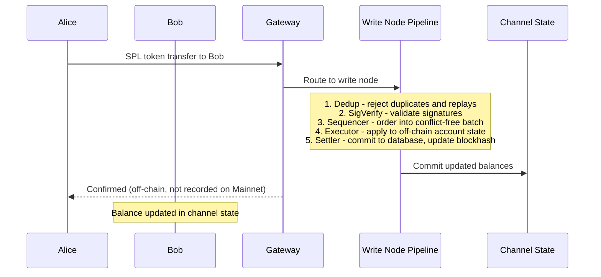
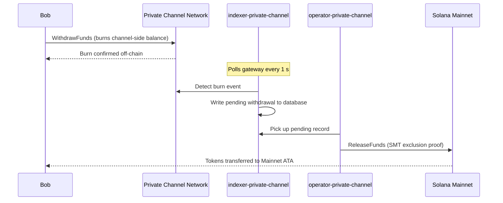

## Kênh Riêng Tư là gì?

Kênh riêng tư là một mạng thanh toán off-chain được neo vào Solana. Người dùng
nạp token SPL vào chương trình ký quỹ on-chain, sau đó giao dịch off-chain
thông qua gateway với tốc độ cao và không tốn phí cho mỗi lần chuyển. Quyết toán
trở lại Solana Mainnet diễn ra thông qua bằng chứng Sparse Merkle Tree, đảm bảo
quỹ luôn có thể được hoàn trả và không thể chi tiêu gấp đôi.

Khác với luồng thanh toán gốc của Solana, các giao dịch chuyển tiền trong kênh
không xuất hiện on-chain cho đến khi người dùng rút tiền. Mạng kênh vận hành
pipeline giao dịch riêng (dedup -> sig verify -> sequencer -> executor -> settler)
xử lý các giao dịch độc lập với thời gian khối của Solana.

## Các Bên Tham Gia

### Quản Trị Viên Instance

Quản trị viên triển khai `Instance` PDA thông qua `CreateInstance` và kiểm soát
các mint token SPL nào được chấp nhận (`AllowMint` / `BlockMint`). Quản trị viên
cấp phép và thu hồi quyền của operator thông qua `AddOperator` / `RemoveOperator`,
và có thể chuyển quyền quản trị thông qua `SetNewAdmin`. Mỗi instance chỉ có một
quản trị viên. Việc chuyển quyền quản trị là không thể hoàn tác trong một bước
duy nhất: quản trị viên hiện tại không thể lấy lại vai trò mà không có sự hợp tác
của quản trị viên mới.

### Các Operator

Các operator được cấp phép bởi quản trị viên. Họ sở hữu một `Operator` PDA và là
các tài khoản duy nhất được phép gọi `ReleaseFunds` (để quyết toán các lần rút
tiền lên Mainnet) và `ResetSmtRoot` (để xoay vòng Sparse Merkle Tree). Các
operator bỏ qua tất cả các kiểm tra quyền sở hữu trong gateway và có quyền truy
cập vào tất cả các phương thức JSON-RPC bao gồm `getBlock`, `getTransaction` và
`simulateTransaction`. Vai trò JWT: `"operator"`. Các operator phải được cấp
phép trực tiếp trong cơ sở dữ liệu; không có cơ chế tự nâng cấp quyền. Xem
[hướng dẫn Operators](/docs/tools/private-channels/operators) để biết chi tiết về triển khai và
cấu hình.

### Người Dùng

Người dùng tự đăng ký thông qua Auth Service. Vai trò JWT: `"user"`. Người dùng
có thể gọi `Deposit` trực tiếp trên Escrow Program và khởi tạo yêu cầu rút tiền
thông qua lệnh `WithdrawFunds` phía kênh trên Withdraw Program. Quyền truy cập
gateway bị giới hạn trong các ví đã xác minh của họ; họ không thể gọi `getBlock`,
`getTransaction` hoặc `simulateTransaction`.

## Vòng Đời Kênh

1. **Tạo instance** - Quản trị viên gọi `CreateInstance`, tạo `Instance`
   PDA và cấu hình các mint được phép.
2. **Nạp tiền** - Người dùng nạp token SPL vào escrow thông qua lệnh `Deposit`.
   Token được chuyển đến associated token account của instance.
3. **Chuyển tiền off-chain** - Người dùng gửi các giao dịch chuyển tiền qua
   gateway. Các giao dịch được sắp xếp và thực thi trên mạng kênh mà không
   tác động đến Mainnet.
4. **Khởi tạo rút tiền** - Người dùng gọi `WithdrawFunds` trên Withdraw
   Program (phía kênh) để đốt số dư của họ và báo hiệu yêu cầu rút tiền.
5. **Quyết toán trên Mainnet** - Operator cung cấp bằng chứng loại trừ SMT
   hợp lệ và gọi `ReleaseFunds` trên Escrow Program (Mainnet), giải phóng
   token về ví của người dùng.
6. **Xoay vòng cây** - Khi SMT tiếp cận dung lượng tối đa (65.536 lá), operator
   gọi `ResetSmtRoot` để xoay vòng cây và bắt đầu một epoch mới.

### Chuyển Tiền

### Rút Tiền

## Khi Nào Nên Sử Dụng Kênh Riêng Tư

Sử dụng kênh riêng tư khi ứng dụng của bạn cần:

- **Thông lượng off-chain** - khối lượng giao dịch của bạn sẽ làm bão hòa TPS
  của Solana hoặc bạn cần xác nhận dưới một giây
- **Bảo mật** - danh tính các bên và số tiền giao dịch không được xuất hiện
  on-chain
- **Không tốn phí mỗi lần chuyển tiền** - chuyển tiền thường xuyên khi chi phí
  SOL cho mỗi giao dịch quá cao

Thay vào đó, hãy sử dụng chuyển tiền SPL gốc khi:

- **Khả năng kết hợp on-chain** là bắt buộc (DeFi, hoán đổi, cho vay; các
  chương trình khác phải có thể quan sát hoặc hành động dựa trên giao dịch)
- **Quyết toán một lần** là đủ và bảo mật không phải là mối lo ngại
- **Không có cơ sở hạ tầng gateway** nào khả dụng hoặc khả thi về mặt vận hành
