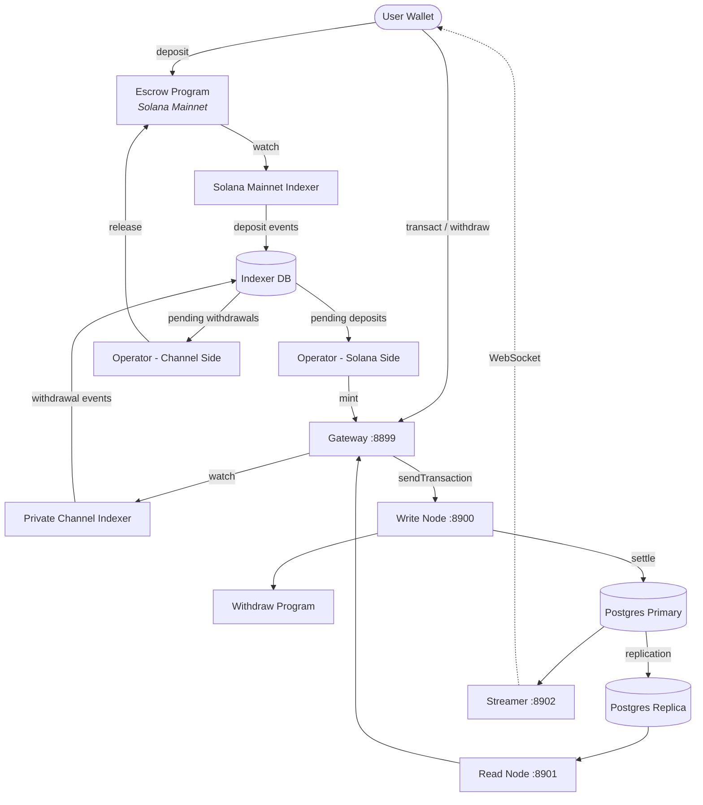

<Callout type="warning">
  Private Channels chưa được kiểm toán bảo mật và không được khuyến nghị sử dụng
  trong môi trường production với tiền thật nếu chưa có đánh giá bảo mật kỹ lưỡng.
</Callout>

<Callout type="info">
  **Bạn đang triển khai một phiên bản?** Xem [Hướng dẫn
  vận hành](/docs/tools/private-channels/operators). **Bạn đang tích hợp với
  một phiên bản hiện có?** Xem
  [Quickstart](/docs/tools/private-channels/quickstart/installation). Trang này
  là tài liệu tham khảo kiến trúc dành cho cả hai đối tượng.
</Callout>

## Kiến trúc

Private Channels được cấu thành từ bốn thành phần: hai chương trình Solana on-chain
(Escrow và Withdraw) và hai dịch vụ off-chain (Gateway và Auth Service).
Cùng nhau, chúng tạo thành một giao thức state channel trong đó tiền được lưu trên Mainnet nhưng
các giao dịch chuyển tiền được thanh toán off-chain.

### Chương trình Escrow

Chương trình Escrow là một chương trình Solana on-chain lưu giữ các SPL token
đã được nạp vào. Đây là điểm neo tin cậy của hệ thống: toàn bộ tiền cuối cùng đều nằm trong
escrow cho đến khi một operator cung cấp bằng chứng loại trừ Sparse Merkle Tree hợp lệ để
giải phóng chúng.

- Program ID: `9tgHa1DcnaSSUtmMsst8ovKTe1Gfxzezn27KnH9xXYeU`
- ID này được biên dịch vào file nhị phân của chương trình thông qua `declare_id!()`. Các dịch vụ off-chain
  đọc cùng ID này tại thời điểm biên dịch từ crate client được tạo ra, không phải
  từ biến môi trường.
- Quản lý các PDA `Instance`, `AllowedMint` và `Operator`
- Các lệnh: `CreateInstance`, `AllowMint`, `BlockMint`, `AddOperator`,
  `RemoveOperator`, `SetNewAdmin`, `Deposit`, `ReleaseFunds`, `ResetSmtRoot`

### Chương trình Withdraw

Chương trình Withdraw chạy trên mạng private channel, không phải trên Solana Mainnet.
Người dùng gọi `WithdrawFunds` để đốt số dư token phía channel của họ. Việc đốt này
không tự động giải phóng tiền; nó báo hiệu cho operator biết rằng một
yêu cầu rút tiền đang chờ xử lý. Sau đó operator gọi `ReleaseFunds` trên Chương trình Escrow
với bằng chứng SMT hợp lệ để hoàn tất thanh toán.

- Program ID: `J231K9UEpS4y4KAPwGc4gsMNCjKFRMYcQBcjVW7vBhVi`
- ID này được biên dịch vào file nhị phân của chương trình. Các dịch vụ off-chain đọc cùng
  ID này tại thời điểm biên dịch từ crate client được tạo ra, không phải từ biến
  môi trường.

### Gateway

Gateway là một proxy tương thích Solana JSON-RPC định tuyến các yêu cầu của client đến
nút ghi của mạng channel (để gửi giao dịch) và nút đọc (để
truy vấn). Nó được cấu hình thông qua các biến môi trường: `GATEWAY_PORT`,
`GATEWAY_WRITE_URL`, `GATEWAY_READ_URL`.

Các endpoint kiểm tra sức khỏe (không yêu cầu xác thực):

- `GET /health` - kiểm tra liveness; trả về `200 {"status":"ok"}`
- `GET /ready` - kiểm tra readiness chuyên sâu, thăm dò các nút ghi + đọc; trả về
  `200 {"status":"ready"}` hoặc `503 {"status":"degraded"}`

#### Định tuyến và Kiểm soát Truy cập Phương thức RPC

Gateway định tuyến `sendTransaction` đến nút ghi và tất cả các phương thức khác đến
nút đọc. Các yêu cầu lớn hơn 64 KB sẽ bị từ chối với HTTP 413. Khi
xác thực được bật, quyền truy cập phương thức được kiểm soát bởi JWT role. Xem
**[Xác thực & Vai trò](/docs/tools/private-channels/concepts/auth)** để biết
ma trận phương thức đầy đủ.

### Auth Service

Auth Service là một thành phần tùy chọn phát hành JWT HS256 (hết hạn sau 24 giờ)
cho kiểm soát truy cập gateway. Nó được kích hoạt khi biến môi trường `JWT_SECRET`
được thiết lập. Nếu không có nó, gateway chấp nhận tất cả các kết nối.

Các claim JWT: `sub` (UUID người dùng), `role` (`"user"` hoặc `"operator"`), `iss`
(`"private-channel-auth"`), `aud` (`"private-channel-gateway"`), `exp` (Unix
timestamp). `iss` và `aud` được xác thực bởi cấu hình JWT của gateway,
không được deserialize vào struct claim của ứng dụng: chỉ có `sub`, `role` và
`exp` mới có sẵn cho code tầng ứng dụng.

Các vai trò:

- `user` - quyền truy cập giới hạn ở các ví đã xác minh của chính họ; không thể gọi `getBlock`,
  `getTransaction` hoặc `simulateTransaction`
- `operator` - bỏ qua tất cả kiểm tra quyền sở hữu; toàn quyền truy cập phương thức RPC; phải được
  cấp phép trong cơ sở dữ liệu (không có tự nâng quyền)

### Streamer

Streamer là một WebSocket server đẩy các cập nhật trạng thái channel đến
các client đang kết nối theo thời gian thực, loại bỏ nhu cầu polling RPC. Nó thăm dò
PostgreSQL để phát hiện thay đổi trạng thái. Đây là một phần của stack Docker Compose cơ sở, không phải
stack devnet mà hướng dẫn này triển khai; xem
[Tài liệu tham khảo cấu hình](/docs/tools/private-channels/operators/configuration#service-port-reference).

- Cổng: `8902`, có thể cấu hình qua `STREAMER_PORT`
- Kết nối: `ws://localhost:8902`
- Health endpoint: `GET /health` - trả về `503` nếu bất kỳ vòng lặp poll nội bộ nào
  bị đình trệ quá 30 giây

<Callout type="warning">
  Schema sự kiện WebSocket chưa được ghi chép công khai. Tham khảo
  [`core/src/bin/streamer.rs`](https://github.com/solana-foundation/solana-private-channels/blob/main/core/src/bin/streamer.rs)
  để biết chi tiết triển khai cho đến khi có tài liệu chính thức.
</Callout>



## Pipeline Giao dịch

```text
Transaction -> [1:Dedup] -> [2:SigVerify] -> [3:Sequencer] -> [4:Executor] -> [5:Settler] -> Database
```

Các giao dịch được gửi đến Gateway đi qua một pipeline năm giai đoạn trước
khi trạng thái của chúng được xác nhận:

1. **Dedup** - lọc các giao dịch trùng lặp trước khi chúng vào pipeline
2. **SigVerify** - xác thực chữ ký giao dịch dựa trên khóa công khai của người ký
3. **Sequencer** - sắp xếp các giao dịch hợp lệ theo trình tự xác định để thiết lập
   lịch sử chuẩn tắc
4. **Executor** - thực thi các giao dịch dựa trên lớp tài khoản của channel
   (BOB Cache + AccountsDB), cập nhật số dư off-chain
5. **Settler** - cam kết kết quả giao dịch tích lũy vào PostgreSQL và
   cập nhật Redis cache; tạo blockhash mới cho chu kỳ block tiếp theo.
   Thanh toán Mainnet (gọi `ReleaseFunds`) được xử lý riêng bởi dịch vụ
   `operator-private-channel`

## Tính năng Chính

### Quyền riêng tư

Các giao dịch chuyển tiền giữa các thành viên channel không được ghi lại trên Solana Mainnet. Chỉ
các khoản nạp tiền (vào channel) và các khoản rút tiền cuối cùng (rời channel)
mới xuất hiện on-chain. Danh tính đối tác và số tiền chuyển khoản không hiển thị với
các bên quan sát bên ngoài trong quá trình hoạt động của channel.

### Hiệu suất

Pipeline off-chain loại bỏ thời gian block của Solana khỏi đường dẫn quan trọng.
Các giao dịch chuyển tiền được xác nhận khi sequencer xử lý chúng, không phải khi một block Solana
được xác nhận. Điều này cho phép finality dưới một giây và thông lượng vượt qua TPS gốc của Solana
cho các giao dịch chuyển tiền ở tầng ứng dụng.

### Thanh toán

Mỗi lần rút tiền đều được bảo vệ bởi một bằng chứng Sparse Merkle Tree on-chain. Root SMT
được lưu trong `Instance.withdrawal_transactions_root` trên Chương trình Escrow.
Khi `ReleaseFunds` được gọi, chương trình trước tiên xác minh bằng chứng loại trừ cho
một nonce chưa từng thấy dựa trên root on-chain hiện tại, sau đó xác minh một bằng chứng
bao gồm riêng biệt cho nonce đó dựa trên root mới do người gọi cung cấp. Chỉ sau khi
cả hai kiểm tra đều vượt qua, nó mới lưu root mới, khiến việc chi tiêu gấp đôi trở nên không thể ngay cả
khi khóa operator bị xâm phạm.

## Mô hình Bảo mật

**Khóa Admin** - kiểm soát việc tạo instance (`CreateInstance`) và cấp phép operator
(`AddOperator` / `RemoveOperator`). Việc xâm phạm khóa admin
cho phép cấp phép operator tùy ý. `SetNewAdmin` chuyển quyền admin
không thể đảo ngược trong một bước duy nhất; hãy bảo vệ khóa admin cho phù hợp.

**Các khóa Operator** - có thể gọi `ReleaseFunds` và `ResetSmtRoot`. Chúng không thể
giải phóng tiền nếu không có bằng chứng loại trừ SMT hợp lệ dựa trên root on-chain hiện tại.
Kiểm tra `verify_smt_exclusion_proof` on-chain là hàng phòng thủ cuối cùng
chống lại các lần rút tiền trái phép: một khóa operator bị xâm phạm đơn thuần
không đủ để rút cạn escrow.

**SMT root** - được lưu on-chain trong `Instance.withdrawal_transactions_root`.
Được cập nhật nguyên tử với mỗi lần gọi `ReleaseFunds`. Vì mỗi bằng chứng phải
tham chiếu một nonce chưa từng thấy, việc chi tiêu gấp đôi cùng một số dư channel là
không thể ngay cả khi khóa operator bị xâm phạm.

**Xoay vòng cây** - `Instance.current_tree_index` theo dõi các epoch của cây. Khi
`ResetSmtRoot` được gọi, nó tăng chỉ số cây và vô hiệu hóa tất cả
nonce từ epoch cây trước đó, cung cấp bảng sạch cho các chu kỳ thanh toán mới.

## Bảo mật Khóa Vận hành

<Callout type="warning">
  Các dịch vụ off-chain sử dụng bộ từ vựng ký của riêng họ, không liên quan đến
  các quyền admin/operator on-chain được mô tả trong Mô hình Bảo mật ở trên.
  `ADMIN_PRIVATE_KEY` là bắt buộc cho mọi dịch vụ operator và thanh toán
  phí giao dịch; một `OPERATOR_PRIVATE_KEY` tùy chọn riêng biệt cung cấp chữ ký
  Operator on-chain cho `ReleaseFunds` và `ResetSmtRoot`, và sẽ dùng
  giá trị của `ADMIN_PRIVATE_KEY` khi không được thiết lập. Không bao giờ đặt khóa admin instance
  ở cấp giao thức (được dùng cho `CreateInstance` / `AddOperator` / `SetNewAdmin`)
  vào một trong hai biến hoặc để lộ nó khi chạy; hãy giữ khóa đó ở trạng thái cold và offline.
</Callout>

`ReleaseFunds` và `ResetSmtRoot` yêu cầu hai chữ ký on-chain: người trả phí
(từ `ADMIN_PRIVATE_KEY`) và quyền của Operator PDA (từ
`OPERATOR_PRIVATE_KEY`, hoặc `ADMIN_PRIVATE_KEY` nếu không được thiết lập). Hướng dẫn triển khai
này trong phần hướng dẫn devnet đặt keypair operator được tạo ra vào
`ADMIN_PRIVATE_KEY` và để `OPERATOR_PRIVATE_KEY` không được thiết lập, vì vậy cùng một keypair
đảm nhận cả hai vai trò ký. Hãy đối xử với bất kỳ khóa nào nằm trong `ADMIN_PRIVATE_KEY` với
cùng mức kiểm soát như một khóa riêng ví nóng:

- Chỉ lưu trữ nó trong file `.env` được gitignore, không bao giờ trong `.env.devnet` hay bất kỳ
  cấu hình nào được commit
- Đối với các triển khai production, hãy cân nhắc sử dụng trình quản lý bí mật (AWS Secrets Manager,
  HashiCorp Vault) thay vì biến môi trường dạng plaintext
- keypair admin instance ở cấp giao thức (được dùng để gọi `AddOperator` /
  `SetNewAdmin`) nên được giữ ở trạng thái cold; nó chỉ cần thiết trong quá trình thiết lập instance
  và cấp phép operator, không phải trong thời gian chạy

`SetNewAdmin` chuyển quyền admin **không thể đảo ngược trong một giao dịch duy nhất**:
admin hiện tại không có đường phục hồi nếu không có sự hợp tác của admin mới. Đừng
gọi nó mà không xác minh địa chỉ đích.

## Các Bước Tiếp theo

<Cards>
  <Card
    title="Quickstart"
    href="/docs/tools/private-channels/quickstart/installation"
  >
    Thiết lập môi trường và tạo các TypeScript client.
  </Card>
  <Card title="Các Channel" href="/docs/tools/private-channels/concepts/channels">
    Tìm hiểu về các thành viên tham gia và vòng đời của channel.
  </Card>
  <Card
    title="Sparse Merkle Tree"
    href="/docs/tools/private-channels/concepts/smt"
  >
    Tìm hiểu cách các bằng chứng rút tiền được xác minh on-chain.
  </Card>
  <Card
    title="Các Lệnh"
    href="/docs/tools/private-channels/instructions/deposit"
  >
    Tài liệu tham khảo lệnh đầy đủ cho tất cả các chương trình.
  </Card>
</Cards>
