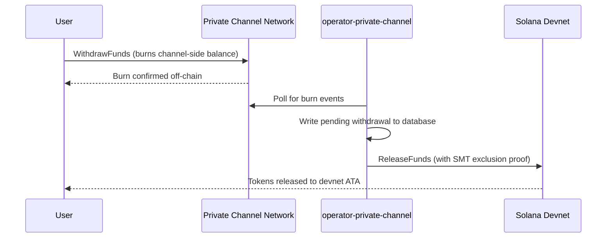

## Tổng Quan

Rút tiền từ Private Channels là một quy trình gồm hai bước. Đầu tiên, người dùng đốt
số dư token phía kênh bằng cách gọi `WithdrawFunds` trên Withdraw
Program. Thứ hai, một operator gọi `ReleaseFunds` trên Escrow Program (devnet,
trong hướng dẫn này) với bằng chứng loại trừ Sparse Merkle Tree hợp lệ để giải phóng
tiền. Bằng chứng SMT đảm bảo mỗi nonce rút tiền chỉ có thể được sử dụng một lần,
ngăn chặn double-spend.



## Bước 1: Khởi Tạo Lệnh Rút Tiền Trên Kênh

Gọi `WithdrawFunds` trên Withdraw Program để đốt số dư phía kênh của bạn.
Sử dụng biến thể `Async`, tự động dẫn xuất `tokenAccount` PDA và là
dạng được khuyến nghị cho môi trường sản xuất:

```typescript
import { getWithdrawFundsInstructionAsync } from "../private-channel-withdraw-program/clients/typescript/src/generated";
import {
  createSolanaRpc,
  address,
  pipe,
  createTransactionMessage,
  setTransactionMessageFeePayerSigner,
  setTransactionMessageLifetimeUsingBlockhash,
  appendTransactionMessageInstruction,
  signAndSendTransactionMessageWithSigners,
  assertIsTransactionMessageWithSingleSendingSigner,
  getBase58Decoder
} from "@solana/kit";

// Point to the gateway, not a public Solana RPC
const privateChannelRpc = createSolanaRpc("http://localhost:8899");

const withdrawIx = await getWithdrawFundsInstructionAsync({
  user: userSigner,
  mint: address(mintAddress),
  amount: 1_000_000n, // 1 USDC (6 decimals)
  destination: null // null = release to signer's devnet wallet
});

const { value: latestBlockhash } = await privateChannelRpc
  .getLatestBlockhash({ commitment: "confirmed" })
  .send();

// Sent to the Private Channels gateway (not Solana RPC directly), which
// expects the legacy transaction format - do not switch this to version 0.
const transactionMessage = pipe(
  createTransactionMessage({ version: "legacy" }),
  (m) => setTransactionMessageFeePayerSigner(userSigner, m),
  (m) => setTransactionMessageLifetimeUsingBlockhash(latestBlockhash, m),
  (m) => appendTransactionMessageInstruction(withdrawIx, m)
);

assertIsTransactionMessageWithSingleSendingSigner(transactionMessage);

const signatureBytes =
  await signAndSendTransactionMessageWithSigners(transactionMessage);
const signature = getBase58Decoder().decode(signatureBytes);
console.log("Withdrawal initiated:", signature);
```

- Withdraw Program ID: `J231K9UEpS4y4KAPwGc4gsMNCjKFRMYcQBcjVW7vBhVi`
- Gửi giao dịch này đến gateway (`http://localhost:8899`), không phải đến
  Solana RPC công khai
- Nếu `destination` được cung cấp, tiền được giải phóng sẽ đến ví đó thay vì
  ví của người ký

## Điều Cần Biết

Không cần thực hiện thêm bất kỳ hành động nào sau khi gọi `WithdrawFunds`. Các dịch vụ operator
xử lý thanh toán tự động:

1. `indexer-private-channel` thăm dò kênh mỗi 1 giây để tìm sự kiện đốt
   và ghi lại một bản ghi rút tiền đang chờ xử lý khi phát hiện của bạn
2. `operator-private-channel` thăm dò cơ sở dữ liệu mỗi 1 giây để tìm các
   bản ghi đang chờ và gửi `ReleaseFunds` đến Escrow Program trên Solana devnet
   với bằng chứng loại trừ SMT cần thiết; nó thăm dò để xác nhận devnet tối đa
   5 lần với khoảng cách 400 ms trước khi thử lại

Tiền thường xuất hiện trong ví devnet của bạn trong vài giây trong
điều kiện bình thường.

## Cách Operator Thanh Toán (Tham Khảo)

Sau khi đốt phía kênh, một operator được cấp phép phải gọi `ReleaseFunds` trên
Escrow Program với bằng chứng loại trừ SMT hợp lệ; operator không thể giải phóng
tiền mà không chứng minh rằng nonce rút tiền chưa được sử dụng trước đó. Bước này
được xử lý tự động bởi `operator-private-channel`; bạn không cần phải gọi
nó theo cách thủ công.

Operator cung cấp:

- `amount`: phải khớp với số tiền đã đốt
- `user`: ví người nhận trên devnet
- `new_withdrawal_root`: gốc SMT đã cập nhật sau lần rút tiền này
- `transaction_nonce`: nonce duy nhất cho lá này
- `sibling_proofs`: 512 byte (16 x 32-byte sibling hash cho bằng chứng cây)

## Xác Minh

Sau khi lệnh gọi của operator được xác nhận, kiểm tra số dư token devnet của bạn:

```bash
spl-token balance <MINT_ADDRESS> --owner <YOUR_WALLET>
```

Hoặc qua RPC:

```typescript
import { createSolanaRpc, address } from "@solana/kit";
import { findAssociatedTokenPda } from "@solana-program/token";

const TOKEN_PROGRAM_ADDRESS = address(
  "TokenkegQfeZyiNwAJbNbGKPFXCWuBvf9Ss623VQ5DA"
);

// Query devnet directly; ReleaseFunds settles here, not through the gateway
const rpc = createSolanaRpc("https://api.devnet.solana.com");

const [yourDevnetAta] = await findAssociatedTokenPda({
  mint: address(mintAddress),
  owner: address(userSigner.address),
  tokenProgram: TOKEN_PROGRAM_ADDRESS
});

const balance = await rpc.getTokenAccountBalance(yourDevnetAta).send();
console.log(balance.value.uiAmountString);
```

## Bạn Đã Hoàn Thành Quickstart

Bạn đã chạy toàn bộ chu trình Private Channels trên devnet: gửi token SPL vào
escrow, thực hiện chuyển khoản off-chain qua gateway, và rút tiền
trở lại ví devnet của bạn.

<Cards>
  <Card
    title="Vòng Đời Kênh"
    href="/docs/tools/private-channels/concepts/channels"
  >
    Hiểu sâu về các thành viên tham gia và toàn bộ luồng từ nạp tiền đến rút tiền.
  </Card>
  <Card
    title="Xác Thực & Phân Quyền"
    href="/docs/tools/private-channels/concepts/auth"
  >
    Thêm xác thực JWT vào tích hợp của bạn.
  </Card>
  <Card
    title="Tham Khảo Release Funds"
    href="/docs/tools/private-channels/instructions/release-funds"
  >
    Tài liệu tham khảo đầy đủ về lệnh ReleaseFunds dành cho công cụ operator.
  </Card>
  <Card
    title="Sparse Merkle Tree"
    href="/docs/tools/private-channels/concepts/smt"
  >
    Hiểu cách bằng chứng rút tiền ngăn chặn double-spend.
  </Card>
</Cards>
