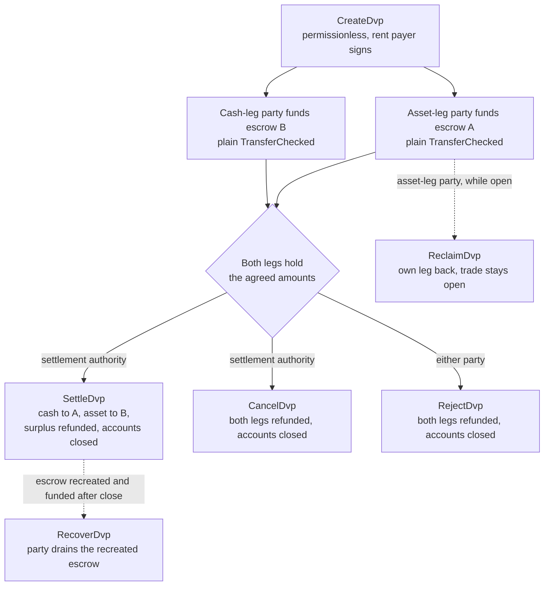
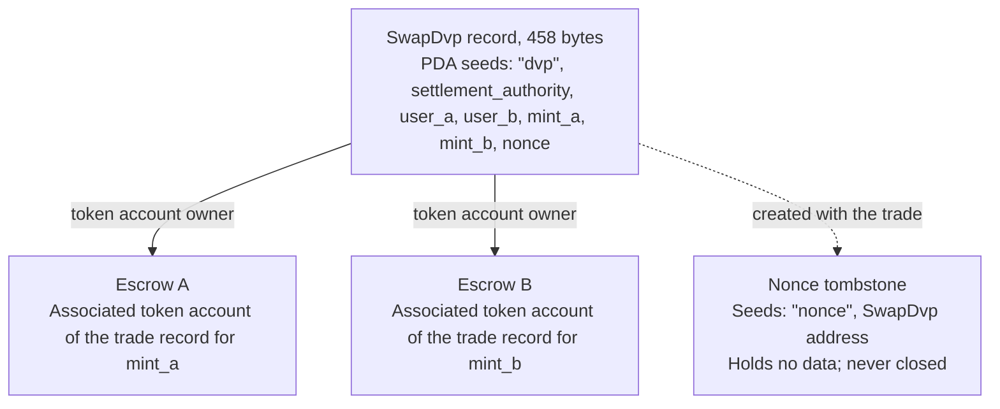

DvP 程序是 Solana 上用于券款对付（Delivery versus Payment）的标准程序，由 Solana 基金会维护，并经 Cantina 审计。双方先就一笔交易达成一致，各自通过普通的代币转账把自己的那一腿存入托管账户，再由结算授权方在一笔交易中完成两腿的结算，因此要么两腿同时转移，要么都不转移。结算授权方是交易中指定的第三方地址，例如促成该交易的交易场所或代理方。任何一方都无需编写或部署程序，只要钱包或托管方能够发送标准代币转账（`TransferChecked`），就可以为某一腿注资，无需任何 DvP 专属集成。在结算之前，任何一方都可以取回自己的那一腿，或撤销交易。

<Callout type="warn" title="操作前请先读取记录">

创建交易记录无需许可，因此记录本身并不能证明双方已达成一致。各方在注资前应读取已存储的条款，结算授权方在结算前也应如此（参见[验证](#verification-before-funding-and-settlement)）。

</Callout>

## 工作原理

每笔交易都有一条由程序拥有的记录和两个托管账户，每条腿一个。资产腿一方（`user_a`）和资金腿一方（`user_b`）分别通过向对应托管账户转入代币来为各自的腿注资。结算授权方是唯一能够执行结算的签名者。结算时，每条腿约定的数额会转给对方，多余部分退还给该腿的所有方，随后关闭记录和两个托管账户。原子性源自 Solana [交易](/docs/core/transactions)：两笔转账位于同一笔交易中，因此要么都生效，要么都不生效。

所有退款、取回和多余部分的退还，都会发送到相应一方自己的 associated token account：`mint_a` 对应 `user_a` 的账户，`mint_b` 对应 `user_b` 的账户。托管方或资金管理系统可以用自己的账户为某一腿注资，但任何退还的资产都会进入该方的账户，而不会回到托管方。每笔交易还会留下一个永久的标记账户（参见[状态](#state)）。

## 指南

这些分步页面将一笔交易从创建带到结算，每条指令都提供 TypeScript 和 Rust 示例。

<Cards>
  <Card title="创建交易" href="/docs/defi/dvp-program/create-a-trade">
    安装客户端，并使用 CreateDvp 记录交易条款
  </Card>
  <Card title="为各腿注资" href="/docs/defi/dvp-program/fund-the-legs">
    验证已存储的条款，然后通过普通转账为每条腿注资
  </Card>
  <Card title="结算交易" href="/docs/defi/dvp-program/settle-the-trade">
    以结算授权方身份，在一笔交易中完成两条腿的结算
  </Card>
  <Card title="撤销交易" href="/docs/defi/dvp-program/unwind-a-trade">
    取回某一腿、取消或拒绝交易，并找回迟到的存款
  </Card>
</Cards>

[devnet 演示](https://solana.com/delivery-vs-payment/demo)会完整运行一笔交易：创建交易，通过标准代币转账为两个托管账户注资，并在一笔交易中完成两条腿的结算。

## 在程序与委托之间做选择

[使用委托的券款对付（DvP）](/docs/tokenization/dvp)无需程序即可完成同样的交换：双方各自将自己的头寸委托给结算代理，由结算代理在一笔交易中转移两条腿。

- **程序方式**无需委托，因此每个 token account 只能有一个委托人的限制并不适用，且结算授权方无法改变收益的去向。不过，每笔交易都依赖于一个可升级程序及其升级授权。
- **委托模式**不依赖任何程序，并且适用于带有 Scaled UI Amount 的 mint。程序会拒绝这类 mint，因此基于 Mosaic 的 `tokenized-security` 模板创建的任何 mint 都无法使用（参见[mint 配置限制](#mint-configuration-constraints)）。

## 角色

该程序是对称的。在其接口中，双方分别是交付 `mint_a` 的 `user_a` 和交付 `mint_b` 的 `user_b`。README 和生成的客户端将 `mint_a` 称为资产腿，将 `mint_b` 称为资金腿，本文档也沿用这一约定，但程序并不要求资金腿必须是现金类工具。两种资产或两种稳定币，同样可以按此方式结算。

| 角色                 | 对象                               | 签名                                              | 备注                                                                                                                                                                                                     |
| -------------------- | --------------------------------- | -------------------------------------------------- | --------------------------------------------------------------------------------------------------------------------------------------------------------------------------------------------------------- |
| 资产腿一方      | `user_a`，交付 `mint_a`       | 自己的注资转账；Reclaim、Reject、Recover | keypair 钱包，或基于 PDA 的智能钱包（如多签金库）。SPL Token 多签账户或 program account 不能作为一方：Create 将失败并返回 `PartyNotSignerCapable`                   |
| 资金腿一方       | `user_b`，交付 `mint_b`       | 自己的注资转账；Reclaim、Reject、Recover | 要求相同                                                                                                                                                                                          |
| 结算授权方 | 创建时指定的第三方地址 | Settle、Cancel                                     | 唯一能够执行结算的签名者。它无法改变收益的去向，收益在创建时即已固定。结算或取消时，已关闭账户的 rent 会归其所有                                         |
| rent 支付方           | 任何签署 `CreateDvp` 的一方         | Create                                             | 为记录、nonce 墓碑账户和两个托管账户支付 rent（即让账户保持开启的 SOL 押金）。不会被记录为 rent 接收方：已关闭账户的 rent 归关闭该交易的一方所有 |

## 程序 ID

```text
dvp34bdbcEm4f4FCUjGV4mDAkDshaQR4LkK8fdcsyZq
```

| 集群      | 程序                                       | 升级授权                              | 最近部署的 slot |
| ------------ | --------------------------------------------- | ---------------------------------------------- | ------------------ |
| mainnet-beta | `dvp34bdbcEm4f4FCUjGV4mDAkDshaQR4LkK8fdcsyZq` | `DXtFpbPjcn2hxPnw79x1Pfoj35vXh5AsWBkS37YnXMVv` | 452,058,374        |
| devnet       | `dvp34bdbcEm4f4FCUjGV4mDAkDshaQR4LkK8fdcsyZq` | `5EX1zFeJWj4rGYZv432WnYw8CbaSUeTdxPx4r573UgYU` | 479,376,863        |

该程序在两个集群上均可升级。上表数据来自 2026 年 10 月 2 日 `solana program show` 的输出；如需最新数值，请自行运行同一命令。devnet 上的构建版本早于分步页面所依据的提交（参见[安装](/docs/defi/dvp-program/create-a-trade#install)），但指令集和错误集相同。

## 生命周期



交易从 `CreateDvp` 开始保持开启状态，直到 Settle、Cancel 或 Reject 之一将其关闭。注资没有独立的指令：当某一腿的托管账户持有不少于约定数额的代币时，即视为该腿已注资。Reclaim 针对单条腿，并且会使交易保持开启，因此某一腿出现问题时，不必迫使另一方取消整笔交易。

## 状态

每笔交易对应一个 458 字节、归程序所有的 `SwapDvp` 账户。其地址由结算授权方、双方、两个 mint 和一个 nonce 派生而来（种子为 `["dvp", settlement_authority, user_a, user_b, mint_a, mint_b, nonce]`）。数额和时间存储在账户内部，不影响地址，因此必须读取，而不能推断。一个小型标记账户，即位于 `["nonce", swap_dvp]` 的 nonce 墓碑账户，会随交易一同创建且永不关闭，因此每一种“双方、mint、授权方与 nonce”的组合只能用于一笔交易。



| 字段                                  | 类型          | 含义                                                                                                 |
| -------------------------------------- | ------------- | ------------------------------------------------------------------------------------------------------- |
| `bump`                                 | `u8`          | PDA bump                                                                                                |
| `user_a`, `user_b`                     | `Pubkey`      | 交易双方                                                                                         |
| `mint_a`, `mint_b`                     | `Pubkey`      | 资产腿和资金腿的 mint                                                                        |
| `settlement_authority`                 | `Pubkey`      | 唯一能够执行结算或取消的签名者                                                               |
| `token_program_a`, `token_program_b`   | `Pubkey`      | 拥有各 mint 的 Token Program；一笔交易中可以混合使用 SPL Token 和 Token-2022 的腿                    |
| `amount_a`, `amount_b`                 | `u64`         | 每条腿约定的数额，以 mint 的最小单位（基础单位）计                                 |
| `expiry_timestamp`                     | `i64`         | 超过此网络时间（链上时钟）后，Settle 将被拒绝；Reclaim、Cancel 和 Reject 仍然可用 |
| `nonce`                                | `u64`         | 用于区分其他种子相同的交易。仅可使用一次                                             |
| `ref_string`                           | `[u8; 64]`    | 不透明的客户端引用，以零填充；程序从不读取它                                     |
| `user_a_settlement_destination`        | `Pubkey`      | 在 Settle 时接收资金腿；默认为 `user_a`                                                   |
| `user_b_settlement_destination`        | `Pubkey`      | 在 Settle 时接收资产腿；默认为 `user_b`                                                  |
| `mint_a_authority`, `mint_b_authority` | `Pubkey`      | 创建时记录的 mint 授权方；若其中任何一个发生变化，Settle 将失败                           |
| `earliest_settlement_timestamp`        | `Option<i64>` | 若已设置，则在此网络时间之前 Settle 将被拒绝                                                     |

字段列表取自程序 IDL，对应[创建交易](/docs/defi/dvp-program/create-a-trade#install)中所指明的提交。

## 指令

| 指令  | 签名者               | 效果                                                                                                                                                              |
| ------------ | -------------------- | ------------------------------------------------------------------------------------------------------------------------------------------------------------------- |
| `CreateDvp`  | 任意付款方            | 创建 `SwapDvp` 记录、其 nonce 墓碑账户以及两个托管账户。不转移任何代币                                                                        |
| `ReclaimDvp` | `user_a` 或 `user_b` | 从托管账户中退回签名者自己的那一腿。交易保持开启，该腿可以重新注资                                                                      |
| `SettleDvp`  | 结算授权方 | 将 `amount_a` 转给 `user_b` 的目标账户，将 `amount_b` 转给 `user_a` 的目标账户，把多余部分退还给该腿的所有方，并关闭记录和两个托管账户 |
| `CancelDvp`  | 结算授权方 | 将托管账户 A 中的全部余额退还给 `user_a`，将托管账户 B 中的全部余额退还给 `user_b`，并关闭记录和两个托管账户                                                            |
| `RejectDvp`  | `user_a` 或 `user_b` | 效果与 Cancel 相同，但由交易一方签名                                                                                                                            |
| `RecoverDvp` | `user_a` 或 `user_b` | 交易关闭之后：将重新创建的托管账户中的资产转入签名者自己的 token account 并关闭该托管账户。适用于在 Settle、Cancel 或 Reject 之后才到账的存款  |

无论是谁为托管账户注资，所有退款都会发送到相应一方针对该腿 mint 的 associated token account。

每条指令的账户和参数，请参见对应步骤的页面。

## 错误

| 代码 | 错误                            | 触发时机                                                                                                   |
| ---- | -------------------------------- | ------------------------------------------------------------------------------------------------------ |
| 0    | `SignerNotParty`                 | Reclaim、Reject 或 Recover 由非 `user_a` 或 `user_b` 的地址签名                      |
| 1    | `DvpExpired`                     | 在 `expiry_timestamp` 之后执行 Settle                                                                        |
| 2    | `SettlementAuthorityMismatch`    | Settle 或 Cancel 由结算授权方以外的地址签名                              |
| 3    | `SettlementTooEarly`             | 在 `earliest_settlement_timestamp` 之前执行 Settle                                                          |
| 4    | `LegNotFunded`                   | 在某个托管账户的余额低于约定数额时执行 Settle                                               |
| 5    | `ExpiryNotInFuture`              | Create 时设置的到期时间等于或早于当前网络时间                                            |
| 6    | `EarliestAfterExpiry`            | Create 时设置的最早结算时间晚于到期时间                                               |
| 7    | `SelfDvp`                        | Create 时 `user_a` 与 `user_b` 相同                                                                 |
| 8    | `SameMint`                       | Create 时 `mint_a` 与 `mint_b` 相同                                                                 |
| 9    | `ZeroAmount`                     | Create 时任一条腿的数额为零                                                                |
| 10   | `BlockedMintExtension`           | Create 或 Settle 时 mint 带有 TransferFee、InterestBearing、ScaledUiAmount 或 NonTransferable 扩展 |
| 11   | `SettlementAuthorityIsParty`     | Create 时结算授权方与某一方相同                                                  |
| 12   | `SettlementAuthorityExecutable`  | Create 时结算授权方是可执行账户                                                         |
| 13   | `NonceAlreadyUsed`               | Create 时重复使用了已有墓碑账户的 `(seeds, nonce)`                                         |
| 14   | `ExpiryTooFarInFuture`           | Create 时设置的到期时间超过一年之后                                                         |
| 15   | `RefStringTooLong`               | Create 时引用长度超过 64 字节                                                           |
| 16   | `DvpStillOpen`                   | 在交易仍处于开启状态时执行 Recover；请改用 Reclaim                                                     |
| 17   | `DvpNeverCreated`                | 使用没有墓碑标记(tombstone)的 seed 执行 Recover                                                              |
| 18   | `EscrowPreloadedWithLamports`    | Create 时,非原生 escrow 持有的 lamports 超出其 rent-exempt 最低额度                           |
| 19   | `SettlementDestinationIsSwapDvp` | Create 时,结算目标地址与交易记录相同                                         |
| 20   | `SwapDvpPreloadedWithLamports`   | Create 时,记录地址持有的 lamports 超出其 rent 储备                                   |
| 21   | `RecipientAtaMismatch`           | 收款方或退款的 token account 不再属于预期的钱包和 mint                  |
| 22   | `PartyNotSignerCapable`          | Create 时,某一方不是归 system 所有且不可执行的账户                                 |
| 23   | `MintAuthorityChanged`           | Settle 时,某条交易腿的 mint authority 与创建时记录的值不同                         |

## 事件与索引

程序不会发出任何链上事件。索引器或对账系统会读取 `SwapDvp` 账户状态以及两个 escrow 的 token 余额,并使用 `ref_string` 将交易与其链下订单关联。由于记录在结算时会被关闭,事后需要这些条款的系统应在读取时自行存储,或从创建该交易的 transaction 中重建。

## 支持的代币

一笔交易可以将 SPL Token 腿与 Token-2022 腿配对;每条腿各自携带自己的 token program。支持 Wrapped SOL 腿。

| 交易腿 mint 上的 Token-2022 扩展                                                     | 程序行为                                                  |
| ---------------------------------------------------------------------------------------- | ----------------------------------------------------------------- |
| TransferFee, InterestBearing, ScaledUiAmount, NonTransferable                            | 在 Create 和 Settle 时被拒绝,并返回 `BlockedMintExtension`         |
| PermanentDelegate, Pausable, DefaultAccountState, freeze authority, MintCloseAuthority | 接受;各 authority 均可对托管中的代币执行操作           |
| ConfidentialTransfer                                                                     | 接受;该交易腿上的金额是公开的                          |
| TransferHook                                                                             | 支持,每条腿最多 32 个额外账户                        |
| 目标账户或退款账户上的 MemoTransfer                                          | 接受;程序会在转账前发出所需的 memo |

转账手续费会使接收方收到的金额少于约定金额。Interest Bearing 和 Scaled UI Amount 不会改变原始金额,但其利率或乘数可能在创建与结算交易之间发生变化,从而改变约定金额的显示方式。NonTransferable 会使两条腿的代币都被困住。

被接受的 authority 可以在交易存续期间转移、冻结或暂停托管中的代币(见下文)。escrow 无法配置为接收机密转账,因此机密腿上的托管金额和结算金额都是公开的。

对于带 hook 的 mint,客户端会解析该 hook 的额外账户,并将其附加到 Settle、Cancel、Reject、Reclaim 和 Recover。每条腿 32 个的上限包含 hook 程序及其验证账户。如果 hook authority 将 hook 的账户列表扩大到超过该上限,则该腿上的所有转账都会失败,包括 Reclaim、Cancel、Reject 和 Recover,直到 authority 撤销该更改。当两条腿都带有 hook 时,交易账户数量限制可能先于每条腿的上限生效。

当目标账户或退款账户要求 memo 时,程序会在转账前调用 Memo 程序,因此每个将代币从 escrow 转出的指令都需要一个 `memo_program` 账户。

### Mint 配置约束

**Scaled UI Amount。** [Mosaic](https://github.com/solana-foundation/mosaic)(Solana Foundation 的发行工具包)中的 `tokenized-security` 模板始终会添加 Scaled UI Amount,因此程序不接受由该模板创建的 mint 作为交易腿。面向本程序的 mint 可以在不带该扩展的情况下创建(参见 [Token Extensions](/docs/tokens/extensions));[使用委托的 DvP](/docs/tokenization/dvp) 通过委托授权进行结算,不适用此检查。

**默认冻结的 mint。** 每笔交易的 escrow 是一个 associated token account,由为该交易新建的 Program Derived Address 所拥有。在 Default Account State 设置为 frozen 的 mint 上,escrow 创建时即处于冻结状态,在解冻之前,向其注资的转账会失败。在 [Token ACL](/docs/tokenization/token-acl) 下,这意味着发行方或其转让代理须在注资前准入该交易的 escrow:要么将交易记录的地址(即 escrow 的所有者)加入 allowlist,这样在 mint 的 Token ACL 配置启用 permissionless thaw 时任何人都可以解冻 escrow;要么由 freeze authority 直接解冻。冻结的 escrow 还会阻止该腿上的 Settle、Reclaim、Cancel、Reject 和 Recover,因此在交易存续期间,freeze authority(对于带 hook 的 mint 还包括 hook authority)是受信任的一方。此处描述了冻结 escrow 的路径,devnet 代码片段中未演示该路径。

## 限制

- 无撮合、价格发现或订单簿。双方在账本之外约定条款,并由其中一方记录。
- 无净额结算,且仅限双边:一条记录就是两方之间的一笔交易。
- 不支持部分成交。Settle 恰好转移每条腿约定的金额,并将任何多余部分退还给该腿的一方。
- 没有账本外的交易腿。两条腿都是 Solana 上的 token account;现有渠道上的现金腿单独结算,并进行对账。
- 无资格检查、allowlist 或 KYC。持有人资格由 mint 自身的控制机制来强制执行。
- 无自动结算。结算 authority 必须签名。
- 无事件,除交易手续费和 rent 外无协议费用。

该程序消除了双方之间的本金风险:除非两条腿同时转移,否则任何一条都不会转移。但它不能消除任一代币的发行方信用风险或赎回风险,不能消除 mint 的 freeze、pause 或 permanent delegate authority 对托管代币采取行动的可能性(参见 [支持的代币](#supported-tokens)),也不能消除对结算 authority 能够随时签名的依赖。

## 注资与结算前的验证

`CreateDvp` 无需许可:只有 payer 签名,各方和结算 authority 无需签名。因此任何人都可以创建指定任意各方和任意条款的记录。在注资之前以及结算之前,请读取 `SwapDvp` 账户并确认:

1. 该账户归 DvP 程序所有,且大小恰好为 458 字节。不归该程序所有的账户可以被填入能解码成真实记录的字节。
2. `user_a`、`user_b`、`mint_a`、`mint_b` 和 `settlement_authority` 与约定的交易一致。
3. `amount_a`、`amount_b`、`expiry_timestamp` 和 `earliest_settlement_timestamp` 与约定条款一致。
4. 两个结算目标地址均为约定的地址。伪造的记录可能会重定向收益。

[为各条腿注资](/docs/defi/dvp-program/fund-the-legs#verify-the-terms)列出了生成客户端的带检查读取器,并以代码展示该检查。

当 Settle 交易达到 [`finalized`](/docs/rpc#configuring-state-commitment) 时,即视为交易已结算。这是网络的 commitment 级别;它是否同时构成法律意义上的结算终局性,取决于各方的协议以及适用的法规制度。

## 版本管理

`SwapDvp` 账户没有版本字段。其布局固定为 458 字节(`SwapDvp::LEN`),带检查的读取器会拒绝任何其他长度的账户。IDL 自带版本号,截至 2026 年 10 月 2 日为 `0.1.0`。

该程序在两个集群上均可升级(参见 [程序 ID](#program-id))。交易记录仅在结算、取消或拒绝之前存在,因此请查看代码仓库了解升级如何处理未结交易,并根据已部署版本的 IDL 重新生成客户端。

## 代码仓库与审计

源代码、IDL、生成的客户端和测试位于 [`solana-foundation/dvp`](https://github.com/solana-foundation/dvp),采用 MIT 许可证。该程序是 `no_std` 的 Pinocchio 程序;客户端使用 Codama 从 IDL 生成。漏洞报告请通过代码仓库的安全公告链接提交,详见其 `SECURITY.md`。

该程序已由 [Cantina](https://cantina.xyz/portfolio/fe870bb4-d96d-4902-8aec-9dfcfa2d6a79) 审计。

## 相关内容

- [使用委托的券款对付(DvP)](/docs/tokenization/dvp):无需程序的委托模式
- [Token ACL](/docs/tokenization/token-acl):受限 mint 如何与 escrow 账户交互
