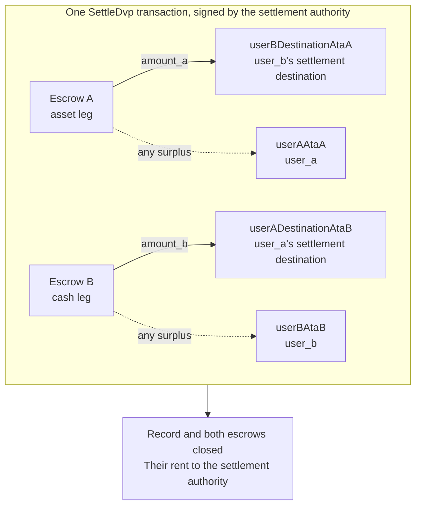

`SettleDvp` 由交易记录中指定的结算权限方签名。它在一笔交易中将资产腿的 `amount_a` 转入现金腿一方的目标账户，将现金腿的 `amount_b` 转入资产腿一方的目标账户，把任一托管账户中的多余部分退还给该腿所属一方，并关闭交易记录和两个托管账户。如果其中任何一笔转账无法完成，该指令会失败，且不会有任何资金移动。

本页承接 [创建交易](/docs/defi/dvp-program/create-a-trade) 和 [为交易腿注资](/docs/defi/dvp-program/fund-the-legs)；client、签名者、`trade` 以及各方的 token account 均沿用。

## 签名前重新校验

结算权限方签署的交易会移动两条腿的资金，因此在签名之前，它会像各方一样执行相同的读取检查：所有者、大小、各方、mint、金额、到期时间以及两个目标账户（参见 [为交易腿注资](/docs/defi/dvp-program/fund-the-legs#verify-the-terms)）。程序本身在结算时还会再次检查：每个 mint 仍属于创建时记录的 token program，不带任何被禁止的扩展，并且 mint authority 与创建交易时一致，因此，若 mint 被重新创建并带有被禁止的扩展、使用了不同的 token program 或不同的 mint authority，则无法结算。

## 创建接收账户

Settle 会写入四个程序不会创建的 token account：

| 账户                | 接收内容                     | 所有者                           |
| ---------------------- | ---------------------------- | ------------------------------- |
| `userADestinationAtaB` | 现金腿（`amount_b`）    | `user_a_settlement_destination` |
| `userBDestinationAtaA` | 资产腿（`amount_a`）   | `user_b_settlement_destination` |
| `userAAtaA`            | 资产腿上的任何多余部分 | `user_a`                        |
| `userBAtaB`            | 现金腿上的任何多余部分  | `user_b`                        |

只有当托管账户中的资金超过约定金额时，才会用到多余部分的退款账户，但任何持有该 mint 的人都可以向托管账户转入少量最小单位（base unit）来制造多余金额。如果退款账户不存在，整个 Settle 都会失败，因此请在同一笔交易中以幂等方式创建全部四个账户。

<Tabs items={["TypeScript", "Rust"]}>
  <Tab value="TypeScript">
    ```ts
    import {
      findAssociatedTokenPda,
      getCreateAssociatedTokenIdempotentInstruction,
    } from "@solana-program/token-2022";

    const destinationA = t.userASettlementDestination; // defaults to userA
    const destinationB = t.userBSettlementDestination; // defaults to userB

    const [userADestinationAtaB] = await findAssociatedTokenPda({
      mint: mintB,
      owner: destinationA,
      tokenProgram: tokenProgramB,
    });
    const [userBDestinationAtaA] = await findAssociatedTokenPda({
      mint: mintA,
      owner: destinationB,
      tokenProgram: tokenProgramA,
    });
    // userAAtaA and userBAtaB are from fund the legs.

    const createRecipientAccounts = [
      { ata: userADestinationAtaB, owner: destinationA, mint: mintB, tokenProgram: tokenProgramB },
      { ata: userBDestinationAtaA, owner: destinationB, mint: mintA, tokenProgram: tokenProgramA },
      { ata: userAAtaA, owner: userA, mint: mintA, tokenProgram: tokenProgramA },
      { ata: userBAtaB, owner: userB, mint: mintB, tokenProgram: tokenProgramB },
    ].map(({ ata, owner, mint, tokenProgram }) =>
      getCreateAssociatedTokenIdempotentInstruction({
        payer: authoritySigner,
        ata,
        owner,
        mint,
        tokenProgram,
      }),
    );
    ```

  </Tab>

  <Tab value="Rust">
    ```rust
    use spl_associated_token_account_client::address::get_associated_token_address_with_program_id;
    use spl_associated_token_account_client::instruction::create_associated_token_account_idempotent;

    let authority: Pubkey = pubkey!("SETTLEMENT_AUTHORITY_ADDRESS_HERE");
    let destination_a = trade.user_a_settlement_destination; // defaults to user_a
    let destination_b = trade.user_b_settlement_destination; // defaults to user_b

    let user_a_destination_ata_b =
        get_associated_token_address_with_program_id(&destination_a, &mint_b, &token_program_b);
    let user_b_destination_ata_a =
        get_associated_token_address_with_program_id(&destination_b, &mint_a, &token_program_a);
    let user_a_ata_a = get_associated_token_address_with_program_id(&user_a, &mint_a, &token_program_a);
    let user_b_ata_b = get_associated_token_address_with_program_id(&user_b, &mint_b, &token_program_b);

    let create_recipient_accounts = [
        create_associated_token_account_idempotent(&authority, &destination_a, &mint_b, &token_program_b),
        create_associated_token_account_idempotent(&authority, &destination_b, &mint_a, &token_program_a),
        create_associated_token_account_idempotent(&authority, &user_a, &mint_a, &token_program_a),
        create_associated_token_account_idempotent(&authority, &user_b, &mint_b, &token_program_b),
    ];
    ```

  </Tab>
</Tabs>

## 结算

`legAExtrasCount` 告知程序：固定列表之后追加的账户中，有多少个属于资产腿的 transfer hook，其余的则属于现金腿。对于没有 transfer hook 的 mint，传入 0 且不追加任何账户。memo program account 是该指令必需的，仅用于要求 memo 的目标账户。

<Tabs items={["TypeScript", "Rust"]}>
  <Tab value="TypeScript">
    ```ts
    import { MEMO_PROGRAM_ADDRESS } from "@solana-program/memo";
    import { getSettleDvpInstruction } from "./dvp";

    const settleInstruction = getSettleDvpInstruction({
      settlementAuthority: authoritySigner,
      swapDvp,
      mintA,
      mintB,
      dvpAtaA: escrowA,
      dvpAtaB: escrowB,
      userADestinationAtaB,
      userBDestinationAtaA,
      userAAtaA,
      userBAtaB,
      tokenProgramA,
      tokenProgramB,
      memoProgram: MEMO_PROGRAM_ADDRESS,
      legAExtrasCount: 0,
    });

    const { context: settleContext } = await client.sendTransaction([
      ...createRecipientAccounts,
      settleInstruction,
    ]);
    const settleSignature = settleContext.signature;
    console.log("Submitted:", settleSignature);

    // sendTransaction returns at the client's commitment (confirmed by default).
    // Wait for finalized before recording the trade as settled.
    let finalized = false;
    for (let attempt = 0; attempt < 30 && !finalized; attempt++) {
      const {
        value: [status],
      } = await client.rpc.getSignatureStatuses([settleSignature]).send();
      if (status?.err) {
        throw new Error("Settle transaction failed");
      }
      finalized = status?.confirmationStatus === "finalized";
      if (!finalized) {
        await new Promise((resolve) => setTimeout(resolve, 2_000));
      }
    }
    if (!finalized) {
      // A closed record means it settled; an open one is safe to settle again.
      throw new Error("Settle not finalized after 60s; read the trade record");
    }
    console.log("Settled:", settleSignature);
    ```

  </Tab>

  <Tab value="Rust">
    ```rust
    use dvp_swap_program_client::instructions::SettleDvpBuilder;

    const MEMO_PROGRAM_ID: Pubkey = pubkey!("MemoSq4gqABAXKb96qnH8TysNcWxMyWCqXgDLGmfcHr");

    let settle_ix = SettleDvpBuilder::new()
        .settlement_authority(authority)
        .swap_dvp(swap_dvp)
        .mint_a(mint_a)
        .mint_b(mint_b)
        .dvp_ata_a(escrow_a)
        .dvp_ata_b(escrow_b)
        .user_a_destination_ata_b(user_a_destination_ata_b)
        .user_b_destination_ata_a(user_b_destination_ata_a)
        .user_a_ata_a(user_a_ata_a)
        .user_b_ata_b(user_b_ata_b)
        .token_program_a(token_program_a)
        .token_program_b(token_program_b)
        .memo_program(MEMO_PROGRAM_ID)
        .leg_a_extras_count(0)
        .instruction();
    ```

  </Tab>
</Tabs>



### Transfer hook

生成的 IDL 仅列出固定账户，因此生成的 builder 并不了解 hook 账户。请按照直接转移该 token 时的相同方式，解析每个 hook mint 的额外账户元数据（extra account metas），然后将其追加到指令中：先是资产腿的账户，再是现金腿的账户，并将 `legAExtrasCount` 设为第一组的数量。在 TypeScript 中，将解析得到的 metas 展开到指令的 `accounts` 数组中；在 Rust 中，使用 builder 上的 `add_remaining_accounts`。每条腿的上限为 32 个账户，包括 hook 程序和验证账户；当两条腿都带有 hook 时，交易的账户数量上限可能会先达到。程序会从每个转发的账户中移除 signer 标志，因此 hook 无法通过这条路径获得结算权限方的签名。

## 记录结果

当 Settle 交易达到 `finalized` 时，才可将该交易视为已结算。结算后，交易记录和两个托管账户都不再存在，因此之后需要这些条款的系统，应从结算前的读取结果或创建交易中保存它们。已关闭账户的 rent 已归结算权限方所有。

## 结算错误

`LegNotFunded` 表示某个托管账户中的资金少于其约定金额；`DvpExpired` 和 `SettlementTooEarly` 表示错过了时间窗口；`MintAuthorityChanged` 和 `BlockedMintExtension` 表示某个 mint 在创建后发生了变化；`RecipientAtaMismatch` 表示目标账户或退款 token account 缺失，或不再属于预期的所有者和 mint，通常是因为跳过了上面的创建账户步骤。无论哪种情况，都不会有任何资金移动，各方可以撤销交易，但受限于 mint 的各项 authority（参见 [撤销交易](/docs/defi/dvp-program/unwind-a-trade)）。

## 后续步骤

- [撤销交易](/docs/defi/dvp-program/unwind-a-trade)：交易未能结算时，取回已注资的交易腿
