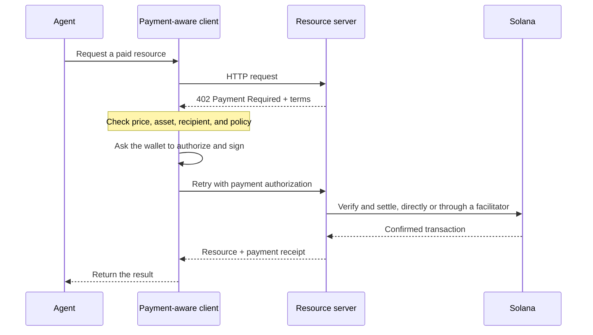

智能体支付让软件能够在同一个 HTTP 工作流中发现价格、授权付款并获取资源。智能体无需事先创建账单账户或复制
API 密钥,即可为数据查询、模型推理或工具调用付费。

<Cards>
  <Card title="MPP" href="/docs/payments/agentic-payments/mpp">
    使用 HTTP 身份验证处理一次性收费和计量付款会话。
  </Card>
  <Card title="x402" href="/docs/payments/agentic-payments/x402">
    为 HTTP 资源添加 x402 V2 支付要求、签名和结算功能。
  </Card>
</Cards>

## 通用支付流程

MPP 和 x402 使用不同的标头和数据模型,但其基本 HTTP 流程相似:

## MPP 与 x402

这两种协议都可以在 Solana 上结算稳定币支付。请根据您的服务所需的支付模型和互操作性来选择,而不仅仅是看它们共用的 `402` 状态码。

|                         | MPP                                                               | x402                                                                     |
| ----------------------- | ----------------------------------------------------------------- | ------------------------------------------------------------------------ |
| 质询               | `WWW-Authenticate: Payment`                                       | `PAYMENT-REQUIRED`                                                       |
| 客户端授权    | `Authorization: Payment`                                          | `PAYMENT-SIGNATURE`                                                      |
| 收据                 | `Payment-Receipt`                                                 | `PAYMENT-RESPONSE`                                                       |
| Solana 支付模型   | 一次性 `charge` 以及设有上限的计量式 `session` 意图           | `exact` 和 `upto` 等方案;支持情况因网络和客户端而异 |
| 结算架构 | 服务器验证,或可选的中继或网关                | 具备本地验证能力的资源服务器,或 facilitator                 |
| 推荐的起点     | 需要 HTTP 身份验证语义或重复计量的 API | 按请求付费的资源和现有的 x402 客户端                      |

MPP 是 **Machine Payments Protocol(机器支付协议)**,请勿将其与 **Model Context Protocol(MCP,模型上下文协议)** 混淆。MCP 向智能体开放工具和资源;而当智能体调用其中某个工具时,MPP 或 x402 可以要求其先付款。

<Callout type="info">
  一项服务可以同时声明支持多种协议。客户端会选择其支持的一种支付方式,然后在整个交互过程中使用与之匹配的质询、授权和收据标头。
</Callout>
