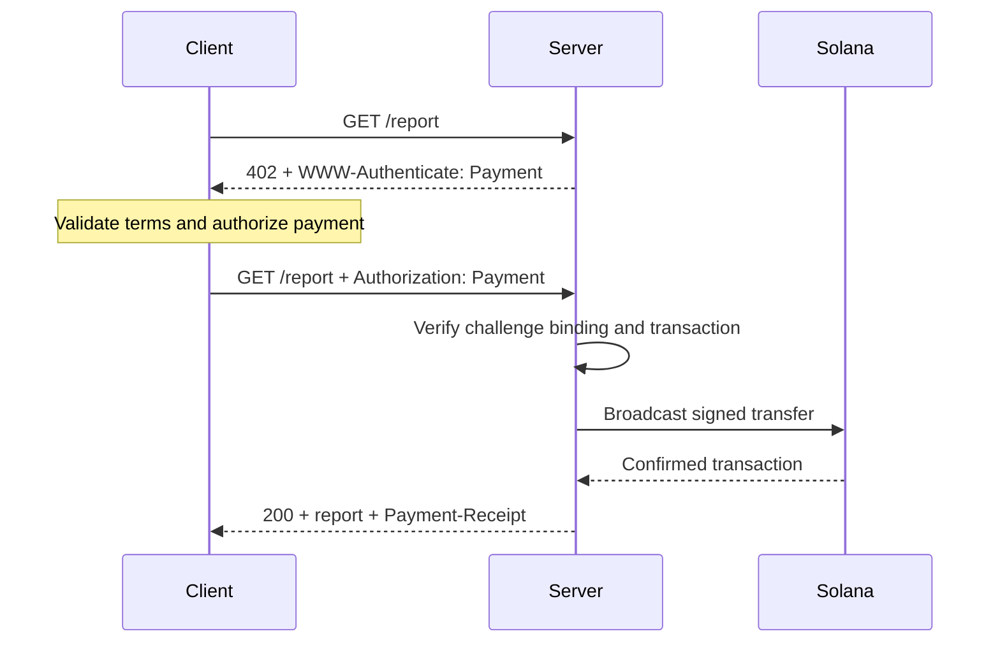
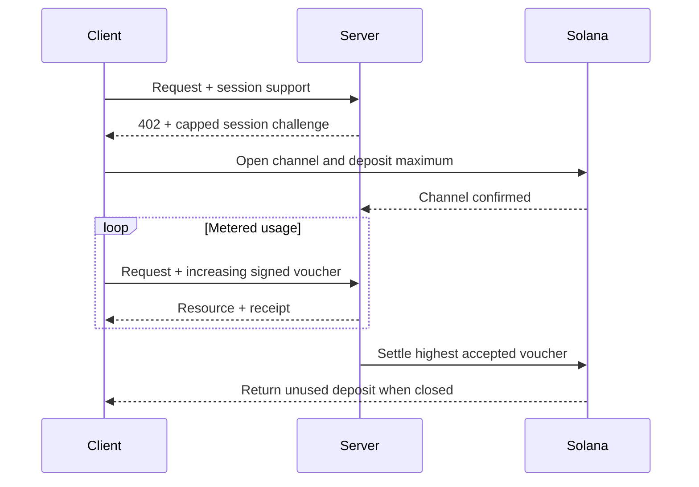

[Machine Payments Protocol (MPP)](https://mpp.dev/) 将 HTTP 认证语义应用于支付。服务器会对未支付的请求发起质询,客户端返回支付凭证,服务器在接受支付后返回收据。

MPP 将三个关注点分开:

- **意图(intent)** 描述商业交互方式,例如一次性的 `charge` 或计量式的 `session`。
- **支付方式(payment method)** 描述价值如何转移。Solana 支付方式支持使用原生 SOL 和 SPL 代币进行收费。
- HTTP **传输层(transport)** 负责承载质询、凭证、收据和错误信息。

MPP 以一组 Internet-Draft 的形式发布。请以[最新规范](https://paymentauth.org/)为准,并注意在草案仍处于制定阶段期间,相关细节可能会发生变化。

## HTTP 交互流程

MPP 使用标准的 HTTP 认证字段,而不是特定于协议的支付标头:

| 消息                 | HTTP 表示形式                                         |
| ----------------------- | ----------------------------------------------------------- |
| 支付质询       | 返回 `402 Payment Required`,并附带 `WWW-Authenticate: Payment ...` |
| 支付凭证      | 携带 `Authorization: Payment ...` 重试请求           |
| 成功收据      | 资源响应中附带 `Payment-Receipt: ...`               |
| 无效的支付详情 | 使用 `application/problem+json` 的 Problem Details 响应体       |



质询包含服务器生成的 ID、realm、支付方式、意图、编码后的支付请求以及有效期。凭证会回传该质询,并附加特定于支付方式的支付证明。服务器必须同时验证这两部分;属于其他质询的有效转账不得解锁该资源。

## Solana 一次性收费

Solana 的 `charge` 意图支持两种凭证类型:

- **拉取模式(Pull mode)** 使用已签名的交易。客户端对转账签名,并将交易发送给服务器。服务器负责验证,可选择性地添加手续费支付方签名,然后广播、确认,并在收据中返回交易签名。
- **推送模式(Push mode)** 使用交易签名。客户端先广播交易,再将已确认的签名发送给服务器。服务器在返回资源之前会获取并验证该交易。

拉取模式支持由服务器代付交易手续费以及服务器端重试逻辑。当钱包要求客户端自行提交交易时,推送模式会很有用,但它无法使用服务器代付手续费。

有关规范性字段和验证规则,请参阅 [Solana charge 规范](https://paymentauth.org/draft-solana-charge-00.html)。

## 为 Express API 添加 MPP 收费

Solana Pay Kit 为 MPP 和 x402 提供了最新的 TypeScript 集成。请将其与 Express 一起安装:

```bash
pnpm add @solana/pay-kit @solana/kit@^6.9.0 express
pnpm add --save-dev @types/express tsx
```

这个最简示例使用托管的 Surfpool 沙盒和该软件包的公开演示收款方,仅适用于本地开发:

```ts filename=server.ts
import express from "express";
import { createPayKit, usd } from "@solana/pay-kit";

const pay = await createPayKit({
  accept: ["mpp"],
  rpcUrl: "https://402.surfnet.dev:8899"
});

const app = express();

app.get("/report", pay.express(usd("0.01")), (_req, res) => {
  res.json({ report: "Paid report" });
});

app.listen(4567, () => {
  console.log("Paid API listening on http://127.0.0.1:4567");
});
```

运行后,对比未支付请求与支持支付的请求:

```bash
pnpm tsx server.ts
curl -i http://127.0.0.1:4567/report
pay --sandbox curl http://127.0.0.1:4567/report
```

只有在中间件接受支付之后,路由处理程序才会运行。

<Callout type="warn" title="在生产环境中替换所有沙盒默认值">
  请配置明确的网络、商户收款方、专用 RPC、稳定的质询绑定密钥、生产环境签名者以及持久化的重放防护存储。切勿将真实支付路由到软件包的演示签名者。
</Callout>

## 计量会话

当客户端将进行大量小额且相关的支付时,请使用 Solana MPP 的 `session`。会话会开启一个带有最大存款额度的链上支付通道,随后随着用量增长使用累计签名的凭单(voucher)。服务器可以在链下验证凭单,并在之后结算已接受的最高金额。

这适用于按代币计量的推理、按字节计量的下载、实时数据以及重复的工具调用。这与为每个事件单独发送一笔链上支付并不相同。



请将会话称为**会话支付**、**支付通道**或**限额重复授权**。只有当服务和支付合约确实对流式用量进行计量时,才可称之为流式支付。

## 生产环境验证

对于每一笔 Solana 收费,服务器至少必须验证:

- 质询真实有效、未过期、与当前请求绑定,并且适用于此 realm。
- 交易使用了预期的网络、资产或 mint、收款方、金额以及 token program。
- 任何手续费支付方或 associated token account 指令都经过明确许可,且无法耗尽服务器签名者的资金。
- 交易已在所需的确认级别(commitment level)下成功。
- 该交易签名尚未被使用。
- 重放检查与消耗操作在所有服务器实例之间是原子性的。

对于会话,还需要将通道状态、已接受的累计金额和结算水位线持久化到共享存储中。请说明当服务器不可用时,客户端如何取回未使用的资金。

## 相关资源

- [MPP 规范](https://paymentauth.org/)
- [MPP 协议文档](https://mpp.dev/protocol)
- [Solana Pay Kit](https://github.com/solana-foundation/pay-kit)
- [智能体支付概述](/docs/payments/agentic-payments)
- [生产就绪](/docs/tools/production-readiness)
