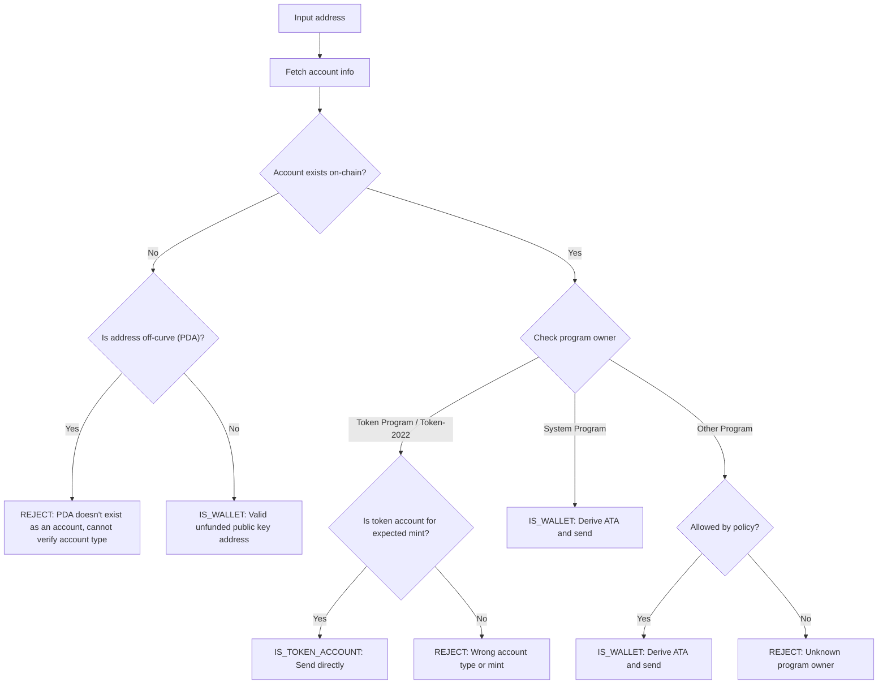

将代币发送到错误的地址可能导致资金永久丢失。地址验证可确保你只向能够正确接收和访问代币的地址发送代币。

<Callout>
  参见 [Solana 支付原理](/docs/payments/how-payments-work)，了解核心支付概念。
</Callout>

## 了解 Solana 地址

Solana 账户有两种类型的地址：on-curve 和 off-curve。

### On-Curve 地址

标准地址是由 Ed25519 密钥对生成的公钥。这些地址：

- 拥有可用于签署交易的对应私钥
- 用作钱包地址

### Off-Curve 地址（PDA）

[Program Derived Address](/docs/core/pda)（程序派生地址，PDA）是通过程序 ID 和种子确定性生成的。这些地址：

- **没有**对应的私钥
- 只能由派生该地址的程序进行签名

## 支付中的账户类型

使用地址从网络获取
[账户](/docs/core/accounts)，检查其程序所有者和账户类型，以确定如何处理该地址。

<Callout>
  仅知道一个地址是 on-curve 还是
  off-curve，并不能判断它是什么类型的账户、归哪个程序所有，或该地址下是否存在账户。你必须从网络获取账户信息以确定这些细节。
</Callout>

### System Program 账户（钱包）

由 System Program 拥有的账户是标准钱包。要向钱包发送 SPL 代币，需要推导并使用其
[Associated Token Account (ATA)](/docs/tokens/basics/create-token-account#whats-an-associated-token-account)。

推导出 ATA 地址后，需检查该 token
account 是否已在链上存在。如果 ATA 不存在，可以在转账的同一笔交易中包含创建收款人 token
account 的指令。但这需要为新 token
account 支付 rent。由于收款人拥有 ATA，支付的 SOL rent 无法由发送方取回。

<Callout type="warn">
  如果没有防护措施，补贴 ATA
  创建可能会被恶意利用。恶意用户可以请求转账，由你承担费用创建他们的
  ATA，然后关闭 ATA 回收 rent SOL，并重复此操作。
</Callout>

### Token 账户

[Token 账户](/docs/tokens/basics/create-token-account) 由 Token
Program 或 Token-2022
Program 管理，用于存储代币余额。如果你收到的地址归属于某个 token
program，你应当在转账前验证该账户是 token account（而不是 mint
account），并且与预期的 token mint account 匹配。

<Callout type="info">
  Token Programs 会自动验证转账中的两个 token account 是否持有同一 mint
  的代币。如果验证失败，交易会被拒绝，资金不会丢失。
</Callout>

### Mint 账户

[Mint 账户](/docs/tokens/basics/create-mint)
用于记录特定代币的总供应量和元数据。Mint account 也由 Token
Programs 管理，但**不能**作为代币转账的有效接收方。尝试向 mint 地址发送代币会导致交易失败，但资金不会丢失。

### 其他账户

由其他程序管理的账户需要根据策略进行判断。有些账户（如多签钱包）可以作为有效的 token
account 拥有者，而其他账户则应被拒绝。

## 验证流程

下图展示了用于验证地址的参考决策树：



<Steps>
<Step>

### 获取账户

使用该地址从网络获取账户详情。

</Step>
<Step>

### 账户不存在

如果该地址没有账户，检查该地址是 on-curve 还是 off-curve：

- **Off-curve（PDA）**：为避免将代币发送到可能无法访问的 ATA，建议保守地拒绝该地址。如果没有现有账户，仅凭地址无法判断是哪个程序派生了该 PDA，也无法确定该地址是否为 ATA。为该地址派生 ATA 并发送代币，可能导致资金被锁定在无法访问的 token
  account 中。

- **On-curve**：这是一个尚未充值的有效钱包地址（公钥）。请派生 ATA，检查其是否存在，然后将代币发送到该地址。如果 ATA 不存在，你需要根据策略决定是否为其创建并承担相关费用。

</Step>
<Step>

### 账户已存在

如果账户已存在，请检查其归属于哪个程序：

- **System
  Program**：这是一个标准钱包。请派生 ATA，检查其是否存在，然后将代币发送到该地址。如果 ATA 不存在，你需要根据策略决定是否为其创建并承担相关费用。

- **Token Program / Token-2022**：请确认该账户是 token account（而不是 mint
  account），并且持有你要发送的 token（mint）。如果验证通过，可直接将代币发送到该地址。如果是 mint
  account 或属于其他 mint 的 token account，则拒绝该地址。

- **其他程序**：这需要根据策略决定。有些程序（如多签钱包）可能是 token
  account 的合法拥有者。如果你的策略允许，可以派生 ATA 并发送。否则，拒绝该地址。

</Step>
</Steps>

## 演示

以下示例仅展示地址校验逻辑。此代码仅供参考和说明用途。

<Callout>
  此演示未展示如何推导 ATA 或构建交易以发送代币。请参考 [token
  account](/docs/tokens/basics/create-token-account#how-to-create-an-associated-token-account)
  和 [token transfer](/docs/tokens/basics/transfer-tokens) 文档，获取示例代码。
</Callout>

下方演示包含三种可能的结果：

| 结果               | 含义               | 操作                                  |
| ------------------ | ------------------ | ------------------------------------- |
| `IS_WALLET`        | 有效钱包地址       | 推导并发送到 associated token account |
| `IS_TOKEN_ACCOUNT` | 有效 token account | 直接将代币发送到该地址                |
| `REJECT`           | 无效地址           | 不发送                                |

<CodeTabs flags="r">

```ts !! title="Demo"
// !collapse(1:35) collapsed

import {
  type Address,
  type Rpc,
  type GetAccountInfoApi,
  createSolanaRpc,
  fetchJsonParsedAccount,
  isOffCurveAddress,
  generateKeyPairSigner,
  getProgramDerivedAddress
} from "@solana/kit";

// =============================================================================
// Constants
// =============================================================================

const defaultRpc = createSolanaRpc("https://api.mainnet-beta.solana.com");

const SYSTEM_PROGRAM = "11111111111111111111111111111111" as Address;
const TOKEN_PROGRAM = "TokenkegQfeZyiNwAJbNbGKPFXCWuBvf9Ss623VQ5DA" as Address;
const TOKEN_2022_PROGRAM =
  "TokenzQdBNbLqP5VEhdkAS6EPFLC1PHnBqCXEpPxuEb" as Address;

// =============================================================================
// Validation Function
// =============================================================================

/**
 * Possible validation results for an input address.
 */
export type ValidationResult =
  | { type: "IS_TOKEN_ACCOUNT" }
  | { type: "IS_WALLET" }
  | { type: "REJECT"; reason: string };

/**
 * Validates an input address and classifies it as a wallet, token account, or invalid.
 *
 * @param inputAddress - The address to validate
 * @param rpc - Optional RPC client (defaults to mainnet)
 * @returns Classification result:
 *   - IS_WALLET: Valid wallet address
 *   - IS_TOKEN_ACCOUNT: Valid token account
 *   - REJECT: Invalid address for transfers
 */
export async function validateAddress(
  inputAddress: Address,
  rpc: Rpc<GetAccountInfoApi> = defaultRpc
): Promise<ValidationResult> {
  const account = await fetchJsonParsedAccount(rpc, inputAddress);
  // Log the account data for demo
  console.log("\nAccount:", account);

  // Account doesn't exist on-chain
  if (!account.exists) {
    // Off-curve = PDA that doesn't exist as an account
    // Reject conservatively to avoid sending to an address that may be inaccessible.
    if (isOffCurveAddress(inputAddress)) {
      return { type: "REJECT", reason: "PDA doesn't exist as an account" };
    }
    // On-curve = valid keypair address, treat as unfunded wallet
    return { type: "IS_WALLET" };
  }

  // Account exists, check program owner
  const owner = account.programAddress;

  // System Program = wallet
  if (owner === SYSTEM_PROGRAM) {
    return { type: "IS_WALLET" };
  }

  // Token Program or Token-2022, check if token account
  if (owner === TOKEN_PROGRAM || owner === TOKEN_2022_PROGRAM) {
    const accountType = (
      account.data as { parsedAccountMeta?: { type?: string } }
    ).parsedAccountMeta?.type;

    if (accountType === "account") {
      return { type: "IS_TOKEN_ACCOUNT" };
    }
    // Reject if not a token account (mint account)
    return {
      type: "REJECT",
      reason: "Not a token account"
    };
  }

  // Unknown program owner
  return { type: "REJECT", reason: "Unknown program owner" };
}

// =============================================================================
// Examples
// =============================================================================
// !collapse(1:1000) collapsed

// Wallets
const EXISTING_WALLET =
  "H8sMJSCQxfKiFTCfDR3DUMLPwcRbM61LGFJ8N4dK3WjS" as Address;
const NEW_WALLET = (await generateKeyPairSigner()).address;

// Token accounts
const USDC_TOKEN_ACCOUNT =
  "3emsAVdmGKERbHjmGfQ6oZ1e35dkf5iYcS6U4CPKFVaa" as Address;
const PYUSD_TOKEN_ACCOUNT =
  "47od2TPRvqJipfPVWZdyenLEngPw8hC36nDxiLyvGsEP" as Address;

// Token mints (should be rejected)
const USDC_MINT = "EPjFWdd5AufqSSqeM2qN1xzybapC8G4wEGGkZwyTDt1v" as Address;
const PYUSD_MINT = "2b1kV6DkPAnxd5ixfnxCpjxmKwqjjaYmCZfHsFu24GXo" as Address;

// PDA that doesn't exist (should be rejected)
const [NON_EXISTENT_PDA] = await getProgramDerivedAddress({
  programAddress: (await generateKeyPairSigner()).address,
  seeds: ["seed"]
});

// Program account (should be rejected)
const PROGRAM_ACCOUNT =
  "p1exdMJcjVao65QdewkaZRUnU6VPSXhus9n2GzWfh98" as Address;

async function runExample(label: string, address: Address) {
  console.log(`\n${"─".repeat(60)}`);
  console.log(`Example: ${label}`);
  console.log(`Input: ${address}`);
  console.log(`${"─".repeat(60)}`);

  const result = await validateAddress(address);
  console.log("\nResult:", result);
}

console.log("\n" + "═".repeat(60));
console.log("  IS_WALLET Examples");
console.log("═".repeat(60));

await runExample("Existing funded wallet", EXISTING_WALLET);
await runExample("New wallet (unfunded)", NEW_WALLET);

console.log("\n" + "═".repeat(60));
console.log("  IS_TOKEN_ACCOUNT Examples");
console.log("═".repeat(60));

await runExample("USDC token account (Token Program)", USDC_TOKEN_ACCOUNT);
await runExample("PYUSD token account (Token-2022)", PYUSD_TOKEN_ACCOUNT);

console.log("\n" + "═".repeat(60));
console.log("  REJECT Examples");
console.log("═".repeat(60));

await runExample("USDC mint address", USDC_MINT);
await runExample("PYUSD mint address", PYUSD_MINT);
await runExample("Non-existent PDA", NON_EXISTENT_PDA);
await runExample("Program account", PROGRAM_ACCOUNT);

console.log("\n" + "═".repeat(60));
console.log("  Done!");
console.log("═".repeat(60) + "\n");
```

</CodeTabs>
