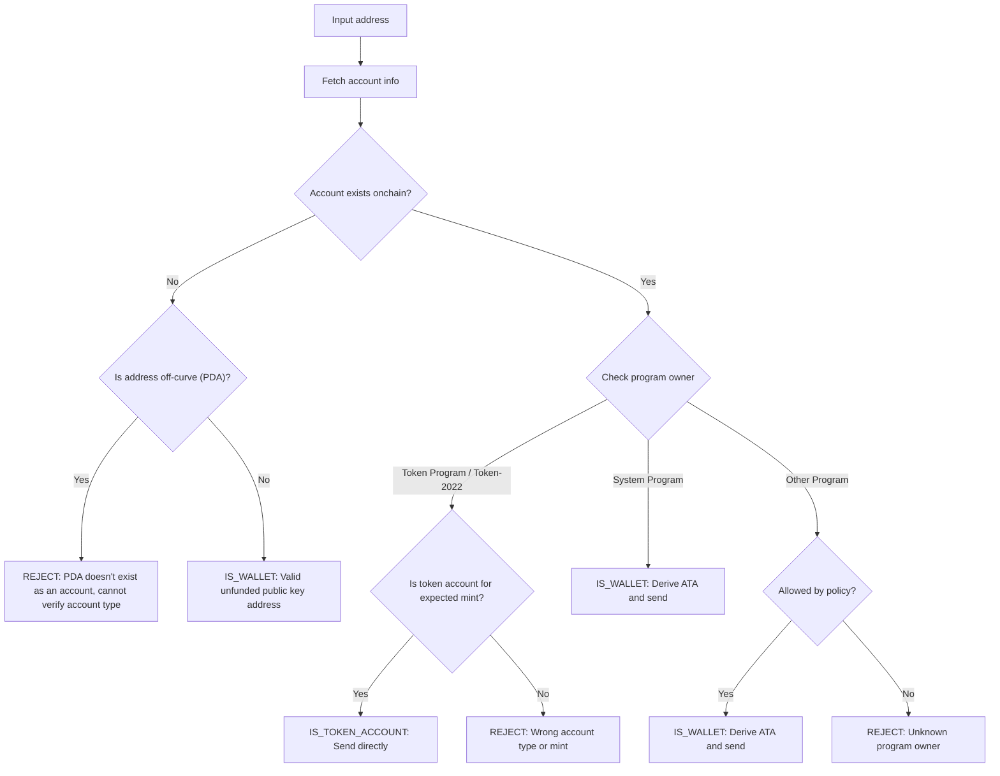

将资金发送到错误地址可能导致永久性损失。地址验证确保您只向能够正确接收和访问资金的地址发送。

验证方式取决于您发送的内容：

- **SPL 代币**具有一定的自我保护机制。Token
  Program 会拒绝账户与预期铸币地址不匹配的转账，因此误转代币的操作会失败，且不会造成资金损失。本页面大部分内容涵盖 SPL 代币的发送。
- **原生 SOL** 没有此类保护机制。System
  Program 的转账可以成功进入任何账户，因此发送给错误接收方会永久锁定 SOL。请参阅
  [发送原生 SOL](#sending-native-sol)。

<Callout>
  请参阅 [Solana 支付的工作原理](/docs/payments/how-payments-work)
  了解核心支付概念。
</Callout>

## 了解 Solana 地址

Solana 账户有两种类型的地址：曲线上地址和曲线外地址。

### 曲线上地址

标准地址是来自 Ed25519 keypair 的公钥。这些地址：

- 具有可对交易进行签名的对应私钥
- 用作钱包地址

### 曲线外地址（PDA）

[Program Derived Address](/docs/core/pda)
由程序 ID 和种子确定性派生而来。这些地址：

- **没有**对应的私钥
- 只能由派生该地址的程序进行签名

## 支付中的账户类型

使用地址从网络获取[账户](/docs/core/accounts)，检查其程序所有者和账户类型，以确定如何处理该地址。

<Callout>
  了解一个地址是曲线上还是曲线外，并不能告诉您该账户的类型、哪个程序拥有它，或者该地址上是否存在账户。您必须从网络中获取该账户才能确定这些详细信息。
</Callout>

### System Program 账户（钱包）

由 System Program 拥有的账户是标准钱包。要向钱包发送 SPL 代币，请派生并使用其
[Associated Token Account (ATA)](/docs/tokens/basics/create-token-account#whats-an-associated-token-account)。

派生出 ATA 地址后，请检查该 token
account 是否已存在于链上。如果 ATA 不存在，你可以在与转账相同的交易中加入一条指令，用于创建收款方的 token
account。不过，这需要为新的 token
account 支付 rent。由于收款方拥有该 ATA，发送方无法收回为 rent 支付的 SOL。

<Callout type="warn">
  如果没有保护措施，补贴创建 ATA 的机制可能会被利用。恶意
  用户可以请求一笔转账，让你出资创建其 ATA，然后关闭 该 ATA 以取回 rent
  SOL，并重复此操作。
</Callout>

### Token Accounts

[Token accounts](/docs/tokens/basics/create-token-account) 由 Token
Program 或 Token-2022 Program 拥有，并持有代币余额。如果你收到的地址由某个 token
program 拥有，那么在发送前，你应验证该账户是 token account（而不是 mint
account），并且与预期的代币 mint account 相匹配。

<Callout type="info">
  Token Programs 会自动验证转账中的两个 token accounts 是否持有同一 mint
  的代币。如果验证失败，交易会被拒绝，且不会损失任何资金。
</Callout>

### Mint Accounts

[Mint accounts](/docs/tokens/basics/create-mint)
用于跟踪特定代币的供应量和元数据。Mint accounts 也由 Token Programs 拥有，但
**不是**
代币转账的有效接收方。尝试向 mint 地址发送代币会导致交易失败，但不会损失任何资金。

### 其他账户

由其他程序拥有的账户需要进行策略决策。某些账户（例如多签钱包）可能是有效的 token
account 所有者，而其他账户则应被拒绝。

## 发送原生 SOL

上述分类决定了 SPL 代币的去向。原生 SOL 的要求更为严格：唯一安全的接收方是
**System Program 钱包**（或一个尚未注资、位于曲线上的地址，该地址将成为 System
Program 钱包）。

System Program 转账会将 lamport 添加到任意账户，包括铸币账户、token
account、program
account 和 PDA。lamport 只能由账户的所属程序转出，因此将 SOL 发送至错误的接收方可能导致资金永久丢失。

与 SPL 代币转账不同，当接收方为意外地址时，交易**不会**失败。

在发送原生 SOL 时，只有 `IS_WALLET` 的结果是可接受的。`IS_TOKEN_ACCOUNT`
则**不可接受**：token
account 持有 SPL 代币，发送至该地址的 SOL 将超出发送方的控制范围。

<Callout type="warn">
  这是 SOL 丢失的常见方式：用户将代币的铸币地址（或 program account 地址）粘贴到
  SOL 提款操作中。转账成功执行，但 SOL 无法找回。在签署 SOL
  转账前，请务必对接收方进行分类验证。
</Callout>

## 验证流程

下图展示了验证地址的参考决策树：


```mermaid title="Address Verification Flow"
flowchart TD
    A["Input address"]
    B["Fetch account info"]

    A --> B
    B --> C{"Account exists onchain?"}

    %% --- Non-existent account path ---
    C -- "No" --> D{"Is address off-curve (PDA)?"}
    D -- "Yes" --> R1["REJECT: PDA doesn't exist as an account, cannot verify account type"]
    D -- "No" --> W1["IS_WALLET: Valid unfunded public key address"]

    %% --- Existing account path ---
    C -- "Yes" --> F{"Check program owner"}

    F -- "Token Program / Token-2022" --> G{"Is token account for expected mint?"}
    G -- "Yes" --> T1["IS_TOKEN_ACCOUNT: Send directly"]
    G -- "No" --> R2["REJECT: Wrong account type or mint"]

    F -- "System Program" --> W2["IS_WALLET: Derive ATA and send"]

    F -- "Other Program" --> K{"Allowed by policy?"}
    K -- "Yes" --> W3["IS_WALLET: Derive ATA and send"]
    K -- "No" --> R3["REJECT: Unknown program owner"]
```

<Steps>
<Step>

### 获取账户

使用该地址从网络中获取账户详情。

</Step>
<Step>

### 账户不存在

如果该地址不存在对应账户，请检查该地址是否位于曲线上或曲线外：

- **曲线外（PDA）**：出于保守原则，拒绝该地址，以避免将资金发送至可能无法访问的 associated
  token
  account。在没有现有账户的情况下，仅凭地址无法判断该 PDA 由哪个程序派生，也无法确认该地址是否属于 associated
  token account。为此地址派生 associated token
  account 并发送代币，可能导致资金被锁定在无法访问的 token account 中。

- **曲线上（On-curve）**：这是一个尚未充值的有效钱包地址（公钥）。请派生对应的 ATA，检查其是否存在，并向其发送代币。如果 ATA 不存在，您必须制定是否资助创建该 ATA 的策略决定。

</Step>
<Step>

### 账户已存在

如果账户已存在，请检查哪个程序拥有该账户：

- **System
  Program**：这是一个标准钱包。请派生对应的 ATA，检查其是否存在，并向其发送代币。如果 ATA 不存在，您必须制定是否资助创建该 ATA 的策略决定。

- **Token Program / Token-2022**：验证该账户是否为 token account（而非 mint
  account），以及它是否持有您打算发送的代币（mint）。如果有效，请直接向该地址发送代币。如果它是 mint
  account 或属于其他 mint 的 token account，则拒绝该地址。

- **其他程序**：这需要制定策略决定。某些程序（如多签钱包）可能是 token
  account 的合法所有者。如果您的策略允许，请派生 ATA 并发送代币；否则，拒绝该地址。

</Step>
</Steps>

## 演示

以下示例仅展示地址验证逻辑，本代码仅供参考说明之用。

<Callout>
  演示未展示如何派生 ATA 或构建发送代币的交易。请参阅 [token
  account](/docs/tokens/basics/create-token-account#how-to-create-an-associated-token-account)
  和 [token transfer](/docs/tokens/basics/transfer-tokens) 文档获取示例代码。
</Callout>

以下演示包含三种可能的结果：

| 结果               | 含义                 | 操作                                  |
| ------------------ | -------------------- | ------------------------------------- |
| `IS_WALLET`        | 有效的钱包地址       | 派生并发送至 associated token account |
| `IS_TOKEN_ACCOUNT` | 有效的 token account | 直接向该地址发送代币                  |
| `REJECT`           | 无效地址             | 请勿发送                              |

然后，它通过 `canReceiveNativeSol`（仅限钱包）和
`canReceiveSplToken`（钱包或 token
account）将每个结果映射到每项资产的可接受性。token account 返回
`IS_TOKEN_ACCOUNT`，因此它可以接收 SPL 代币，但**不能**接收原生 SOL——正是这一区别防止了 SOL 被锁定。

<CodeTabs flags="r">

```ts !! title="Demo"
// !collapse(1:35) collapsed

import {
  type Address,
  type Rpc,
  type GetAccountInfoApi,
  createSolanaRpc,
  fetchJsonParsedAccount,
  isOffCurveAddress,
  generateKeyPairSigner,
  getProgramDerivedAddress
} from "@solana/kit";

// =============================================================================
// Constants
// =============================================================================

const defaultRpc = createSolanaRpc("https://api.mainnet-beta.solana.com");

const SYSTEM_PROGRAM = "11111111111111111111111111111111" as Address;
const TOKEN_PROGRAM = "TokenkegQfeZyiNwAJbNbGKPFXCWuBvf9Ss623VQ5DA" as Address;
const TOKEN_2022_PROGRAM =
  "TokenzQdBNbLqP5VEhdkAS6EPFLC1PHnBqCXEpPxuEb" as Address;

// =============================================================================
// Validation Function
// =============================================================================

/**
 * Possible validation results for an input address.
 */
export type ValidationResult =
  | { type: "IS_TOKEN_ACCOUNT" }
  | { type: "IS_WALLET" }
  | { type: "REJECT"; reason: string };

/**
 * Validates an input address and classifies it as a wallet, token account, or invalid.
 *
 * @param inputAddress - The address to validate
 * @param rpc - Optional RPC client (defaults to mainnet)
 * @returns Classification result:
 *   - IS_WALLET: Valid wallet address
 *   - IS_TOKEN_ACCOUNT: Valid token account
 *   - REJECT: Invalid address for transfers
 */
export async function validateAddress(
  inputAddress: Address,
  rpc: Rpc<GetAccountInfoApi> = defaultRpc
): Promise<ValidationResult> {
  const account = await fetchJsonParsedAccount(rpc, inputAddress);
  // Log the account data for demo
  console.log("\nAccount:", account);

  // Account doesn't exist onchain
  if (!account.exists) {
    // Off-curve = PDA that doesn't exist as an account
    // Reject conservatively to avoid sending to an address that may be inaccessible.
    if (isOffCurveAddress(inputAddress)) {
      return { type: "REJECT", reason: "PDA doesn't exist as an account" };
    }
    // On-curve = valid keypair address, treat as unfunded wallet
    return { type: "IS_WALLET" };
  }

  // Account exists, check program owner
  const owner = account.programAddress;

  // System Program = wallet
  if (owner === SYSTEM_PROGRAM) {
    return { type: "IS_WALLET" };
  }

  // Token Program or Token-2022, check if token account
  if (owner === TOKEN_PROGRAM || owner === TOKEN_2022_PROGRAM) {
    const accountType = (
      account.data as { parsedAccountMeta?: { type?: string } }
    ).parsedAccountMeta?.type;

    if (accountType === "account") {
      return { type: "IS_TOKEN_ACCOUNT" };
    }
    // Reject if not a token account (mint account)
    return {
      type: "REJECT",
      reason: "Not a token account"
    };
  }

  // Unknown program owner
  return { type: "REJECT", reason: "Unknown program owner" };
}

/**
 * Native SOL is only safe to send to a wallet. Any other account locks it.
 */
function canReceiveNativeSol(result: ValidationResult): boolean {
  return result.type === "IS_WALLET";
}

/**
 * SPL tokens can go to a wallet (via its ATA) or directly to a token account.
 */
function canReceiveSplToken(result: ValidationResult): boolean {
  return result.type === "IS_WALLET" || result.type === "IS_TOKEN_ACCOUNT";
}

// =============================================================================
// Examples
// =============================================================================
// !collapse(1:1000) collapsed

// Wallets
const EXISTING_WALLET =
  "H8sMJSCQxfKiFTCfDR3DUMLPwcRbM61LGFJ8N4dK3WjS" as Address;
const NEW_WALLET = (await generateKeyPairSigner()).address;

// Token accounts
const USDC_TOKEN_ACCOUNT =
  "3emsAVdmGKERbHjmGfQ6oZ1e35dkf5iYcS6U4CPKFVaa" as Address;
const PYUSD_TOKEN_ACCOUNT =
  "47od2TPRvqJipfPVWZdyenLEngPw8hC36nDxiLyvGsEP" as Address;

// Token mints (should be rejected)
const USDC_MINT = "EPjFWdd5AufqSSqeM2qN1xzybapC8G4wEGGkZwyTDt1v" as Address;
const PYUSD_MINT = "2b1kV6DkPAnxd5ixfnxCpjxmKwqjjaYmCZfHsFu24GXo" as Address;

// PDA that doesn't exist (should be rejected)
const [NON_EXISTENT_PDA] = await getProgramDerivedAddress({
  programAddress: (await generateKeyPairSigner()).address,
  seeds: ["seed"]
});

// Program account (should be rejected)
const PROGRAM_ACCOUNT =
  "p1exdMJcjVao65QdewkaZRUnU6VPSXhus9n2GzWfh98" as Address;

async function runExample(label: string, address: Address) {
  console.log(`\n${"─".repeat(60)}`);
  console.log(`Example: ${label}`);
  console.log(`Input: ${address}`);
  console.log(`${"─".repeat(60)}`);

  const result = await validateAddress(address);
  console.log("\nResult:", result);
  console.log(
    `Can receive SOL?   ${canReceiveNativeSol(result) ? "YES" : "NO"}`
  );
  console.log(
    `Can receive token? ${canReceiveSplToken(result) ? "YES" : "NO"}`
  );
}

console.log("\n" + "═".repeat(60));
console.log("  IS_WALLET Examples");
console.log("═".repeat(60));

await runExample("Existing funded wallet", EXISTING_WALLET);
await runExample("New wallet (unfunded)", NEW_WALLET);

console.log("\n" + "═".repeat(60));
console.log("  IS_TOKEN_ACCOUNT Examples");
console.log("═".repeat(60));

await runExample("USDC token account (Token Program)", USDC_TOKEN_ACCOUNT);
await runExample("PYUSD token account (Token-2022)", PYUSD_TOKEN_ACCOUNT);

console.log("\n" + "═".repeat(60));
console.log("  REJECT Examples");
console.log("═".repeat(60));

await runExample("USDC mint address", USDC_MINT);
await runExample("PYUSD mint address", PYUSD_MINT);
await runExample("Non-existent PDA", NON_EXISTENT_PDA);
await runExample("Program account", PROGRAM_ACCOUNT);

console.log("\n" + "═".repeat(60));
console.log("  Done!");
console.log("═".repeat(60) + "\n");
```

</CodeTabs>
