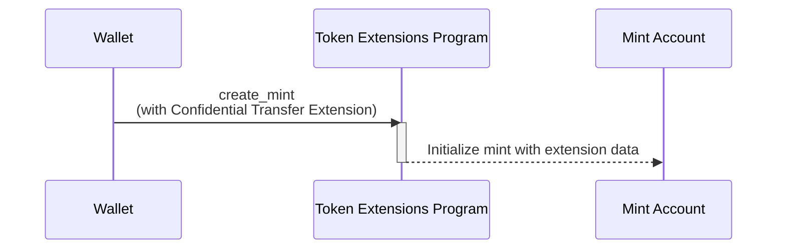

<Callout type="warn">
  由于正在进行安全审计，ZK ElGamal Program 目前在主网和 devnet 上暂时禁用。
  这意味着机密转账扩展当前不可用。虽然相关概念依然适用，但代码示例将无法运行。
</Callout>

## 如何使用机密转账扩展创建 mint

机密转账扩展通过在 mint
account 中添加额外状态，实现了私密的 token 转账。本节将介绍如何启用该扩展来创建 token
mint。

下图展示了使用机密转账扩展创建 mint 的步骤：



### 机密转账 Mint 状态

该扩展会在 mint account 中添加
[ConfidentialTransferMint](https://github.com/solana-program/token-2022/blob/efd0c957fefbd79882d77df5fb2dac88c001249c/program/src/extension/confidential_transfer/mod.rs#L48-L69)
状态：

```rust title="Confidential Mint State"
#[repr(C)]
#[derive(Clone, Copy, Debug, Default, PartialEq, Pod, Zeroable)]
pub struct ConfidentialTransferMint {
    /// Authority to modify the `ConfidentialTransferMint` configuration and to
    /// approve new accounts (if `auto_approve_new_accounts` is true)
    ///
    /// The legacy Token Multisig account is not supported as the authority
    pub authority: OptionalNonZeroPubkey,

    /// Indicate if newly configured accounts must be approved by the
    /// `authority` before they may be used by the user.
    ///
    /// * If `true`, no approval is required and new accounts may be used
    ///   immediately
    /// * If `false`, the authority must approve newly configured accounts (see
    ///   `ConfidentialTransferInstruction::ConfigureAccount`)
    pub auto_approve_new_accounts: PodBool,

    /// Authority to decode any transfer amount in a confidential transfer.
    pub auditor_elgamal_pubkey: OptionalNonZeroElGamalPubkey,
}
```

_rs`ConfidentialTransferMint`_ 包含三个配置字段：

- **authority**：有权更改 mint 的机密转账设置并在关闭自动审批时批准新机密账户的账户。

- **auto_approve_new_accounts**：为 true 时，用户可默认创建启用机密转账的 token
  account。为 false 时，authority 必须先批准每个新 token
  account，才能用于机密转账。

- **auditor_elgamal_pubkey**：可选的审计员，可解密机密交易中的转账金额，为合规提供机制，同时对公众保持隐私。

### 所需指令

启用机密转账的 mint 创建需要在单笔交易中包含三条指令：

1. **创建 Mint Account**：调用 System Program 的 _rs`CreateAccount`_
   指令以创建 mint account。

2. **初始化机密转账扩展**：调用 Token Extension Program 的
   [ConfidentialTransferInstruction::InitializeMint](https://github.com/solana-program/token-2022/blob/efd0c957fefbd79882d77df5fb2dac88c001249c/program/src/extension/confidential_transfer/processor.rs#L48)
   指令，为 mint 配置 _rs`ConfidentialTransferMint`_ 状态。

3. **初始化 Mint**：调用 Token Extension Program 的
   _rs`Instruction::InitializeMint`_ 指令，初始化标准 mint 状态。

虽然你可以手动编写这些指令，但 `spl_token_client` crate提供了一个 `create_mint`
方法，可以在一次函数调用中构建并发送包含所有三条指令的交易，具体示例如下。

### 示例代码

以下代码演示了如何创建带有机密转账扩展的 mint。

要运行此示例，请使用以下命令启动一个本地 validator，并从主网克隆 Token Extension
Program。你需要先安装 Solana CLI 才能启动本地 validator。

```terminal
$ solana-test-validator --clone-upgradeable-program TokenzQdBNbLqP5VEhdkAS6EPFLC1PHnBqCXEpPxuEb --url https://api.mainnet.solana.com -r
```

<Callout type="info">
  截至目前，默认的本地 validator 尚未启用机密转账功能。你需要克隆主网的 Token
  Extension Program 才能运行示例代码。
</Callout>

<CodeTabs>

```rust !! title="main.rs"
use anyhow::{Context, Result};
use solana_client::nonblocking::rpc_client::RpcClient;
use solana_sdk::{
    commitment_config::CommitmentConfig,
    signature::{Keypair, Signer},
};
use spl_token_client::{
    client::{ProgramRpcClient, ProgramRpcClientSendTransaction},
    spl_token_2022::id as token_2022_program_id,
    token::{ExtensionInitializationParams, Token},
};
use std::sync::Arc;

#[tokio::main]
async fn main() -> Result<()> {
    // Create connection to local test validator
    let rpc_client = RpcClient::new_with_commitment(
        String::from("http://localhost:8899"),
        CommitmentConfig::confirmed(),
    );

    // Load the default Solana CLI keypair to use as the fee payer
    // This will be the wallet paying for the transaction fees
    // Use Arc to prevent multiple clones of the keypair
    let payer = Arc::new(load_keypair()?);
    println!("Using payer: {}", payer.pubkey());

    // Generate a new keypair to use as the address of the token mint
    let mint = Keypair::new();
    println!("Mint keypair generated: {}", mint.pubkey());

    // Set up program client for Token client
    let program_client =
        ProgramRpcClient::new(Arc::new(rpc_client), ProgramRpcClientSendTransaction);

    // Number of decimals for the mint
    let decimals = 9;

    // Create a token client for the Token-2022 program
    // This provides high-level methods for token operations
    let token = Token::new(
        Arc::new(program_client),
        &token_2022_program_id(), // Use the Token-2022 program (newer version with extensions)
        &mint.pubkey(),           // Address of the new token mint
        Some(decimals),           // Number of decimal places
        payer.clone(),            // Fee payer for transactions (cloning Arc, not keypair)
    );

    // Create extension initialization parameters
    // The ConfidentialTransferMint extension enables confidential (private) transfers of tokens
    let extension_initialization_params =
        vec![ExtensionInitializationParams::ConfidentialTransferMint {
            authority: Some(payer.pubkey()), // Authority that can modify confidential transfer settings
            auto_approve_new_accounts: true, // Automatically approve new confidential accounts
            auditor_elgamal_pubkey: None,    // Optional auditor ElGamal public key
        }];

    // Create and initialize the mint with the ConfidentialTransferMint extension
    // This sends a transaction to create the new token mint
    let transaction_signature = token
        .create_mint(
            &payer.pubkey(),                 // Mint authority - can mint new tokens
            Some(&payer.pubkey()),           // Freeze authority - can freeze token accounts
            extension_initialization_params, // Add the ConfidentialTransferMint extension
            &[&mint],                        // Mint keypair needed as signer
        )
        .await?;

    // Print results for user verification
    println!("Mint Address: {}", mint.pubkey());
    println!("Transaction Signature: {}", transaction_signature);

    Ok(())
}

// Load the keypair from the default Solana CLI keypair path (~/.config/solana/id.json)
// This enables using the same wallet as the Solana CLI tools
fn load_keypair() -> Result<Keypair> {
    // Get the default keypair path
    let keypair_path = dirs::home_dir()
        .context("Could not find home directory")?
        .join(".config/solana/id.json");

    // Read the keypair file directly into bytes using serde_json
    // The keypair file is a JSON array of bytes
    let file = std::fs::File::open(&keypair_path)?;
    let keypair_bytes: Vec<u8> = serde_json::from_reader(file)?;

    // Create keypair from the loaded bytes
    // This converts the byte array into a keypair
    let keypair = Keypair::from_bytes(&keypair_bytes)?;

    Ok(keypair)
}
```

```toml !! title="Cargo.toml"
[package]
name = "confidential-transfer"
version = "0.1.0"
edition = "2021"

[dependencies]
[package]
name = "confidential-transfer"
version = "0.1.0"
edition = "2021"

[dependencies]
solana-client = "2.2.2"
solana-sdk = "2.2.2"
spl-associated-token-account = "6.0.0"
spl-token-client = "0.14.0"
spl-token-confidential-transfer-proof-extraction = "0.2.1"
spl-token-confidential-transfer-proof-generation = "0.3.0"

anyhow = "1.0.95"
dirs = "6.0.0"
serde_json = "1.0.135"
tokio = { version = "1.44.2", features = ["full"] }
```

</CodeTabs>
