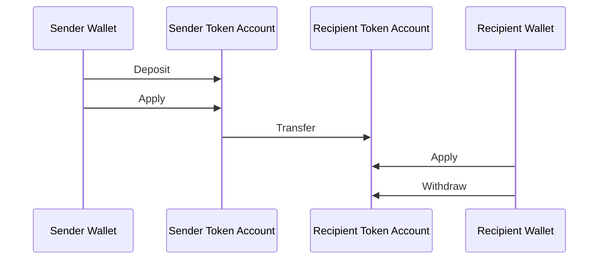
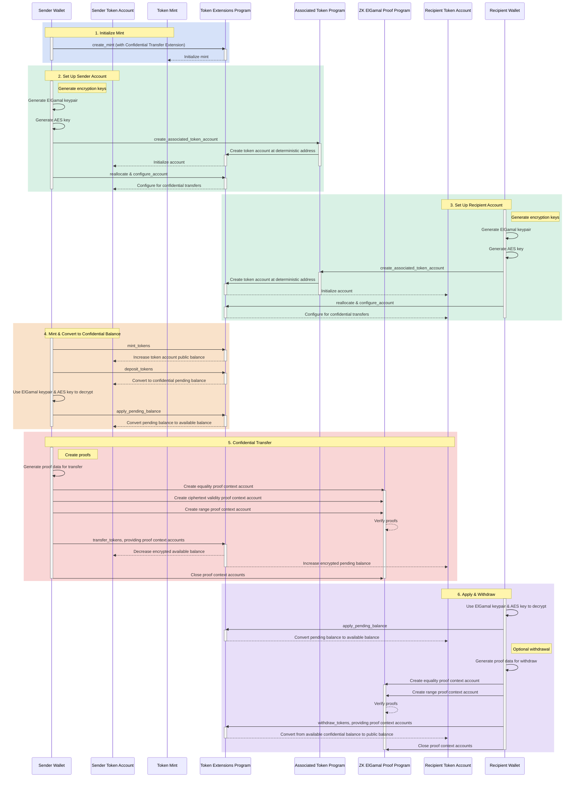

## 什么是机密转账？

机密转账允许您在 token
account 之间转移代币，而无需披露转账金额。这对于保护隐私的交易非常有用。只有转账金额和代币余额是私密的，token
account 地址仍然是公开的。

- [协议概述](https://www.solana-program.com/docs/confidential-balances/overview) - 底层加密协议的详细说明
- [快速入门指南](https://www.solana-program.com/docs/confidential-balances#setup) - 设置与基本 CLI 命令
- [机密余额使用手册](https://github.com/solana-developers/Confidential-Balances-Sample) - 如何使用机密转账扩展的代码示例

### 它是如何工作的？

机密转账扩展为 Token Extension program 添加了
[指令](https://github.com/solana-program/token-2022/blob/efd0c957fefbd79882d77df5fb2dac88c001249c/program/src/extension/confidential_transfer/instruction.rs#L29)，使您能够在账户之间转移代币而无需披露转账金额。

机密代币转账的基本流程如下：

1. 创建带有机密转账扩展的 mint account。
2. 为发送方和接收方创建带有机密转账扩展的 token account。
3. 将代币铸造至发送方账户。
4. 将发送方的公开余额**存入\*\***机密待处理余额\*\*。
5. 将发送方的待处理余额**应用**至**机密可用余额**。
6. 机密地将代币从发送方 token account **转账**至接收方 token account。
7. 将接收方的待处理余额**应用**至**机密可用余额**。
8. 将接收方的机密可用余额**提取**至**公开余额**。

有关机密转账流程中各步骤的更多详情，请参阅对应页面：

<Cards>
  <Card
    title="创建 Mint Account"
    href="/docs/tokens/extensions/confidential-transfer/create-mint"
  >
    如何创建带有机密转账扩展的 mint account
  </Card>
  <Card
    title="创建 Token Account"
    href="/docs/tokens/extensions/confidential-transfer/create-token-account"
  >
    如何配置带有机密转账扩展的 token account
  </Card>
  <Card
    title="存入代币"
    href="/docs/tokens/extensions/confidential-transfer/deposit-tokens"
  >
    如何将代币存入机密待处理余额
  </Card>
  <Card
    title="应用待处理余额"
    href="/docs/tokens/extensions/confidential-transfer/apply-pending-balance"
  >
    如何将待处理余额应用至机密可用余额
  </Card>
  <Card
    title="提取代币"
    href="/docs/tokens/extensions/confidential-transfer/withdraw-tokens"
  >
    如何从机密可用余额中提取代币
  </Card>
  <Card
    title="转账代币"
    href="/docs/tokens/extensions/confidential-transfer/transfer-tokens"
  >
    如何在 token account 之间进行机密代币转账
  </Card>
  <Card
    title="集成指南"
    href="/docs/tokens/extensions/confidential-transfer/integration-guide"
  >
    钱包、区块链浏览器和交易所如何支持机密转账代币
  </Card>
  <Card
    title="发行方指南"
    href="/docs/tokens/extensions/confidential-transfer/issuer-guide"
  >
    如何发行和管理机密转账代币（审批策略、审计员、手续费、铸造与销毁）
  </Card>
</Cards>

下图展示了机密代币转账基本流程的详细时序：

## 机密转账指令

机密转账扩展的完整[指令列表](https://github.com/solana-program/token-2022/blob/efd0c957fefbd79882d77df5fb2dac88c001249c/program/src/extension/confidential_transfer/instruction.rs#L29)如下：

| 指令                                | 描述                                                                                                           |
| ----------------------------------- | -------------------------------------------------------------------------------------------------------------- |
| _rs`InitializeMint`_                | 为 mint account 设置机密转账配置。该指令必须与 _rs`TokenInstruction::InitializeMint`_ 指令包含在同一笔交易中。 |
| _rs`UpdateMint`_                    | 更新 mint account 的机密转账设置。                                                                             |
| _rs`ConfigureAccount`_              | 为 token account 设置机密转账配置。                                                                            |
| _rs`ApproveAccount`_                | 在 mint account 要求对新 token account 进行审批时，批准该 token account 用于机密转账。                         |
| _rs`EmptyAccount`_                  | 清空待处理和可用的机密余额，以允许关闭 token account。                                                         |
| _rs`Deposit`_                       | 将公开代币余额转换为待处理的机密余额。                                                                         |
| _rs`Withdraw`_                      | 将可用的机密余额转换回公开余额。                                                                               |
| _rs`Transfer`_                      | 在 token account 之间以机密方式转账代币。                                                                      |
| _rs`ApplyPendingBalance`_           | 在存款或转账后，将待处理余额转换为可用余额。                                                                   |
| _rs`EnableConfidentialCredits`_     | 允许 token account 接收机密代币转账。                                                                          |
| _rs`DisableConfidentialCredits`_    | 屏蔽传入的机密转账，同时仍允许公开转账。                                                                       |
| _rs`EnableNonConfidentialCredits`_  | 允许 token account 接收公开代币转账。                                                                          |
| _rs`DisableNonConfidentialCredits`_ | 屏蔽常规转账，使账户仅接收机密转账。                                                                           |
| _rs`TransferWithFee`_               | 在 token account 之间以机密方式转账代币并收取手续费。                                                          |
| _rs`ConfigureAccountWithRegistry`_  | 使用 _rs`ElGamalRegistry`_ 账户替代 _rs`VerifyPubkeyValidity`_ 证明，为 token account 配置机密转账的替代方式。 |
