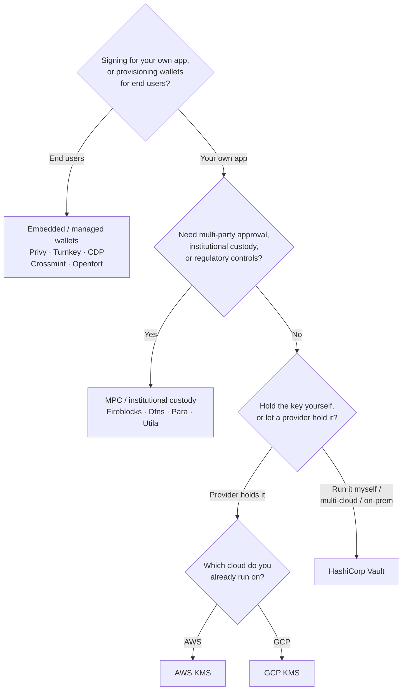

Keychain 在所有后端中提供统一的 `SolanaSigner`
接口，因此后端的选择是运维层面的决策，而非架构层面的决策——您可以随时通过配置进行更改。正因如此，**请从您的需求出发，而非从产品出发。**
两个问题决定了大部分选择：_私钥存放在哪里，以及谁有权授权使用它进行签名？_

没有哪个后端是绝对最优的。每种后端都更适合特定的约束条件——您当前使用的云平台、是否愿意自行运维密钥基础设施，以及您需要满足哪些托管和审批控制要求。下方的流程图将这些约束条件映射到对应的后端。

<Callout type="info">
  本指南涵盖后端（服务端）签名。若您的终端用户需要在浏览器中自行签署交易，请通过
  Wallet Standard
  使用钱包——参见[生产环境中的签名](/docs/core/transactions/signing-in-production)。
</Callout>

## 决策流程

<Callout type="info">
  本地开发和测试无需上述任何配置——原型开发阶段请使用 **Memory**
  后端，之后通过配置切换至上述生产环境后端之一。
</Callout>

## 逐步解析

<Steps>

<Step>

### 您是在为自己的应用签名，还是为终端用户签名？

如果您为**终端用户**创建并管理其拥有和使用的钱包（消费类应用、用户引导流程），请使用**嵌入式 / 托管钱包**后端——Privy、Turnkey、CDP、Crossmint 或 Openfort。这些服务会代您管理每位用户的钱包及身份验证。

如果您是以**自己的应用程序**身份签名——例如手续费支付方、资金库或后端自动化——请继续阅读以下内容。

</Step>

<Step>

### 您是否需要多方审批、机构托管或合规管控？

如果签名在生成之前必须通过审批策略、支出限额或合规工作流的审核——或者您需要受监管的托管方持有密钥——请使用
**MPC
/ 机构托管**后端：Fireblocks、Dfns、Para 或 Utila。这些服务会对密钥进行拆分或托管，并根据您的策略进行联合签名。

如果您只需要一个按需签名的密钥，请继续阅读以下内容。

</Step>

<Step>

### 您希望自己持有密钥，还是交由服务商保管？

如果您希望云服务商将密钥保存在硬件支持的基础设施中，并通过 IAM 策略控制签名权限，请使用该云服务商的 KMS：

- **运行于 AWS** → AWS KMS
- **运行于 GCP** → GCP KMS

如果您希望自行管理密钥基础设施——或您采用多云或本地部署方案——请使用 **HashiCorp
Vault**。由您自行运行和审计；密钥始终保存在 Transit 引擎内，并按需进行签名。

</Step>

</Steps>

## 托管模式

后端可归纳为五种托管模式，上述流程将引导您选择其中一种。

- **自托管（进程内）**
  — 您的应用程序直接持有原始私钥。便于开发使用，但不适合生产环境。后端：**Memory**。
- **自建密钥管理**
  — 由您自行运维密钥基础设施；密钥保存于其中并按需签名。后端：**HashiCorp
  Vault**。
- **云 KMS / HSM**
  — 云服务商将密钥存储在硬件支持的基础设施中；密钥永不离开该服务，签名权限由您的 IAM 策略控制。后端：**AWS
  KMS**、**GCP KMS**。
- **MPC 与机构托管**
  — 密钥由服务商进行拆分或托管，并根据您的策略（审批、限额）进行联合签名。后端：**Fireblocks**、**Dfns**、**Para**、**Utila**。
- **嵌入式与托管钱包**
  — 由服务商代您管理钱包，通常用于终端用户的注册引导。后端：**Privy**、**Turnkey**、**CDP**、**Crossmint**、**Openfort**。

## 后端比较

| 后端            | 托管模式              | 最适合场景                    | 备注                                        |
| --------------- | --------------------- | ----------------------------- | ------------------------------------------- |
| Memory          | 自托管（进程内）      | 本地开发、测试、CI            | 原始密钥存于进程中——请勿用于生产环境        |
| HashiCorp Vault | 自托管密钥管理        | 自建密钥基础设施的团队        | 使用 Transit 引擎；由您自行运营和审计       |
| AWS KMS         | 云端 KMS / HSM        | 运行于 AWS 的后端             | 密钥永不离开 KMS；IAM 控制签名权限          |
| GCP KMS         | 云端 KMS / HSM        | 运行于 GCP 的后端             | 密钥永不离开 KMS；IAM 控制签名权限          |
| Fireblocks      | MPC / 机构级托管      | 资金库、交易所、合规托管场景  | 提供策略引擎和审批工作流                    |
| Dfns            | MPC 钱包基础设施      | 具备策略控制的程序化钱包      | Ed25519 签名                                |
| Para            | MPC 钱包              | 需要 MPC 支持的钱包应用       | API 密钥 + 钱包 ID                          |
| Utila           | MPC 托管 + 联合签名者 | 现有 Utila 托管的 Solana 钱包 | `signMessage` 不支持；需自行广播交易        |
| Privy           | 嵌入式钱包            | 面向用户的钱包接入类消费应用  | 应用托管的嵌入式钱包                        |
| Turnkey         | 非托管密钥管理        | 程序化、策略控制的签名场景    | 非托管密钥管理                              |
| CDP             | 托管钱包（Coinbase）  | Coinbase 开发者平台上的应用   | `signMessage` 仅接受 UTF-8 格式的载荷       |
| Crossmint       | 托管钱包              | 市场平台及托管钱包应用        | `smart` 和 `mpc` 钱包；`signMessage` 不支持 |
| Openfort        | 嵌入式后端钱包        | 服务端钱包                    | 密钥存储于 TEE                              |

## 企业级应用场景

单个应用程序通常需要同时使用多种方案。由于接口完全一致，您可以针对不同角色使用不同的后端，而无需修改调用代码。

- **资金库操作**
  — 将日常运营的"热"签名者与"冷"资金库签名者分离。通过 MPC 托管或云端 HSM 为资金库提供支持，并在执行高价值签名前要求审批策略。
- **审批工作流** —
  MPC 和托管后端（例如 Fireblocks）在生成签名前强制执行多方审批。
- **合规与审计**
  — 云端 KMS（AWS/GCP）和 Vault 会生成签名审计日志；机构托管方还提供策略执行与合规报告。
- **受监管环境**
  — 将密钥材料保存在 HSM、KMS 或机构托管方中，确保原始密钥永远不会接触您的应用程序。

请参阅[生产最佳实践](/docs/tools/keychain/production-best-practices)，了解如何安全地运行这些后端。

<Cards>
  <Card title="Rust 指南" href="/docs/tools/keychain/getting-started/rust">
    在 Rust 中配置各后端。
  </Card>
  <Card
    title="TypeScript 指南"
    href="/docs/tools/keychain/getting-started/typescript"
  >
    在 TypeScript 中配置各后端。
  </Card>
</Cards>
