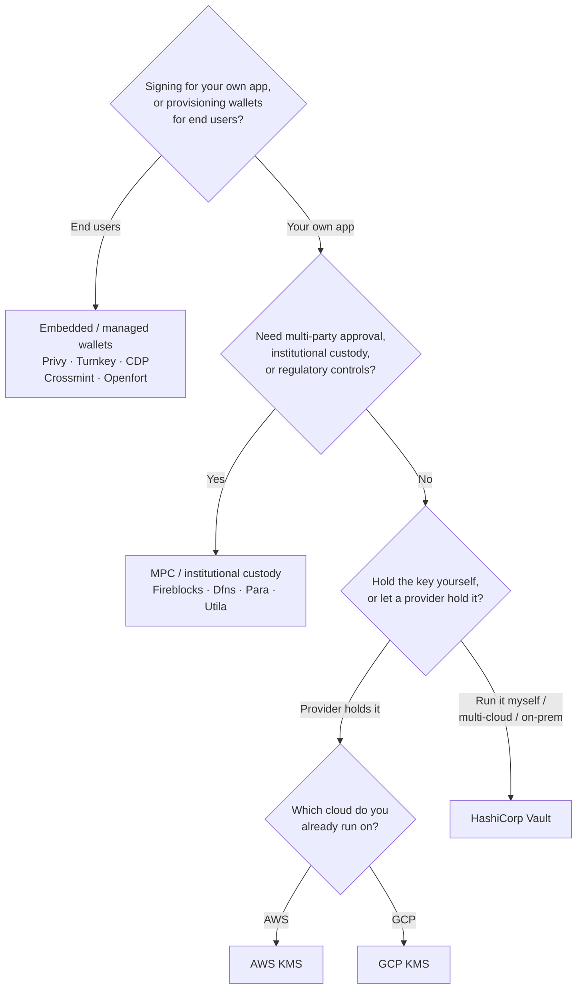

Keychain 在所有后端中提供统一的 `SolanaSigner`
接口，因此后端的选择属于运维层面的决策，而非架构层面——您可以随时通过配置进行更改。因此，**请从您的需求出发，而非从产品出发。**
决定大部分选择的关键在于两个问题：_私钥存储在哪里，以及谁有权使用它授权签名？_

不存在单一最佳后端。每种后端都更适合特定的约束条件——您当前使用的云平台、是否需要自行运维密钥基础设施，以及所需满足的托管和审批控制要求。下方的流程图将这些约束条件映射到对应的后端。

<Callout type="info">
  本指南涵盖后端（服务端）签名。当您的终端用户在浏览器中自行签署 交易时，请通过
  Wallet Standard 使用钱包——
  请参阅[生产环境中的签名](/docs/core/transactions/signing-in-production)。
</Callout>

## 决策流程

<Callout type="info">
  本地开发和测试无需以上任何配置——原型开发时使用 **Memory** 后端，
  然后通过配置切换到上述生产环境后端之一。
</Callout>

## 逐步解析各问题

<Steps>

<Step>

### 您是在为自己的应用签名，还是为终端用户签名？

如果您为**终端用户**提供其自己拥有和操作的钱包（消费者应用、用户引导流程），请使用**嵌入式 / 托管钱包**后端——Privy、Turnkey、CDP、Crossmint 或 Openfort。这些服务代您管理每位用户的钱包及身份验证。

如果您以**自己的应用程序**身份签名——作为费用支付方、资金库或后端自动化——请继续阅读以下内容。

</Step>

<Step>

### 您是否需要多方审批、机构托管或合规管控？

如果签名在生成之前必须通过审批策略、消费限额或合规工作流的审核——或者您需要受监管的托管方来持有密钥——请使用
**MPC
/ 机构托管**后端：Fireblocks、Dfns、Para 或 Utila。这些服务会拆分或托管密钥，并根据您的策略进行联合签名。

如果您只需要一个按需签名的密钥，请继续阅读以下内容。

</Step>

<Step>

### 您希望自行持有密钥，还是由服务提供商代为持有？

如果希望由云服务提供商将密钥存储在硬件支持的基础设施中，并通过 IAM 策略控制签名权限，请使用对应云平台的 KMS：

- **在 AWS 上运行** → AWS KMS
- **在 GCP 上运行** → GCP KMS

如果您希望自行管理密钥基础设施——或者您采用多云或本地部署方案——请使用 **HashiCorp
Vault**。由您自行运行和审计；密钥始终保存在 Transit 引擎内部，并按需签名。

</Step>

</Steps>

## 托管模式

这些后端可归纳为五种托管模式，上述流程将引导您选择其中一种。

- **自托管（进程内）**
  — 您的应用程序直接持有原始私钥。适合开发环境，但不适用于生产环境。后端：**Memory**。
- **自托管密钥管理**
  — 由您自行管理密钥基础设施；密钥保存其中并按需签名。后端：**HashiCorp
  Vault**。
- **云 KMS / HSM**
  — 由云服务提供商将密钥存储在硬件支持的基础设施中；密钥永不离开该服务，签名权限由您的 IAM 策略控制。后端：**AWS
  KMS**、**GCP KMS**。
- **MPC 与机构托管**
  — 密钥由服务提供商拆分或托管，并根据您的策略（审批、限额）进行联合签名。后端：**Fireblocks**、**Dfns**、**Para**、**Utila**。
- **嵌入式与托管钱包**
  — 由服务提供商代为管理钱包，通常用于终端用户的引导注册。后端：**Privy**、**Turnkey**、**CDP**、**Crossmint**、**Openfort**。

## 后端对比

| 后端            | 托管模式             | 最适用于                       | 备注                                        |
| --------------- | -------------------- | ------------------------------ | ------------------------------------------- |
| Memory          | 自托管（进程内）     | 本地开发、测试、CI             | 密钥以明文存于进程中——请勿用于生产环境      |
| HashiCorp Vault | 自托管密钥管理       | 运营自有密钥基础设施的团队     | 使用 Transit 引擎；由您自行运维和审计       |
| AWS KMS         | 云端 KMS / HSM       | 运行于 AWS 的后端              | 密钥永不离开 KMS；由 IAM 控制签名权限       |
| GCP KMS         | 云端 KMS / HSM       | 运行于 GCP 的后端              | 密钥永不离开 KMS；由 IAM 控制签名权限       |
| Fireblocks      | MPC / 机构级托管     | 资金库、交易所、合规托管场景   | 提供策略引擎和审批工作流                    |
| Dfns            | MPC 钱包基础设施     | 具备策略控制的程序化钱包       | Ed25519 签名                                |
| Para            | MPC 钱包             | 需要 MPC 支持的钱包应用        | API 密钥 + 钱包 ID                          |
| Utila           | MPC 托管 + 联署方    | 现有 Utila 托管的 Solana 钱包  | `signMessage` 不支持；需自行广播交易        |
| Privy           | 嵌入式钱包           | 面向用户的消费类钱包接入应用   | 应用托管的嵌入式钱包                        |
| Turnkey         | 非托管密钥管理       | 程序化、策略门控的签名场景     | 非托管密钥管理                              |
| CDP             | 托管钱包（Coinbase） | 基于 Coinbase 开发者平台的应用 | `signMessage` 仅接受 UTF-8 载荷             |
| Crossmint       | 托管钱包             | 市场平台及托管钱包应用         | `smart` 和 `mpc` 钱包；`signMessage` 不支持 |
| Openfort        | 嵌入式后端钱包       | 服务端钱包                     | 密钥存储于 TEE 中                           |

## 企业应用场景

单个应用程序通常需要同时使用其中多种方案。由于接口完全相同，您可以针对不同角色运行不同的后端，而无需修改调用点。

- **资金库操作**
  — 将操作性"热"签名者与"冷"资金库签名者分离。使用 MPC 托管或云 HSM 为资金库提供支持，并在高价值签名前要求审批策略。
- **审批工作流** — MPC 和托管后端（如 Fireblocks）在生成签名前强制执行多方审批。
- **合规与审计**
  — 云 KMS（AWS/GCP）和 Vault 生成签名审计日志；机构托管方增加策略执行和报告功能。
- **受监管环境**
  — 将密钥材料保存在 HSM、KMS 或机构托管方中，确保原始密钥永不接触您的应用程序。

请参阅[生产最佳实践](/docs/tools/keychain/production-best-practices)，了解如何安全运行这些后端。

<Cards>
  <Card title="Rust 指南" href="/docs/tools/keychain/getting-started/rust">
    在 Rust 中配置各个后端。
  </Card>
  <Card
    title="TypeScript 指南"
    href="/docs/tools/keychain/getting-started/typescript"
  >
    在 TypeScript 中配置各个后端。
  </Card>
</Cards>
