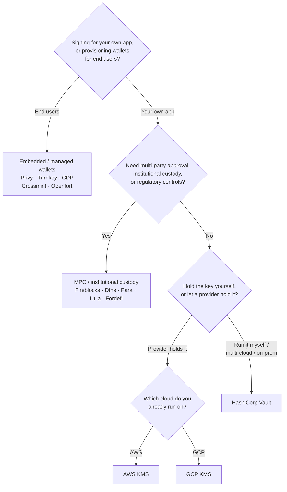

Keychain 为所有后端提供统一的 `SolanaSigner` 基础接口,因此对于大多数后端而言,选择属于运维层面的决策,而非架构层面的决策:你以后可以通过配置随时更换。唯一的例外是交易形态。Crossmint 和 Fordefi 原生自动模式会在服务端签名并广播,而 Fordefi 原生手动模式会在签名前重写交易,因此切换到其中任何一种或从中切换出来,都会改变你调用签名器的方式。正因如此,**请从你的需求出发,而不是从某个产品出发。**大部分问题可由两个问题决定:_私钥存放在哪里,以及谁有权授权使用它进行签名?_

除 Ledger 外,所有后端均提供全部四种语言版本(Rust、TypeScript、Python 和 Go)。Ledger 仅支持 Rust,并需通过可选启用的 `ledger` 功能使用。

不存在唯一最佳的后端。每个后端都更适合特定的约束条件:你已经在使用的云平台、你是否愿意自行运维密钥基础设施,以及你必须具备哪些托管和审批控制。下面的流程会将这些约束条件对应到相应的后端。

<Callout type="info">
  本指南介绍的是后端(服务端)签名。如果你的终端用户在浏览器中自行签署交易,请改用通过 Wallet Standard 接入的钱包。请参阅[生产环境中的签名](/docs/core/transactions/signing-in-production)。
</Callout>

## 决策流程

```mermaid title="Choosing a Keychain backend"
flowchart TD
    Start{Signing for your own app,<br/>or provisioning wallets<br/>for end users?}
    Start -->|End users| Managed[Embedded / managed wallets<br/>Privy · Turnkey · CDP<br/>Crossmint · Openfort]
    Start -->|Your own app| Q2{Need multi-party approval,<br/>institutional custody,<br/>or regulatory controls?}
    Q2 -->|Yes| MPC[MPC / institutional custody<br/>Fireblocks · Dfns · Para · Utila · Fordefi]
    Q2 -->|No| Q3{Hold the key yourself,<br/>or let a provider hold it?}
    Q3 -->|Provider holds it| Q4{Which cloud do you<br/>already run on?}
    Q4 -->|AWS| AWS[AWS KMS]
    Q4 -->|GCP| GCP[GCP KMS]
    Q3 -->|Run it myself /<br/>multi-cloud / on-prem| Vault[HashiCorp Vault]
```

<Callout type="info">
  本地开发和测试无需用到上述任何内容:原型开发时请使用 **Memory** 后端,之后再通过配置切换到上述任一生产后端。
</Callout>

## 逐步解析各问题

<Steps>

<Step>

### 你是为自己的应用签名,还是为终端用户签名?

如果你要配置由**终端用户**拥有并操作的钱包(面向消费者的应用、新用户引导流程),请使用**嵌入式 / 托管钱包**后端:Privy、Turnkey、CDP、Crossmint 或 Openfort。它们会代你管理每个用户的钱包和身份验证。

如果你是以**自己的应用**身份签名(手续费支付方、资金库、后端自动化),请继续往下看。

</Step>

<Step>

### 你是否需要多方审批、机构级托管或合规控制?

如果签名在生成之前必须通过审批策略、支出限额或合规流程,或者你需要由受监管的托管机构保管密钥,请使用 **MPC / 机构托管**后端:Fireblocks、Dfns、Para、Utila 或 Fordefi。它们会对密钥进行拆分或托管,并按照你的策略共同签名。

如果你只需要一个按请求签名的密钥,请继续往下看。

</Step>

<Step>

### 你想自己持有密钥,还是交由服务商持有?

如果希望由云服务商在硬件支持的基础设施中持有密钥,并通过你的 IAM 策略控制谁可以签名,请使用对应云平台的 KMS:

- **运行在 AWS 上** → AWS KMS
- **运行在 GCP 上** → GCP KMS

如果你想自行运维密钥基础设施,或者使用多云或本地部署环境,请使用 **HashiCorp Vault**。由你负责运行和审计;密钥始终保留在 Transit 引擎内部,并按请求签名。

</Step>

</Steps>

## 托管模式

这些后端可分为六种托管模式。上面的流程会将你引导至其中一种。

- **自托管(进程内)**:由你的应用持有原始私钥。便于开发,但不适合生产环境。后端:**Memory**。
- **自托管(硬件钱包)**:密钥永远不会离开 Ledger 设备,每一次签名都需要有人在设备屏幕上确认。适用于需要人工交互的操作员签名,不适用于无人值守的服务。仅支持 Rust,需手动启用,且未纳入审计范围。后端:**Ledger**。
- **自托管密钥管理**:由你运维密钥基础设施;密钥始终保留在其中,并按请求签名。后端:**HashiCorp Vault**。
- **云 KMS / HSM**:由云服务商将密钥存放在硬件支持的基础设施中;密钥永远不会离开该服务,并由你的 IAM 策略控制谁可以签名。后端:**AWS KMS**、**GCP KMS**。
- **MPC 与机构托管**:密钥由服务商拆分或托管,并按照你的策略(审批、限额)共同签名。后端:**Fireblocks**、**Dfns**、**Para**、**Utila**、**Fordefi**。
- **嵌入式与托管钱包**:由服务商代你管理钱包,通常用于引导终端用户接入。后端:**Privy**、**Turnkey**、**CDP**、**Crossmint**、**Openfort**。

## 后端对比

| 后端         | 托管模式                  | 最适用于                                     | 备注                                                                                                              |
| --------------- | ------------------------------ | -------------------------------------------- | ------------------------------------------------------------------------------------------------------------------ |
| Memory          | 自托管（进程内）      | 本地开发、测试、CI                 | 原始密钥存在于进程中;请勿在生产环境中使用                                                                       |
| Ledger          | 自托管(硬件钱包) | 通过 Rust 工具进行需人工交互的操作员签名 | 仅支持 Rust,需手动启用 `ledger` 功能,未经审计;每次签名均需在设备上确认                                 |
| HashiCorp Vault | 自托管密钥管理     | 运营自有密钥基础设施的团队   | 使用 Transit 引擎；由您自行运维和审计                                                                           |
| AWS KMS         | 云端 KMS / HSM                | 运行于 AWS 的后端                      | 密钥永不离开 KMS；由 IAM 控制签名权限                                                                         |
| GCP KMS         | 云端 KMS / HSM                | 运行于 GCP 的后端                      | 密钥永不离开 KMS；由 IAM 控制签名权限                                                                         |
| Fireblocks      | MPC / 机构级托管    | 资金库、交易所、合规托管场景     | 提供策略引擎和审批工作流                                                                               |
| Dfns            | MPC 钱包基础设施      | 具备策略控制的程序化钱包    | Ed25519 签名                                                                                                    |
| Para            | MPC 钱包                    | 需要 MPC 支持的钱包应用            | API 密钥 + 钱包 ID                                                                                                |
| Utila           | MPC 托管 + 联署方        | 现有 Utila 托管的 Solana 钱包        | `signMessage` 不支持；需自行广播交易                                                                    |
| Fordefi         | MPC / 机构级托管    | 具备策略控制的机构托管   | 黑盒模式:由你发送。原生自动模式:由 Fordefi 重写并发送。原生手动模式:由 Fordefi 重写,你发送结果 |
| Privy           | 嵌入式钱包               | 面向用户的消费类钱包接入应用    | 应用托管的嵌入式钱包                                                                                       |
| Turnkey         | 非托管密钥管理   | 程序化、策略门控的签名场景           | 非托管密钥管理                                                                                       |
| CDP             | 托管钱包（Coinbase）      | 基于 Coinbase 开发者平台的应用      | `signMessage` 仅接受 UTF-8 载荷                                                                          |
| Crossmint       | 托管钱包                | 市场平台及托管钱包应用         | 仅发送:在服务端广播,可能为 Gas 赞助而重写交易;不支持 `signMessage`                   |
| Openfort        | 嵌入式后端钱包       | 服务端钱包                          | 密钥存储于 TEE 中                                                                                                    |

## 能力形态

除托管方式外,每个后端还有一种交易形态,它决定了你调用签名器的方式:

- **签名**:服务商对你构建的字节进行签名,由你负责广播。大多数后端均属此类,包括 Ledger 和 Fordefi 黑盒模式。
- **重写并签名**:服务商重写交易,然后签名但不广播。请基于其返回的交易继续后续操作。适用于 Fordefi 原生手动模式。
- **签名并广播**:服务商在服务端签名并广播,因此出现失败并不意味着交易一定没有上链。适用于 Crossmint 和 Fordefi 原生自动模式。

每种语言 README 中的签名器能力表列出了每个后端的形态;[安全模型](https://github.com/solana-foundation/solana-keychain/blob/main/docs/SECURITY_MODEL.md)则说明了每种形态所提供的保障。

## 企业应用场景

一个应用往往需要同时使用其中多种后端。由于接口是共享的,只要这些后端的能力形态一致,你就可以按角色使用不同的后端,而无需修改调用处的代码。

- **资金库操作**
  — 将操作性"热"签名者与"冷"资金库签名者分离。使用 MPC 托管或云 HSM 为资金库提供支持，并在高价值签名前要求审批策略。
- **审批工作流** — MPC 和托管后端（如 Fireblocks）在生成签名前强制执行多方审批。
- **合规与审计**
  — 云 KMS（AWS/GCP）和 Vault 生成签名审计日志；机构托管方增加策略执行和报告功能。
- **受监管环境**
  — 将密钥材料保存在 HSM、KMS 或机构托管方中，确保原始密钥永不接触您的应用程序。

请参阅[生产最佳实践](/docs/tools/keychain/production-best-practices)，了解如何安全运行这些后端。

<Cards>
  <Card title="Rust 指南" href="/docs/tools/keychain/getting-started/rust">
    在 Rust 中配置各个后端。
  </Card>
  <Card
    title="TypeScript 指南"
    href="/docs/tools/keychain/getting-started/typescript"
  >
    在 TypeScript 中配置各个后端。
  </Card>
</Cards>
