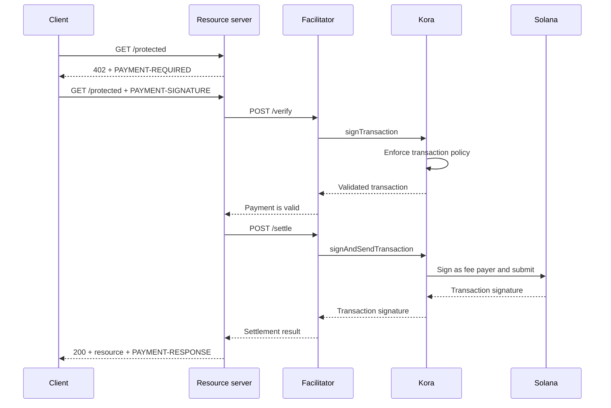

Kora 可为 [x402 V2 促进器](/docs/tools/x402-facilitator)提供 Solana 签名、交易策略和费用赞助层。促进器实现 x402 HTTP API；Kora 对其接受的支付交易进行验证、签名并发送。

本指南在 Solana Devnet 上启动参考 Kora 促进器。这是一个用于测试集成的开发环境，而非生产部署。

## 架构



四个应用角色保持独立：

- **客户端**选择支付要求并对支付授权进行签名。
- **资源服务器**对路由定价，并仅在成功验证和结算后才予以履行。
- **促进器**暴露 x402 的 `/supported`、`/verify` 和 `/settle` 端点。
- **Kora** 仅对其策略允许的交易进行签名，并可赞助其 Solana 网络费用。

Kora 并不取代 x402 协议。它是该促进器实现所使用的签名与策略边界。

## 启动参考促进器

您需要 Git 和 [Docker with Compose](https://docs.docker.com/compose/)。克隆最新稳定版 Kora 并进入 x402 演示目录：

```bash
git clone --branch v2.0.5 --depth 1 https://github.com/solana-foundation/kora.git
cd kora/examples/x402/demo
cp .env.example .env
```

在 `.env` 中将 `KORA_PRIVATE_KEY` 设置为一个一次性 Devnet keypair。演示的签名方配置接受 base58 密钥、字节数组 keypair 或 JSON keypair 文件路径。为其公共地址充值 Devnet SOL，以便其能够赞助交易费用。

<Callout type="caution" title="使用一次性 Devnet 签名方">
  Docker 演示从环境变量中加载 Kora 签名方。请勿将生产签名密钥放入此演示，也不要提交 `.env` 文件。
</Callout>

启动 Kora 和促进器：

```bash
docker compose up --build
```

首次构建可能需要几分钟。当两个健康检查均通过后，从另一个终端查看促进器所通告的功能：

```bash
curl http://127.0.0.1:3000/supported
```

响应应通告 x402 版本 `2`、`exact` 方案以及 Devnet CAIP-2 网络标识符：

```json
{
  "kinds": [
    {
      "x402Version": 2,
      "scheme": "exact",
      "network": "solana:EtWTRABZaYq6iMfeYKouRu166VU2xqa1",
      "extra": {
        "feePayer": "<KORA_SIGNER_ADDRESS>"
      }
    }
  ]
}
```

Kora 默认监听 `127.0.0.1:8080`，促进器默认监听 `127.0.0.1:3000`。使用 `Ctrl+C` 停止演示。

## 连接资源服务器

配置 x402 资源服务器，使其使用本地促进器，并将 Kora 签名方的公共地址作为收款方：

```bash
FACILITATOR_URL=http://127.0.0.1:3000
SOLANA_PAY_TO=<KORA_SIGNER_ADDRESS>
```

然后参考 [x402 on Solana](/docs/payments/agentic-payments/x402)，将 x402 V2 中间件添加到 Express 路由。未支付的请求将收到 `PAYMENT-REQUIRED`，重试请求携带 `PAYMENT-SIGNATURE`，成功响应携带 `PAYMENT-RESPONSE`。

请勿复制使用 `X-PAYMENT`、`X-PAYMENT-RESPONSE` 或 `solana-devnet` 网络名称的示例。这些字段属于 x402 V1。

Kora 仓库在同一 `examples/x402/demo` 目录下还包含一个受保护的 API 和支付感知客户端。当您需要演练完整的本地流程时，请使用这些应用程序。

## 配置 Kora 策略

参考配置 `kora/kora.toml` 范围有意设得较窄。其验证策略控制：

- 签名方允许的 Solana 程序；
- 可使用的 SPL 代币铸造地址；
- 最大赞助 lamport 数量和签名计数；
- 禁止的费用支付方操作；以及
- 被拒绝的 Token-2022 扩展。

演示仅启用促进器所需的 Kora RPC 方法：`signTransaction`、`signAndSendTransaction`、`getBlockhash`、`getPayerSigner`、`getConfig` 和 `getVersion`。

将策略视为费用支付方密钥的安全边界。对于生产服务：

1. 仅将您的 x402 方案所产生的程序、代币铸造地址和交易形式加入白名单。
2. 拒绝转账、权限变更、账户关闭以及其他可从 Kora 签名方转移价值的指令。
3. 设置交易和使用限制，以限定促进器凭证泄露所造成的损失上限。
4. 使用托管签名方后端，而非环境变量中存储的私钥。

## 保护促进器与 Kora 之间的连接

演示启用了 Kora API 密钥身份验证。促进器发送 `KORA_API_KEY` 的值，该值必须与 `kora.toml` 中的 `[kora.auth].api_key` 匹配。

对于生产环境，还需：

- 将 Kora 置于私有网络中，并在可信边界处终止 TLS；
- 将 API 凭证存储在密钥管理器中并定期轮换；
- 考虑使用 Kora 的 HMAC 请求身份验证，以防止篡改和重放攻击；
- 在您的会计模型需要时，将费用支付方密钥与支付收款方密钥分离；以及
- 对策略拒绝、结算失败、费用消耗和签名方余额设置告警。

## 加固支付结算

Kora 对 Solana 交易进行验证，但促进器和资源服务器仍负责 x402 协议的正确性。在提供资源之前，强制执行：

- 所选的 x402 版本、方案、网络、资产、金额和收款方；
- 授权有效期和精确的 Solana 指令布局；
- 原子性重放保护和幂等结算；
- 产品所要求的承诺级别确认；以及
- 购买、结算结果与履行之间的持久映射。

请勿仅因 Kora 接受了某笔交易的签名请求就返回付费内容。仅在促进器返回成功的结算结果后才予以履行。

## 相关资源

- [Kora 仓库与 x402 演示](https://github.com/solana-foundation/kora/tree/main/examples/x402/demo)
- [Kora 运营商配置](/docs/tools/kora/operators/configuration)
- [Kora 签名方后端](/docs/tools/kora/operators/signers)
- [Kora 安全审计](/docs/tools/kora/security-audits)
- [x402 V2 规范](https://github.com/x402-foundation/x402/blob/main/specs/x402-specification-v2.md)
- [代理支付概览](/docs/payments/agentic-payments)
