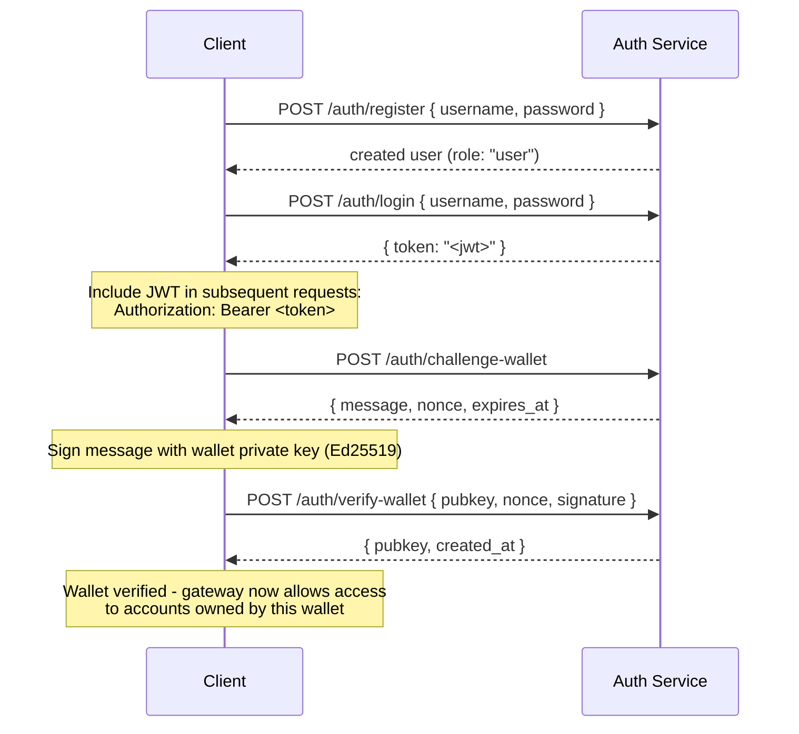

## 概述

Private Channels 包含一个可选的认证服务，通过 JWT 身份验证和基于角色的访问控制（RBAC）对网关访问进行管控。当身份验证禁用时，网关接受所有连接。启用后，客户端必须在每个请求中提供有效的 JWT。

本页面面向以下两类用户：

- **开发者** - 注册、登录、钱包验证及发送已认证请求
- **运营者** - 启用认证服务、配置 `JWT_SECRET` 以及分配 `operator` 角色

## 启用身份验证

通过在网关和认证服务上同时设置非空的 `JWT_SECRET` 来启用身份验证。认证服务还需要配置 `AUTH_DATABASE_URL`。

若未设置 `JWT_SECRET`，网关将以开放模式运行，无需 token。

> **Docker Compose：** 认证服务是一个 Docker Compose profile，**默认不启动**。如需启用，请在 `docker compose` 命令中加入 `--profile auth`，并附带 `--env-file .env` 以确保 `JWT_SECRET` 和 `POSTGRES_PASSWORD` 等密钥能正确解析（一旦传入任何 `--env-file` 参数，Compose 将禁用其自动加载 `.env` 的功能）：
>
> ```bash
> docker compose -f docker-compose.devnet.yml --env-file versions.env --env-file .env.devnet --env-file .env --profile auth up -d
> ```

## 认证服务 API

所有端点均位于 `/auth` 路径下。认证服务监听 `AUTH_PORT`（默认 `8903`）。

### `POST /auth/register`

创建新账户。所有用户注册时均赋予 `user` 角色。

```json
{ "username": "alice", "password": "hunter2" }
```

- 用户名：5-32 个字符，支持字母数字及 `_` 和 `-`
- 密码：6-128 个字符
- 返回已创建的用户信息；密码不会被返回

### `POST /auth/login`

进行身份验证并获取有效期为 24 小时的已签名 JWT。

```json
{ "username": "alice", "password": "hunter2" }
```

返回 `{ "token": "<jwt>" }`。用户名错误和密码错误均返回 `401`，以防止用户名枚举攻击。

### `POST /auth/challenge-wallet`

请求签名挑战以证明对某个 Solana 钱包的所有权。需要有效的 JWT。

返回消息、nonce 和过期时间。挑战在 10 分钟后过期。

```json
{
  "message": "PrivateChannel wallet verification\nuser: <uuid>\nnonce: <uuid>\nexpires: <unix>",
  "nonce": "<uuid>",
  "expires_at": "<iso8601>"
}
```

### `POST /auth/verify-wallet`

提交已签名的挑战，将钱包注册为已验证状态。需要有效的 JWT。

```json
{
  "pubkey": "<base58 pubkey>",
  "nonce": "<uuid from challenge>",
  "signature": "<base58 Ed25519 signature>"
}
```

服务将重建挑战消息，验证 Ed25519 签名，并存储钱包信息。每个 nonce 只能使用一次，重放请求将被拒绝。

返回 `{ "pubkey": "<base58>", "created_at": "<iso8601>" }`。

### `GET /auth/wallets`

列出已认证用户的所有已验证钱包。需要有效的 JWT。

### `DELETE /auth/wallets/{pubkey}`

从已认证用户的账户中移除一个已验证钱包。需要有效的 JWT。

### `GET /health`

存活检查。返回 `200 ok`。无需身份验证。

## JWT 结构

Token 使用 HS256 算法，并在签发后 24 小时过期。

| 声明  | 值                           |
| ------ | ------------------------------- |
| `sub`  | 用户 UUID                       |
| `role` | `"user"` 或 `"operator"`        |
| `iss`  | `"private-channel-auth"`        |
| `aud`  | `"private-channel-gateway"`     |
| `exp`  | Unix 时间戳（签发后 24 小时） |

> `iss` 和 `aud` 存在于 JWT payload 中，但由网关的 JWT 配置进行验证，而非反序列化到应用层的声明结构体中。应用层代码仅能访问 `sub`、`role` 和 `exp`。

在 `Authorization` 请求头中传递 token：

```
Authorization: Bearer <JWT_TOKEN>
```

## 角色

### user

注册时的默认角色。

- 访问权限限定于用户自己的已验证钱包
- 禁止访问：`getBlock`、`getTransaction`、`simulateTransaction`
- 可执行：在 Escrow Program 上调用 `Deposit`，通过 `WithdrawFunds` 发起提款

### operator

提升权限角色。必须直接进行分配；不存在从 `user` 自助升级为 `operator` 的路径。

**授予角色**，可通过 Admin CLI（`private-channel-auth-admin`）执行：

```bash
private-channel-auth-admin set-role --username alice --role operator
```

或使用直接 SQL：

<Callout type="warning">
  这是一项特权数据库操作。请相应地限制对认证服务数据库的访问，并对所有角色变更进行审计。
</Callout>

```sql
UPDATE private_channel_auth.users SET role = 'operator' WHERE username = 'alice';
```

**无需自助验证流程即可注册钱包（Admin CLI，`private-channel-auth-admin`）：**

```bash
private-channel-auth-admin attach-wallet --username alice --pubkey <base58-pubkey>
```

此操作将已验证钱包直接插入 `verified_wallets` 表，绕过挑战/验证流程。对 `(user_id, pubkey)` 强制执行唯一性约束。此命令本身**不会**授予 `operator` 角色；如需授权，请使用 `set-role` 或上述 SQL 更新语句。此命令用于将钱包附加到账户（例如服务账户），而无需经历交互式挑战/验证流程。

**功能权限：**

- 绕过所有钱包所有权检查
- 完全访问所有网关 RPC 方法，包括 `getBlock`、`getTransaction`、`simulateTransaction`
- 以下方法必须使用此角色：`ReleaseFunds`、`ResetSmtRoot`

## 完整身份验证流程



## 发送已认证请求

```typescript
const response = await fetch("http://localhost:8899/", {
  method: "POST",
  headers: {
    "Content-Type": "application/json",
    Authorization: `Bearer ${jwtToken}`
  },
  body: JSON.stringify({
    jsonrpc: "2.0",
    id: 1,
    method: "getBalance",
    params: [walletAddress]
  })
});
const data = await response.json();
```

## 网关端点

以下端点无需身份验证：

| 端点  | 方法 | 描述                               | 成功                  | 失败                     |
| --------- | ------ | ----------------------------------------- | ------------------------ | --------------------------- |
| `/health` | GET    | 存活检查                            | `200 {"status":"ok"}`    | -                           |
| `/ready`  | GET    | 深度就绪检查；探测写入节点和读取节点 | `200 {"status":"ready"}` | `503 {"status":"degraded"}` |

有关 `JWT_SECRET` 及网关环境变量的参考说明，请参阅 [配置参考](/docs/tools/private-channels/operators/configuration)。

## RPC 方法访问矩阵

以下方法均受网关识别。当设置了 `JWT_SECRET` 时，访问权限取决于 JWT 角色：

| 方法                        | 路由      | 无 JWT | `user`           | `operator` |
| ----------------------------- | ---------- | ------ | ---------------- | ---------- |
| `sendTransaction`             | 写入节点 | ✓      | ✓                | ✓          |
| `getLatestBlockhash`          | 读取节点  | ✓      | ✓                | ✓          |
| `getSlot`                     | 读取节点  | ✓      | ✓                | ✓          |
| `getRecentBlockhash`          | 读取节点  | ✓      | ✓                | ✓          |
| `getSignatureStatuses`        | 读取节点  | ✓      | ✓                | ✓          |
| `getTransactionCount`         | 读取节点  | ✓      | ✓                | ✓          |
| `getFirstAvailableBlock`      | 读取节点  | ✓      | ✓                | ✓          |
| `getBlocks`                   | 读取节点  | ✓      | ✓                | ✓          |
| `getEpochInfo`                | 读取节点  | ✓      | ✓                | ✓          |
| `getEpochSchedule`            | 读取节点  | ✓      | ✓                | ✓          |
| `getRecentPerformanceSamples` | 读取节点  | ✓      | ✓                | ✓          |
| `getBlockTime`                | 读取节点  | ✓      | ✓                | ✓          |
| `getVoteAccounts`             | 读取节点  | ✓      | ✓                | ✓          |
| `getSupply`                   | 读取节点  | ✓      | ✓                | ✓          |
| `getSlotLeaders`              | 读取节点  | ✓      | ✓                | ✓          |
| `isBlockhashValid`            | 读取节点  | ✓      | ✓                | ✓          |
| `getAccountInfo`              | 读取节点  | 401    | 所有权验证¹ | ✓          |
| `getTokenAccountBalance`      | 读取节点  | 401    | 所有权验证¹ | ✓          |
| `getSignaturesForAddress`     | 读取节点  | 401    | 所有权验证¹ | ✓          |
| `getBlock`                    | 读取节点  | 401    | 403              | ✓          |
| `getTransaction`              | 读取节点  | 401    | 403              | ✓          |
| `simulateTransaction`         | 读取节点  | 401    | 403              | ✓          |

¹ **所有权验证**：对于 SPL token account（owner 字段为 `TokenkegQ...` 或 `TokenzQ...`，数据至少 165 字节），网关会检查 `owner` 或 `delegate` 字段是否与已认证用户的某个已验证钱包匹配。对于其他账户类型（System Program 钱包或未知 PDA），则直接检查所查询的 pubkey 本身是否属于用户的已验证钱包，因为此类账户没有 owner/delegate 字段可供检查。任一检查失败均返回 403。
