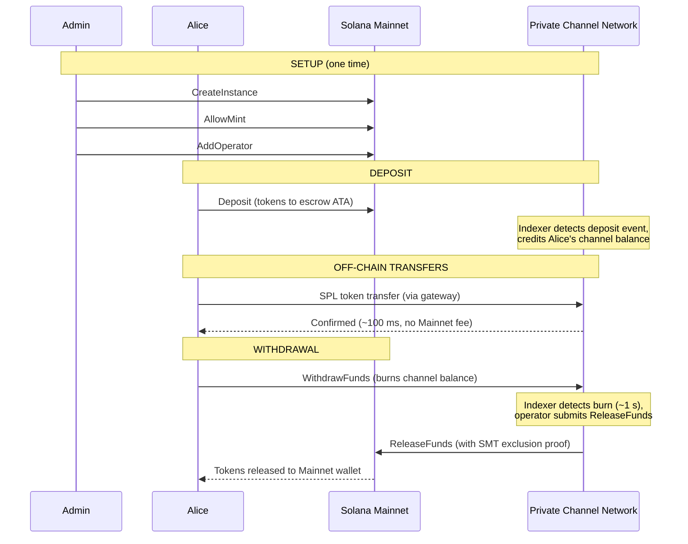
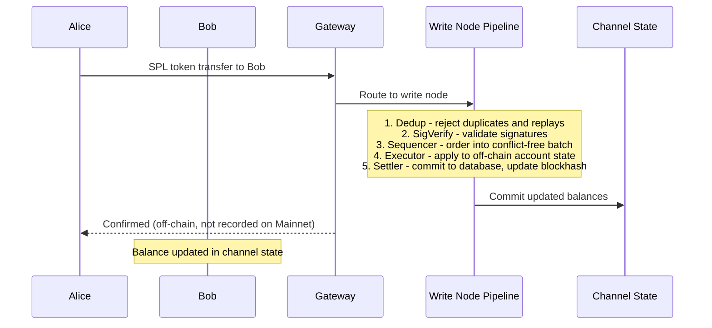
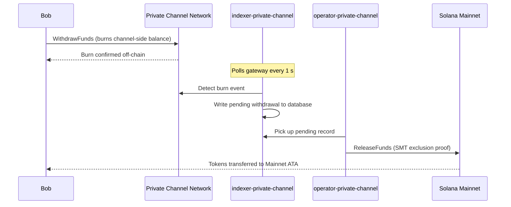

## 什么是私有通道？

私有通道是一个锚定在 Solana 上的链下支付网络。用户将 SPL 代币存入链上托管程序，然后通过网关以高速、零转账费用的方式在链下进行交易。结算回 Solana 主网时，通过稀疏默克尔树（Sparse Merkle Tree）证明完成，确保资金始终可赎回且不可双花。

与 Solana 原生支付流程不同，通道内的转账在用户提款之前不会出现在链上。通道网络运行其自己的交易管道（去重 -> 签名验证 -> 排序器 -> 执行器 -> 结算器），独立于 Solana 出块时间处理交易。

## 参与者

### 实例管理员

管理员通过 `CreateInstance` 部署 `Instance` PDA，并控制哪些 SPL 代币铸造账户被接受（`AllowMint` / `BlockMint`）。管理员通过 `AddOperator` / `RemoveOperator` 配置和撤销操作员，并可通过 `SetNewAdmin` 转移管理员权限。每个实例只有一名管理员。管理员权限转移是不可逆的单步操作：当前管理员在没有新管理员配合的情况下无法重新获得该角色。

### 操作员

操作员由管理员配置。他们持有 `Operator` PDA，是唯一被允许调用 `ReleaseFunds`（将提款结算至主网）和 `ResetSmtRoot`（轮换稀疏默克尔树）的账户。操作员绕过网关中的所有所有权检查，并可访问所有 JSON-RPC 方法，包括 `getBlock`、`getTransaction` 和 `simulateTransaction`。JWT 角色：`"operator"`。操作员必须直接在数据库中配置；不存在自助提权通道。部署和配置详情请参阅[操作员指南](/docs/tools/private-channels/operators)。

### 用户

用户通过 Auth Service 自助注册。JWT 角色：`"user"`。用户可直接在托管程序上调用 `Deposit`，并通过提款程序上的通道侧 `WithdrawFunds` 指令发起提款。网关访问仅限于其自己已验证的钱包；他们无法调用 `getBlock`、`getTransaction` 或 `simulateTransaction`。

## 通道生命周期

1. **实例创建** - 管理员调用 `CreateInstance`，创建 `Instance` PDA 并配置允许的铸造账户。
2. **存款** - 用户通过 `Deposit` 指令将 SPL 代币存入托管账户。代币转移至实例的 associated token account。
3. **链下转账** - 用户通过网关发送转账。转账在通道网络上完成排序和执行，不涉及主网。
4. **发起提款** - 用户在提款程序（通道侧）调用 `WithdrawFunds`，销毁其余额并发出提款信号。
5. **主网结算** - 操作员提供有效的 SMT 排除证明，并在托管程序（主网）上调用 `ReleaseFunds`，将代币释放至用户钱包。
6. **树轮换** - 当 SMT 接近容量上限（65,536 个叶节点）时，操作员调用 `ResetSmtRoot` 轮换该树并开始新的 epoch。

### 转账

### 提款

## 何时使用私有通道

当您的应用程序有以下需求时，请使用私有通道：

- **链下吞吐量** - 您的转账量将使 Solana TPS 达到饱和，或您需要亚秒级确认
- **隐私保护** - 交易对手身份和转账金额不得出现在链上
- **零转账费用** - 频繁转账时，每笔交易的 SOL 成本过高

在以下情况下，请改用原生 SPL 转账：

- **需要链上可组合性**（DeFi、兑换、借贷；其他程序必须能够观察或响应该转账）
- **单次转账结算**即可满足需求且无隐私顾虑
- **无网关基础设施**可用或在运维上不可行
