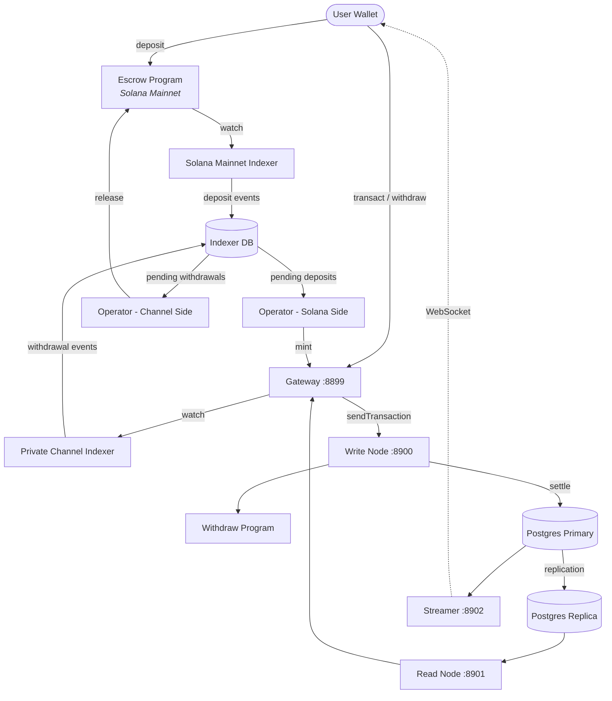

<Callout type="warning">
  Private Channels 尚未经过安全审计，在未经全面安全审查的情况下，不建议将其用于涉及真实资金的生产环境。
</Callout>

<Callout type="info">
  **正在部署实例？** 请前往 [运营商指南](/docs/tools/private-channels/operators)。**正在对接现有实例？** 请前往 [快速入门](/docs/tools/private-channels/quickstart/installation)。本页面是面向两类读者的架构参考文档。
</Callout>

## 架构

Private Channels 由四个组件构成：两个链上 Solana 程序（Escrow 和 Withdraw）以及两个链下服务（Gateway 和 Auth Service）。它们共同构成一个状态通道协议，资金存放在主网上，而转账则在链下完成结算。

### Escrow 程序

Escrow 程序是一个链上 Solana 程序，用于持有存入的 SPL 代币。它是系统的信任锚点：所有资金最终都存放在托管中，直到运营商提供有效的稀疏默克尔树排除证明后方可释放。

- 程序 ID：`9tgHa1DcnaSSUtmMsst8ovKTe1Gfxzezn27KnH9xXYeU`
- 此 ID 通过 `declare_id!()` 编译进程序二进制文件。链下服务在编译时从生成的客户端 crate 中读取相同的 ID，而非从环境变量中读取。
- 管理 `Instance`、`AllowedMint` 和 `Operator` PDA
- 指令：`CreateInstance`、`AllowMint`、`BlockMint`、`AddOperator`、`RemoveOperator`、`SetNewAdmin`、`Deposit`、`ReleaseFunds`、`ResetSmtRoot`

### Withdraw 程序

Withdraw 程序运行在私有通道网络上，而非 Solana 主网。用户调用 `WithdrawFunds` 销毁其通道侧的代币余额。此销毁操作不会自动释放资金，而是向运营商发出提款待处理的信号。随后，运营商在 Escrow 程序上携带有效的 SMT 证明调用 `ReleaseFunds`，以完成结算。

- 程序 ID：`J231K9UEpS4y4KAPwGc4gsMNCjKFRMYcQBcjVW7vBhVi`
- 此 ID 编译进程序二进制文件。链下服务在编译时从生成的客户端 crate 中读取相同的 ID，而非从环境变量中读取。

### Gateway

Gateway 是一个兼容 Solana JSON-RPC 的代理，将客户端请求路由至通道网络的写节点（用于提交交易）和读节点（用于查询）。它通过环境变量进行配置：`GATEWAY_PORT`、`GATEWAY_WRITE_URL`、`GATEWAY_READ_URL`。

健康检查端点（无需身份验证）：

- `GET /health` - 存活检查；返回 `200 {"status":"ok"}`
- `GET /ready` - 深度就绪检查，探测写节点和读节点；返回 `200 {"status":"ready"}` 或 `503 {"status":"degraded"}`

#### RPC 方法路由与访问控制

Gateway 将 `sendTransaction` 路由至写节点，其余所有方法路由至读节点。超过 64 KB 的请求将以 HTTP 413 拒绝。启用身份验证后，方法访问由 JWT 角色控制。完整方法矩阵请参阅 **[身份验证与角色](/docs/tools/private-channels/concepts/auth)**。

### Auth Service

Auth Service 是一个可选组件，用于签发 HS256 JWT（有效期 24 小时）以控制 Gateway 访问。当设置了 `JWT_SECRET` 环境变量时，该组件将被启用。未设置时，Gateway 接受所有连接。

JWT 声明：`sub`（用户 UUID）、`role`（`"user"` 或 `"operator"`）、`iss`（`"private-channel-auth"`）、`aud`（`"private-channel-gateway"`）、`exp`（Unix 时间戳）。`iss` 和 `aud` 由 Gateway 的 JWT 配置验证，不会反序列化到应用声明结构体中：应用层代码只能访问 `sub`、`role` 和 `exp`。

角色：

- `user` - 访问权限仅限于自身已验证的钱包；不能调用 `getBlock`、`getTransaction` 或 `simulateTransaction`
- `operator` - 绕过所有所有权检查；拥有完整的 RPC 方法访问权限；必须在数据库中预先配置（不支持自助提权）

### Streamer

Streamer 是一个 WebSocket 服务器，可实时向已连接的客户端推送通道状态更新，无需轮询 RPC。它通过轮询 PostgreSQL 获取状态变更。它是基础 Docker Compose 栈的一部分，而非本指南部署的 devnet 栈；请参阅 [配置参考](/docs/tools/private-channels/operators/configuration#service-port-reference)。

- 端口：`8902`，可通过 `STREAMER_PORT` 配置
- 连接地址：`ws://localhost:8902`
- 健康检查端点：`GET /health` - 若任意内部轮询循环停滞超过 30 秒，则返回 `503`

<Callout type="warning">
  WebSocket 事件模式尚未公开记录。在正式文档发布前，请参阅 [`core/src/bin/streamer.rs`](https://github.com/solana-foundation/solana-private-channels/blob/main/core/src/bin/streamer.rs) 了解实现细节。
</Callout>



## 交易流水线

```text
Transaction -> [1:Dedup] -> [2:SigVerify] -> [3:Sequencer] -> [4:Executor] -> [5:Settler] -> Database
```

提交至 Gateway 的交易在状态被提交前，需经过五个阶段的流水线处理：

1. **去重（Dedup）** - 在交易进入流水线前过滤重复交易
2. **签名验证（SigVerify）** - 验证交易签名与签名者公钥的一致性
3. **排序（Sequencer）** - 对有效交易进行确定性排序，建立规范历史记录
4. **执行（Executor）** - 在通道账户层（BOB Cache + AccountsDB）上执行交易，在链下更新余额
5. **结算（Settler）** - 将累积的交易结果提交至 PostgreSQL 并更新 Redis 缓存；为下一个区块周期生成新的 blockhash。主网结算（调用 `ReleaseFunds`）由 `operator-private-channel` 服务单独处理

## 核心特性

### 隐私性

通道参与者之间的转账不会记录在 Solana 主网上。只有存款（进入通道）和最终提款（离开通道）才会上链。在通道运行期间，交易对手身份和转账金额对外部观察者不可见。

### 性能

链下流水线将 Solana 的出块时间从关键路径中移除。转账在排序器处理时即可确认，而无需等待 Solana 区块确认。这使得应用层转账能够实现亚秒级终局性，吞吐量也可超越 Solana 原生 TPS。

### 结算

每笔提款均受链上稀疏默克尔树证明保护。SMT 根存储在 Escrow 程序的 `Instance.withdrawal_transactions_root` 中。调用 `ReleaseFunds` 时，程序首先对当前链上根验证一个未见 nonce 的排除证明，再对调用者提供的新根验证该 nonce 的包含证明。两项检查均通过后，才会存储新根，即使运营商密钥遭到泄露，也无法实现双重花费。

## 安全模型

**管理员密钥** - 控制实例创建（`CreateInstance`）和运营商配置（`AddOperator` / `RemoveOperator`）。管理员密钥一旦泄露，攻击者可任意配置运营商。`SetNewAdmin` 以不可逆的单步操作转移管理员权限；请妥善保护管理员密钥。

**运营商密钥** - 可调用 `ReleaseFunds` 和 `ResetSmtRoot`。在没有针对当前链上根的有效 SMT 排除证明的情况下，无法释放资金。链上的 `verify_smt_exclusion_proof` 检查是防范未授权提款的最后一道防线：仅凭一个被泄露的运营商密钥，不足以耗尽托管资金。

**SMT 根** - 链上存储于 `Instance.withdrawal_transactions_root`。每次调用 `ReleaseFunds` 时原子性更新。由于每个证明必须引用未见的 nonce，即使运营商密钥遭到泄露，也无法对相同的通道余额进行双重花费。

**树轮换** - `Instance.current_tree_index` 跟踪树的 epoch。调用 `ResetSmtRoot` 时，会递增树索引并使前一个树 epoch 的所有 nonce 失效，为新的结算周期提供干净的初始状态。

## 运营密钥安全

<Callout type="warning">
  链下服务使用其自有的签名者体系，与上述安全模型中描述的链上管理员/运营商权限无关。`ADMIN_PRIVATE_KEY` 是所有运营商服务的必填项，用于支付交易费用；独立的可选项 `OPERATOR_PRIVATE_KEY` 为 `ReleaseFunds` 和 `ResetSmtRoot` 提供链上 Operator 签名，未设置时回退使用 `ADMIN_PRIVATE_KEY` 的值。切勿将协议级实例管理员密钥（用于 `CreateInstance` / `AddOperator` / `SetNewAdmin`）填入上述任一变量或在运行时暴露；请将该密钥保持冷存储并离线保管。
</Callout>

`ReleaseFunds` 和 `ResetSmtRoot` 需要两个链上签名：费用支付者（来自 `ADMIN_PRIVATE_KEY`）和 Operator PDA 的授权方（来自 `OPERATOR_PRIVATE_KEY`，若未设置则使用 `ADMIN_PRIVATE_KEY`）。本部署指南的 devnet 演练将生成的运营商 keypair 填入 `ADMIN_PRIVATE_KEY`，并保持 `OPERATOR_PRIVATE_KEY` 未设置，因此同一 keypair 同时承担两个签名角色。请对 `ADMIN_PRIVATE_KEY` 中的密钥施以与热钱包私钥相同的安全管控：

- 仅将其存储于已在 gitignore 中忽略的 `.env` 文件，切勿存入 `.env.devnet` 或任何已提交的配置文件
- 对于生产环境部署，建议使用密钥管理器（如 AWS Secrets Manager 或 HashiCorp Vault），而非明文环境变量
- 协议级实例管理员 keypair（用于调用 `AddOperator` / `SetNewAdmin`）应保持冷存储；它仅在实例初始化和运营商配置期间使用，运行时无需使用

`SetNewAdmin` **以单笔交易不可逆地转移**管理员权限：当前管理员在未获新管理员配合的情况下无任何恢复路径。请务必在验证目标地址后再调用此指令。

## 下一步

<Cards>
  <Card
    title="快速入门"
    href="/docs/tools/private-channels/quickstart/installation"
  >
    配置您的开发环境并生成 TypeScript 客户端。
  </Card>
  <Card title="通道" href="/docs/tools/private-channels/concepts/channels">
    了解参与者及通道生命周期。
  </Card>
  <Card
    title="稀疏默克尔树"
    href="/docs/tools/private-channels/concepts/smt"
  >
    了解提款证明如何在链上进行验证。
  </Card>
  <Card
    title="指令"
    href="/docs/tools/private-channels/instructions/deposit"
  >
    所有程序的完整指令参考。
  </Card>
</Cards>
