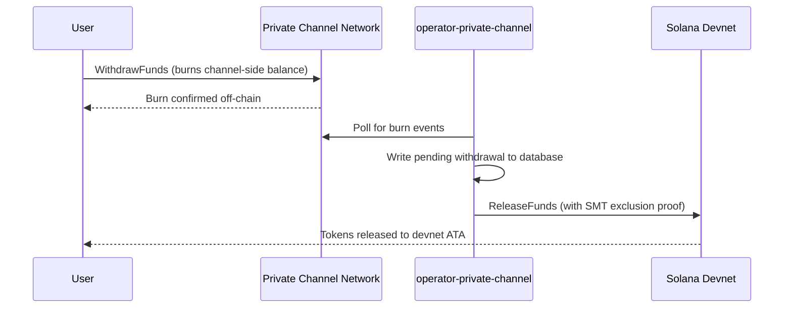

## 概述

从 Private Channels 提取资金是一个两步流程。首先，用户通过调用提取程序上的 `WithdrawFunds` 来销毁其通道侧代币余额。其次，运营商在本演练中调用 Escrow 程序（devnet）上的 `ReleaseFunds`，并提供有效的稀疏默克尔树排除证明以释放资金。SMT 证明确保每个提取 nonce 只能使用一次，从而防止双重支付。



## 步骤 1：在通道上发起提取

调用提取程序上的 `WithdrawFunds` 以销毁您的通道侧余额。
使用 `Async` 变体，它会自动派生 `tokenAccount` PDA，是生产环境中的推荐形式：

```typescript
import { getWithdrawFundsInstructionAsync } from "../private-channel-withdraw-program/clients/typescript/src/generated";
import {
  createSolanaRpc,
  address,
  pipe,
  createTransactionMessage,
  setTransactionMessageFeePayerSigner,
  setTransactionMessageLifetimeUsingBlockhash,
  appendTransactionMessageInstruction,
  signAndSendTransactionMessageWithSigners,
  assertIsTransactionMessageWithSingleSendingSigner,
  getBase58Decoder
} from "@solana/kit";

// Point to the gateway, not a public Solana RPC
const privateChannelRpc = createSolanaRpc("http://localhost:8899");

const withdrawIx = await getWithdrawFundsInstructionAsync({
  user: userSigner,
  mint: address(mintAddress),
  amount: 1_000_000n, // 1 USDC (6 decimals)
  destination: null // null = release to signer's devnet wallet
});

const { value: latestBlockhash } = await privateChannelRpc
  .getLatestBlockhash({ commitment: "confirmed" })
  .send();

// Sent to the Private Channels gateway (not Solana RPC directly), which
// expects the legacy transaction format - do not switch this to version 0.
const transactionMessage = pipe(
  createTransactionMessage({ version: "legacy" }),
  (m) => setTransactionMessageFeePayerSigner(userSigner, m),
  (m) => setTransactionMessageLifetimeUsingBlockhash(latestBlockhash, m),
  (m) => appendTransactionMessageInstruction(withdrawIx, m)
);

assertIsTransactionMessageWithSingleSendingSigner(transactionMessage);

const signatureBytes =
  await signAndSendTransactionMessageWithSigners(transactionMessage);
const signature = getBase58Decoder().decode(signatureBytes);
console.log("Withdrawal initiated:", signature);
```

- 提取程序 ID：`J231K9UEpS4y4KAPwGc4gsMNCjKFRMYcQBcjVW7vBhVi`
- 将此交易提交到网关（`http://localhost:8899`），而非公共 Solana RPC
- 如果提供了 `destination`，释放的资金将转入该钱包，而非签名者的钱包

## 预期结果

调用 `WithdrawFunds` 后无需进一步操作。运营商服务会自动处理结算：

1. `indexer-private-channel` 每隔 1 秒轮询通道以检测销毁事件，并在检测到您的事件时写入一条待处理的提取记录
2. `operator-private-channel` 每隔 1 秒轮询数据库以获取待处理记录，并携带所需的 SMT 排除证明向 Solana devnet 上的 Escrow 程序提交 `ReleaseFunds`；在重试之前，它会以 400 毫秒为间隔最多轮询 5 次以等待 devnet 确认

在正常情况下，资金通常会在几秒钟内出现在您的 devnet 钱包中。

## 运营商如何结算（参考）

通道侧销毁完成后，已配置的运营商必须携带有效的 SMT 排除证明调用 Escrow 程序上的 `ReleaseFunds`；若不能证明提取 nonce 未被使用过，运营商将无法释放资金。此步骤由 `operator-private-channel` 自动处理，您无需自行调用。

运营商需提供：

- `amount`：必须与已销毁的金额一致
- `user`：devnet 上的接收方钱包
- `new_withdrawal_root`：本次提取后更新的 SMT 根
- `transaction_nonce`：该叶节点的唯一 nonce
- `sibling_proofs`：512 字节（树证明的 16 个 32 字节兄弟节点哈希）

## 验证

运营商调用确认后，检查您的 devnet 代币余额：

```bash
spl-token balance <MINT_ADDRESS> --owner <YOUR_WALLET>
```

或通过 RPC：

```typescript
import { createSolanaRpc, address } from "@solana/kit";
import { findAssociatedTokenPda } from "@solana-program/token";

const TOKEN_PROGRAM_ADDRESS = address(
  "TokenkegQfeZyiNwAJbNbGKPFXCWuBvf9Ss623VQ5DA"
);

// Query devnet directly; ReleaseFunds settles here, not through the gateway
const rpc = createSolanaRpc("https://api.devnet.solana.com");

const [yourDevnetAta] = await findAssociatedTokenPda({
  mint: address(mintAddress),
  owner: address(userSigner.address),
  tokenProgram: TOKEN_PROGRAM_ADDRESS
});

const balance = await rpc.getTokenAccountBalance(yourDevnetAta).send();
console.log(balance.value.uiAmountString);
```

## 您已完成快速入门

您已在 devnet 上完成了完整的 Private Channels 周期：将 SPL 代币存入托管账户，通过网关发送链下转账，并将资金提取回您的 devnet 钱包。

<Cards>
  <Card
    title="通道生命周期"
    href="/docs/tools/private-channels/concepts/channels"
  >
    深入了解参与者及完整的存款至提款流程。
  </Card>
  <Card
    title="身份验证与角色"
    href="/docs/tools/private-channels/concepts/auth"
  >
    为您的集成添加 JWT 身份验证。
  </Card>
  <Card
    title="释放资金参考"
    href="/docs/tools/private-channels/instructions/release-funds"
  >
    面向运营商工具的完整 ReleaseFunds 指令参考。
  </Card>
  <Card
    title="稀疏默克尔树"
    href="/docs/tools/private-channels/concepts/smt"
  >
    了解提取证明如何防止双重支付。
  </Card>
</Cards>
