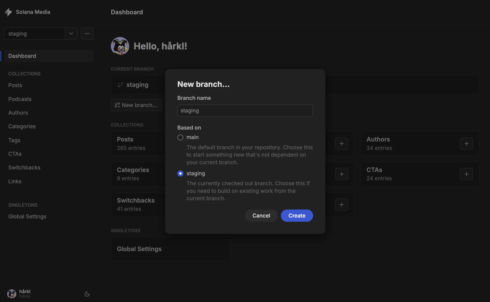
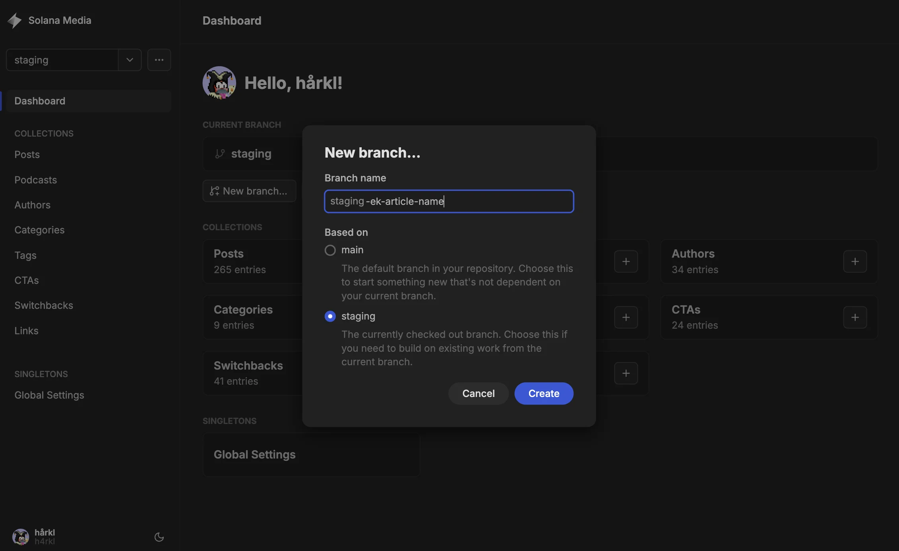
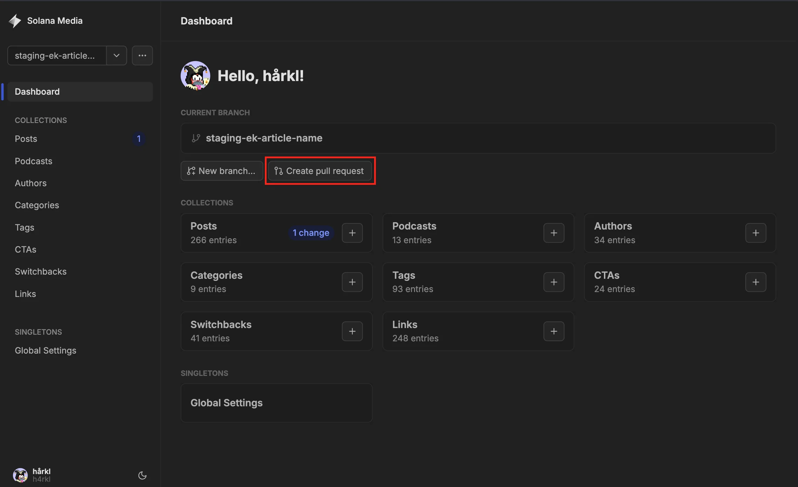
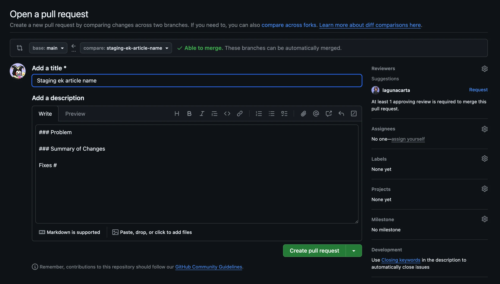

# Authoring Posts in Keystatic with Branching

> A short workflow for creating a post on a dedicated Keystatic branch and using
> the branch flow shown in the CMS.

## When To Use This

Use this flow when you are creating or updating a post and do not want to work
directly on the shared `staging` branch.

The goal is simple:

1. Create a dedicated branch from `staging`
2. Write and save the post there
3. Open the pull request flow from that branch
4. Merge and publish through GitHub

## Step 1: Start from `staging`

Open the hosted Keystatic admin:

- `https://solana-com-media.vercel.app/keystatic`

On the dashboard, confirm the branch selector is set to `staging`.

Then click `New branch...`.

## Step 2: Name the Branch

Use a descriptive branch name for the article you are creating.

Example:

- `staging-ek-article-name`

Keep `Based on` set to `staging`, then click `Create`.

## Step 3: Open Posts and Draft on Your Branch

Once the new branch is selected, open `Posts`, create or update the post, and
save your work on that branch.

Important fields for release readiness:

- `Status`: leave as `Draft` until the post is approved
- `Publish Date`: enter the exact UTC date and time
- `Author`, `Categories`, and `Tags`: make sure these are set before handoff

## Step 4: Use the Pull Request Action in Keystatic

After saving changes on your branch, return to the dashboard and click
`Create pull request`.

Keystatic opens the GitHub PR screen for the current branch.

## Step 5: Complete the Pull Request in GitHub

In GitHub, review the branch comparison, add the PR title and description, and
create the pull request.

The flow in the screenshots shows:

- `base`: `main`
- `compare`: your content branch, for example `staging-ek-article-name`

If your team wants an intermediate merge into shared `staging` before release,
adjust the GitHub base branch there before creating the PR.

## Step 6: Wait for the Vercel Preview Build

After the pull request is opened, Vercel will start a preview build for that
branch.

Open the PR in GitHub and look for the Vercel deployment status on the pull
request timeline or checks section. When the build finishes, GitHub will show a
link to the preview deployment for that PR.

Use that preview link to review the post before merging.

## Quick Rules

- Do not draft directly on shared `staging` when the article should live on its
  own branch first
- Use one dedicated branch per article or content batch
- Review the GitHub base and compare branches before clicking
  `Create pull request`
- Wait for the Vercel preview build and review the preview link from the PR
