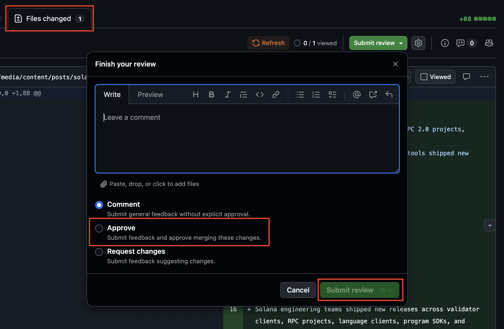
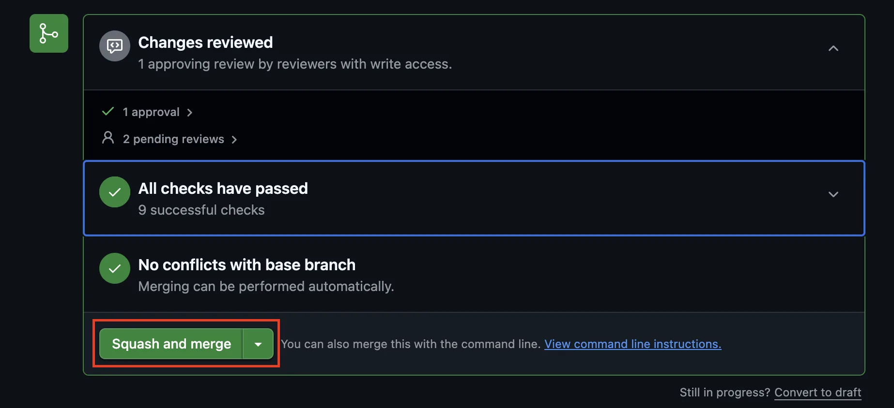

# Authoring Posts in Keystatic with Branching

> A short workflow for creating a post on a dedicated Keystatic branch and using
> the branch flow shown in the CMS.

## When To Use This

Use this flow for every content change. Each article or related content batch
gets its own `staging-*` branch.

The goal is simple:

1. Create a dedicated `staging-*` branch from `main`
2. Write and save the post there
3. Open a Pull Request from that branch to `main`
4. Review, approve, and merge the Pull Request

## Step 1: Start from `main`

Open the hosted Keystatic admin:

- `https://solana-com-media.vercel.app/keystatic`

On the dashboard, confirm the branch selector is set to `main`. Starting from
`main` ensures the new content branch contains the latest published content.

Then click `New branch...`.

## Step 2: Name the Branch

Keystatic adds the required `staging-` prefix. Enter a descriptive suffix for
the article you are creating.

Example:

- Enter `ek-article-name`
- Keystatic creates `staging-ek-article-name`

Because you started on `main`, Keystatic uses `main` as the base automatically.
Click `Create`.

## Step 3: Open Posts and Draft on Your Branch

Once the new branch is selected, open `Posts`, create or update the post, and
save your work on that branch.

Important fields for release readiness:

- `Status`: leave as `Draft` until the post is approved
- `Publish Date`: enter the exact UTC date and time
- `Author`, `Categories`, and `Tags`: make sure these are set before handoff

## Step 4: Use the Pull Request Action in Keystatic

After saving changes on your branch, return to the dashboard and click
`Create pull request`.

Keystatic opens the GitHub PR screen for the current branch.

## Step 5: Complete the Pull Request in GitHub

In GitHub, review the branch comparison, add the PR title and description, and
create the pull request.

Confirm the GitHub comparison shows:

- `base`: `main`
- `compare`: your content branch, for example `staging-ek-article-name`

## Step 6: Wait for the Vercel Preview Build

After the pull request is opened, Vercel will start a preview build for that
branch.

Open the PR in GitHub and look for the Vercel deployment status on the pull
request timeline or checks section. When the build finishes, GitHub will show a
link to the preview deployment for that PR.

Use that preview link to review the post before merging.

## Step 7: Approve the Pull Request in GitHub

After the preview looks correct, open the PR's `Files changed` tab and review
the content diff.

Click `Submit review`, select `Approve`, and then click `Submit review` again.

Only approve after the post copy, metadata, publish date, images, and preview
page have been checked.

## Step 8: Squash and Merge the Pull Request

Return to the PR conversation view. Confirm GitHub shows:

- `Changes reviewed`
- `All checks have passed`
- `No conflicts with base branch`

Then click `Squash and merge`.

After the squash merge completes, the post is published from `main` once the
production deployment finishes and the post's `Publish Date` timestamp has
passed.

## Quick Rules

- Start each content branch from `main`
- Use a branch beginning with `staging-`; Keystatic adds this prefix for you
- Use one dedicated branch per article or content batch
- Open the Pull Request directly from the content branch to `main`
- Wait for the Vercel preview build and review the preview link from the PR
- Approve the GitHub PR only after the preview and content diff have been
  checked
- Use `Squash and merge` after approval, passing checks, and a clean base branch
