# Keystatic CMS Walkthrough for Content Writers

> A production walkthrough for managing Solana Media content in Keystatic with
> GitHub authentication, staging drafts, and pull request based publishing.

---

## Section 1: Prerequisites

Keystatic uses GitHub for authentication and version control. Before you start,
make sure you have:

1. A GitHub account.
2. **Write** access to the `solana-foundation/solana-com` repository.
3. Access to the Solana Media Keystatic GitHub App.

If you do not have repository access yet:

1. Go to [github.com](https://github.com) and create an account.
2. Verify your email address.
3. Ask your team admin to invite you to the `solana-foundation/solana-com`
   repository.
4. Accept the GitHub invitation before opening Keystatic.

> **Note:** You do not need to use Git directly. Keystatic creates the commits
> for you.

---

## Section 2: How Publishing Works

There are two separate stages in the workflow:

| Stage                  | Where the change lives                          | What it means                               |
| ---------------------- | ----------------------------------------------- | ------------------------------------------- |
| **Drafting / editing** | A dedicated `staging-*` branch made from `main` | Safe working copy for one content change    |
| **Publishing**         | Pull Request from that branch to `main`         | Review and release process for live content |

Each Pull Request gets a Vercel preview deployment. Open the preview link from
the Pull Request checks to verify the content before merging.

> **Note:** After saving a change, allow 1–2 minutes for the branch preview to
> update. Vercel needs to rebuild the site before new content appears.

Important rules:

- Start from `main`, then create a new branch for the article or content batch.
- Branch names must start with `staging-`. Keystatic adds this prefix for you.
- Do not edit content directly on `main` or on the old shared `staging` branch.
- Saving in Keystatic writes a commit to the selected `staging-*` branch, not to
  the live site.
- Setting a post to **Published** only marks it ready on that branch.
- Content goes live only after a Pull Request from the content branch to `main`
  is reviewed and merged.
- Posts and reports now use **Publish Date** with both date and time.
- Enter **Publish Date** in UTC.
- Published posts and reports remain hidden until their **Publish Date** has
  passed.
- Scheduled content is filtered out of the website, RSS feeds, and APIs until
  that timestamp is reached.
- Site and API caches revalidate roughly every 5 minutes, so merge scheduled
  content a little ahead of the desired release time.

---

## Section 3: Accessing the CMS

1. Open
   [https://solana-com-media.vercel.app/keystatic](https://solana-com-media.vercel.app/keystatic).
2. Click **Log in with GitHub**.
3. Authorize the GitHub prompt if asked.
4. After Keystatic loads, use the branch selector in the left sidebar and
   confirm it is set to **`main`**.
5. Click **New branch...**.
6. Enter a descriptive suffix such as `ek-article-name`. Keystatic displays the
   fixed `staging-` prefix and creates `staging-ek-article-name`.
7. Because you started on `main`, Keystatic uses `main` as the base
   automatically. Click **Create**.

### Dashboard

The dashboard shows all collections and singletons you can manage, plus the
current branch and the **Create pull request** action.

On the dashboard:

- The branch selector should show your dedicated `staging-*` branch before you
  edit content.
- The **Create pull request** button is used later when content is ready to
  publish.
- The collection cards take you to Posts, Podcasts, Authors, Categories, Tags,
  CTAs, Switchbacks, and Links.

### If Branch Creation Fails

1. Confirm you opened the branch dialog from `main`.
2. Enter only the branch suffix. The `staging-` prefix is already supplied by
   Keystatic.
3. Log out of Keystatic, log in again, and reauthorize the GitHub App.
4. Ask a repository admin to confirm that:
   - you have the **Write** role,
   - the Solana Media Keystatic App is installed for
     `solana-foundation/solana-com`,
   - the installation is not suspended or awaiting approval, and
   - its repository permissions include write access to Contents and Pull
     Requests.

---

## Section 4: Creating a Blog Post

This is the most common workflow.

### Step 1: Confirm You Are on Your `staging-*` Branch

Before editing anything, check the branch selector in the left sidebar. It
should show the dedicated branch you just created, such as
**`staging-ek-article-name`**.

If it shows `main`, create or select the correct `staging-*` branch first.
Drafts and edits must not be made directly on `main`.

### Step 2: Open the Posts Collection

Click **Posts** in the sidebar to view the existing posts.

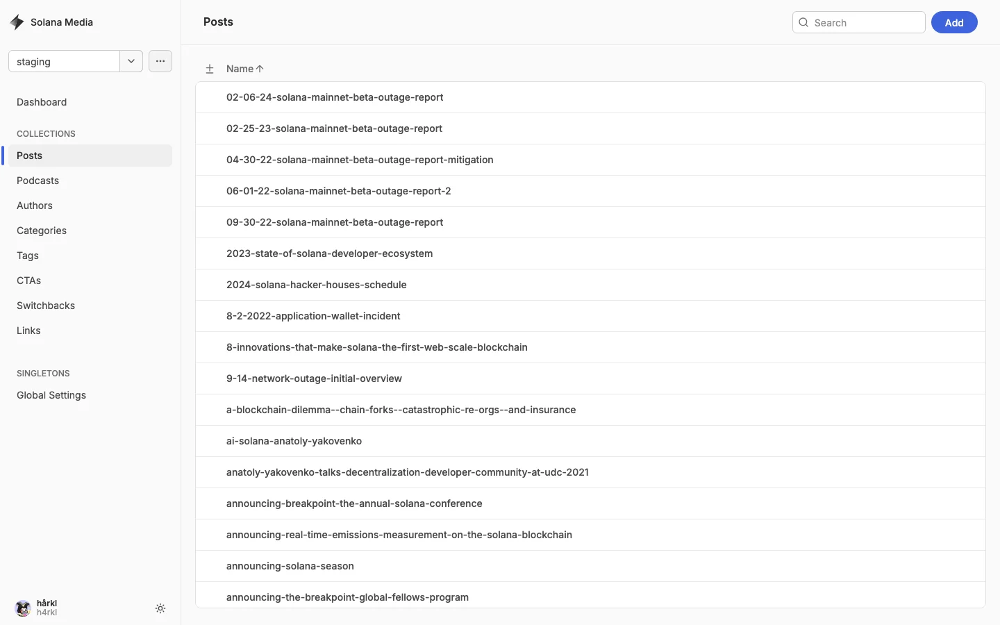

### Step 3: Start a New Post

Click **Add** to open the new post form.

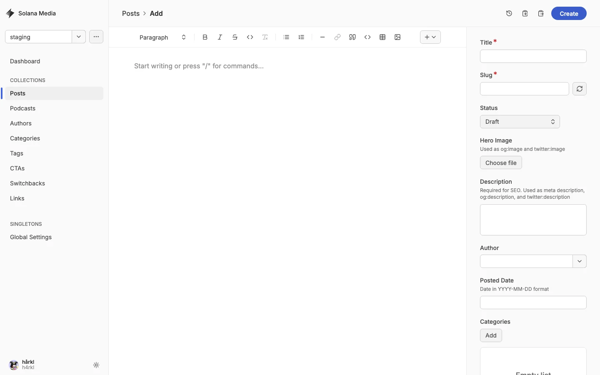

The form includes:

| Field            | Description                                        |
| ---------------- | -------------------------------------------------- |
| **Title**        | Internal and public title of the post              |
| **Slug**         | URL path for the post                              |
| **Status**       | Usually **Draft** while the article is in progress |
| **Hero Image**   | Main article image for listing and social sharing  |
| **Description**  | SEO/social summary                                 |
| **Author**       | Author relationship field                          |
| **Publish Date** | Exact publication date and time in UTC             |
| **Categories**   | One or more categories                             |
| **Body**         | Main article content editor                        |
| **CTA**          | Optional call-to-action block                      |
| **Switchback**   | Optional switchback block                          |

#### Body Editor

The main editor supports rich text and MDX-style structured content. Use the
toolbar to add headings, lists, quotes, links, embeds, and other supported
blocks.

For mathematical notation, insert **Inline formula (LaTeX)** inside a paragraph
or **Display formula (LaTeX)** for a centered equation on its own line. Enter
the TeX expression without `$` or `$$` delimiters. For example, enter `E = mc^2`
or `\frac{a}{b}` directly in the LaTeX field. The editor preview shows the
rendered formula before you save.

### Step 4: Save the Post as a Draft on Your Branch

When the article is still in progress:

1. Leave **Status** set to **Draft**.
2. Click **Create**.
3. Keystatic saves the new post to the selected **`staging-*`** branch.

This does **not** publish the article to the live site. After you open the Pull
Request, use its Vercel preview link to review the draft. Allow 1–2 minutes
after saving for the preview to update while Vercel rebuilds.

### Step 5: Mark the Post Ready for Publishing

When the article is approved and finalized:

1. Re-open the post from the Posts list.
2. Change **Status** from **Draft** to **Published**.
3. Set **Publish Date** to the exact date and time when the post should become
   visible in UTC.
4. Click **Save**.

This still saves only to your `staging-*` branch. The article is not live yet.

---

## Section 5: Opening a Pull Request to Publish

Publishing happens after the content is already saved on its dedicated branch.

1. Return to the dashboard.
2. Confirm the current branch is your **`staging-*`** content branch.
3. Click **Create pull request**.
4. In GitHub, open a Pull Request with:
   - **base:** `main`
   - **compare:** your `staging-*` branch
5. Review the diff, confirm it contains only the intended content change, and
   create the Pull Request.
6. Wait for the Vercel preview deployment to finish and verify the preview link
   from the Pull Request checks.
7. After review and approval, merge the Pull Request into `main`.

> **Important:** A post with **Status = Published** is still not live until the
> content branch is merged to `main`, and it remains hidden until the **Publish
> Date** timestamp has passed.
>
> Example: if you want a post to go live at `6:00 PM` in Auckland on March 20,
> 2026, enter the equivalent UTC time, not `2026-03-20 18:00`.

---

## Section 6: Managing Links

Links are curated external items shown on the site. Open **Links** in the
sidebar to browse existing entries.

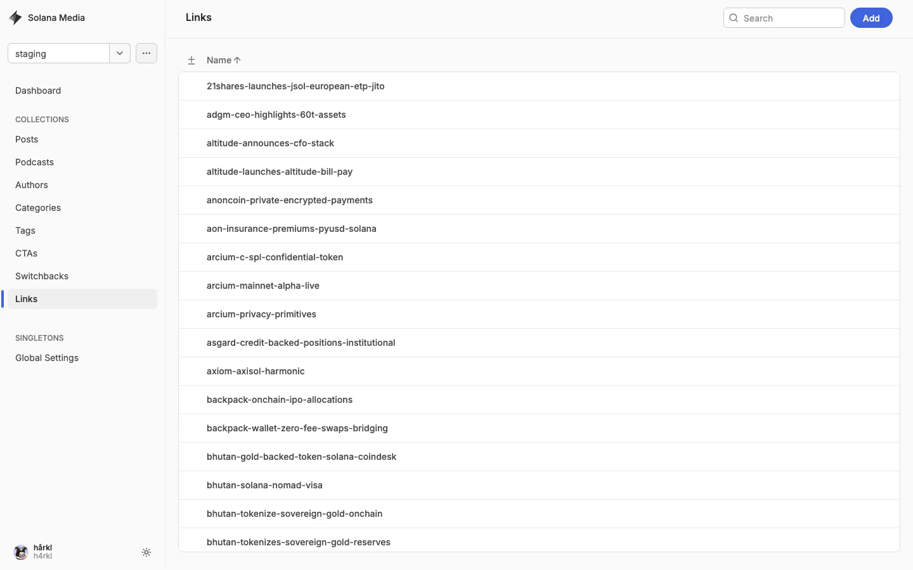

Click **Add** to create a new link.

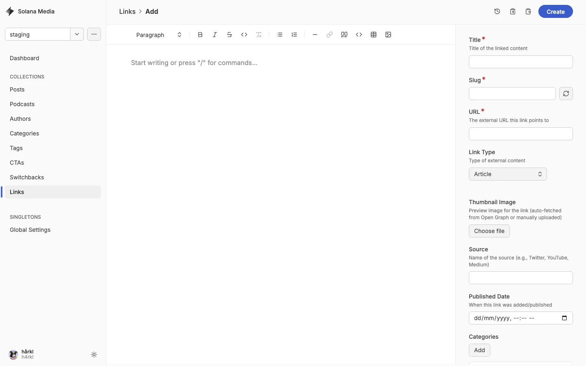

| Field           | Description                                             |
| --------------- | ------------------------------------------------------- |
| **Title**       | Display title for the link                              |
| **URL**         | External destination                                    |
| **Link Type**   | Article, Tweet/X Post, Video, Podcast, GitHub, or Other |
| **Description** | Summary text                                            |
| **Thumbnail**   | Preview image                                           |
| **Source**      | Publisher or platform name                              |
| **Published**   | Date field                                              |
| **Categories**  | Related categories                                      |
| **Tags**        | Related tags                                            |
| **Featured**    | Whether the link should be featured                     |

Save link changes on a dedicated `staging-*` branch, then publish them through
the same Pull Request flow described above.

---

## Section 7: Managing CTAs

CTAs are reusable call-to-action blocks that can be attached to posts.

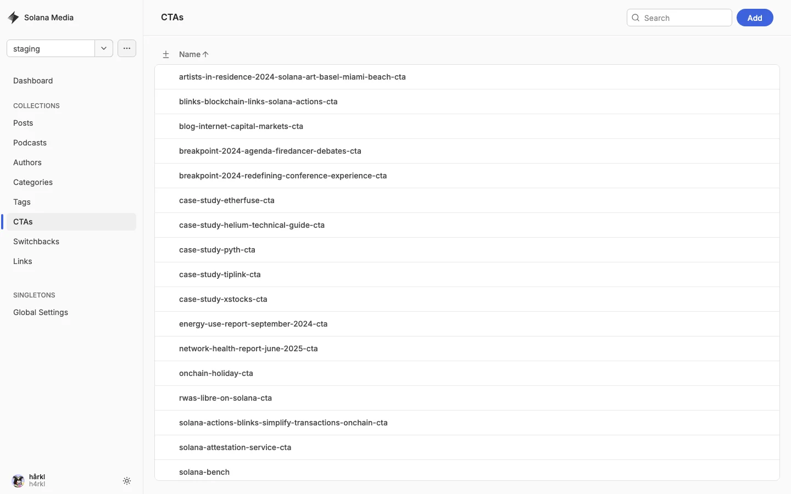

Click **Add** to create a CTA.

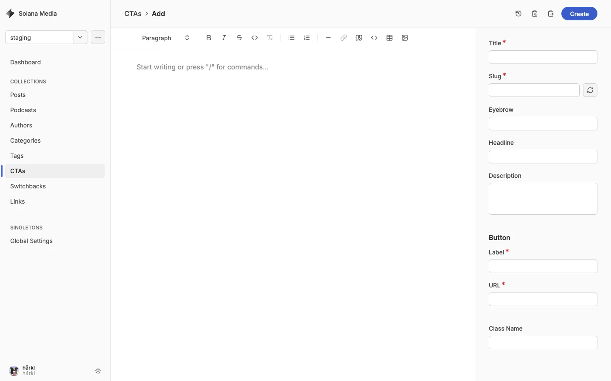

| Field           | Description                    |
| --------------- | ------------------------------ |
| **Title**       | Internal CTA name              |
| **Eyebrow**     | Small label above the headline |
| **Headline**    | Main CTA heading               |
| **Description** | Supporting copy                |
| **Button**      | Label and URL                  |
| **Body**        | Optional rich text content     |

---

## Section 8: Managing Switchbacks

Switchbacks are reusable image-and-text sections.

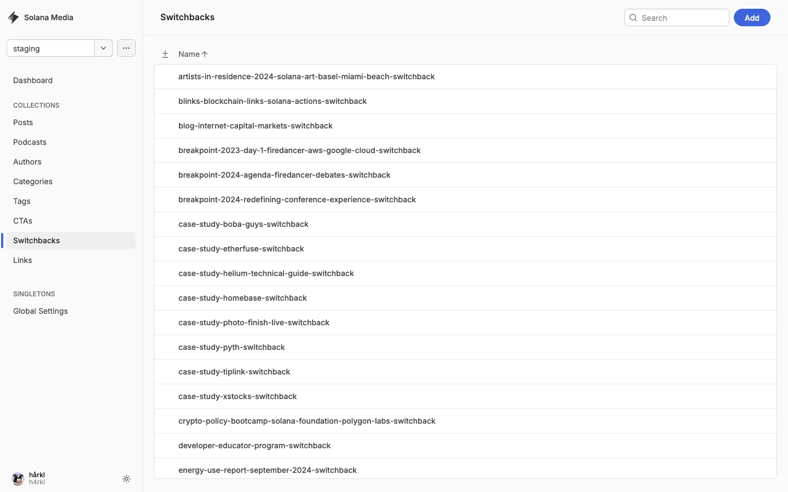

Click **Add** to create a switchback.

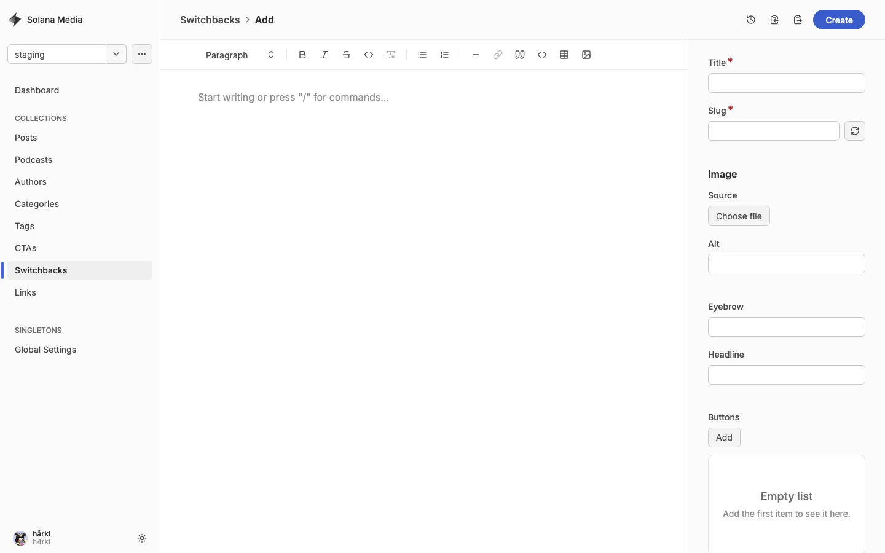

| Field        | Description               |
| ------------ | ------------------------- |
| **Title**    | Internal name             |
| **Image**    | Image upload and alt text |
| **Eyebrow**  | Supporting label          |
| **Headline** | Main heading              |
| **Body**     | Rich text content         |
| **Buttons**  | One or more CTA buttons   |

### Reports in Switchbacks

Reports are managed through the **Switchbacks** collection.

When a switchback is used as a report:

| Field                          | Description                                              |
| ------------------------------ | -------------------------------------------------------- |
| **Use As Report**              | Marks the switchback as a report                         |
| **Report Status**              | Set to **Published** when the report is approved         |
| **Publish Date**               | Exact date and time in UTC when the report should appear |
| **Report Description**         | Summary used for previews and SEO                        |
| **PDF URL / HubSpot Form CTA** | Download or lead-gen action                              |

To schedule a report:

1. Open the switchback entry for the report.
2. Enable **Use As Report** if needed.
3. Set **Report Status** to **Published**.
4. Set **Publish Date** to the exact release date and time in UTC.
5. Save on a dedicated `staging-*` branch and publish through the normal Pull
   Request flow.

---

## Section 9: Managing Categories

Categories are broad topic groupings for posts and links.

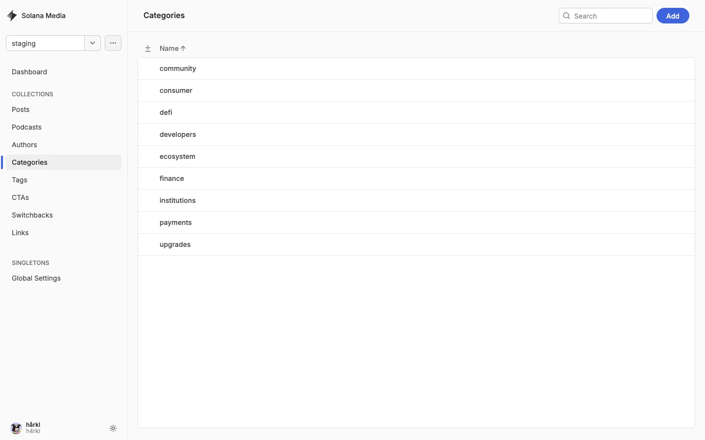

Click **Add** to create a category.

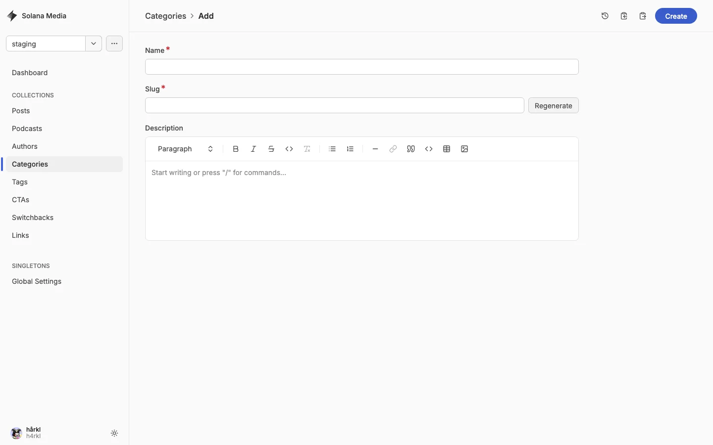

| Field           | Description               |
| --------------- | ------------------------- |
| **Name**        | Category name             |
| **Description** | Optional category summary |

---

## Section 10: Managing Tags

Tags provide more specific labels for posts and links.

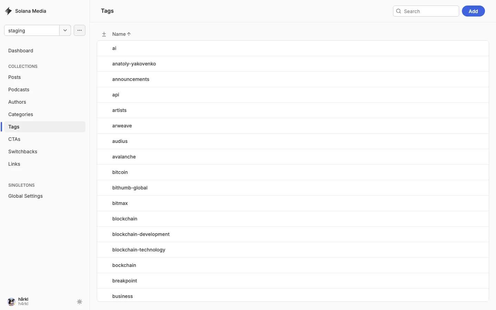

Click **Add** to create a tag.

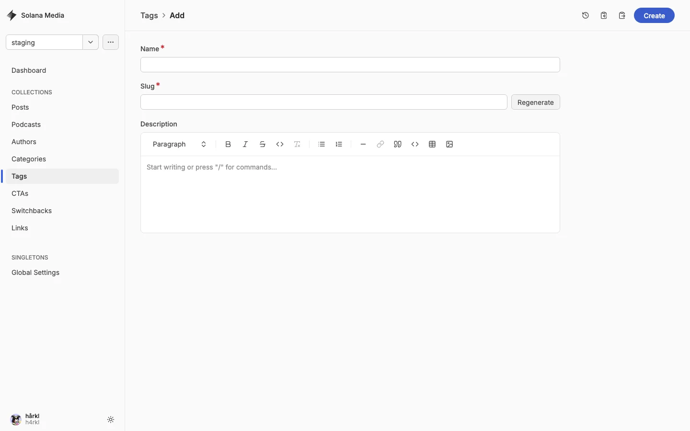

| Field           | Description          |
| --------------- | -------------------- |
| **Name**        | Tag name             |
| **Description** | Optional tag summary |

---

## Section 11: Global Settings

Global Settings controls site-wide theme options.

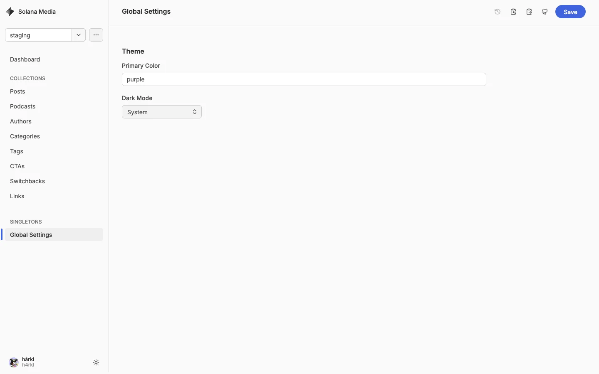

| Field             | Description          |
| ----------------- | -------------------- |
| **Primary Color** | Brand accent color   |
| **Dark Mode**     | Theme mode selection |

---

## Section 12: Quick Reference

| Task                     | Branch                                       | Final step                               |
| ------------------------ | -------------------------------------------- | ---------------------------------------- |
| Start a new draft        | New `staging-*` branch based on `main`       | Click **Create**                         |
| Update an existing draft | That content change's `staging-*` branch     | Click **Save**                           |
| Mark a post ready        | That content change's `staging-*` branch     | Set **Status** to **Published** and save |
| Publish to the live site | Pull Request from the content branch to main | Merge the PR                             |

### Remember

- Start from **`main`**, then create a fresh **`staging-*`** branch.
- Keep one article or related content batch per branch.
- **Published** status alone does not make content live.
- A **Pull Request from the content branch to `main`** is what publishes the
  content.
