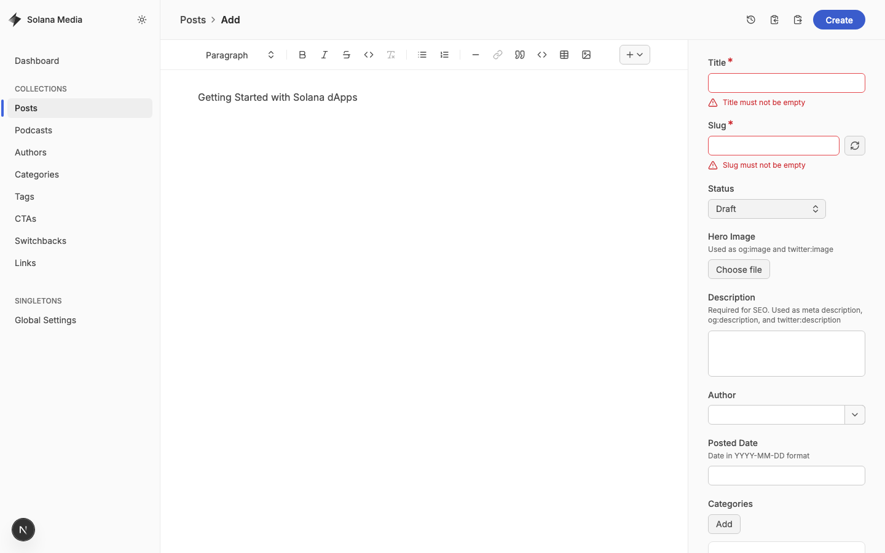

# Keystatic CMS Walkthrough for Content Writers

> A step-by-step guide for creating and publishing content on the Solana blog
> using Keystatic — from setting up your GitHub account to going live.

---

## Section 1: Prerequisites — Creating a GitHub Account

Keystatic uses GitHub for authentication and version control. You will need a
GitHub account with access to the Solana repository.

1. Go to [github.com](https://github.com) and click **Sign up**.
2. Enter your email address, create a password, and choose a username.
3. Verify your email address by clicking the link GitHub sends you.
4. Ask your team admin to invite you to the **solana-foundation/solana-com**
   repository. You will receive an email invitation — click **Accept**.

> **Note:** You do not need to know how to use Git. Keystatic handles all Git
> operations automatically behind the scenes.

---

## Section 2: Understanding the Workflow

Content moves through two stages:

| Stage          | Branch      | Visibility                                         |
| -------------- | ----------- | -------------------------------------------------- |
| **Staging**    | `staging/*` | Preview/staging environment only                   |
| **Production** | `main`      | Live on [solana.com/news](https://solana.com/news) |

- When you save content in Keystatic, it is saved to a **staging branch**. Your
  changes are safe but not yet visible to the public.
- When a staging branch is **merged to `main`** (done by an admin or developer),
  the content goes live.
- Keystatic creates Git commits automatically — **you never need to use Git
  directly**.

---

## Section 3: Accessing the CMS

### Production (Recommended)

1. Navigate to
   [https://solana-com-media.vercel.app/keystatic](https://solana-com-media.vercel.app/keystatic).
2. Click **Sign in with GitHub**.
3. Authorize the Keystatic GitHub App when prompted.
4. You will be asked to **create or select a branch**. Choose an existing
   `staging/*` branch or create a new one — this is where your changes are
   saved until an admin merges them to production.

> **Production note:** In production, the top of the Keystatic UI shows a
> **branch selector** bar. You will always be working on a `staging/*` branch.
> This branch selector does not appear in the screenshots below (which were
> captured in local development mode), but the forms and fields are identical.

### Local Development

1. Run the media app locally:
   `NEXT_PUBLIC_KEYSTATIC_LOCAL=true pnpm dev --filter solana-com-media`
2. Open [127.0.0.1:3002/keystatic](http://127.0.0.1:3002/keystatic) — no sign-in
   required in local mode.

> **Note:** In local mode there is no GitHub sign-in screen and no branch
> selector. Changes are written directly to your filesystem.

### Dashboard

After signing in (production) or opening the URL (local), you will see the
Keystatic dashboard. The sidebar on the left lists every collection and
singleton you can manage: Posts, Podcasts, Authors, Categories, Tags, CTAs,
Switchbacks, Links, and Global Settings.

---

## Section 4: Creating a Blog Post

This is the most common workflow. Follow these steps to create a new blog post.

### Step 1 — Navigate to Posts

Click **Posts** in the sidebar to see all existing posts. You can search by name
using the search bar at the top.

### Step 2 — Create a New Post

Click the **Add** button to open the post creation form.

The form contains the following fields (scroll down to see all of them):

| Field           | Description                                                                 |
| --------------- | --------------------------------------------------------------------------- |
| **Title**       | The post title. Keystatic auto-generates a URL-friendly slug from this.     |
| **Status**      | **Draft** (work in progress) or **Published** (ready for production).       |
| **Hero Image**  | Upload an image used as the post thumbnail and for social sharing cards.    |
| **Description** | A short summary for SEO — used as meta description and social preview text. |
| **Author**      | Select the post author from the dropdown.                                   |
| **Posted Date** | Publish date in `YYYY-MM-DD` format (e.g., `2026-03-13`).                   |
| **Categories**  | Click **+** to add one or more categories from the Categories collection.   |
| **Tags**        | Click **+** to add one or more tags from the Tags collection.               |
| **Body**        | The MDX editor for the post content (see below).                            |
| **CTA**         | Optionally attach a Call to Action block (from the CTAs collection).        |
| **Switchback**  | Optionally attach a Switchback section (from the Switchbacks collection).   |

#### Body Editor

The body editor supports rich text: **bold**, _italic_, links, headings, lists,
code blocks, and blockquotes. Use the insert button in the toolbar to add
content blocks:

- **Blockquote** — Styled pull quotes
- **Video** — Embedded video players
- **Gallery** — Image galleries
- **Stats** — Statistic displays
- **Tweet** — Embedded tweets/X posts

### Step 3 — Save

Click the **Create** button at the bottom to save the post. You will see a
confirmation once the post is saved.

> **Production note:** In production, clicking Create saves your post as a Git
> commit on your current `staging/*` branch. You will see the branch name in
> the header bar. In local mode the save writes directly to the filesystem.

### Step 4 — Publish

When the post is ready to go live:

1. Open the post from the Posts list.
2. Change the **Status** from "Draft" to **Published**.
3. Click **Save**.
4. From the Keystatic dashboard, click **Create pull request** to open a GitHub
   Pull Request from your `staging/*` branch to `main`.

> Changing the status to "Published" does **not** make the post live
> immediately. It flags the post as ready on your staging branch. The post only
> goes live after an admin merges the branch to `main` (see Section 11).

---

## Section 5: Managing Links

Links are curated external content (articles, tweets, videos, etc.) displayed on
the site. Click **Links** in the sidebar to see existing links.

Click **Add** to create a new link.

| Field           | Description                                             |
| --------------- | ------------------------------------------------------- |
| **Title**       | Title of the linked content                             |
| **URL**         | The external URL                                        |
| **Link Type**   | Article, Tweet/X Post, Video, Podcast, GitHub, or Other |
| **Description** | Brief description or excerpt                            |
| **Thumbnail**   | Preview image (upload or auto-fetched from Open Graph)  |
| **Source**      | Name of the source (e.g., "Twitter", "YouTube")         |
| **Published**   | Date the link was added                                 |
| **Categories**  | Assign relevant categories                              |
| **Tags**        | Assign relevant tags                                    |
| **Featured**    | Check to display in the featured section                |

---

## Section 6: Managing CTAs

CTAs (Calls to Action) are reusable promotional blocks that can be attached to
blog posts. Click **CTAs** in the sidebar.

Click **Add** to create a new CTA.

| Field           | Description                       |
| --------------- | --------------------------------- |
| **Title**       | Internal name for the CTA         |
| **Eyebrow**     | Small text above the headline     |
| **Headline**    | Main heading                      |
| **Description** | Supporting text                   |
| **Button**      | Label + URL for the action button |
| **Body**        | Optional additional rich content  |

---

## Section 7: Managing Switchbacks

Switchbacks are alternating content sections (image + text) that can be attached
to blog posts. Click **Switchbacks** in the sidebar.

Click **Add** to create a new switchback.

| Field        | Description                    |
| ------------ | ------------------------------ |
| **Title**    | Internal name                  |
| **Image**    | Source image + alt text        |
| **Eyebrow**  | Small text above the headline  |
| **Headline** | Main heading                   |
| **Body**     | Rich text content              |
| **Buttons**  | Array of buttons (label + URL) |

---

## Section 8: Managing Categories

Categories provide broad groupings for posts and links. Click **Categories** in
the sidebar.

Click **Add** to create a new category.

| Field           | Description                           |
| --------------- | ------------------------------------- |
| **Name**        | Category name (auto-generates a slug) |
| **Description** | Optional description of the category  |

---

## Section 9: Managing Tags

Tags provide fine-grained labels for posts and links. Click **Tags** in the
sidebar.

Click **Add** to create a new tag.

| Field           | Description                      |
| --------------- | -------------------------------- |
| **Name**        | Tag name (auto-generates a slug) |
| **Description** | Optional description of the tag  |

---

## Section 10: Global Settings

Global settings control site-wide appearance options. Click **Global Settings**
in the sidebar.

| Field           | Description                   |
| --------------- | ----------------------------- |
| **Theme Color** | Primary color for the site    |
| **Dark Mode**   | System (auto), Light, or Dark |

---

## Section 11: Publishing Workflow Summary

> **Note on screenshots:** The screenshots in this guide were captured in
> **local development mode**, where Keystatic writes directly to the filesystem
> without GitHub authentication or branching. In **production**, the CMS
> interface is identical except for two additions:
>
> - A **"Sign in with GitHub"** screen when you first visit the CMS.
> - A **branch selector** bar at the top of every page showing your current
>   `staging/*` branch.
>
> All collection forms, fields, editors, and sidebar navigation look and behave
> the same in both modes.

| Action              | Where                         | Result                                              |
| ------------------- | ----------------------------- | --------------------------------------------------- |
| Save as Draft       | Keystatic UI                  | Content on `staging/*` branch, not visible publicly |
| Change to Published | Keystatic UI                  | Still on staging branch, flagged as ready           |
| Create PR to `main` | GitHub PR (done by admin/dev) | Content is ready for review and preview             |
| Merge to `main`     | GitHub PR (done by admin/dev) | Content goes live on solana.com/news                |

**How publishing works in production:**

1. You save your content on a `staging/*` branch in Keystatic.
2. From the Keystatic dashboard, click **Create pull request** to open a GitHub
   Pull Request from that `staging/*` branch to `main`.
3. Review the preview build at
   [solana-com-media-git-staging-solana-foundation.vercel.app](https://solana-com-media-git-staging-solana-foundation.vercel.app).
4. Wait around 2 minutes for the preview build to finish before checking the
   changes.
5. After approval, an admin reviews and merges the PR into `main`.
6. The site rebuilds and your content appears on the live site.

The PR should always be opened with **base** set to `main` and **compare** set
to your `staging/*` branch.

### Creating a Pull Request from Staging to Publish Articles

Use this flow when an article has been marked **Published** in Keystatic and is
ready to go live:

1. In the Keystatic dashboard, click **Create pull request**.
2. GitHub opens the PR screen. Confirm **base** is `main` and **compare** is
   the `staging/*` branch that contains the article changes.
3. Add the PR title and any description your team wants to include.
4. Confirm the PR diff includes the expected content updates.
5. Create the Pull Request.
6. Wait around 2 minutes for the Vercel preview build to become available.
7. Review the preview at
   [solana-com-media-git-staging-solana-foundation.vercel.app](https://solana-com-media-git-staging-solana-foundation.vercel.app).
8. Once the preview looks correct and approvals are in place, merge the PR into
   `main`.

### Tips

- **Preview before publishing:** Use
  [solana-com-media-git-staging-solana-foundation.vercel.app](https://solana-com-media-git-staging-solana-foundation.vercel.app)
  to review staging changes. New preview builds usually take around 2 minutes
  to become available.
- **Images:** Use high-quality images (at least 1200px wide for hero images).
  Keystatic stores them in the repository automatically.
- **Drafts are safe:** Saving a draft does not affect the live site. Take your
  time editing.
- **Need help?** Reach out to the development team if you encounter any issues
  with the CMS.
