# Keystatic CMS Walkthrough for Content Writers

> A production walkthrough for managing Solana Media content in Keystatic with
> GitHub authentication, staging drafts, and pull request based publishing.

---

## Section 1: Prerequisites

Keystatic uses GitHub for authentication and version control. Before you start,
make sure you have:

1. A GitHub account.
2. Access to the `solana-foundation/solana-com` repository.
3. Permission to work in Keystatic on the shared `staging` branch.

If you do not have repository access yet:

1. Go to [github.com](https://github.com) and create an account.
2. Verify your email address.
3. Ask your team admin to invite you to the
   `solana-foundation/solana-com` repository.
4. Accept the GitHub invitation before opening Keystatic.

> **Note:** You do not need to use Git directly. Keystatic creates the commits
> for you.

---

## Section 2: How Publishing Works

There are two separate stages in the workflow:

| Stage                  | Where the change lives                | What it means                               |
| ---------------------- | ------------------------------------- | ------------------------------------------- |
| **Drafting / editing** | `staging` branch                      | Safe working copy for content updates       |
| **Publishing**         | Pull Request from `staging` to `main` | Review and release process for live content |

The `staging` branch has its own preview deployment at
[https://solana-com-media-git-staging-solana-foundation.vercel.app/](https://solana-com-media-git-staging-solana-foundation.vercel.app/).
Use this link to verify how your content looks before opening a Pull Request.

> **Note:** After saving a change to `staging`, allow 1–2 minutes for the
> preview to update. Vercel needs to rebuild the site before new content
> appears.

Important rules:

- Always select the `staging` branch before you create or edit content.
- Saving in Keystatic writes a commit to `staging`, not to the live site.
- Setting a post to **Published** only marks it ready on `staging`.
- Content goes live only after a Pull Request from `staging` to `main` is
  reviewed and merged.

---

## Section 3: Accessing the CMS

1. Open
   [https://solana-com-media.vercel.app/keystatic](https://solana-com-media.vercel.app/keystatic).
2. Click **Log in with GitHub**.
3. Authorize the GitHub prompt if asked.
4. After Keystatic loads, use the branch selector in the left sidebar and
   confirm it is set to **`staging`** before doing any work.

### Dashboard

The dashboard shows all collections and singletons you can manage, plus the
current branch and the **Create pull request** action.

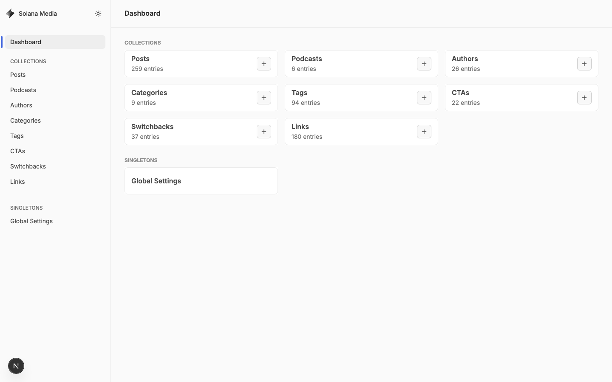

On the dashboard:

- The branch selector in the left sidebar should read `staging`.
- The **Create pull request** button is used later when content is ready to
  publish.
- The collection cards take you to Posts, Podcasts, Authors, Categories, Tags,
  CTAs, Switchbacks, and Links.

---

## Section 4: Creating a Blog Post

This is the most common workflow.

### Step 1: Confirm You Are on `staging`

Before editing anything, check the branch selector in the left sidebar. It
should show **`staging`**.

If it shows `main`, switch it to `staging` first. Drafts and edits should be
made on staging, not directly on `main`.

### Step 2: Open the Posts Collection

Click **Posts** in the sidebar to view the existing posts.

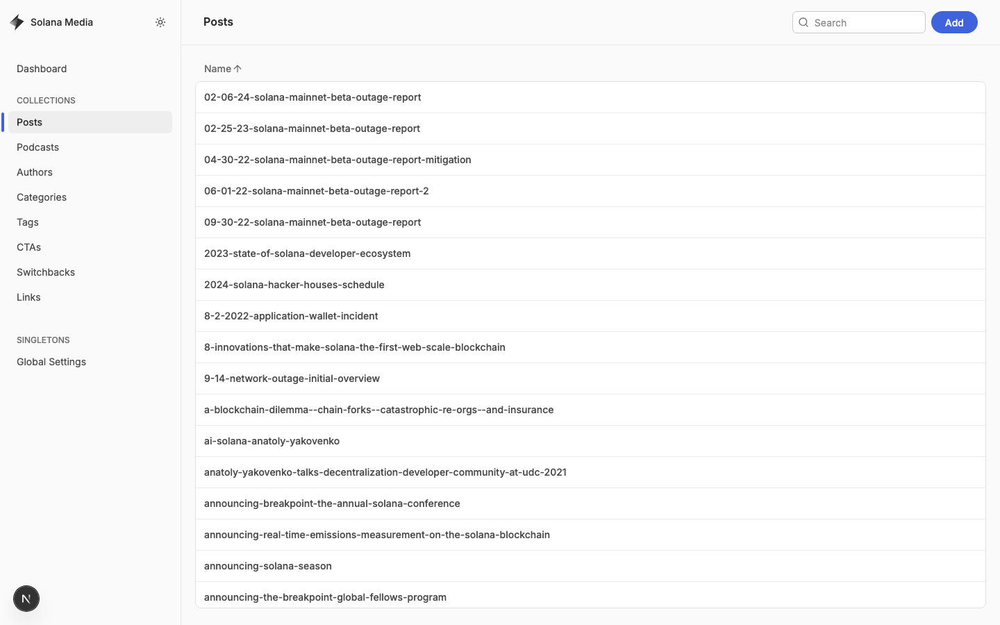

### Step 3: Start a New Post

Click **Add** to open the new post form.

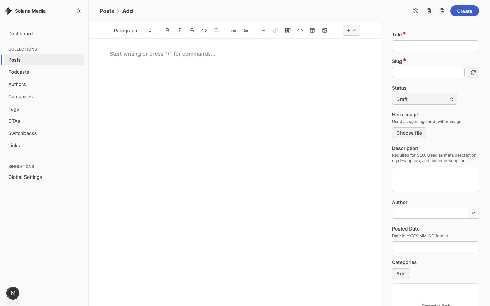

The form includes:

| Field           | Description                                        |
| --------------- | -------------------------------------------------- |
| **Title**       | Internal and public title of the post              |
| **Slug**        | URL path for the post                              |
| **Status**      | Usually **Draft** while the article is in progress |
| **Hero Image**  | Main article image for listing and social sharing  |
| **Description** | SEO/social summary                                 |
| **Author**      | Author relationship field                          |
| **Posted Date** | Publication date in `YYYY-MM-DD` format            |
| **Categories**  | One or more categories                             |
| **Body**        | Main article content editor                        |
| **CTA**         | Optional call-to-action block                      |
| **Switchback**  | Optional switchback block                          |

#### Body Editor

The main editor supports rich text and MDX-style structured content. Use the
toolbar to add headings, lists, quotes, links, embeds, and other supported
blocks.

### Step 4: Save the Post as a Draft on `staging`

When the article is still in progress:

1. Leave **Status** set to **Draft**.
2. Click **Create**.
3. Keystatic saves the new post to the current **`staging`** branch.

This does **not** publish the article to the live site. You can preview your
draft on the staging site at
[https://solana-com-media-git-staging-solana-foundation.vercel.app/](https://solana-com-media-git-staging-solana-foundation.vercel.app/).
Allow 1–2 minutes after saving for the preview to update while Vercel rebuilds.

### Step 5: Mark the Post Ready for Publishing

When the article is approved and finalized:

1. Re-open the post from the Posts list.
2. Change **Status** from **Draft** to **Published**.
3. Click **Save**.

This still saves only to `staging`. The article is not live yet.

---

## Section 5: Opening a Pull Request to Publish

Publishing happens after the content is already saved on `staging`.

1. Return to the dashboard.
2. Confirm the current branch is still **`staging`**.
3. Click **Create pull request**.
4. In GitHub, open a Pull Request with:
   - **base:** `main`
   - **compare:** `staging`
5. Review the diff and create the Pull Request.
6. Wait for the preview deployment to finish building. You can also verify
   content on the staging preview at
   [https://solana-com-media-git-staging-solana-foundation.vercel.app/](https://solana-com-media-git-staging-solana-foundation.vercel.app/)
   before merging.
7. After review and approval, merge the Pull Request into `main`.

> **Important:** A post with **Status = Published** is still not live until the
> `staging` to `main` Pull Request is merged.

---

## Section 6: Managing Links

Links are curated external items shown on the site. Open **Links** in the
sidebar to browse existing entries.

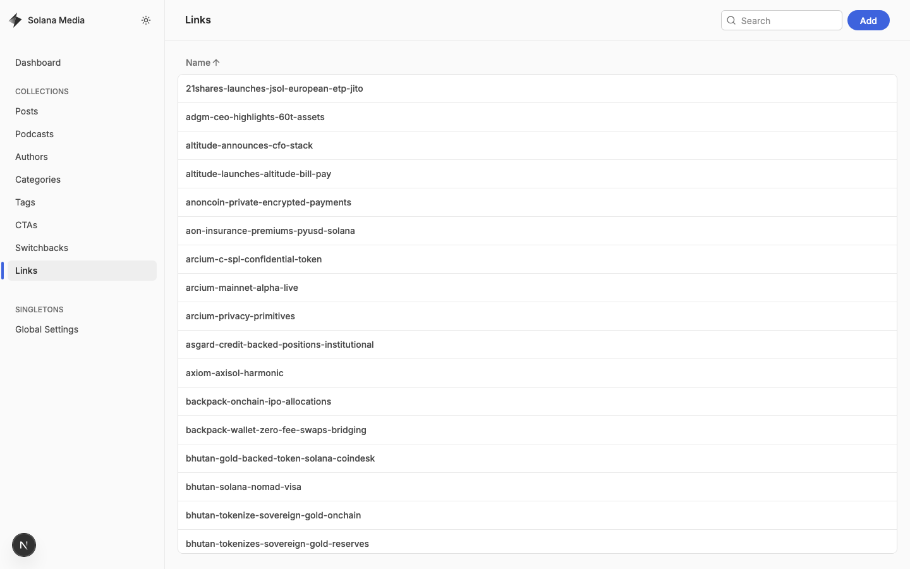

Click **Add** to create a new link.

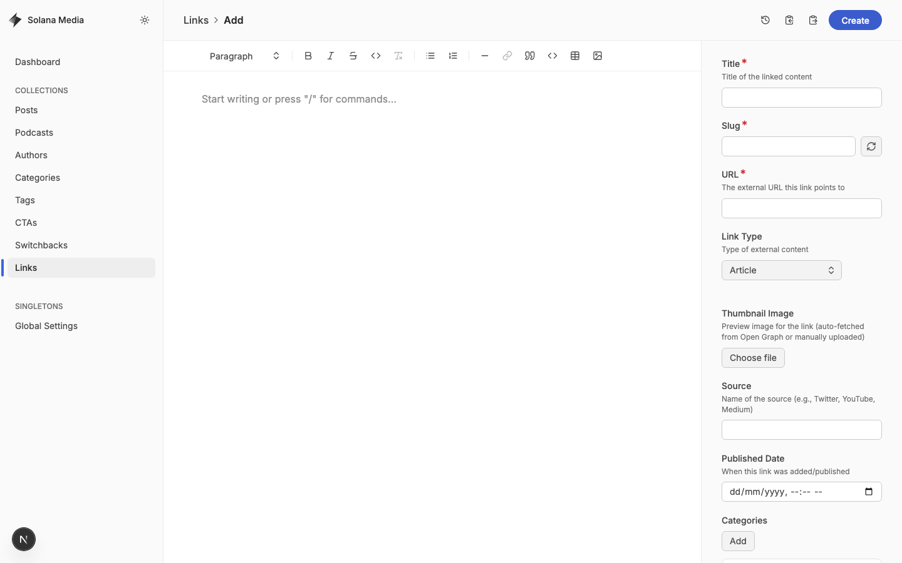

| Field           | Description                                             |
| --------------- | ------------------------------------------------------- |
| **Title**       | Display title for the link                              |
| **URL**         | External destination                                    |
| **Link Type**   | Article, Tweet/X Post, Video, Podcast, GitHub, or Other |
| **Description** | Summary text                                            |
| **Thumbnail**   | Preview image                                           |
| **Source**      | Publisher or platform name                              |
| **Published**   | Date field                                              |
| **Categories**  | Related categories                                      |
| **Tags**        | Related tags                                            |
| **Featured**    | Whether the link should be featured                     |

Save link changes on `staging`, then publish them through the same Pull Request
flow described above.

---

## Section 7: Managing CTAs

CTAs are reusable call-to-action blocks that can be attached to posts.

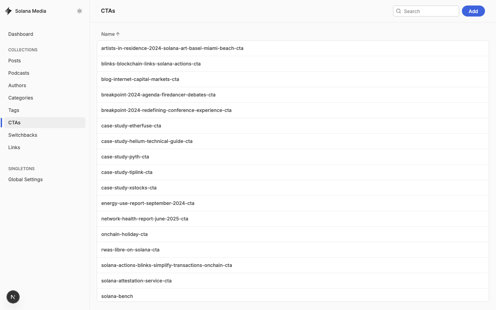

Click **Add** to create a CTA.

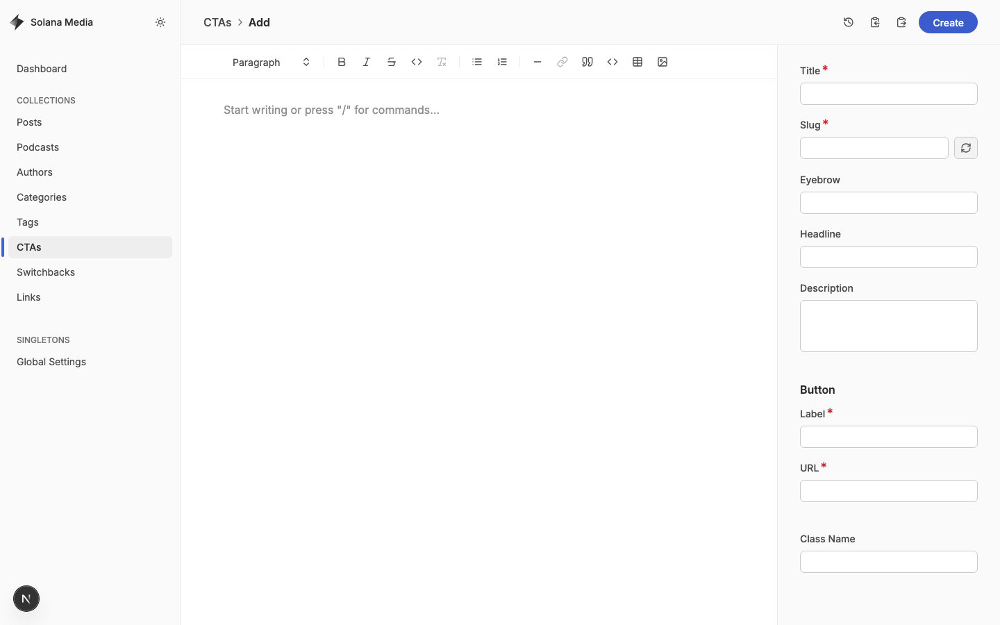

| Field           | Description                    |
| --------------- | ------------------------------ |
| **Title**       | Internal CTA name              |
| **Eyebrow**     | Small label above the headline |
| **Headline**    | Main CTA heading               |
| **Description** | Supporting copy                |
| **Button**      | Label and URL                  |
| **Body**        | Optional rich text content     |

---

## Section 8: Managing Switchbacks

Switchbacks are reusable image-and-text sections.

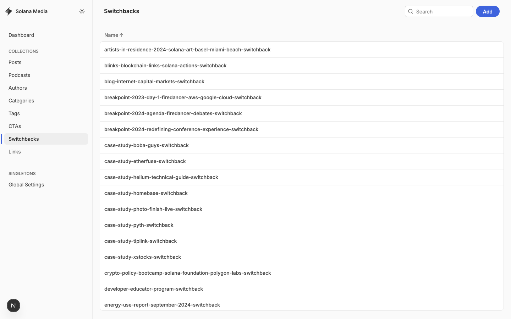

Click **Add** to create a switchback.

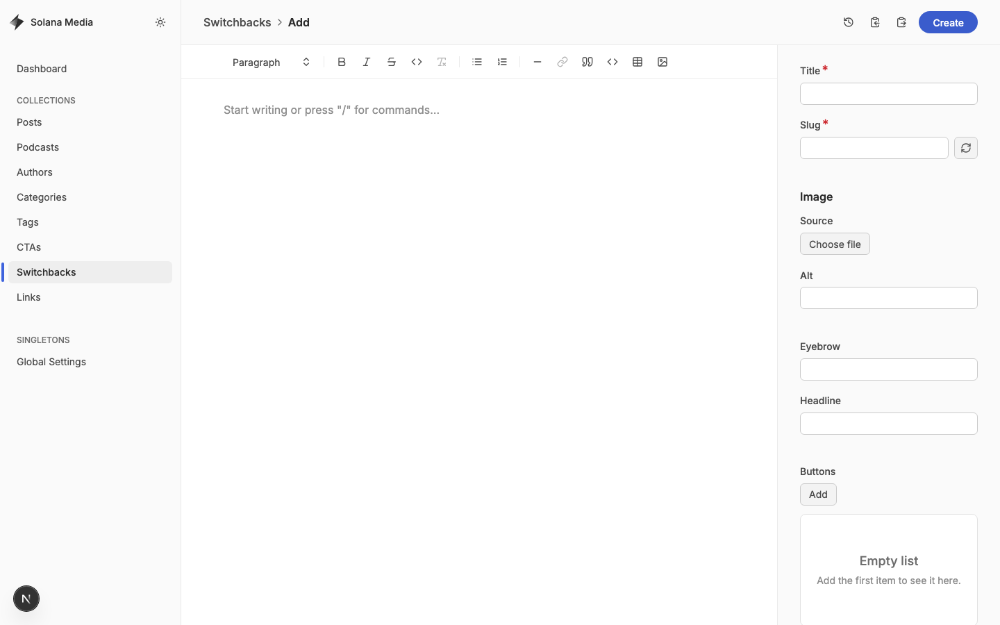

| Field        | Description               |
| ------------ | ------------------------- |
| **Title**    | Internal name             |
| **Image**    | Image upload and alt text |
| **Eyebrow**  | Supporting label          |
| **Headline** | Main heading              |
| **Body**     | Rich text content         |
| **Buttons**  | One or more CTA buttons   |

---

## Section 9: Managing Categories

Categories are broad topic groupings for posts and links.

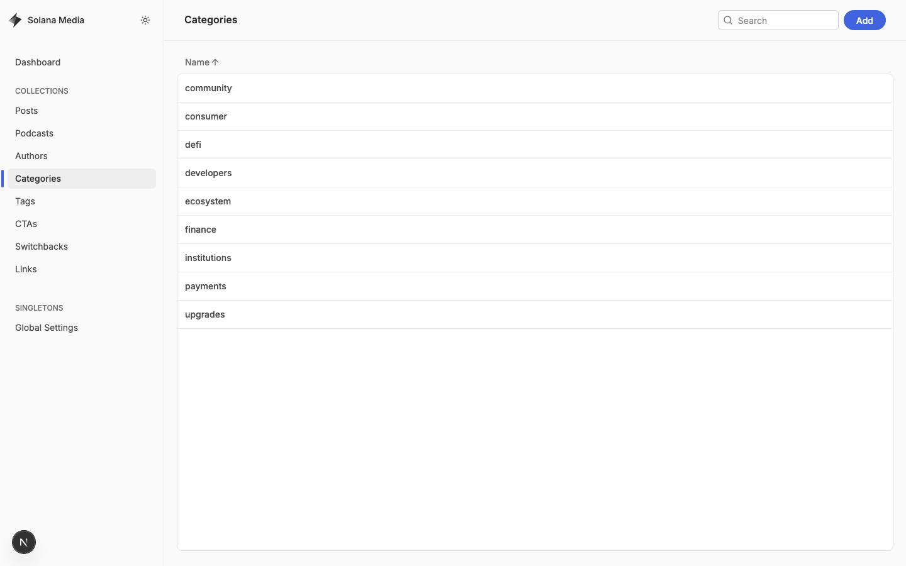

Click **Add** to create a category.

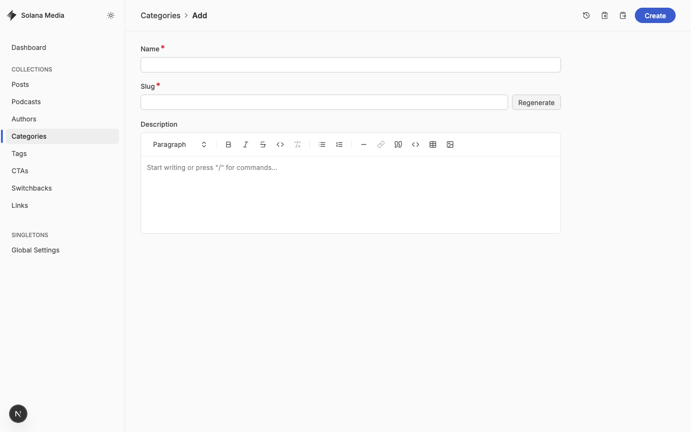

| Field           | Description               |
| --------------- | ------------------------- |
| **Name**        | Category name             |
| **Description** | Optional category summary |

---

## Section 10: Managing Tags

Tags provide more specific labels for posts and links.

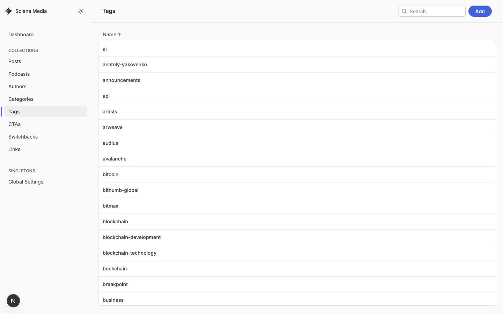

Click **Add** to create a tag.

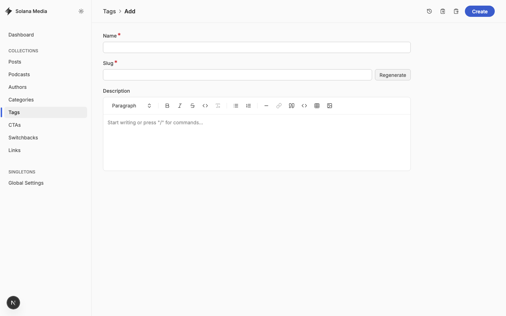

| Field           | Description          |
| --------------- | -------------------- |
| **Name**        | Tag name             |
| **Description** | Optional tag summary |

---

## Section 11: Global Settings

Global Settings controls site-wide theme options.

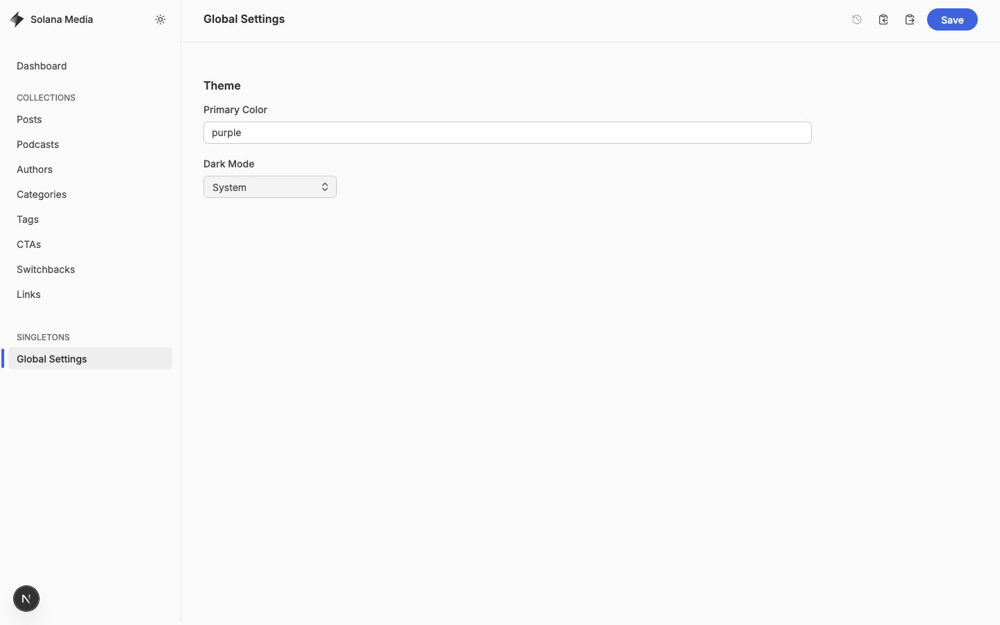

| Field             | Description          |
| ----------------- | -------------------- |
| **Primary Color** | Brand accent color   |
| **Dark Mode**     | Theme mode selection |

---

## Section 12: Quick Reference

| Task                     | Branch                                | Final step                               |
| ------------------------ | ------------------------------------- | ---------------------------------------- |
| Start a new draft        | `staging`                             | Click **Create**                         |
| Update an existing draft | `staging`                             | Click **Save**                           |
| Mark a post ready        | `staging`                             | Set **Status** to **Published** and save |
| Publish to the live site | Pull Request from `staging` to `main` | Merge the PR                             |

### Remember

- Work in **`staging`**.
- Drafts stay in **`staging`**.
- **Published** status alone does not make content live.
- A **Pull Request from `staging` to `main`** is what publishes the content.
