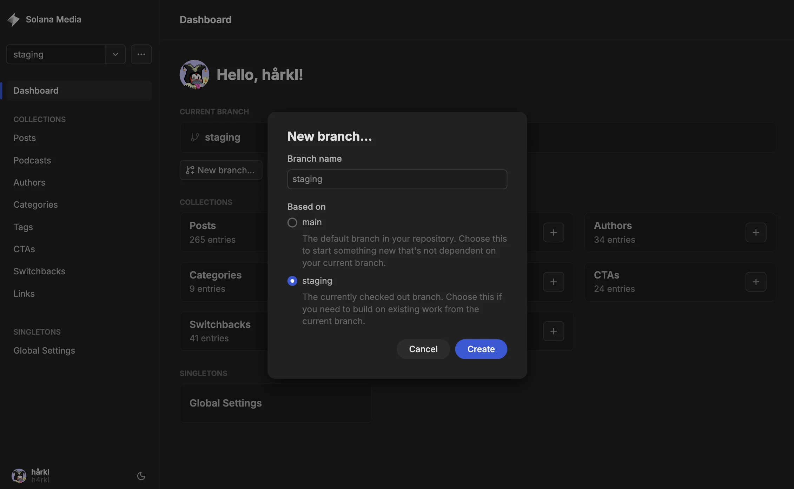
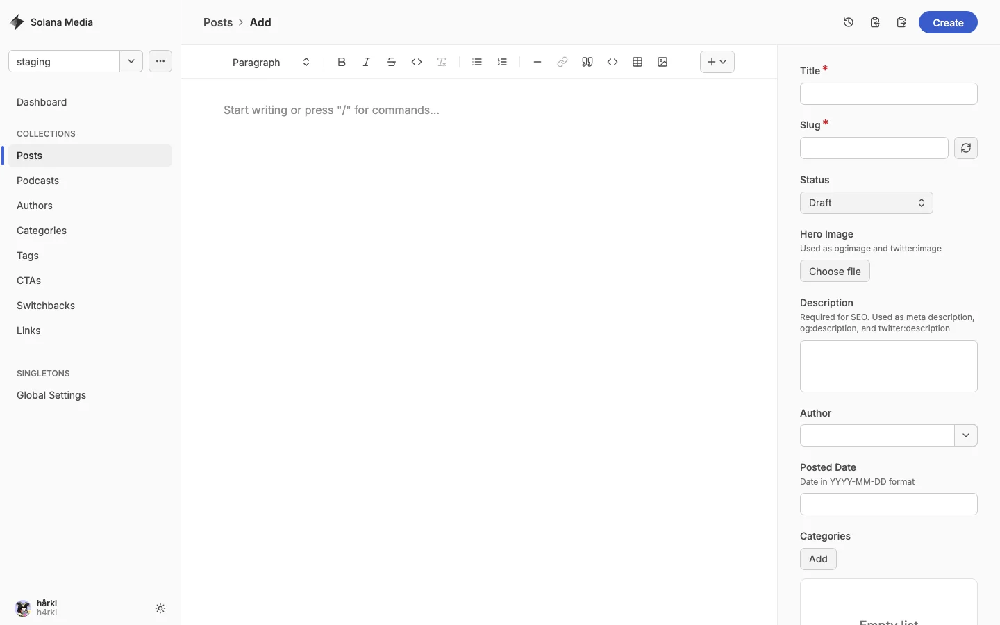
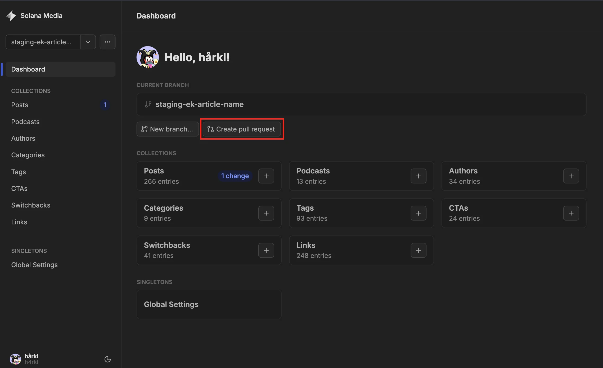

# Post Authoring Quickstart

Create, review, and publish a post in Keystatic.

1. Open [Keystatic](https://solana-com-media.vercel.app/keystatic) and sign in
   with GitHub.
2. From `main`, select **New branch...** and create a descriptive `staging-*`
   branch (for example, `staging-validator-update`).

3. Open **Posts** → **Add**. Enter the title, slug, description, hero image,
   author, category, publish date (UTC), and body.

4. Save it as **Draft** while writing. When approved, change its status to
   **Published** and save.
5. Select **Create pull request**, review the Vercel preview, then get the PR
   approved and squash-merge it into `main`.

The post becomes public after the production deploy completes and its publish
date has passed.

## Before You Merge

- Confirm the title, slug, metadata, image, and body are final.
- Confirm the UTC publish date and time are correct.
- Check the Vercel preview and the GitHub diff.
