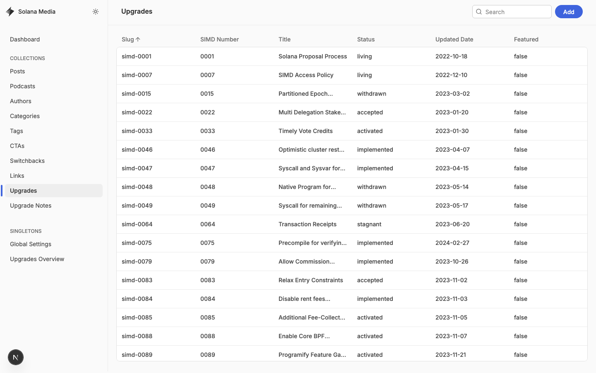
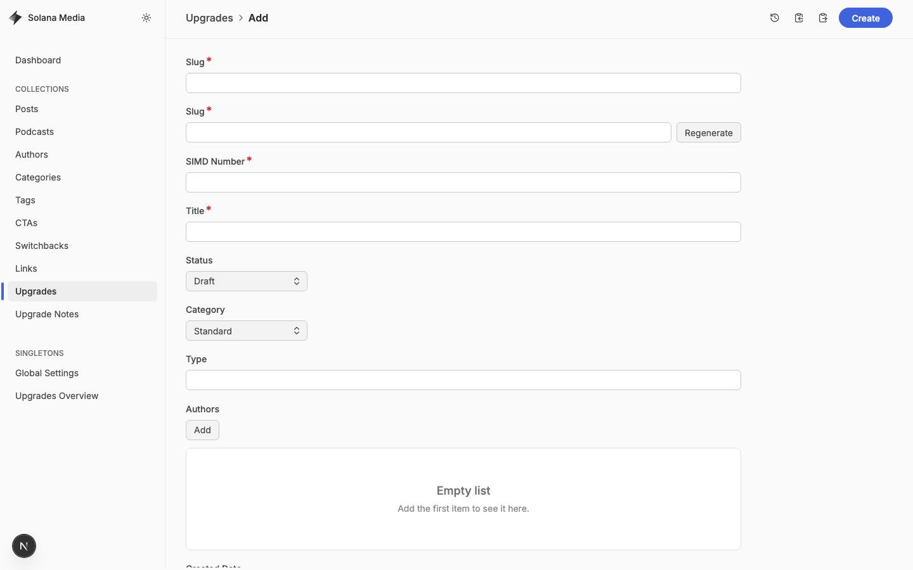
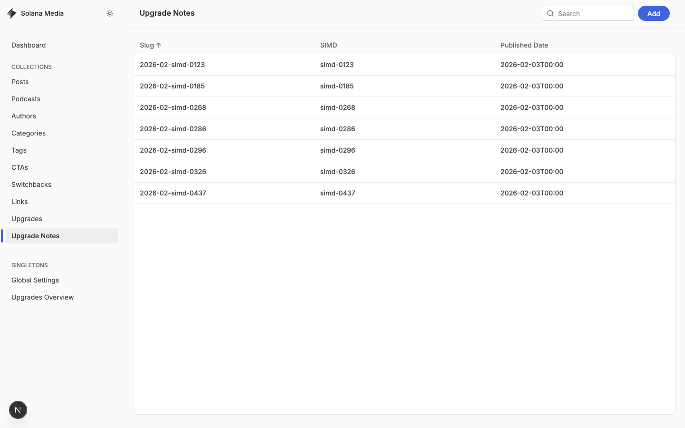
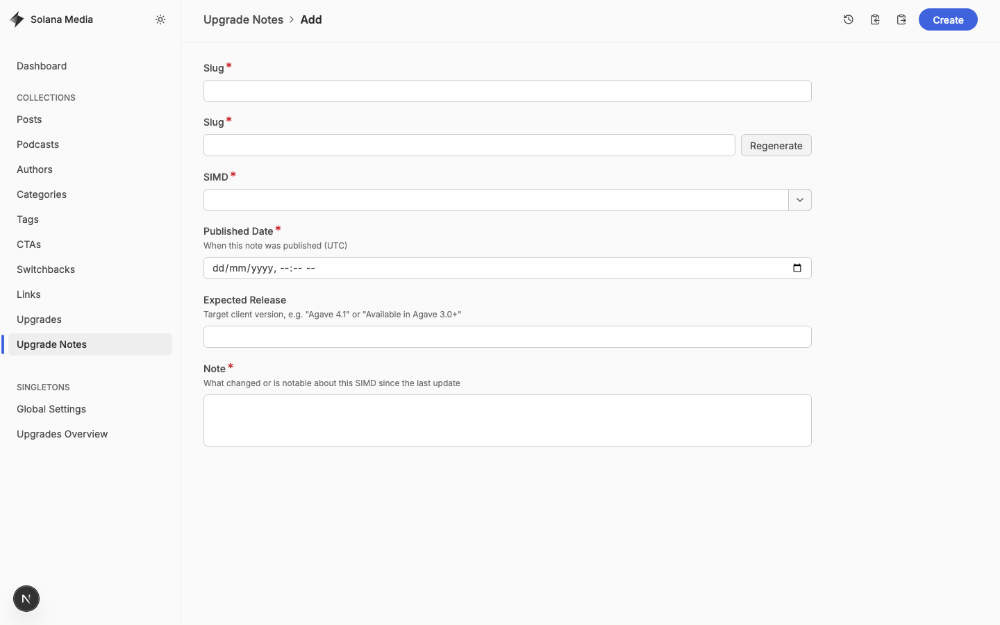
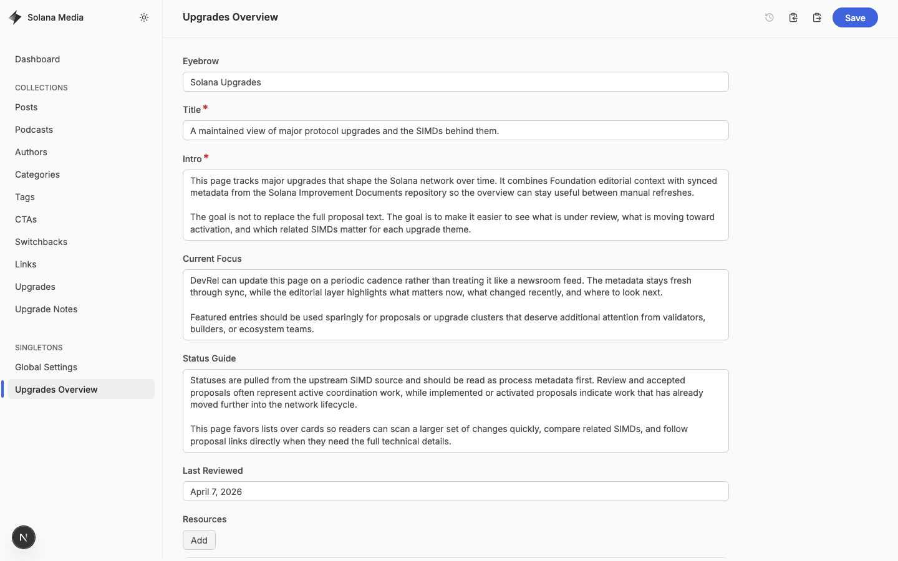

# Upgrades and Upgrade Notes Walkthrough

> Internal engineering walkthrough for the Solana Media upgrades system in
> [`app/[locale]/upgrades`](/Users/karambit/Sites/solana-com/apps/media/app/[locale]/upgrades),
> the Keystatic admin, and the GitHub-backed authoring flow.

## What This System Owns

The media app has two separate but connected content layers:

1. `content/upgrades/*.yaml` This is the canonical upgrade record for each SIMD.
   It stores the proposal metadata, status, summary, editorial description,
   related SIMDs, tags, and optional hero image.
2. `content/upgrade-notes/*.yaml` This is the timeline of short update notes
   attached to an upgrade. Each note points to one upgrade entry and adds a
   dated explanation of what changed.

Page-level overview copy for `/upgrades` is no longer stored in Keystatic. It
now lives in the media app i18n messages:

- English source:
  [`packages/i18n/messages/media/en/common.json`](/Users/karambit/Sites/solana-com/packages/i18n/messages/media/en/common.json)
- Namespace: `upgradeOverview`

The public UI reads both layers together:

- Upgrade list and detail page:
  [`app/[locale]/upgrades/upgrades-page-content.tsx`](/Users/karambit/Sites/solana-com/apps/media/app/[locale]/upgrades/upgrades-page-content.tsx)
- Note rendering in the detail panel:
  [`components/upgrades/simd-detail-panel.tsx`](/Users/karambit/Sites/solana-com/apps/media/components/upgrades/simd-detail-panel.tsx)
- Keystatic readers:
  [`lib/keystatic/upgrade-data.ts`](/Users/karambit/Sites/solana-com/apps/media/lib/keystatic/upgrade-data.ts)
  and
  [`lib/keystatic/upgrade-note-data.ts`](/Users/karambit/Sites/solana-com/apps/media/lib/keystatic/upgrade-note-data.ts)

## Source of Truth and Sync Model

There are two different sync directions in this system.

### 1. SIMDs sync in from GitHub

The `upgrades` collection is partially generated from the upstream SIMD repo:

- Script:
  [`scripts/sync-simds.ts`](/Users/karambit/Sites/solana-com/apps/media/scripts/sync-simds.ts)
- Command: `pnpm --filter solana-com-media sync:simds`
- Upstream repo: `solana-foundation/solana-improvement-documents`
- Upstream path: `proposals/*.md`

What the sync script does:

- fetches proposal frontmatter and markdown from GitHub
- derives `slug`, `simdNumber`, `title`, `status`, `category`, `type`,
  `createdDate`, `updatedDate`, `githubUrl`, `discussionUrl`, `summary`, and
  `relatedSimds`
- preserves local editorial fields already present in the YAML: `editorialNote`,
  `featured`, `tags`, and `heroImage`

What it does not do:

- it does not create `upgrade-notes`
- it does not write editorial `description`
- it does not decide release readiness or expected client version

The practical rule is:

- run the sync script to refresh proposal metadata
- use Keystatic or direct YAML edits to add editorial context
- use `upgrade-notes` for ongoing progress updates that are not present in the
  upstream SIMD repo

### 2. Keystatic syncs content back to the `solana-com` GitHub repo

Keystatic storage is configured in
[`keystatic.config.tsx`](/Users/karambit/Sites/solana-com/apps/media/keystatic.config.tsx).

Hosted mode on Vercel uses GitHub-backed storage:

- repo: `solana-foundation/solana-com`
- branch prefix: `staging`
- path prefix: `apps/media`

That means a save in hosted Keystatic writes content into this repo under
`apps/media/...`, not into the SIMD repo.

Local development is different:

- when `NEXT_PUBLIC_KEYSTATIC_LOCAL=true`, Keystatic writes directly to the
  local filesystem
- local mode is ideal for engineering edits, previews, and screenshots
- local mode does not open GitHub auth or create GitHub commits by itself

## Key Admin URLs

Hosted admin:

- `https://solana-com-media.vercel.app/keystatic/`

Local admin used for the screenshots in this doc:

- `http://localhost:3002/keystatic/`
- `http://localhost:3002/keystatic/collection/upgrades`
- `http://localhost:3002/keystatic/collection/upgrades/create`
- `http://localhost:3002/keystatic/collection/upgradeNotes`
- `http://localhost:3002/keystatic/collection/upgradeNotes/create`

Useful local commands:

- `NEXT_PUBLIC_KEYSTATIC_LOCAL=true pnpm --filter solana-com-media dev`
- `pnpm --filter solana-com-media sync:simds`

All screenshots below were captured with Playwright against local Keystatic on
April 9, 2026.

## Keystatic Screens

### Upgrades Collection

Use this screen to review the full list of imported SIMDs and open or create an
upgrade entry.



### Upgrade Create Form

This form defines the public upgrade record that appears on `/upgrades`.



### Upgrade Notes Collection

This screen holds the dated note timeline that appears in the detail panel under
`Update history`.



### Upgrade Note Create Form

This is the main authoring screen for new progress notes.



### Upgrades Overview Copy

This copy is now maintained in the media i18n catalog under the
`upgradeOverview` namespace instead of a Keystatic singleton. That includes the
page eyebrow, title, intro, status guide, last-reviewed label, and resource
links.



## Data Model You Need To Preserve

### Upgrade fields

The `upgrades` collection lives at `content/upgrades/*` and includes:

- `slug`
- `simdNumber`
- `title`
- `status`
- `category`
- `type`
- `authors`
- `createdDate`
- `updatedDate`
- `featureGate`
- `githubUrl`
- `discussionUrl`
- `summary`
- `relatedSimds`
- `sourceSha`
- `description`
- `editorialNote`
- `featured`
- `tags`
- `heroImage`

Field guidance:

- `summary` should stay close to the upstream SIMD summary
- `description` should explain why the upgrade matters to a broader audience
- `editorialNote` is optional context for internal curation or page pinning
- `featured` should be used sparingly; it changes ordering on the overview page
- `relatedSimds` should only include real proposal relationships, not loose
  thematic guesses

### Upgrade note fields

The `upgradeNotes` collection lives at `content/upgrade-notes/*` and includes:

- `slug`
- `upgrade`
- `publishedAt`
- `expectedRelease`
- `body`

Field guidance:

- `upgrade` must point to an existing `upgrades` slug such as `simd-0123`
- `publishedAt` is the note date, not necessarily the upstream proposal date
- `expectedRelease` should be a short, stable label such as `Agave 4.1`
- `body` should describe what changed since the last meaningful update

## Standard Workflow

### 1. Refresh the upgrade catalog

When the upstream SIMD repo changed, refresh the local catalog first:

```bash
pnpm --filter solana-com-media sync:simds
```

Review the resulting YAML changes in
[`content/upgrades`](/Users/karambit/Sites/solana-com/apps/media/content/upgrades).

Do this before writing notes so you are attaching notes to current metadata and
status values.

### 2. Confirm the upgrade entry is usable

Before creating a note, make sure the upgrade record has:

- the correct title and status from the upstream SIMD
- a valid `githubUrl`
- a useful `description` if the upgrade is likely to be viewed outside a narrow
  protocol audience
- only accurate related SIMDs

If the imported record is technically correct but not readable, improve the
editorial fields rather than rewriting synced source fields without reason.

### 3. Create the note

Open `Upgrade Notes` in Keystatic and create a new entry with:

- `slug`: use `YYYY-MM-simd-####`
- `upgrade`: select the matching upgrade entry
- `publishedAt`: use the note publication timestamp in UTC
- `expectedRelease`: only fill this in when there is a credible release target
- `body`: write one short paragraph focused on change since the last note

Example:

```yaml
slug: 2026-02-simd-0123
upgrade: simd-0123
publishedAt: 2026-02-03T00:00:00.000Z
expectedRelease: Agave 4.1
body: >-
  Block Revenue Distribution is under development. SIMD-123 enables validators
  to share block revenue with delegators automatically through the protocol.
```

Reference file:
[`content/upgrade-notes/2026-02-simd-0123.yaml`](/Users/karambit/Sites/solana-com/apps/media/content/upgrade-notes/2026-02-simd-0123.yaml)

### 4. Verify on the public page

Run the media app locally and verify:

- the upgrade appears where you expect on `/upgrades`
- the note appears in `Update history`
- `expectedRelease` displays as intended
- the note reads chronologically and does not duplicate the previous update

### 5. Commit or publish

For local engineering work:

- commit the YAML changes normally through Git

For hosted Keystatic:

- save through Keystatic on the active branch
- review the resulting GitHub diff in `solana-foundation/solana-com`
- open the PR through the normal staging workflow

## Best Practices for Upgrades

- Treat `upgrades` as the long-lived proposal record and `upgrade-notes` as the
  change log.
- Do not overload `description` with time-sensitive release notes. Put that in a
  dated note instead.
- Do not paraphrase the SIMD so aggressively that protocol meaning changes.
- Keep status values aligned with the upstream source unless there is a clear
  ingestion bug.
- Preserve `sourceSha` and `githubUrl`; they make the sync auditable.
- Add `featured` only when there is a clear editorial reason to pin the item.
- If a SIMD is withdrawn or stagnant, say so directly in the note rather than
  hiding the state behind vague language.
- Prefer one high-signal note over multiple tiny notes for the same milestone.

## Best Practices for Upgrade Notes

- Write notes as deltas: what changed since the last note, not a full
  restatement.
- Tie every claim to a source you can point to: SIMD diff, merged PR, release
  note, implementation status update, or meeting decision.
- Keep `body` to one paragraph unless the change is unusually complex.
- Name the release only when there is a concrete target; otherwise leave
  `expectedRelease` empty.
- Avoid speculative language like `soon`, `probably`, or `expected shortly`.
- Include activation, implementation, acceptance, or material scope change. Do
  not create notes for trivial wording edits.
- When a release target changes, create a new note rather than silently editing
  an old one if the change is historically meaningful.

## Recommended AI-Assisted Workflow

Use AI to draft notes, not to decide facts.

The best pattern here is:

1. sync the latest SIMD metadata
2. gather structured inputs for one SIMD
3. ask the model for a strictly factual draft note
4. review and edit the draft by hand
5. save the final YAML entry

### Good input set for a note draft

For each SIMD, provide the model with:

- current upgrade YAML
- previous upgrade note, if one exists
- latest upstream SIMD summary or relevant diff
- linked implementation PRs or release notes
- any known target release label

Do not ask the model to infer status or release targets from weak signals.

### Prompt pattern for a single note

```text
You are drafting one upgrade note for the Solana Media upgrades page.

Task:
- Write a factual update note for this SIMD.
- Focus only on what changed since the previous note.
- Keep the note to one paragraph.
- Preserve technical accuracy.
- Do not speculate.
- If the release target is not explicit in the source material, omit it.

Output JSON only with:
- slug
- upgrade
- publishedAt
- expectedRelease
- body

Rules:
- slug format must be YYYY-MM-simd-####.
- upgrade must be the existing upgrade slug.
- body must be plain text, no markdown bullets.
- body must not repeat background that already appears in the SIMD summary unless
  needed for clarity.

Inputs:
- current_upgrade_yaml: <paste YAML>
- previous_note_yaml: <paste YAML or NONE>
- upstream_summary: <paste text>
- upstream_diff_or_status_update: <paste text>
- implementation_sources: <paste release notes / PR summaries>
- published_at_utc: <timestamp>
- expected_release_if_confirmed: <value or NONE>
```

### Prompt pattern for batch generation

```text
You are generating draft upgrade notes for multiple SIMDs.

For each item:
- compare the current upgrade record to the previous note
- identify whether there is enough new information for a note
- if yes, produce one factual draft note
- if no, return skip_reason

Output an array of JSON objects with:
- upgrade
- should_create_note
- skip_reason
- draft_note

Rules:
- never invent release versions
- never upgrade a status unless the source explicitly supports it
- prefer skipping over weak or repetitive notes
- keep each draft_note.body to one paragraph
```

### Review checklist for AI output

- Is every sentence traceable to a source?
- Does the note describe a real change, not generic background?
- Is the release label confirmed?
- Does the wording match the current upstream status?
- Does the note duplicate the previous entry?
- Would an engineer reading the timeline learn something new?

## Programmatic Generation Pattern

If you automate note creation, keep the pipeline deterministic around the AI
step.

Recommended shape:

1. run `sync:simds`
2. enumerate candidate upgrades from `content/upgrades`
3. load the latest prior note per upgrade from `content/upgrade-notes`
4. gather external source text for each candidate milestone
5. call the model with strict JSON output
6. validate:
   - valid slug
   - existing upgrade slug
   - ISO timestamp
   - optional short `expectedRelease`
   - non-empty body
7. write YAML only after human approval

Do not let the model write directly to the repo without validation.

## Common Failure Modes

- `upgrade` points to a nonexistent slug
- note body repeats the SIMD summary instead of the new change
- `expectedRelease` is filled with an unconfirmed guess
- editors manually overwrite synced upstream fields and lose the next sync diff
- multiple notes get created for the same event with different wording
- a note is added before `sync:simds`, so it references stale status or title

## Files To Inspect Before Changing The System

- [`keystatic.config.tsx`](/Users/karambit/Sites/solana-com/apps/media/keystatic.config.tsx)
- [`scripts/sync-simds.ts`](/Users/karambit/Sites/solana-com/apps/media/scripts/sync-simds.ts)
- [`content/upgrades`](/Users/karambit/Sites/solana-com/apps/media/content/upgrades)
- [`content/upgrade-notes`](/Users/karambit/Sites/solana-com/apps/media/content/upgrade-notes)
- [`lib/keystatic/upgrade-data.ts`](/Users/karambit/Sites/solana-com/apps/media/lib/keystatic/upgrade-data.ts)
- [`lib/keystatic/upgrade-note-data.ts`](/Users/karambit/Sites/solana-com/apps/media/lib/keystatic/upgrade-note-data.ts)
- [`components/upgrades/simd-detail-panel.tsx`](/Users/karambit/Sites/solana-com/apps/media/components/upgrades/simd-detail-panel.tsx)
