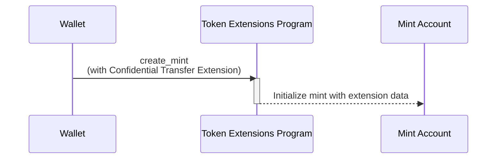

<Callout type="warn">
  Program ZK ElGamal sementara dinonaktifkan di mainnet dan devnet karena sedang
  menjalani audit keamanan. Ini berarti ekstensi transfer rahasia saat ini tidak
  tersedia. Meskipun konsepnya masih valid, contoh kode tidak akan berjalan.
</Callout>

## Cara membuat mint dengan ekstensi Confidential Transfer

Ekstensi Confidential Transfer memungkinkan transfer token secara privat dengan
menambahkan state tambahan ke akun mint. Bagian ini menjelaskan cara membuat
token mint dengan ekstensi ini diaktifkan.

Diagram berikut menunjukkan langkah-langkah yang terlibat dalam membuat mint
dengan ekstensi Confidential Transfer:



### State Confidential Transfer Mint

Ekstensi ini menambahkan
[ConfidentialTransferMint](https://github.com/solana-program/token-2022/blob/efd0c957fefbd79882d77df5fb2dac88c001249c/program/src/extension/confidential_transfer/mod.rs#L48-L69)
state ke akun mint:

```rust title="Confidential Mint State"
#[repr(C)]
#[derive(Clone, Copy, Debug, Default, PartialEq, Pod, Zeroable)]
pub struct ConfidentialTransferMint {
    /// Authority to modify the `ConfidentialTransferMint` configuration and to
    /// approve new accounts (if `auto_approve_new_accounts` is true)
    ///
    /// The legacy Token Multisig account is not supported as the authority
    pub authority: OptionalNonZeroPubkey,

    /// Indicate if newly configured accounts must be approved by the
    /// `authority` before they may be used by the user.
    ///
    /// * If `true`, no approval is required and new accounts may be used
    ///   immediately
    /// * If `false`, the authority must approve newly configured accounts (see
    ///   `ConfidentialTransferInstruction::ConfigureAccount`)
    pub auto_approve_new_accounts: PodBool,

    /// Authority to decode any transfer amount in a confidential transfer.
    pub auditor_elgamal_pubkey: OptionalNonZeroElGamalPubkey,
}
```

_rs`ConfidentialTransferMint`_ berisi tiga bidang konfigurasi:

- **authority**: Akun yang memiliki izin untuk mengubah pengaturan transfer
  rahasia untuk mint dan menyetujui akun rahasia baru jika persetujuan otomatis
  dinonaktifkan.

- **auto_approve_new_accounts**: Ketika diatur ke true, pengguna dapat membuat
  token account dengan transfer rahasia diaktifkan secara default. Ketika false,
  authority harus menyetujui setiap token account baru sebelum dapat digunakan
  untuk transfer rahasia.

- **auditor_elgamal_pubkey**: Auditor opsional yang dapat mendekripsi jumlah
  transfer dalam transaksi rahasia, menyediakan mekanisme kepatuhan sambil
  menjaga privasi dari publik umum.

### Instruksi yang Diperlukan

Membuat mint dengan Confidential Transfer diaktifkan memerlukan tiga instruksi
dalam satu transaksi:

1. **Membuat Akun Mint**: Memanggil instruksi _rs`CreateAccount`_ dari System
   Program untuk membuat akun mint.

2. **Menginisialisasi Ekstensi Confidential Transfer**: Memanggil instruksi
   [ConfidentialTransferInstruction::InitializeMint](https://github.com/solana-program/token-2022/blob/efd0c957fefbd79882d77df5fb2dac88c001249c/program/src/extension/confidential_transfer/processor.rs#L48)
   dari Token Extensions Program untuk mengkonfigurasi state
   _rs`ConfidentialTransferMint`_ untuk mint.

3. **Initialize Mint**: Panggil instruksi Token Extension Program
   _rs`Instruction::InitializeMint`_ untuk menginisialisasi keadaan mint
   standar.

Meskipun Anda dapat menulis instruksi-instruksi ini secara manual, crate
`spl_token_client` menyediakan metode `create_mint` yang membangun dan mengirim
transaksi dengan ketiga instruksi dalam satu panggilan fungsi, seperti yang
ditunjukkan dalam contoh di bawah ini.

### Contoh Kode

Kode berikut menunjukkan cara membuat mint dengan ekstensi Confidential
Transfer.

Untuk menjalankan contoh, mulai validator lokal dengan Token Extension Program
yang dikloning dari mainnet menggunakan perintah berikut. Anda harus memiliki
Solana CLI yang terinstal untuk memulai validator lokal.

```terminal
$ solana-test-validator --clone-upgradeable-program TokenzQdBNbLqP5VEhdkAS6EPFLC1PHnBqCXEpPxuEb --url https://api.mainnet.solana.com -r
```

<Callout type="info">
  Pada saat penulisan, Confidential Transfers belum diaktifkan pada validator
  lokal default. Anda harus mengkloning Token Extension Program dari mainnet
  untuk menjalankan kode contoh.
</Callout>

<CodeTabs>

```rust !! title="main.rs"
use anyhow::{Context, Result};
use solana_client::nonblocking::rpc_client::RpcClient;
use solana_sdk::{
    commitment_config::CommitmentConfig,
    signature::{Keypair, Signer},
};
use spl_token_client::{
    client::{ProgramRpcClient, ProgramRpcClientSendTransaction},
    spl_token_2022::id as token_2022_program_id,
    token::{ExtensionInitializationParams, Token},
};
use std::sync::Arc;

#[tokio::main]
async fn main() -> Result<()> {
    // Create connection to local test validator
    let rpc_client = RpcClient::new_with_commitment(
        String::from("http://localhost:8899"),
        CommitmentConfig::confirmed(),
    );

    // Load the default Solana CLI keypair to use as the fee payer
    // This will be the wallet paying for the transaction fees
    // Use Arc to prevent multiple clones of the keypair
    let payer = Arc::new(load_keypair()?);
    println!("Using payer: {}", payer.pubkey());

    // Generate a new keypair to use as the address of the token mint
    let mint = Keypair::new();
    println!("Mint keypair generated: {}", mint.pubkey());

    // Set up program client for Token client
    let program_client =
        ProgramRpcClient::new(Arc::new(rpc_client), ProgramRpcClientSendTransaction);

    // Number of decimals for the mint
    let decimals = 9;

    // Create a token client for the Token-2022 program
    // This provides high-level methods for token operations
    let token = Token::new(
        Arc::new(program_client),
        &token_2022_program_id(), // Use the Token-2022 program (newer version with extensions)
        &mint.pubkey(),           // Address of the new token mint
        Some(decimals),           // Number of decimal places
        payer.clone(),            // Fee payer for transactions (cloning Arc, not keypair)
    );

    // Create extension initialization parameters
    // The ConfidentialTransferMint extension enables confidential (private) transfers of tokens
    let extension_initialization_params =
        vec![ExtensionInitializationParams::ConfidentialTransferMint {
            authority: Some(payer.pubkey()), // Authority that can modify confidential transfer settings
            auto_approve_new_accounts: true, // Automatically approve new confidential accounts
            auditor_elgamal_pubkey: None,    // Optional auditor ElGamal public key
        }];

    // Create and initialize the mint with the ConfidentialTransferMint extension
    // This sends a transaction to create the new token mint
    let transaction_signature = token
        .create_mint(
            &payer.pubkey(),                 // Mint authority - can mint new tokens
            Some(&payer.pubkey()),           // Freeze authority - can freeze token accounts
            extension_initialization_params, // Add the ConfidentialTransferMint extension
            &[&mint],                        // Mint keypair needed as signer
        )
        .await?;

    // Print results for user verification
    println!("Mint Address: {}", mint.pubkey());
    println!("Transaction Signature: {}", transaction_signature);

    Ok(())
}

// Load the keypair from the default Solana CLI keypair path (~/.config/solana/id.json)
// This enables using the same wallet as the Solana CLI tools
fn load_keypair() -> Result<Keypair> {
    // Get the default keypair path
    let keypair_path = dirs::home_dir()
        .context("Could not find home directory")?
        .join(".config/solana/id.json");

    // Read the keypair file directly into bytes using serde_json
    // The keypair file is a JSON array of bytes
    let file = std::fs::File::open(&keypair_path)?;
    let keypair_bytes: Vec<u8> = serde_json::from_reader(file)?;

    // Create keypair from the loaded bytes
    // This converts the byte array into a keypair
    let keypair = Keypair::from_bytes(&keypair_bytes)?;

    Ok(keypair)
}
```

```toml !! title="Cargo.toml"
[package]
name = "confidential-transfer"
version = "0.1.0"
edition = "2021"

[dependencies]
[package]
name = "confidential-transfer"
version = "0.1.0"
edition = "2021"

[dependencies]
solana-client = "2.2.2"
solana-sdk = "2.2.2"
spl-associated-token-account = "6.0.0"
spl-token-client = "0.14.0"
spl-token-confidential-transfer-proof-extraction = "0.2.1"
spl-token-confidential-transfer-proof-generation = "0.3.0"

anyhow = "1.0.95"
dirs = "6.0.0"
serde_json = "1.0.135"
tokio = { version = "1.44.2", features = ["full"] }
```

</CodeTabs>
