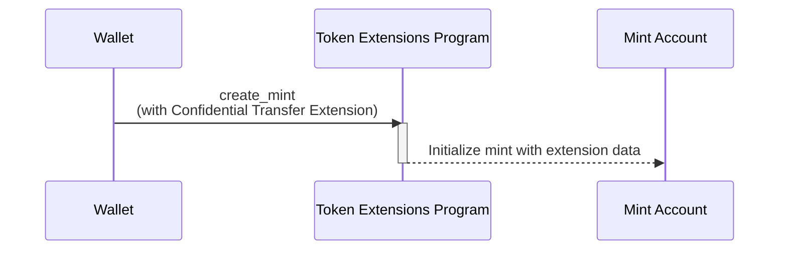

<Callout type="warn">
  ZK
  ElGamalプログラムはセキュリティ監査中のため、メインネットとdevnetで一時的に無効化されています。これにより、機密転送拡張機能は現在利用できません。概念自体は有効ですが、コード例は実行できません。
</Callout>

## 機密転送拡張機能を持つミントの作成方法

機密転送拡張機能は、mint
accountに追加の状態を加えることで、プライベートなトークン転送を可能にします。このセクションでは、この拡張機能を有効にしたトークンミントの作成方法について説明します。

以下の図は、機密転送拡張機能を持つミントを作成するための手順を示しています：



### 機密転送ミントの状態

この拡張機能は、mint
accountに[ConfidentialTransferMint](https://github.com/solana-program/token-2022/blob/efd0c957fefbd79882d77df5fb2dac88c001249c/program/src/extension/confidential_transfer/mod.rs#L48-L69)状態を追加します：

```rust title="Confidential Mint State"
#[repr(C)]
#[derive(Clone, Copy, Debug, Default, PartialEq, Pod, Zeroable)]
pub struct ConfidentialTransferMint {
    /// Authority to modify the `ConfidentialTransferMint` configuration and to
    /// approve new accounts (if `auto_approve_new_accounts` is true)
    ///
    /// The legacy Token Multisig account is not supported as the authority
    pub authority: OptionalNonZeroPubkey,

    /// Indicate if newly configured accounts must be approved by the
    /// `authority` before they may be used by the user.
    ///
    /// * If `true`, no approval is required and new accounts may be used
    ///   immediately
    /// * If `false`, the authority must approve newly configured accounts (see
    ///   `ConfidentialTransferInstruction::ConfigureAccount`)
    pub auto_approve_new_accounts: PodBool,

    /// Authority to decode any transfer amount in a confidential transfer.
    pub auditor_elgamal_pubkey: OptionalNonZeroElGamalPubkey,
}
```

*rs`ConfidentialTransferMint`*には3つの設定フィールドが含まれています：

- **authority**: ミントの機密転送設定を変更する権限を持ち、自動承認が無効になっている場合に新しい機密アカウントを承認するアカウント。

- **auto_approve_new_accounts**:
  trueに設定すると、ユーザーはデフォルトで機密転送が有効なトークンアカウントを作成できます。falseの場合、機密転送に使用する前に各新規トークンアカウントをauthorityが承認する必要があります。

- **auditor_elgamal_pubkey**: 機密取引での転送金額を復号化できるオプションの監査者で、一般公開からのプライバシーを維持しながらコンプライアンスメカニズムを提供します。

### 必要なinstructions

機密転送を有効にしたミントの作成には、1つのトランザクションで3つのinstructionsが必要です：

1. **ミントアカウントの作成**: System
   Programの\_rs`CreateAccount`\_instructionを呼び出してミントアカウントを作成します。

2. **機密転送拡張機能の初期化**: Token Extensions
   Programの[ConfidentialTransferInstruction::InitializeMint](https://github.com/solana-program/token-2022/blob/efd0c957fefbd79882d77df5fb2dac88c001249c/program/src/extension/confidential_transfer/processor.rs#L48)instructionを呼び出して、ミントの*rs`ConfidentialTransferMint`*状態を設定します。

3. **ミントの初期化**: Token Extension Programの
   _rs`Instruction::InitializeMint`_
   instructionsを呼び出して標準ミント状態を初期化します。

これらのinstructionsを手動で記述することもできますが、`spl_token_client`
クレートは以下の例で示すように、3つのinstructionsをすべて含むトランザクションを構築して送信する
`create_mint` メソッドを提供しています。

### サンプルコード

以下のコードは、Confidential
Transfer拡張機能を持つミントを作成する方法を示しています。

例を実行するには、以下のコマンドを使用してメインネットからクローンしたToken
Extension
Programでローカルvalidatorを起動します。ローカルvalidatorを起動するにはSolana
CLIがインストールされている必要があります。

```terminal
$ solana-test-validator --clone-upgradeable-program TokenzQdBNbLqP5VEhdkAS6EPFLC1PHnBqCXEpPxuEb --url https://api.mainnet.solana.com -r
```

<Callout type="info">
  執筆時点では、Confidential
  Transfersはデフォルトのローカルvalidatorで有効になっていません。サンプルコードを実行するには、メインネットのToken
  Extension Programをクローンする必要があります。
</Callout>

<CodeTabs>

```rust !! title="main.rs"
use anyhow::{Context, Result};
use solana_client::nonblocking::rpc_client::RpcClient;
use solana_sdk::{
    commitment_config::CommitmentConfig,
    signature::{Keypair, Signer},
};
use spl_token_client::{
    client::{ProgramRpcClient, ProgramRpcClientSendTransaction},
    spl_token_2022::id as token_2022_program_id,
    token::{ExtensionInitializationParams, Token},
};
use std::sync::Arc;

#[tokio::main]
async fn main() -> Result<()> {
    // Create connection to local test validator
    let rpc_client = RpcClient::new_with_commitment(
        String::from("http://localhost:8899"),
        CommitmentConfig::confirmed(),
    );

    // Load the default Solana CLI keypair to use as the fee payer
    // This will be the wallet paying for the transaction fees
    // Use Arc to prevent multiple clones of the keypair
    let payer = Arc::new(load_keypair()?);
    println!("Using payer: {}", payer.pubkey());

    // Generate a new keypair to use as the address of the token mint
    let mint = Keypair::new();
    println!("Mint keypair generated: {}", mint.pubkey());

    // Set up program client for Token client
    let program_client =
        ProgramRpcClient::new(Arc::new(rpc_client), ProgramRpcClientSendTransaction);

    // Number of decimals for the mint
    let decimals = 9;

    // Create a token client for the Token-2022 program
    // This provides high-level methods for token operations
    let token = Token::new(
        Arc::new(program_client),
        &token_2022_program_id(), // Use the Token-2022 program (newer version with extensions)
        &mint.pubkey(),           // Address of the new token mint
        Some(decimals),           // Number of decimal places
        payer.clone(),            // Fee payer for transactions (cloning Arc, not keypair)
    );

    // Create extension initialization parameters
    // The ConfidentialTransferMint extension enables confidential (private) transfers of tokens
    let extension_initialization_params =
        vec![ExtensionInitializationParams::ConfidentialTransferMint {
            authority: Some(payer.pubkey()), // Authority that can modify confidential transfer settings
            auto_approve_new_accounts: true, // Automatically approve new confidential accounts
            auditor_elgamal_pubkey: None,    // Optional auditor ElGamal public key
        }];

    // Create and initialize the mint with the ConfidentialTransferMint extension
    // This sends a transaction to create the new token mint
    let transaction_signature = token
        .create_mint(
            &payer.pubkey(),                 // Mint authority - can mint new tokens
            Some(&payer.pubkey()),           // Freeze authority - can freeze token accounts
            extension_initialization_params, // Add the ConfidentialTransferMint extension
            &[&mint],                        // Mint keypair needed as signer
        )
        .await?;

    // Print results for user verification
    println!("Mint Address: {}", mint.pubkey());
    println!("Transaction Signature: {}", transaction_signature);

    Ok(())
}

// Load the keypair from the default Solana CLI keypair path (~/.config/solana/id.json)
// This enables using the same wallet as the Solana CLI tools
fn load_keypair() -> Result<Keypair> {
    // Get the default keypair path
    let keypair_path = dirs::home_dir()
        .context("Could not find home directory")?
        .join(".config/solana/id.json");

    // Read the keypair file directly into bytes using serde_json
    // The keypair file is a JSON array of bytes
    let file = std::fs::File::open(&keypair_path)?;
    let keypair_bytes: Vec<u8> = serde_json::from_reader(file)?;

    // Create keypair from the loaded bytes
    // This converts the byte array into a keypair
    let keypair = Keypair::from_bytes(&keypair_bytes)?;

    Ok(keypair)
}
```

```toml !! title="Cargo.toml"
[package]
name = "confidential-transfer"
version = "0.1.0"
edition = "2021"

[dependencies]
[package]
name = "confidential-transfer"
version = "0.1.0"
edition = "2021"

[dependencies]
solana-client = "2.2.2"
solana-sdk = "2.2.2"
spl-associated-token-account = "6.0.0"
spl-token-client = "0.14.0"
spl-token-confidential-transfer-proof-extraction = "0.2.1"
spl-token-confidential-transfer-proof-generation = "0.3.0"

anyhow = "1.0.95"
dirs = "6.0.0"
serde_json = "1.0.135"
tokio = { version = "1.44.2", features = ["full"] }
```

</CodeTabs>
