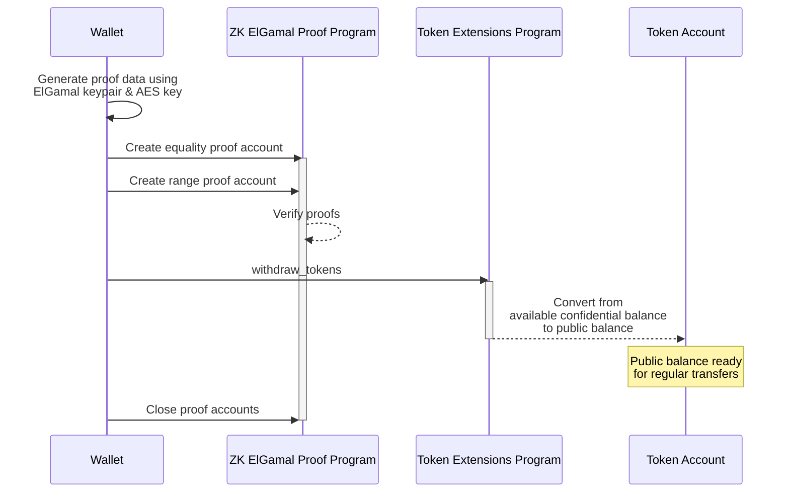

## Как вывести токены из конфиденциального доступного баланса

Чтобы вывести токены из конфиденциального доступного баланса в публичный баланс:

1. Создайте
   [два доказательства](https://github.com/solana-program/token-2022/blob/efd0c957fefbd79882d77df5fb2dac88c001249c/confidential-transfer/proof-generation/src/withdraw.rs#L22)
   на стороне клиента:

   **Доказательство равенства
   ([CiphertextCommitmentEqualityProofData](https://github.com/anza-xyz/agave/blob/8b33d6d311c95780362a7d235919e7b8d2345939/zk-token-sdk/src/instruction/ciphertext_commitment_equality.rs#L56))**:
   Проверяет, что зашифрованный остаток доступного баланса после вывода
   соответствует его
   [коммитменту Педерсена](https://en.wikipedia.org/wiki/Commitment_scheme),
   гарантируя, что новый доступный баланс аккаунта вычислен корректно как
   `remaining_balance = current_balance - withdraw_amount`.

   **Доказательство диапазона
   ([BatchedRangeProofU64Data](https://github.com/anza-xyz/agave/blob/8b33d6d311c95780362a7d235919e7b8d2345939/zk-token-sdk/src/instruction/batched_range_proof/batched_range_proof_u64.rs#L37))**:
   Проверяет, что оставшийся доступный баланс после вывода неотрицательный и
   находится в заданном диапазоне.

2. Для каждого доказательства:
   - Вызовите программу доказательства ZK ElGamal для проверки данных
     доказательства.
   - Сохраните метаданные, относящиеся к доказательству, в аккаунте "состояния
     контекста" для использования в других инструкциях.

3. Вызовите инструкцию
   [ConfidentialTransferInstruction::Withdraw](https://github.com/solana-program/token-2022/blob/efd0c957fefbd79882d77df5fb2dac88c001249c/program/src/extension/confidential_transfer/processor.rs#L493),
   предоставив два аккаунта доказательств.

4. Закройте аккаунты доказательств, чтобы вернуть SOL, использованные для их
   создания.

Следующая диаграмма показывает шаги, связанные с выводом токенов из
конфиденциального доступного баланса в публичный баланс:



### Необходимые инструкции

Чтобы вывести токены из конфиденциального доступного баланса в публичный баланс,
вы должны:

- Сгенерировать доказательство равенства и доказательство диапазона на стороне
  клиента
- Вызвать программу доказательства ZK ElGamal для проверки доказательств и
  инициализации аккаунтов "состояния контекста"
- Вызвать инструкцию
  [ConfidentialTransferInstruction::Withdraw](https://github.com/solana-program/token-2022/blob/efd0c957fefbd79882d77df5fb2dac88c001249c/program/src/extension/confidential_transfer/processor.rs#L493),
  предоставив два аккаунта доказательств.
- Закрыть два аккаунта доказательств, чтобы вернуть rent.

Crate `spl_token_client` предоставляет следующие методы:

- Метод `confidential_transfer_create_context_state_account`, который создаёт
  аккаунт доказательства.
- Метод `confidential_transfer_withdraw`, который вызывает инструкцию
  `Withdraw`.
- Метод `confidential_transfer_close_context_state_account`, который закрывает
  аккаунт доказательства.

### Пример кода

Следующий пример демонстрирует, как вывести токены из конфиденциального
доступного баланса в публичный баланс.

Чтобы запустить пример, запустите локальный валидатор с программой Token
Extensions, клонированной из основной сети, используя следующую команду. Для
запуска локального валидатора у вас должен быть установлен Solana CLI.

```terminal
$ solana-test-validator --clone-upgradeable-program TokenzQdBNbLqP5VEhdkAS6EPFLC1PHnBqCXEpPxuEb --url https://api.mainnet-beta.solana.com -r
```

```terminal
$ solana-test-validator --clone-upgradeable-program TokenzQdBNbLqP5VEhdkAS6EPFLC1PHnBqCXEpPxuEb --url https://api.mainnet.solana.com -r
```

<CodeTabs flags="r">

```rust !! title="main.rs"
use anyhow::{Context, Result};
use solana_client::nonblocking::rpc_client::RpcClient;
use solana_sdk::{
    commitment_config::CommitmentConfig,
    signature::{Keypair, Signer},
    transaction::Transaction,
};
use spl_associated_token_account::{
    get_associated_token_address_with_program_id, instruction::create_associated_token_account,
};
use spl_token_client::{
    client::{ProgramRpcClient, ProgramRpcClientSendTransaction},
    spl_token_2022::{
        extension::{
            confidential_transfer::{
                account_info::WithdrawAccountInfo,
                ConfidentialTransferAccount,
                instruction::{configure_account, PubkeyValidityProofData},
            },
            BaseStateWithExtensions, ExtensionType,
        },
        id as token_2022_program_id,
        instruction::reallocate,
        solana_zk_sdk::encryption::{auth_encryption::*, elgamal::*},
    },
    token::{ExtensionInitializationParams, Token},
};
use spl_token_confidential_transfer_proof_extraction::instruction::{ProofData, ProofLocation};
use spl_token_confidential_transfer_proof_generation::withdraw::WithdrawProofData;
use std::sync::Arc;

#[tokio::main]
async fn main() -> Result<()> {
    // Create connection to local test validator
    let rpc_client = Arc::new(RpcClient::new_with_commitment(
        String::from("http://localhost:8899"),
        CommitmentConfig::confirmed(),
    ));

    // Load the default Solana CLI keypair to use as the fee payer
    // This will be the wallet paying for the transaction fees
    // Use Arc to prevent multiple clones of the keypair
    let payer = Arc::new(load_keypair()?);
    println!("Using payer: {}", payer.pubkey());

    // Generate a new keypair to use as the address of the token mint
    let mint = Keypair::new();
    println!("Mint keypair generated: {}", mint.pubkey());

    // Set up program client for Token client
    let program_client = ProgramRpcClient::new(rpc_client.clone(), ProgramRpcClientSendTransaction);

    // Number of decimals for the mint
    let decimals = 9;

    // Create a token client for the Token-2022 program
    // This provides high-level methods for token operations
    let token = Token::new(
        Arc::new(program_client),
        &token_2022_program_id(), // Use the Token-2022 program (newer version with extensions)
        &mint.pubkey(),           // Address of the new token mint
        Some(decimals),           // Number of decimal places
        payer.clone(),            // Fee payer for transactions
    );

    // Create extension initialization parameters for the mint
    // The ConfidentialTransferMint extension enables confidential (private) transfers of tokens
    let extension_initialization_params =
        vec![ExtensionInitializationParams::ConfidentialTransferMint {
            authority: Some(payer.pubkey()), // Authority that can modify confidential transfer settings
            auto_approve_new_accounts: true, // Automatically approve new confidential accounts
            auditor_elgamal_pubkey: None,    // Optional auditor ElGamal public key
        }];

    // Create and initialize the mint with the ConfidentialTransferMint extension
    // This sends a transaction to create the new token mint
    let transaction_signature = token
        .create_mint(
            &payer.pubkey(),                 // Mint authority - can mint new tokens
            Some(&payer.pubkey()),           // Freeze authority - can freeze token accounts
            extension_initialization_params, // Add the ConfidentialTransferMint extension
            &[&mint],                        // Mint keypair needed as signer
        )
        .await?;

    // Print results for user verification
    println!("Mint Address: {}", mint.pubkey());
    println!(
        "Mint Creation Transaction Signature: {}",
        transaction_signature
    );

    // ===== Create and configure token account for confidential transfers =====
    println!("\nCreate and configure token account for confidential transfers");

    // Get the associated token account address for the owner
    let token_account_pubkey = get_associated_token_address_with_program_id(
        &payer.pubkey(),          // Token account owner
        &mint.pubkey(),           // Mint
        &token_2022_program_id(), // Token program ID
    );
    println!("Token Account Address: {}", token_account_pubkey);

    // Step 1: Create the associated token account
    let create_associated_token_account_instruction = create_associated_token_account(
        &payer.pubkey(),          // Funding account
        &payer.pubkey(),          // Token account owner
        &mint.pubkey(),           // Mint
        &token_2022_program_id(), // Token program ID
    );

    // Step 2: Reallocate the token account to include space for the ConfidentialTransferAccount extension
    let reallocate_instruction = reallocate(
        &token_2022_program_id(),                      // Token program ID
        &token_account_pubkey,                         // Token account
        &payer.pubkey(),                               // Payer
        &payer.pubkey(),                               // Token account owner
        &[&payer.pubkey()],                            // Signers
        &[ExtensionType::ConfidentialTransferAccount], // Extension to reallocate space for
    )?;

    // Step 3: Generate the ElGamal keypair and AES key for token account
    let elgamal_keypair = ElGamalKeypair::new_from_signer(&payer, &token_account_pubkey.to_bytes())
        .expect("Failed to create ElGamal keypair");
    let aes_key = AeKey::new_from_signer(&payer, &token_account_pubkey.to_bytes())
        .expect("Failed to create AES key");

    // The maximum number of Deposit and Transfer instructions that can
    // credit pending_balance before the ApplyPendingBalance instruction must be executed
    let maximum_pending_balance_credit_counter = 65536;

    // Initial token balance is 0
    let decryptable_balance = aes_key.encrypt(0);

    // Generate the proof data client-side
    let proof_data = PubkeyValidityProofData::new(&elgamal_keypair)
        .map_err(|_| anyhow::anyhow!("Failed to generate proof data"))?;

    // Indicate that proof is included in the same transaction
    let proof_location =
        ProofLocation::InstructionOffset(1.try_into()?, ProofData::InstructionData(&proof_data));

    // Step 4: Create instructions to configure the account for confidential transfers
    let configure_account_instructions = configure_account(
        &token_2022_program_id(),               // Program ID
        &token_account_pubkey,                  // Token account
        &mint.pubkey(),                         // Mint
        &decryptable_balance.into(),            // Initial balance
        maximum_pending_balance_credit_counter, // Maximum pending balance credit counter
        &payer.pubkey(),                        // Token Account Owner
        &[],                                    // Additional signers
        proof_location,                         // Proof location
    )?;

    // Combine all instructions
    let mut instructions = vec![
        create_associated_token_account_instruction,
        reallocate_instruction,
    ];
    instructions.extend(configure_account_instructions);

    // Create and send the transaction
    let recent_blockhash = rpc_client.get_latest_blockhash().await?;
    let transaction = Transaction::new_signed_with_payer(
        &instructions,
        Some(&payer.pubkey()),
        &[&*payer],
        recent_blockhash,
    );

    let setup_signature = rpc_client
        .send_and_confirm_transaction(&transaction)
        .await?;
    println!(
        "Token Account Setup Transaction Signature: {}",
        setup_signature
    );

    // Mint some tokens to the newly created token account
    // This gives the account some tokens to work with
    let mint_signature = token
        .mint_to(
            &token_account_pubkey,            // Destination account
            &payer.pubkey(),                  // Mint authority
            100 * 10u64.pow(decimals as u32), // Amount (100 tokens with decimal precision)
            &[&payer],                        // Signers
        )
        .await?;

    println!("Token Minting Transaction Signature: {}", mint_signature);

    // Deposit the tokens to confidential state
    // This converts regular tokens to confidential tokens
    println!("Deposit tokens to confidential state pending balance");
    let deposit_signature = token
        .confidential_transfer_deposit(
            &token_account_pubkey,            // The token account
            &payer.pubkey(),                  // Authority (owner) of the account
            100 * 10u64.pow(decimals as u32), // Amount to deposit (100 tokens)
            decimals,                         // Decimals of the token
            &[&payer],                        // Signers (owner must sign)
        )
        .await?;

    println!(
        "Confidential Transfer Deposit Signature: {}",
        deposit_signature
    );

    // Apply the pending balance to make funds available
    println!("Apply pending balance to available balance");
    let apply_signature = token
        .confidential_transfer_apply_pending_balance(
            &token_account_pubkey,    // The token account
            &payer.pubkey(),          // Authority (owner) of the account
            None,                     // Optional new decryptable available balance
            elgamal_keypair.secret(), // ElGamal secret key encryption
            &aes_key,                 // AES key for encryption
            &[&payer],                // Signers (owner must sign)
        )
        .await?;

    println!("Apply Pending Balance Signature: {}", apply_signature);

    // ===== Withdraw half of the tokens from confidential state =====
    println!("\nWithdraw tokens from confidential available balance");

    // Calculate the withdraw amount (half of the deposited amount)
    let withdraw_amount = 50 * 10u64.pow(decimals as u32); // Half of the 100 tokens deposited

    // Get the token account data to access the confidential transfer extension
    let token_account = token.get_account_info(&token_account_pubkey).await?;

    // Unpack the ConfidentialTransferAccount extension portion of the token account data
    let extension_data = token_account.get_extension::<ConfidentialTransferAccount>()?;

    // Confidential Transfer extension information needed to construct a `Withdraw` instruction
    let withdraw_account_info =
        WithdrawAccountInfo::new(
            extension_data,
        );

    // Create keypairs for the proof accounts
    let equality_proof_context_state_keypair = Keypair::new();
    let equality_proof_context_state_pubkey = equality_proof_context_state_keypair.pubkey();
    let range_proof_context_state_keypair = Keypair::new();
    let range_proof_context_state_pubkey = range_proof_context_state_keypair.pubkey();

    // Create a withdraw proof data
    let WithdrawProofData {
        equality_proof_data,
        range_proof_data,
    } = withdraw_account_info.generate_proof_data(
        withdraw_amount,  // Amount to withdraw from confidential state
        &elgamal_keypair, // ElGamal keypair for encryption
        &aes_key,         // AES key for encryption
    )?;

    // Generate the equality proof account
    println!("Create equality proof context state account");
    let equality_proof_signature = token
        .confidential_transfer_create_context_state_account(
            &equality_proof_context_state_pubkey, // Public key of the new equality proof context state account
            &payer.pubkey(), // Authority that can close the context state account
            &equality_proof_data, // Proof data for the equality proof verification
            false, // False: combine account creation and proof verification in one transaction
            &[&equality_proof_context_state_keypair], // Signer for the new account
        )
        .await?;
    println!(
        "Equality Proof Context State Account Signature: {}",
        equality_proof_signature
    );

    // Generate the range proof account
    println!("Create range proof context state account");
    let range_proof_signature = token
        .confidential_transfer_create_context_state_account(
            &range_proof_context_state_pubkey, // Public key of the new range proof context state account
            &payer.pubkey(),                   // Authority that can close the context state account
            &range_proof_data,                 // Proof data for the range proof verification
            true, // True: split account creation and proof verification into separate transactions (for large proofs)
            &[&range_proof_context_state_keypair], // Signer for the new account
        )
        .await?;
    println!(
        "Range Proof Context State Account Signature: {}",
        range_proof_signature
    );

    // Perform the withdrawal
    println!("Execute withdrawal transaction");
    let withdraw_signature = token
        .confidential_transfer_withdraw(
            &token_account_pubkey, // Token account to withdraw from
            &payer.pubkey(),       // Owner of the token account
            Some(&spl_token_client::token::ProofAccount::ContextAccount(
                equality_proof_context_state_pubkey, // Reference to the equality proof account
            )),
            Some(&spl_token_client::token::ProofAccount::ContextAccount(
                range_proof_context_state_pubkey, // Reference to the range proof account
            )),
            withdraw_amount,             // Amount to withdraw from confidential state
            decimals,                    // Decimal precision of the token
            Some(withdraw_account_info), // Data from confidential transfer extension for proof verification
            &elgamal_keypair, // ElGamal keypair for encryption
            &aes_key,         // AES key for encryption
            &[&payer],        // Owner must sign the transaction
        )
        .await?;
    println!("Withdraw Transaction Signature: {}", withdraw_signature);

    // Close the context state accounts to recover rent
    println!("Close equality proof context state account");
    let close_equality_signature = token
        .confidential_transfer_close_context_state_account(
            &equality_proof_context_state_pubkey, // Equality proof context state account to close
            &token_account_pubkey,                // Account that will receive the lamports
            &payer.pubkey(),                      // Authority allowed to close the account
            &[&payer],                            // Authority must sign
        )
        .await?;
    println!(
        "Close Equality Proof Account Signature: {}",
        close_equality_signature
    );

    println!("Close range proof context state account");
    let close_range_signature = token
        .confidential_transfer_close_context_state_account(
            &range_proof_context_state_pubkey, // Range proof context state account to close
            &token_account_pubkey,             // Account that will receive the lamports
            &payer.pubkey(),                   // Authority allowed to close the account
            &[&payer],                         // Authority must sign
        )
        .await?;
    println!(
        "Close Range Proof Account Signature: {}",
        close_range_signature
    );
    Ok(())
}

// Load the keypair from the default Solana CLI keypair path (~/.config/solana/id.json)
// This enables using the same wallet as the Solana CLI tools
fn load_keypair() -> Result<Keypair> {
    // Get the default keypair path
    let keypair_path = dirs::home_dir()
        .context("Could not find home directory")?
        .join(".config/solana/id.json");

    // Read the keypair file directly into bytes using serde_json
    // The keypair file is a JSON array of bytes
    let file = std::fs::File::open(&keypair_path)?;
    let keypair_bytes: Vec<u8> = serde_json::from_reader(file)?;

    // Create keypair from the loaded bytes
    // This converts the byte array into a keypair
    let keypair = Keypair::from_bytes(&keypair_bytes)?;

    Ok(keypair)
}
```

```toml !! title="Cargo.toml"
[package]
name = "confidential-transfer"
version = "0.1.0"
edition = "2021"

[dependencies]
solana-client = "2.2.2"
solana-sdk = "2.2.2"
spl-associated-token-account = "6.0.0"
spl-token-client = "0.14.0"
spl-token-confidential-transfer-proof-extraction = "0.2.1"
spl-token-confidential-transfer-proof-generation = "0.3.0"

anyhow = "1.0.95"
dirs = "6.0.0"
serde_json = "1.0.135"
tokio = { version = "1.44.2", features = ["full"] }
```

</CodeTabs>

```rust !! title="main.rs"
use anyhow::{Context, Result};
use solana_client::nonblocking::rpc_client::RpcClient;
use solana_sdk::{
    commitment_config::CommitmentConfig,
    signature::{Keypair, Signer},
    transaction::Transaction,
};
use spl_associated_token_account::{
    get_associated_token_address_with_program_id, instruction::create_associated_token_account,
};
use spl_token_client::{
    client::{ProgramRpcClient, ProgramRpcClientSendTransaction},
    spl_token_2022::{
        extension::{
            confidential_transfer::{
                account_info::WithdrawAccountInfo,
                ConfidentialTransferAccount,
                instruction::{configure_account, PubkeyValidityProofData},
            },
            BaseStateWithExtensions, ExtensionType,
        },
        id as token_2022_program_id,
        instruction::reallocate,
        solana_zk_sdk::encryption::{auth_encryption::*, elgamal::*},
    },
    token::{ExtensionInitializationParams, Token},
};
use spl_token_confidential_transfer_proof_extraction::instruction::{ProofData, ProofLocation};
use spl_token_confidential_transfer_proof_generation::withdraw::WithdrawProofData;
use std::sync::Arc;

#[tokio::main]
async fn main() -> Result<()> {
    // Create connection to local test validator
    let rpc_client = Arc::new(RpcClient::new_with_commitment(
        String::from("http://localhost:8899"),
        CommitmentConfig::confirmed(),
    ));

    // Load the default Solana CLI keypair to use as the fee payer
    // This will be the wallet paying for the transaction fees
    // Use Arc to prevent multiple clones of the keypair
    let payer = Arc::new(load_keypair()?);
    println!("Using payer: {}", payer.pubkey());

    // Generate a new keypair to use as the address of the token mint
    let mint = Keypair::new();
    println!("Mint keypair generated: {}", mint.pubkey());

    // Set up program client for Token client
    let program_client = ProgramRpcClient::new(rpc_client.clone(), ProgramRpcClientSendTransaction);

    // Number of decimals for the mint
    let decimals = 9;

    // Create a token client for the Token-2022 program
    // This provides high-level methods for token operations
    let token = Token::new(
        Arc::new(program_client),
        &token_2022_program_id(), // Use the Token-2022 program (newer version with extensions)
        &mint.pubkey(),           // Address of the new token mint
        Some(decimals),           // Number of decimal places
        payer.clone(),            // Fee payer for transactions
    );

    // Create extension initialization parameters for the mint
    // The ConfidentialTransferMint extension enables confidential (private) transfers of tokens
    let extension_initialization_params =
        vec![ExtensionInitializationParams::ConfidentialTransferMint {
            authority: Some(payer.pubkey()), // Authority that can modify confidential transfer settings
            auto_approve_new_accounts: true, // Automatically approve new confidential accounts
            auditor_elgamal_pubkey: None,    // Optional auditor ElGamal public key
        }];

    // Create and initialize the mint with the ConfidentialTransferMint extension
    // This sends a transaction to create the new token mint
    let transaction_signature = token
        .create_mint(
            &payer.pubkey(),                 // Mint authority - can mint new tokens
            Some(&payer.pubkey()),           // Freeze authority - can freeze token accounts
            extension_initialization_params, // Add the ConfidentialTransferMint extension
            &[&mint],                        // Mint keypair needed as signer
        )
        .await?;

    // Print results for user verification
    println!("Mint Address: {}", mint.pubkey());
    println!(
        "Mint Creation Transaction Signature: {}",
        transaction_signature
    );

    // ===== Create and configure token account for confidential transfers =====
    println!("\nCreate and configure token account for confidential transfers");

    // Get the associated token account address for the owner
    let token_account_pubkey = get_associated_token_address_with_program_id(
        &payer.pubkey(),          // Token account owner
        &mint.pubkey(),           // Mint
        &token_2022_program_id(), // Token program ID
    );
    println!("Token Account Address: {}", token_account_pubkey);

    // Step 1: Create the associated token account
    let create_associated_token_account_instruction = create_associated_token_account(
        &payer.pubkey(),          // Funding account
        &payer.pubkey(),          // Token account owner
        &mint.pubkey(),           // Mint
        &token_2022_program_id(), // Token program ID
    );

    // Step 2: Reallocate the token account to include space for the ConfidentialTransferAccount extension
    let reallocate_instruction = reallocate(
        &token_2022_program_id(),                      // Token program ID
        &token_account_pubkey,                         // Token account
        &payer.pubkey(),                               // Payer
        &payer.pubkey(),                               // Token account owner
        &[&payer.pubkey()],                            // Signers
        &[ExtensionType::ConfidentialTransferAccount], // Extension to reallocate space for
    )?;

    // Step 3: Generate the ElGamal keypair and AES key for token account
    let elgamal_keypair = ElGamalKeypair::new_from_signer(&payer, &token_account_pubkey.to_bytes())
        .expect("Failed to create ElGamal keypair");
    let aes_key = AeKey::new_from_signer(&payer, &token_account_pubkey.to_bytes())
        .expect("Failed to create AES key");

    // The maximum number of Deposit and Transfer instructions that can
    // credit pending_balance before the ApplyPendingBalance instruction must be executed
    let maximum_pending_balance_credit_counter = 65536;

    // Initial token balance is 0
    let decryptable_balance = aes_key.encrypt(0);

    // Generate the proof data client-side
    let proof_data = PubkeyValidityProofData::new(&elgamal_keypair)
        .map_err(|_| anyhow::anyhow!("Failed to generate proof data"))?;

    // Indicate that proof is included in the same transaction
    let proof_location =
        ProofLocation::InstructionOffset(1.try_into()?, ProofData::InstructionData(&proof_data));

    // Step 4: Create instructions to configure the account for confidential transfers
    let configure_account_instructions = configure_account(
        &token_2022_program_id(),               // Program ID
        &token_account_pubkey,                  // Token account
        &mint.pubkey(),                         // Mint
        &decryptable_balance.into(),            // Initial balance
        maximum_pending_balance_credit_counter, // Maximum pending balance credit counter
        &payer.pubkey(),                        // Token Account Owner
        &[],                                    // Additional signers
        proof_location,                         // Proof location
    )?;

    // Combine all instructions
    let mut instructions = vec![
        create_associated_token_account_instruction,
        reallocate_instruction,
    ];
    instructions.extend(configure_account_instructions);

    // Create and send the transaction
    let recent_blockhash = rpc_client.get_latest_blockhash().await?;
    let transaction = Transaction::new_signed_with_payer(
        &instructions,
        Some(&payer.pubkey()),
        &[&*payer],
        recent_blockhash,
    );

    let setup_signature = rpc_client
        .send_and_confirm_transaction(&transaction)
        .await?;
    println!(
        "Token Account Setup Transaction Signature: {}",
        setup_signature
    );

    // Mint some tokens to the newly created token account
    // This gives the account some tokens to work with
    let mint_signature = token
        .mint_to(
            &token_account_pubkey,            // Destination account
            &payer.pubkey(),                  // Mint authority
            100 * 10u64.pow(decimals as u32), // Amount (100 tokens with decimal precision)
            &[&payer],                        // Signers
        )
        .await?;

    println!("Token Minting Transaction Signature: {}", mint_signature);

    // Deposit the tokens to confidential state
    // This converts regular tokens to confidential tokens
    println!("Deposit tokens to confidential state pending balance");
    let deposit_signature = token
        .confidential_transfer_deposit(
            &token_account_pubkey,            // The token account
            &payer.pubkey(),                  // Authority (owner) of the account
            100 * 10u64.pow(decimals as u32), // Amount to deposit (100 tokens)
            decimals,                         // Decimals of the token
            &[&payer],                        // Signers (owner must sign)
        )
        .await?;

    println!(
        "Confidential Transfer Deposit Signature: {}",
        deposit_signature
    );

    // Apply the pending balance to make funds available
    println!("Apply pending balance to available balance");
    let apply_signature = token
        .confidential_transfer_apply_pending_balance(
            &token_account_pubkey,    // The token account
            &payer.pubkey(),          // Authority (owner) of the account
            None,                     // Optional new decryptable available balance
            elgamal_keypair.secret(), // ElGamal secret key encryption
            &aes_key,                 // AES key for encryption
            &[&payer],                // Signers (owner must sign)
        )
        .await?;

    println!("Apply Pending Balance Signature: {}", apply_signature);

    // ===== Withdraw half of the tokens from confidential state =====
    println!("\nWithdraw tokens from confidential available balance");

    // Calculate the withdraw amount (half of the deposited amount)
    let withdraw_amount = 50 * 10u64.pow(decimals as u32); // Half of the 100 tokens deposited

    // Get the token account data to access the confidential transfer extension
    let token_account = token.get_account_info(&token_account_pubkey).await?;

    // Unpack the ConfidentialTransferAccount extension portion of the token account data
    let extension_data = token_account.get_extension::<ConfidentialTransferAccount>()?;

    // Confidential Transfer extension information needed to construct a `Withdraw` instruction
    let withdraw_account_info =
        WithdrawAccountInfo::new(
            extension_data,
        );

    // Create keypairs for the proof accounts
    let equality_proof_context_state_keypair = Keypair::new();
    let equality_proof_context_state_pubkey = equality_proof_context_state_keypair.pubkey();
    let range_proof_context_state_keypair = Keypair::new();
    let range_proof_context_state_pubkey = range_proof_context_state_keypair.pubkey();

    // Create a withdraw proof data
    let WithdrawProofData {
        equality_proof_data,
        range_proof_data,
    } = withdraw_account_info.generate_proof_data(
        withdraw_amount,  // Amount to withdraw from confidential state
        &elgamal_keypair, // ElGamal keypair for encryption
        &aes_key,         // AES key for encryption
    )?;

    // Generate the equality proof account
    println!("Create equality proof context state account");
    let equality_proof_signature = token
        .confidential_transfer_create_context_state_account(
            &equality_proof_context_state_pubkey, // Public key of the new equality proof context state account
            &payer.pubkey(), // Authority that can close the context state account
            &equality_proof_data, // Proof data for the equality proof verification
            false, // False: combine account creation and proof verification in one transaction
            &[&equality_proof_context_state_keypair], // Signer for the new account
        )
        .await?;
    println!(
        "Equality Proof Context State Account Signature: {}",
        equality_proof_signature
    );

    // Generate the range proof account
    println!("Create range proof context state account");
    let range_proof_signature = token
        .confidential_transfer_create_context_state_account(
            &range_proof_context_state_pubkey, // Public key of the new range proof context state account
            &payer.pubkey(),                   // Authority that can close the context state account
            &range_proof_data,                 // Proof data for the range proof verification
            true, // True: split account creation and proof verification into separate transactions (for large proofs)
            &[&range_proof_context_state_keypair], // Signer for the new account
        )
        .await?;
    println!(
        "Range Proof Context State Account Signature: {}",
        range_proof_signature
    );

    // Perform the withdrawal
    println!("Execute withdrawal transaction");
    let withdraw_signature = token
        .confidential_transfer_withdraw(
            &token_account_pubkey, // Token account to withdraw from
            &payer.pubkey(),       // Owner of the token account
            Some(&spl_token_client::token::ProofAccount::ContextAccount(
                equality_proof_context_state_pubkey, // Reference to the equality proof account
            )),
            Some(&spl_token_client::token::ProofAccount::ContextAccount(
                range_proof_context_state_pubkey, // Reference to the range proof account
            )),
            withdraw_amount,             // Amount to withdraw from confidential state
            decimals,                    // Decimal precision of the token
            Some(withdraw_account_info), // Data from confidential transfer extension for proof verification
            &elgamal_keypair, // ElGamal keypair for encryption
            &aes_key,         // AES key for encryption
            &[&payer],        // Owner must sign the transaction
        )
        .await?;
    println!("Withdraw Transaction Signature: {}", withdraw_signature);

    // Close the context state accounts to recover rent
    println!("Close equality proof context state account");
    let close_equality_signature = token
        .confidential_transfer_close_context_state_account(
            &equality_proof_context_state_pubkey, // Equality proof context state account to close
            &token_account_pubkey,                // Account that will receive the lamports
            &payer.pubkey(),                      // Authority allowed to close the account
            &[&payer],                            // Authority must sign
        )
        .await?;
    println!(
        "Close Equality Proof Account Signature: {}",
        close_equality_signature
    );

    println!("Close range proof context state account");
    let close_range_signature = token
        .confidential_transfer_close_context_state_account(
            &range_proof_context_state_pubkey, // Range proof context state account to close
            &token_account_pubkey,             // Account that will receive the lamports
            &payer.pubkey(),                   // Authority allowed to close the account
            &[&payer],                         // Authority must sign
        )
        .await?;
    println!(
        "Close Range Proof Account Signature: {}",
        close_range_signature
    );
    Ok(())
}

// Load the keypair from the default Solana CLI keypair path (~/.config/solana/id.json)
// This enables using the same wallet as the Solana CLI tools
fn load_keypair() -> Result<Keypair> {
    // Get the default keypair path
    let keypair_path = dirs::home_dir()
        .context("Could not find home directory")?
        .join(".config/solana/id.json");

    // Read the keypair file directly into bytes using serde_json
    // The keypair file is a JSON array of bytes
    let file = std::fs::File::open(&keypair_path)?;
    let keypair_bytes: Vec<u8> = serde_json::from_reader(file)?;

    // Create keypair from the loaded bytes
    // This converts the byte array into a keypair
    let keypair = Keypair::from_bytes(&keypair_bytes)?;

    Ok(keypair)
}
```
