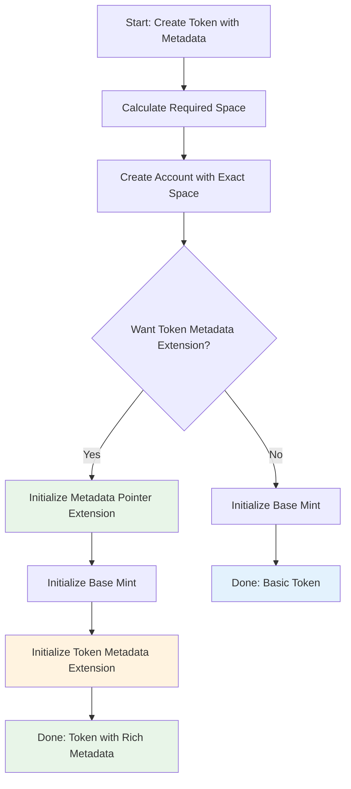
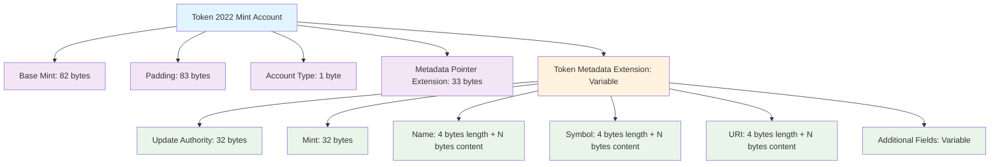
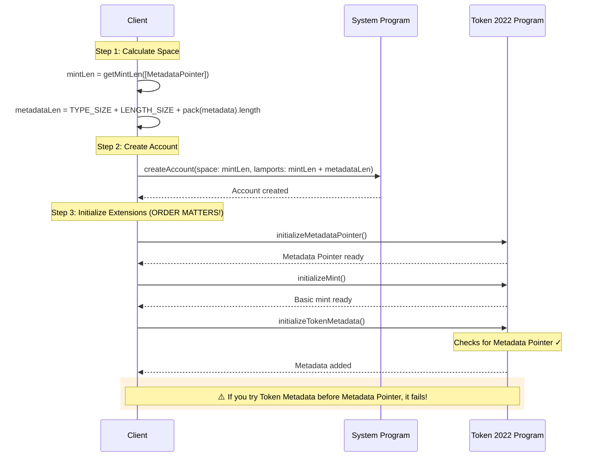
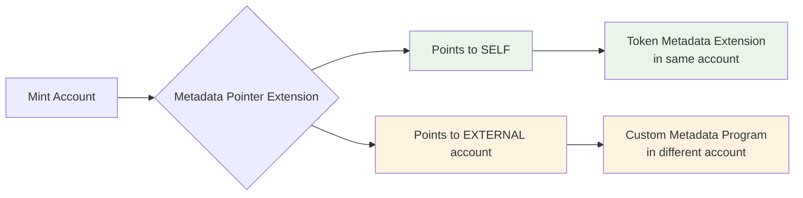

> **Previous:** [Token Extensions Overview](./) | **Next:** >
> [TypeScript Implementation](./typescript)

This section provides the technical foundation you need to understand Token 2022
extensions at the byte level. We'll cover account structures, space
calculations, and the critical initialization sequences—plus address the most
common questions and pitfalls developers encounter when working with metadata
extensions.

## Core Concepts

Before diving into the technical details, let's establish two fundamental concepts that are crucial for understanding Token 2022 metadata extensions:

### What is Account Initialization?

On Solana, **accounts are just raw data buffers** when first created. They contain unstructured bytes with no inherent meaning. **Initialization** is the process that gives this raw data structure and semantic meaning, allowing programs to interpret and use the data correctly.

Think of it like formatting a hard drive:
- **Before initialization**: Raw storage space with no file system
- **After initialization**: Structured data that the operating system can understand and use

For Token 2022 mints:
- **Before initialization**: A blank account owned by the Token 2022 program
- **After initialization**: A structured mint account with defined fields (supply, decimals, authority, extensions)

### TLV (Type-Length-Value) Encoding

Token 2022 uses **TLV encoding** to store extension data efficiently and flexibly. TLV is a standardized way to serialize data where each piece of information is stored as:

- **Type** (2 bytes): Identifies what kind of data this is (e.g., MetadataPointer = 18, TokenMetadata = 19)
- **Length** (2 bytes): Specifies how many bytes the data occupies
- **Value** (variable): The actual data content

This structure allows Token 2022 to:
- Support multiple extensions in any combination
- Parse extension data without knowing the complete schema upfront
- Add new extension types without breaking existing code

```
Example TLV structure:
[Type: 18][Length: 33][Value: Metadata Pointer data...]
[Type: 19][Length: 188][Value: Token Metadata data...]
```

### Account Reallocation

Based on the Token 2022 source code, **account reallocation** is the mechanism used to handle variable-sized extensions like metadata within the existing account structure.

**Key facts from the implementation:**
- Token 2022 can reallocate account space to accommodate variable-length extensions
- The `alloc_and_serialize_variable_len_extension` function handles both allocation and serialization of metadata
- When metadata is initialized or updated, the account may be reallocated to fit the new data size
- The reallocation process adjusts the TLV structure within the account to accommodate size changes

**From the source code comments:**
> "allocate a TLV entry for the space and write it in, assumes that there's enough SOL for the new rent-exemption"

**Space allocation:**
- The initial account is created with space for the base mint and metadata pointer extension
- Additional rent is calculated and paid for the metadata extension when it's added
- Updates to metadata can cause reallocation if the size changes

This reallocation mechanism enables the flexibility of variable-sized metadata while maintaining the structured TLV format within the account.

Now let's see how these concepts apply to the actual account structure.

## Account Structure Deep Dive

The first thing to understand is that a Token 2022 mint account is a superset of
an SPL Token Mint Account. So it has all the bells and whistles of the
traditional token program plus some additional stuff, which we call extensions
and And this is how it looks like in memory:

```mermaid
block-beta
    columns 3

    block:mint["Base Mint Data"]:1
        a["Mint Authority: 32 bytes"]
        b["Supply: 8 bytes"]
        c["Decimals: 1 byte"]
        d["Other fields: 41 bytes"]
    end

    block:padding["Padding"]:1
        e["Reserved: 83 bytes"]
    end

    block:type["Account Type"]:1
        f["Type: 1 byte"]
    end

    block:ext1["Extension 1"]:3
        g["Metadata Pointer Extension"]
        h["Authority: 32 bytes"]
        i["Address: 32 bytes (optional)"]
    end

    block:ext2["Extension 2"]:3
        j["Token Metadata Extension"]
        k["Update Authority: 32 bytes"]
        l["Mint: 32 bytes"]
        m["Name: Variable length"]
        n["Symbol: Variable length"]
        o["URI: Variable length"]
    end

    style mint fill:#e3f2fd
    style padding fill:#f5f5f5
    style type fill:#f5f5f5
    style ext1 fill:#e8f5e8
    style ext2 fill:#fff3e0
```



### Extension Dependencies Flowchart



### Space Calculation Formula

**How to Calculate the Space Needed for a Token 2022 Mint with Metadata**



#### Fixed Components (for mint with MetadataPointer):

Based on the Token 2022 test suite, `getMintLen([ExtensionType.MetadataPointer])` returns **234 bytes**.

This includes:
- Base mint data and required extensions infrastructure
- Metadata Pointer extension data
- Proper alignment and padding

#### Variable Components (Token Metadata Extension):

When adding the Token Metadata extension, additional space is calculated as:
- **TYPE_SIZE** (2 bytes) + **LENGTH_SIZE** (2 bytes) + **packed metadata length**

The packed metadata includes:
- Update Authority: 32 bytes
- Mint: 32 bytes  
- Name: 4 bytes (length) + N bytes (content)
- Symbol: 4 bytes (length) + N bytes (content)
- URI: 4 bytes (length) + N bytes (content)
- Additional fields: Variable

_Total Space = 234 bytes (base with MetadataPointer) + Variable Metadata Extension Size_

> **⚠️ Critical Rule**: You must allocate all space upfront based on your requirements. Account space cannot be increased later for the account structure.

### The Initialization Order That Matters



## Why Do We Need Both Metadata Pointer AND Token Metadata?

This is the **#1 question** developers ask, and for good reason. It seems
redundant at first glance.

### The Design Rationale

The Token Metadata Interface supports **two approaches**:

1. **Self-referential**: A mint can carry metadata itself AND point to itself
2. **External reference**: A mint points to another account for metadata



### The Security Pattern

**The Metadata Pointer acts as a digital signature** that says "this metadata is
official." Here's why this matters:

```mermaid
flowchart TD
    A[Malicious Actor] --> B[Creates Fake Metadata Account]
    B --> C[Claims: "This belongs to Popular Token XYZ"]

    D[Wallet/Explorer] --> E{Check Metadata Pointer}
    E -->|Mint points to fake account| F[❌ Reject - Not official metadata]
    E -->|Mint points to real account| G[✅ Accept - Official metadata]

    H[Token Mint XYZ] --> I[Metadata Pointer Extension]
    I --> J[Points to Official Metadata]

    style F fill:#ffebee
    style G fill:#e8f5e8
    style A fill:#ffebee
    style B fill:#ffebee
```

**Without the pointer**: Anyone could create metadata claiming to belong to your
token.  
**With the pointer**: Only the mint authority can set which metadata is
official.

This design enables clients to verify a token's official metadata by checking
that the mint and metadata reference each other—providing a built-in anti-scam
mechanism.

## Ecosystem Support and Display Considerations

### Wallet and Explorer Integration

Token 2022 metadata extensions represent a newer standard that required
ecosystem-wide adoption. Initially, many wallets and explorers displayed tokens
with these extensions as "Unknown Token" because they lacked built-in support
for the new metadata format.

The ecosystem has evolved to support Token 2022 metadata natively. Modern
explorers and wallets can now read and display metadata directly from the mint
account extensions, eliminating the dependency on external metadata accounts.

### Unified Metadata Access

The **Metaplex Digital Asset Standard (DAS) API** provides a standardized
interface for accessing metadata regardless of whether it uses the traditional
Metaplex format or Token 2022 extensions. This abstraction layer allows
applications to work with both metadata formats seamlessly.

## Understanding Extension Status Indicators

User interfaces often display labels like "Token Extensions: False" or "Token
Extensions: True" to indicate the technical characteristics of a token.

This flag indicates whether the token was created using the Token 2022 program
and has any extensions enabled:

- **"False"**: Token created with the original Token Program, or Token 2022 with
  no extensions
- **"True"**: Token created with Token 2022 program with at least one extension
  enabled

A token can be created with the Token 2022 program but still show "Extensions:
False" if no extensions are actually utilized. The program supports both
traditional token functionality and extended capabilities.

## What's Next?

Now that you understand the technical architecture and common pitfalls, you're
ready to start building. The initialization order, space calculations, and
security patterns we've covered form the foundation for everything that follows.

**Continue to:** [**TypeScript Implementation →**](./typescript)

In the next section, we'll put this knowledge into practice by building a
complete token with metadata using TypeScript/JavaScript, handling all the edge
cases and pitfalls we've discussed here.
