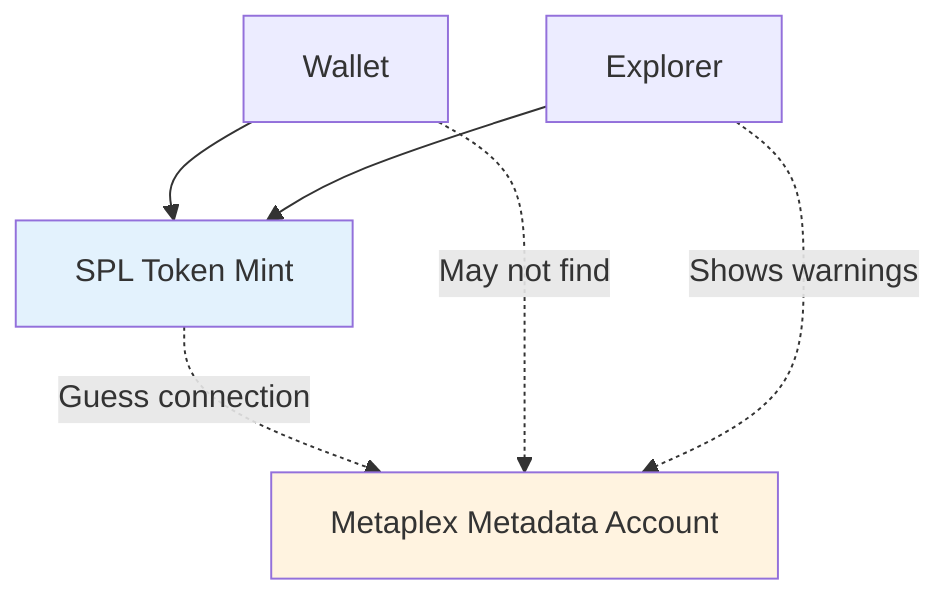
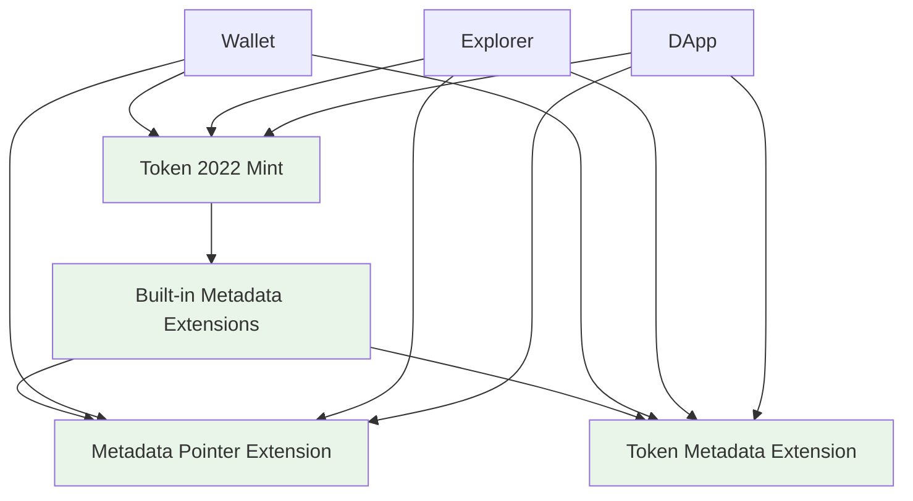
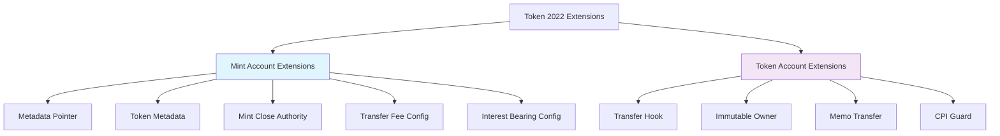
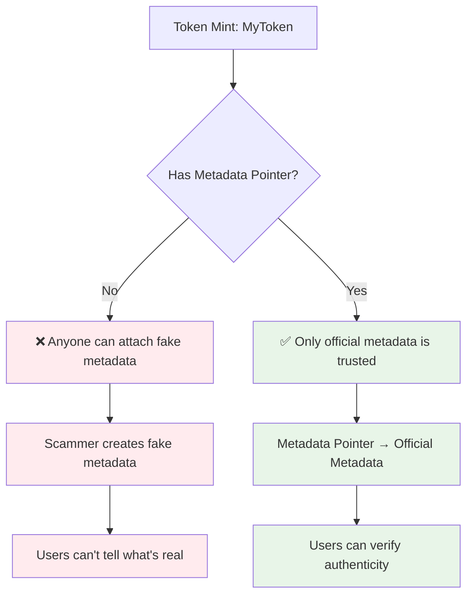

## A Practical Guide to Token 2022 Metadata Pointer and Metadata Token Extensions

Solana's [Token 2022 program](https://spl.solana.com/token-2022) introduces a
powerful new architecture: **Token Extensions**.

These extensions – especially the Metadata Extension addresses the core
challenge of the digital trust problem: **how do you attach rich, verifiable,
and updatable information to a token, in a way that's cryptographically secure,
natively accessible, and impossible to fake or lose?**

Unlike older approaches (where metadata lived in a separate account or off-chain
database), Token 2022 lets you store metadata _inside_ the token mint account
itself through a flexible and extensible data layout. This means wallets,
explorers, and programs can always find and trust your token's metadata – no
more "unknown token" errors, no more fragile links, and no more custom smart
contracts just to add a name or an image.

### What This Guide Covers

This guide is a **step-by-step, code-level walkthrough** of how to build, use,
and understand Token 2022 metadata extensions – across the full stack:

- **TypeScript Client Implementation**: You'll learn how to manually construct
  and serialize instructions for Token 2022 extensions using
  [@solana/web3.js](https://solana-labs.github.io/solana-web3.js/), including
  the details of byte layout, discriminators, and matching Rust-side
  expectations.
- **[Anchor Framework](https://www.anchor-lang.com/) Approach**: We'll show how
  the Anchor framework can simplify some aspects of extension management, but
  also where you need to understand the underlying mechanics for full control
  and security.
- **Native Rust Program Implementation**: You'll see how to implement everything
  from scratch using the
  [Solana Program Library](https://github.com/solana-labs/solana-program-library),
  including manual account validation, TLV (Type-Length-Value) data management,
  [rent](https://docs.solana.com/implemented-proposals/rent) handling, and
  [cross-program invocations](/docs/intro/quick-start/cross-program-invocation),
  giving you a deep understanding of Solana's internals.

Throughout, we will highlight real-world errors, debugging strategies, and best
practices for Solana programs.

### What You'll Learn (and What You'll Build)

By following this guide, you will:

1. **Understand the two main types of Token Extensions** (Mint and Account) and
   how they fit into the
   [Solana account model](/docs/intro/quick-start/reading-from-network).
2. **Learn when and why to use the Metadata Pointer extension** – and how it
   enables dynamic, updatable metadata directly in the mint account.
3. **Master TLV (Type-Length-Value) data structures**: how Token 2022 stores
   extension data, how to calculate space, and how to read/write TLV fields.
   Learn more about
   [TLV in the SPL docs](https://spl.solana.com/token-2022/extension-guide#type-length-value).
4. **See the full lifecycle of a Token 2022 mint with metadata**: from account
   creation, through extension initialization, to dynamic metadata updates.
5. **Write and debug TypeScript clients** that serialize instructions _exactly_
   as the Rust program expects (no more "invalid instruction data" errors).
   Build on [Solana Web3.js](https://solana-labs.github.io/solana-web3.js/)
   foundations.
6. **Implement and validate Rust programs** (both
   [Anchor](https://www.anchor-lang.com/) and native) that handle all the edge
   cases: account validation,
   [rent](https://docs.solana.com/implemented-proposals/rent),
   [CPI](/docs/intro/quick-start/cross-program-invocation), and more.
7. **Avoid common pitfalls**: account order mismatches, missing signer checks,
   space miscalculations, and rent errors.
8. **Gain a deep understanding of Solana's extension architecture** – knowledge
   that will make you a better Solana developer, whether you use
   [Anchor](https://www.anchor-lang.com/) or not.

### Prerequisites & Knowledge Required

This guide is designed for developers who:

- Have a basic understanding of
  [Solana accounts, programs](/docs/intro/quick-start), and the
  [SPL Token standard](/docs/tokens).
- Are comfortable reading and writing both
  [TypeScript](https://www.typescriptlang.org/) and
  [Rust](https://www.rust-lang.org/) (no need to be an expert, but you should
  know the basics).
- Want to go beyond "copy-paste" and actually understand _why_ things work (and
  why they sometimes don't).

If you're new to Solana, it's helpful to review the
[Solana Programming Model](/docs/intro/quick-start) and
[Token 2022 documentation](https://spl.solana.com/token-2022) first. If you're
already comfortable with [Anchor](https://www.anchor-lang.com/), this guide will
show you what's happening "under the hood" – and how to go native when you need
maximum control.

### How This Guide Is Structured

This comprehensive guide is organized into focused sections:

1. **[How Extensions Work](./how-extensions-work)**: Deep dive into the
   technical architecture, TLV structures, and space calculations
2. **[TypeScript Implementation](./typescript)**: Build tokens with metadata
   using JavaScript/TypeScript clients
3. **[Anchor Implementation](./anchor)**: Leverage the Anchor framework for
   streamlined development
4. **[Native Rust Implementation](./native-rust)**: Master complete control with
   native Solana programming
5. **[Real-World Use Cases](./usecases)**: Explore practical applications and
   production patterns

Each section builds on the previous, starting with foundational concepts and
progressing to advanced implementations. You can jump to specific sections based
on your needs, but we recommend following the sequence for the fullest
understanding.

**Ready to start?** Let's begin with understanding how Token 2022 extensions
work under the hood.

## What Are Token Extensions? (And Why Do They Matter?)

Think of a traditional [SPL token](/docs/tokens/basics) like a basic bank note –
it has a value, you can transfer it, but that's about it. You can't write on it,
you can't update it, and you certainly can't attach a photo or certificate to
it.

If you wanted to add metadata to your token, you had to:

1. **Create your SPL token** (using the
   [original token program](/docs/tokens/basics))
2. **Create a separate metadata account** (using
   [Metaplex's program](https://docs.metaplex.com/programs/token-metadata/))
3. **Hope wallets and explorers knew how to connect them**

This created several problems:

- First, you are relying on separate programs (more dependencies and
  complexity).
- Then, Wallets had to guess the connections so your token might show up as
  "Unknown Token" in wallets because they couldn't reliably find or trust the
  metadata connection.



More than that, there was no form of verification and things were often stored
on centralized storage which may get corrupted or deleted. This is why
[decentralized storage solutions](https://arweave.org/) became important for NFT
metadata.

### Token Extensions change this completely.

They're like upgrading from a basic bank note to a smart card that can store
photos, certificates, update history, and even enforce rules about how it can be
used.

With Token 2022, everything lives in one place:

```
Token Mint Address: ABC123...
├── Basic token data (balance, decimals)
├── Metadata Extension (name, symbol, image)
├── Transfer Fee Extension (optional)
└── Other Extensions (as needed)
```

The result? Wallets and explorers get all the information they need from one
source they can trust.



## Token Extensions are like Lego Blocks

They work like modular components that you can snap together. Each extension
adds specific functionality, and they fall into **two distinct categories**:

- **Mint Account Extensions**
- **Token Account Extensions**

Mint Account Extensions are attached to the
**[Mint Account](/docs/tokens#mint-account)** itself (the "template" for the
token). So it's shared by all token holders. While Token Account Extensions are
attached to **individual [Token Accounts](/docs/tokens#token-account)** (where
users hold the tokens). So it means it could be different for each token holder.



### Metadata Pointer and Token Metadata Extensions will be used in this guide

As shown earlier, they are Mint Account Extensions and so affect **all tokens**
made from their Mint.

- **Metadata Pointer** Extension points to where the metadata lives
- **Token Metadata** Extension stores the actual metadata (name, symbol, image
  URL) and any additional information.

They are always used together for security patterns. The Metadata Pointer acts
like a digital signature that says "this metadata is official." Without it,
anyone could claim their metadata belongs to your token.



## What's Next?

Now that you understand the motivation and basic concepts behind Token 2022
metadata extensions, it's time to dive deeper into the technical implementation.

**Continue to:** [**How Extensions Work →**](./metadata/how-extensions-work)

In the next section, we'll explore the technical architecture, including:

- Account structure and TLV (Type-Length-Value) encoding
- Space calculations and rent considerations
- The critical initialization order that prevents common errors
- Extension dependencies and security patterns

This foundation will prepare you for the hands-on implementation guides that
follow.
