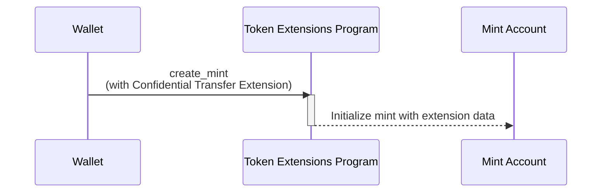

## Confidential Transfer 확장 기능으로 민트 생성하는 방법

Confidential Transfer 확장 기능은 민트 계정에 추가 상태를 더함으로써 비공개 토큰
전송을 가능하게 합니다. 이 섹션에서는 이 확장 기능이 활성화된 토큰 민트를
생성하는 방법을 설명합니다.

다음 다이어그램은 Confidential Transfer 확장 기능으로 민트를 생성하는 단계를
보여줍니다:



### Confidential Transfer 민트 상태

이 확장 기능은 민트 계정에
[ConfidentialTransferMint](https://github.com/solana-program/token-2022/blob/efd0c957fefbd79882d77df5fb2dac88c001249c/program/src/extension/confidential_transfer/mod.rs#L48-L69)
상태를 추가합니다:

```rust title="Confidential Mint State"
#[repr(C)]
#[derive(Clone, Copy, Debug, Default, PartialEq, Pod, Zeroable)]
pub struct ConfidentialTransferMint {
    /// Authority to modify the `ConfidentialTransferMint` configuration and to
    /// approve new accounts (if `auto_approve_new_accounts` is true)
    ///
    /// The legacy Token Multisig account is not supported as the authority
    pub authority: OptionalNonZeroPubkey,

    /// Indicate if newly configured accounts must be approved by the
    /// `authority` before they may be used by the user.
    ///
    /// * If `true`, no approval is required and new accounts may be used
    ///   immediately
    /// * If `false`, the authority must approve newly configured accounts (see
    ///   `ConfidentialTransferInstruction::ConfigureAccount`)
    pub auto_approve_new_accounts: PodBool,

    /// Authority to decode any transfer amount in a confidential transfer.
    pub auditor_elgamal_pubkey: OptionalNonZeroElGamalPubkey,
}
```

*rs`ConfidentialTransferMint`*에는 세 가지 구성 필드가 포함되어 있습니다:

- **authority**: 민트의 기밀 전송 설정을 변경하고 자동 승인이 비활성화된 경우
  새로운 기밀 계정을 승인할 권한이 있는 계정입니다.

- **auto_approve_new_accounts**: true로 설정하면 사용자는 기본적으로 기밀 전송이
  활성화된 토큰 계정을 생성할 수 있습니다. false인 경우, 각 새 토큰 계정은 기밀
  전송에 사용되기 전에 권한자의 승인이 필요합니다.

- **auditor_elgamal_pubkey**: 기밀 거래에서 전송 금액을 해독할 수 있는 선택적
  감사자로, 일반 대중으로부터 개인 정보를 보호하면서 규정 준수 메커니즘을
  제공합니다.

### 필요한 명령어

Confidential Transfer가 활성화된 민트를 생성하려면 단일 트랜잭션에서 세 가지
명령어가 필요합니다:

1. **민트 계정 생성**: System Program의 _rs`CreateAccount`_ 명령어를 호출하여
   민트 계정을 생성합니다.

2. **Confidential Transfer 확장 기능 초기화**: Token Extensions Program의
   [ConfidentialTransferInstruction::InitializeMint](https://github.com/solana-program/token-2022/blob/efd0c957fefbd79882d77df5fb2dac88c001249c/program/src/extension/confidential_transfer/processor.rs#L48)
   명령어를 호출하여 민트의 _rs`ConfidentialTransferMint`_ 상태를 구성합니다.

3. **민트 초기화**: Token Extensions Program의 _rs`Instruction::InitializeMint`_
   명령어를 호출하여 표준 민트 상태를 초기화합니다.

이러한 명령어를 수동으로 작성할 수도 있지만, `spl_token_client` 크레이트는 아래
예제에서 보여주는 것처럼 세 가지 명령어가 모두 포함된 트랜잭션을 구축하고
전송하는 `create_mint` 메서드를 제공합니다.

### 예제 코드

다음 코드는 기밀 전송(Confidential Transfer) 확장 기능을 가진 민트를 생성하는
방법을 보여줍니다.

예제를 실행하려면 다음 명령을 사용하여 메인넷에서 복제한 Token Extensions
Program으로 로컬 validator를 시작하세요. 로컬 validator를 시작하려면 Solana
CLI가 설치되어 있어야 합니다.

```terminal
$ solana-test-validator --clone-upgradeable-program TokenzQdBNbLqP5VEhdkAS6EPFLC1PHnBqCXEpPxuEb --url https://api.mainnet-beta.solana.com -r
```

<Callout type="info">
  이 글을 작성하는 시점에서는 기본 로컬 validator에서 기밀 전송(Confidential
  Transfers)이 활성화되어 있지 않습니다. 예제 코드를 실행하려면 메인넷에서 Token
  Extensions Program을 복제해야 합니다.
</Callout>

<CodeTabs flags="r">

```rust !! title="main.rs"
use anyhow::{Context, Result};
use solana_client::nonblocking::rpc_client::RpcClient;
use solana_sdk::{
    commitment_config::CommitmentConfig,
    signature::{Keypair, Signer},
};
use spl_token_client::{
    client::{ProgramRpcClient, ProgramRpcClientSendTransaction},
    spl_token_2022::id as token_2022_program_id,
    token::{ExtensionInitializationParams, Token},
};
use std::sync::Arc;

#[tokio::main]
async fn main() -> Result<()> {
    // Create connection to local test validator
    let rpc_client = RpcClient::new_with_commitment(
        String::from("http://localhost:8899"),
        CommitmentConfig::confirmed(),
    );

    // Load the default Solana CLI keypair to use as the fee payer
    // This will be the wallet paying for the transaction fees
    // Use Arc to prevent multiple clones of the keypair
    let payer = Arc::new(load_keypair()?);
    println!("Using payer: {}", payer.pubkey());

    // Generate a new keypair to use as the address of the token mint
    let mint = Keypair::new();
    println!("Mint keypair generated: {}", mint.pubkey());

    // Set up program client for Token client
    let program_client =
        ProgramRpcClient::new(Arc::new(rpc_client), ProgramRpcClientSendTransaction);

    // Number of decimals for the mint
    let decimals = 9;

    // Create a token client for the Token-2022 program
    // This provides high-level methods for token operations
    let token = Token::new(
        Arc::new(program_client),
        &token_2022_program_id(), // Use the Token-2022 program (newer version with extensions)
        &mint.pubkey(),           // Address of the new token mint
        Some(decimals),           // Number of decimal places
        payer.clone(),            // Fee payer for transactions (cloning Arc, not keypair)
    );

    // Create extension initialization parameters
    // The ConfidentialTransferMint extension enables confidential (private) transfers of tokens
    let extension_initialization_params =
        vec![ExtensionInitializationParams::ConfidentialTransferMint {
            authority: Some(payer.pubkey()), // Authority that can modify confidential transfer settings
            auto_approve_new_accounts: true, // Automatically approve new confidential accounts
            auditor_elgamal_pubkey: None,    // Optional auditor ElGamal public key
        }];

    // Create and initialize the mint with the ConfidentialTransferMint extension
    // This sends a transaction to create the new token mint
    let transaction_signature = token
        .create_mint(
            &payer.pubkey(),                 // Mint authority - can mint new tokens
            Some(&payer.pubkey()),           // Freeze authority - can freeze token accounts
            extension_initialization_params, // Add the ConfidentialTransferMint extension
            &[&mint],                        // Mint keypair needed as signer
        )
        .await?;

    // Print results for user verification
    println!("Mint Address: {}", mint.pubkey());
    println!("Transaction Signature: {}", transaction_signature);

    Ok(())
}

// Load the keypair from the default Solana CLI keypair path (~/.config/solana/id.json)
// This enables using the same wallet as the Solana CLI tools
fn load_keypair() -> Result<Keypair> {
    // Get the default keypair path
    let keypair_path = dirs::home_dir()
        .context("Could not find home directory")?
        .join(".config/solana/id.json");

    // Read the keypair file directly into bytes using serde_json
    // The keypair file is a JSON array of bytes
    let file = std::fs::File::open(&keypair_path)?;
    let keypair_bytes: Vec<u8> = serde_json::from_reader(file)?;

    // Create keypair from the loaded bytes
    // This converts the byte array into a keypair
    let keypair = Keypair::from_bytes(&keypair_bytes)?;

    Ok(keypair)
}
```

```toml !! title="Cargo.toml"
[package]
name = "confidential-transfer"
version = "0.1.0"
edition = "2021"

[dependencies]
[package]
name = "confidential-transfer"
version = "0.1.0"
edition = "2021"

[dependencies]
solana-client = "2.2.2"
solana-sdk = "2.2.2"
spl-associated-token-account = "6.0.0"
spl-token-client = "0.14.0"
spl-token-confidential-transfer-proof-extraction = "0.2.1"
spl-token-confidential-transfer-proof-generation = "0.3.0"

anyhow = "1.0.95"
dirs = "6.0.0"
serde_json = "1.0.135"
tokio = { version = "1.44.2", features = ["full"] }
```

</CodeTabs>
