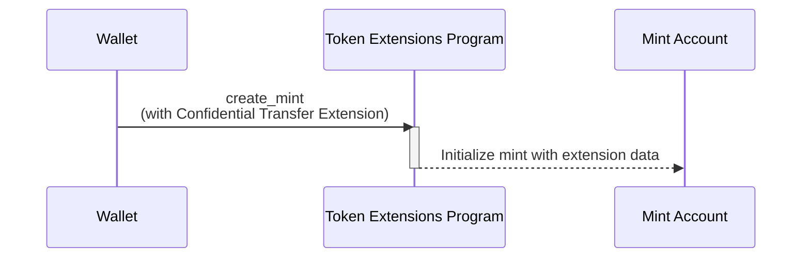

## Hoe maak je een mint aan met Confidential Transfer-extensie

De Confidential Transfer-extensie maakt privé tokenoverdrachten mogelijk door
extra status toe te voegen aan de mint account. Dit gedeelte legt uit hoe je een
token mint aanmaakt met deze extensie ingeschakeld.

Het volgende diagram toont de stappen die nodig zijn voor het aanmaken van een
mint met de Confidential Transfer-extensie:



### Confidential Transfer mint status

De extensie voegt de
[ConfidentialTransferMint](https://github.com/solana-program/token-2022/blob/efd0c957fefbd79882d77df5fb2dac88c001249c/program/src/extension/confidential_transfer/mod.rs#L48-L69)
status toe aan de mint account:

```rust title="Confidential Mint State"
#[repr(C)]
#[derive(Clone, Copy, Debug, Default, PartialEq, Pod, Zeroable)]
pub struct ConfidentialTransferMint {
    /// Authority to modify the `ConfidentialTransferMint` configuration and to
    /// approve new accounts (if `auto_approve_new_accounts` is true)
    ///
    /// The legacy Token Multisig account is not supported as the authority
    pub authority: OptionalNonZeroPubkey,

    /// Indicate if newly configured accounts must be approved by the
    /// `authority` before they may be used by the user.
    ///
    /// * If `true`, no approval is required and new accounts may be used
    ///   immediately
    /// * If `false`, the authority must approve newly configured accounts (see
    ///   `ConfidentialTransferInstruction::ConfigureAccount`)
    pub auto_approve_new_accounts: PodBool,

    /// Authority to decode any transfer amount in a confidential transfer.
    pub auditor_elgamal_pubkey: OptionalNonZeroElGamalPubkey,
}
```

De _rs`ConfidentialTransferMint`_ bevat drie configuratievelden:

- **authority**: Het account dat toestemming heeft om confidential transfer-
  instellingen voor de mint te wijzigen en nieuwe confidential accounts goed te
  keuren als automatische goedkeuring is uitgeschakeld.

- **auto_approve_new_accounts**: Wanneer dit is ingesteld op true, kunnen
  gebruikers standaard token accounts aanmaken met confidential transfers
  ingeschakeld. Wanneer false, moet de authority elk nieuw token account
  goedkeuren voordat het kan worden gebruikt voor confidential transfers.

- **auditor_elgamal_pubkey**: Een optionele auditor die overdrachtsbedragen in
  confidential transacties kan decoderen, wat een compliance-mechanisme biedt
  terwijl de privacy ten opzichte van het grote publiek behouden blijft.

### Vereiste instructies

Het aanmaken van een mint met Confidential Transfer ingeschakeld vereist drie
instructies in één enkele transactie:

1. **Aanmaken van de mint account**: Roep de _rs`CreateAccount`_ instructie van
   het System Program aan om de mint account aan te maken.

2. **Initialiseren van de Confidential Transfer-extensie**: Roep de
   [ConfidentialTransferInstruction::InitializeMint](https://github.com/solana-program/token-2022/blob/efd0c957fefbd79882d77df5fb2dac88c001249c/program/src/extension/confidential_transfer/processor.rs#L48)
   instructie van het Token Extensions Program aan om de
   _rs`ConfidentialTransferMint`_ status voor de mint te configureren.

3. **Initialiseren van de mint**: Roep de _rs`Instruction::InitializeMint`_
   instructie van het Token Extensions Program aan om de standaard mint status
   te initialiseren.

Hoewel je deze instructies handmatig zou kunnen schrijven, biedt de
`spl_token_client` crate een `create_mint` methode die een transactie bouwt en
verzendt met alle drie de instructies in één enkele functieaanroep, zoals
gedemonstreerd in het onderstaande voorbeeld.

### Voorbeeldcode

De volgende code laat zien hoe je een mint kunt maken met de Confidential
Transfer extensie.

Om het voorbeeld uit te voeren, start je een lokale validator met het Token
Extensions Program gekloond van het mainnet met het volgende commando. Je moet
de Solana CLI geïnstalleerd hebben om de lokale validator te starten.

```terminal
$ solana-test-validator --clone-upgradeable-program TokenzQdBNbLqP5VEhdkAS6EPFLC1PHnBqCXEpPxuEb --url https://api.mainnet-beta.solana.com -r
```

<Callout type="info">
  Op het moment van schrijven zijn Confidential Transfers niet ingeschakeld op
  de standaard lokale validator. Je moet het Token Extensions Program van het
  mainnet klonen om de voorbeeldcode uit te voeren.
</Callout>

<CodeTabs flags="r">

```rust !! title="main.rs"
use anyhow::{Context, Result};
use solana_client::nonblocking::rpc_client::RpcClient;
use solana_sdk::{
    commitment_config::CommitmentConfig,
    signature::{Keypair, Signer},
};
use spl_token_client::{
    client::{ProgramRpcClient, ProgramRpcClientSendTransaction},
    spl_token_2022::id as token_2022_program_id,
    token::{ExtensionInitializationParams, Token},
};
use std::sync::Arc;

#[tokio::main]
async fn main() -> Result<()> {
    // Create connection to local test validator
    let rpc_client = RpcClient::new_with_commitment(
        String::from("http://localhost:8899"),
        CommitmentConfig::confirmed(),
    );

    // Load the default Solana CLI keypair to use as the fee payer
    // This will be the wallet paying for the transaction fees
    // Use Arc to prevent multiple clones of the keypair
    let payer = Arc::new(load_keypair()?);
    println!("Using payer: {}", payer.pubkey());

    // Generate a new keypair to use as the address of the token mint
    let mint = Keypair::new();
    println!("Mint keypair generated: {}", mint.pubkey());

    // Set up program client for Token client
    let program_client =
        ProgramRpcClient::new(Arc::new(rpc_client), ProgramRpcClientSendTransaction);

    // Number of decimals for the mint
    let decimals = 9;

    // Create a token client for the Token-2022 program
    // This provides high-level methods for token operations
    let token = Token::new(
        Arc::new(program_client),
        &token_2022_program_id(), // Use the Token-2022 program (newer version with extensions)
        &mint.pubkey(),           // Address of the new token mint
        Some(decimals),           // Number of decimal places
        payer.clone(),            // Fee payer for transactions (cloning Arc, not keypair)
    );

    // Create extension initialization parameters
    // The ConfidentialTransferMint extension enables confidential (private) transfers of tokens
    let extension_initialization_params =
        vec![ExtensionInitializationParams::ConfidentialTransferMint {
            authority: Some(payer.pubkey()), // Authority that can modify confidential transfer settings
            auto_approve_new_accounts: true, // Automatically approve new confidential accounts
            auditor_elgamal_pubkey: None,    // Optional auditor ElGamal public key
        }];

    // Create and initialize the mint with the ConfidentialTransferMint extension
    // This sends a transaction to create the new token mint
    let transaction_signature = token
        .create_mint(
            &payer.pubkey(),                 // Mint authority - can mint new tokens
            Some(&payer.pubkey()),           // Freeze authority - can freeze token accounts
            extension_initialization_params, // Add the ConfidentialTransferMint extension
            &[&mint],                        // Mint keypair needed as signer
        )
        .await?;

    // Print results for user verification
    println!("Mint Address: {}", mint.pubkey());
    println!("Transaction Signature: {}", transaction_signature);

    Ok(())
}

// Load the keypair from the default Solana CLI keypair path (~/.config/solana/id.json)
// This enables using the same wallet as the Solana CLI tools
fn load_keypair() -> Result<Keypair> {
    // Get the default keypair path
    let keypair_path = dirs::home_dir()
        .context("Could not find home directory")?
        .join(".config/solana/id.json");

    // Read the keypair file directly into bytes using serde_json
    // The keypair file is a JSON array of bytes
    let file = std::fs::File::open(&keypair_path)?;
    let keypair_bytes: Vec<u8> = serde_json::from_reader(file)?;

    // Create keypair from the loaded bytes
    // This converts the byte array into a keypair
    let keypair = Keypair::from_bytes(&keypair_bytes)?;

    Ok(keypair)
}
```

```toml !! title="Cargo.toml"
[package]
name = "confidential-transfer"
version = "0.1.0"
edition = "2021"

[dependencies]
[package]
name = "confidential-transfer"
version = "0.1.0"
edition = "2021"

[dependencies]
solana-client = "2.2.2"
solana-sdk = "2.2.2"
spl-associated-token-account = "6.0.0"
spl-token-client = "0.14.0"
spl-token-confidential-transfer-proof-extraction = "0.2.1"
spl-token-confidential-transfer-proof-generation = "0.3.0"

anyhow = "1.0.95"
dirs = "6.0.0"
serde_json = "1.0.135"
tokio = { version = "1.44.2", features = ["full"] }
```

</CodeTabs>
