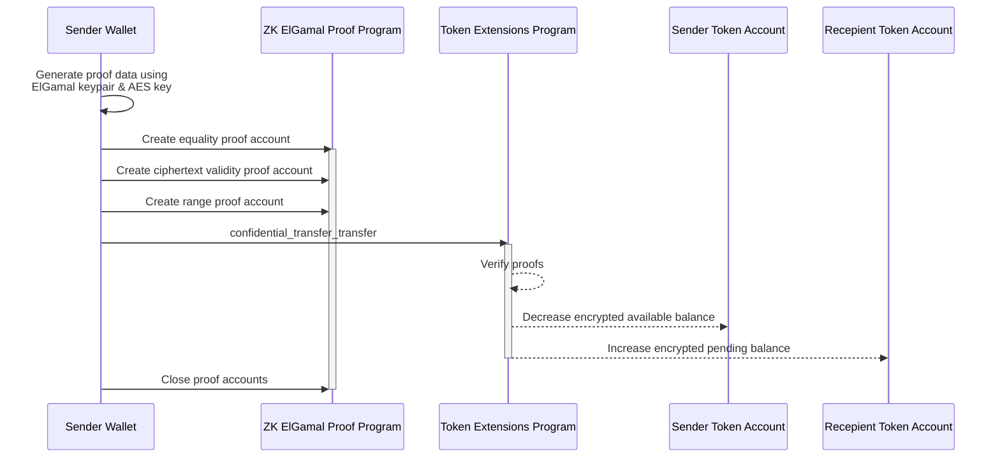

## Transfer tokens privately from one token account to another

To confidentially transfer tokens from one token account to another, both the
sender and recipient must have token accounts initialized with the
ConfidentialTransferAccount extension state and approved for confidential
transfers. The sender's token account must also have an available confidential
balance to transfer from.

To transfer tokens confidentially:

1. Create the necessary proofs on the client side:

   - Equality Proof: Verifies that the ciphertexts encrypting the transfer
     amount, which are encrypted separately under the sender's and receiver's
     encryption keys, encrypt the same value.
   - Ciphertext Validity Proof: Verifies that the ciphertext representing the
     transfer amount are properly generated according to the encryption scheme.
   - Range Proof: Verifies that the transfer amount falls within a valid range
     and is a non-negative value.

2. For each proof:

   - Invoke the ZK ElGamal proof program to verify the proof data.
   - The proof program stores metadata specific to each type of proof in a
     corresponding proof “context state” account for use in subsequent
     instructions.

3. Invoke the
   [ConfidentialTransferInstruction::Transfer](https://github.com/solana-program/token-2022/blob/efd0c957fefbd79882d77df5fb2dac88c001249c/program/src/extension/confidential_transfer/processor.rs#L604)
   instruction, providing the proof accounts.

4. Close the proof accounts to recover the SOL used for account rent

The following diagram shows the steps involved in transferring tokens from a
sender's token account to a recipient's token account.



### Required Instructions

To withdraw tokens from confidential available balance to public balance, you
must:

- Generate an equality proof, ciphertext validity proof, and range proof
  client-side
- Invoke the Zk ElGamal proof program to verify the proofs and initialize the
  "context state" accounts
- Invoke the
  [ConfidentialTransferInstruction::Transfer](https://github.com/solana-program/token-2022/blob/efd0c957fefbd79882d77df5fb2dac88c001249c/program/src/extension/confidential_transfer/processor.rs#L604)
  instruction providing the three proof accounts.
- Close the three proof accounts to recover rent.

The `spl_token_client` crate provides the following methods:

- `confidential_transfer_create_context_state_account` method that creates a
  proof account.
- `confidential_transfer_transfer` method that invokes the `Transfer`
  instruction.
- `confidential_transfer_close_context_state_account` method that closes a proof
  account.

### Example

```rust title="Rust"
use anyhow::{Context, Result};
use solana_client::nonblocking::rpc_client::RpcClient;
use solana_sdk::{
    commitment_config::CommitmentConfig,
    signature::{Keypair, Signer},
    transaction::Transaction,
};
use spl_associated_token_account::{
    get_associated_token_address_with_program_id, instruction::create_associated_token_account,
};
use spl_token_client::{
    client::{ProgramRpcClient, ProgramRpcClientSendTransaction},
    spl_token_2022::{
        extension::{
            confidential_transfer::instruction::{configure_account, PubkeyValidityProofData},
            BaseStateWithExtensions, ExtensionType,
        },
        id as token_2022_program_id,
        instruction::reallocate,
        solana_zk_sdk::encryption::{auth_encryption::*, elgamal::*},
    },
    token::{ExtensionInitializationParams, Token},
};
use spl_token_confidential_transfer_proof_extraction::instruction::{ProofData, ProofLocation};
use spl_token_confidential_transfer_proof_generation::withdraw::WithdrawProofData;
use std::sync::Arc;

#[tokio::main]
async fn main() -> Result<()> {
    // Create connection to Solana devnet
    // Wrap in Arc from the beginning so we can share it
    let rpc_client = Arc::new(RpcClient::new_with_commitment(
        String::from("http://localhost:8899"),
        CommitmentConfig::confirmed(),
    ));

    // Load the default Solana CLI keypair to use as the fee payer
    // This will be the wallet paying for the transaction fees
    // Use Arc to prevent multiple clones of the keypair
    let payer = Arc::new(load_keypair()?);
    println!("Using payer: {}", payer.pubkey());

    // Generate a new keypair to use as the address of the token mint
    let mint = Keypair::new();
    println!("Mint keypair generated: {}", mint.pubkey());

    // Set up program client for Token client
    // This wraps the RPC client with token program-specific functionality
    let program_client = ProgramRpcClient::new(rpc_client.clone(), ProgramRpcClientSendTransaction);

    // Number of decimals for the mint
    let decimals = 9;

    // Create a token client for the Token-2022 program
    // This provides high-level methods for token operations
    let token = Token::new(
        Arc::new(program_client),
        &token_2022_program_id(), // Use the Token-2022 program (newer version with extensions)
        &mint.pubkey(),           // Address of the new token mint
        Some(decimals),           // Number of decimal places
        payer.clone(),            // Fee payer for transactions (cloning Arc, not keypair)
    );

    // Create extension initialization parameters for the mint
    // The ConfidentialTransferMint extension enables confidential (private) transfers of tokens
    let extension_initialization_params =
        vec![ExtensionInitializationParams::ConfidentialTransferMint {
            authority: Some(payer.pubkey()), // Authority that can modify confidential transfer settings
            auto_approve_new_accounts: true, // Automatically approve new confidential accounts
            auditor_elgamal_pubkey: None,    // Optional auditor ElGamal public key
        }];

    // Create and initialize the mint with the ConfidentialTransferMint extension
    // This sends a transaction to create the new token mint
    let transaction_signature = token
        .create_mint(
            &payer.pubkey(),                 // Mint authority - can mint new tokens
            Some(&payer.pubkey()),           // Freeze authority - can freeze token accounts
            extension_initialization_params, // Add the ConfidentialTransferMint extension
            &[&mint],                        // Mint keypair needed as signer
        )
        .await?;

    // Print results for user verification
    println!("Mint Address: {}", mint.pubkey());
    println!(
        "Mint Creation Transaction Signature: {}",
        transaction_signature
    );

    // ===== Create and configure token account for confidential transfers =====
    println!("\nSetting up token account with confidential transfer capability...");

    // Get the associated token account address for the owner
    let token_account_pubkey = get_associated_token_address_with_program_id(
        &payer.pubkey(),          // Token account owner
        &mint.pubkey(),           // Mint
        &token_2022_program_id(), // Token program ID
    );
    println!("Token Account Address: {}", token_account_pubkey);

    // Step 1: Create the associated token account
    let create_associated_token_account_instruction = create_associated_token_account(
        &payer.pubkey(),          // Funding account
        &payer.pubkey(),          // Token account owner
        &mint.pubkey(),           // Mint
        &token_2022_program_id(), // Token program ID
    );

    // Step 2: Reallocate the token account to include space for the ConfidentialTransferAccount extension
    let reallocate_instruction = reallocate(
        &token_2022_program_id(),                      // Token program ID
        &token_account_pubkey,                         // Token account
        &payer.pubkey(),                               // Payer
        &payer.pubkey(),                               // Token account owner
        &[&payer.pubkey()],                            // Signers
        &[ExtensionType::ConfidentialTransferAccount], // Extension to reallocate space for
    )?;

    // Step 3: Generate the ElGamal keypair and AES key for token account
    let elgamal_keypair = ElGamalKeypair::new_from_signer(&payer, &token_account_pubkey.to_bytes())
        .expect("Failed to create ElGamal keypair");
    let aes_key = AeKey::new_from_signer(&payer, &token_account_pubkey.to_bytes())
        .expect("Failed to create AES key");

    // The maximum number of Deposit and Transfer instructions that can
    // credit pending_balance before the ApplyPendingBalance instruction is executed
    let maximum_pending_balance_credit_counter = 65536;

    // Initial token balance is 0
    let decryptable_balance = aes_key.encrypt(0);

    // Generate the proof data client-side
    let proof_data = PubkeyValidityProofData::new(&elgamal_keypair)
        .map_err(|_| anyhow::anyhow!("Failed to generate proof data"))?;

    // Indicate that proof is included in the same transaction
    let proof_location =
        ProofLocation::InstructionOffset(1.try_into()?, ProofData::InstructionData(&proof_data));

    // Step 4: Create instructions to configure the account for confidential transfers
    let configure_account_instructions = configure_account(
        &token_2022_program_id(),               // Program ID
        &token_account_pubkey,                  // Token account
        &mint.pubkey(),                         // Mint
        &decryptable_balance.into(),            // Initial balance
        maximum_pending_balance_credit_counter, // Maximum pending balance credit counter
        &payer.pubkey(),                        // Token Account Owner
        &[],                                    // Additional signers
        proof_location,                         // Proof location
    )?;

    // Combine all instructions
    let mut instructions = vec![
        create_associated_token_account_instruction,
        reallocate_instruction,
    ];
    instructions.extend(configure_account_instructions);

    // Create and send the transaction
    let recent_blockhash = rpc_client.get_latest_blockhash().await?;
    let transaction = Transaction::new_signed_with_payer(
        &instructions,
        Some(&payer.pubkey()),
        &[&*payer],
        recent_blockhash,
    );

    let setup_signature = rpc_client
        .send_and_confirm_transaction(&transaction)
        .await?;
    println!(
        "Token Account Setup Transaction Signature: {}",
        setup_signature
    );

    // Mint some tokens to the newly created token account
    // This gives the account some tokens to work with
    let mint_signature = token
        .mint_to(
            &token_account_pubkey,            // Destination account
            &payer.pubkey(),                  // Mint authority
            100 * 10u64.pow(decimals as u32), // Amount (100 tokens with decimal precision)
            &[&payer],                        // Signers
        )
        .await?;

    println!("Token Minting Transaction Signature: {}", mint_signature);

    // Deposit the tokens to confidential state
    // This converts regular tokens to confidential tokens
    println!("Depositing tokens to confidential state...");
    let deposit_signature = token
        .confidential_transfer_deposit(
            &token_account_pubkey,            // The token account
            &payer.pubkey(),                  // Authority (owner) of the account
            100 * 10u64.pow(decimals as u32), // Amount to deposit (100 tokens)
            decimals,                         // Decimals of the token
            &[&payer],                        // Signers (owner must sign)
        )
        .await?;

    println!(
        "Confidential Transfer Deposit Signature: {}",
        deposit_signature
    );

    // Apply the pending balance to make funds available
    println!("Applying pending balance...");
    let apply_signature = token
        .confidential_transfer_apply_pending_balance(
            &token_account_pubkey,    // The token account
            &payer.pubkey(),          // Authority (owner) of the account
            None,                     // Optional new decryptable available balance
            elgamal_keypair.secret(), // ElGamal secret key for decryption
            &aes_key,                 // AES key for encryption of balance and transfer amounts
            &[&payer],                // Signers (owner must sign)
        )
        .await?;

    println!("Apply Pending Balance Signature: {}", apply_signature);

    // ===== Withdraw half of the tokens from confidential state =====
    println!("\nWithdrawing tokens from confidential state...");

    // Calculate the withdraw amount (half of the deposited amount)
    let withdraw_amount = 50 * 10u64.pow(decimals as u32); // Half of the 100 tokens deposited

    // Get the token account data to access the confidential transfer extension
    let token_account = token.get_account_info(&token_account_pubkey).await?;

    // Unpack the ConfidentialTransferAccount extension portion of the token account data
    let extension_data = token_account.get_extension::<spl_token_2022::extension::confidential_transfer::ConfidentialTransferAccount>()?;

    // Confidential Transfer extension information needed to construct a `Withdraw` instruction
    let withdraw_account_info =
        spl_token_2022::extension::confidential_transfer::account_info::WithdrawAccountInfo::new(
            extension_data,
        );

    // Create keypairs for the proof accounts
    let equality_proof_context_state_keypair = Keypair::new();
    let equality_proof_context_state_pubkey = equality_proof_context_state_keypair.pubkey();
    let range_proof_context_state_keypair = Keypair::new();
    let range_proof_context_state_pubkey = range_proof_context_state_keypair.pubkey();

    // Create a withdraw proof data
    let WithdrawProofData {
        equality_proof_data,
        range_proof_data,
    } = withdraw_account_info.generate_proof_data(
        withdraw_amount,  // Amount to withdraw from confidential state
        &elgamal_keypair, // ElGamal keypair for public-key cryptography (decryption and ZK proofs)
        &aes_key,         // AES key for encryption of balance and transfer amounts
    )?;

    // Generate the equality proof account
    println!("Creating equality proof context state account...");
    let equality_proof_signature = token
        .confidential_transfer_create_context_state_account(
            &equality_proof_context_state_pubkey, // Public key of the new equality proof context state account
            &payer.pubkey(), // Authority that can close the context state account
            &equality_proof_data, // Proof data for the equality proof verification
            false, // False: combine account creation and proof verification in one transaction
            &[&equality_proof_context_state_keypair], // Signer for the new account
        )
        .await?;
    println!(
        "Equality Proof Context State Account Signature: {}",
        equality_proof_signature
    );

    // Generate the range proof account
    println!("Creating range proof context state account...");
    let range_proof_signature = token
        .confidential_transfer_create_context_state_account(
            &range_proof_context_state_pubkey, // Public key of the new range proof context state account
            &payer.pubkey(),                   // Authority that can close the context state account
            &range_proof_data,                 // Proof data for the range proof verification
            true, // True: split account creation and proof verification into separate transactions (for large proofs)
            &[&range_proof_context_state_keypair], // Signer for the new account
        )
        .await?;
    println!(
        "Range Proof Context State Account Signature: {}",
        range_proof_signature
    );

    // Perform the withdrawal
    println!("Executing withdrawal transaction...");
    let withdraw_signature = token
        .confidential_transfer_withdraw(
            &token_account_pubkey, // Token account to withdraw from
            &payer.pubkey(),       // Owner of the token account
            Some(&spl_token_client::token::ProofAccount::ContextAccount(
                equality_proof_context_state_pubkey, // Reference to the equality proof account
            )),
            Some(&spl_token_client::token::ProofAccount::ContextAccount(
                range_proof_context_state_pubkey, // Reference to the range proof account
            )),
            withdraw_amount,             // Amount to withdraw from confidential state
            decimals,                    // Decimal precision of the token
            Some(withdraw_account_info), // Data from confidential transfer extension for proof verification
            &elgamal_keypair, // ElGamal keypair for public-key cryptography (decryption and ZK proofs)
            &aes_key,         // AES key for encryption of balance and transfer amounts
            &[&payer],        // Owner must sign the transaction
        )
        .await?;
    println!("Withdraw Transaction Signature: {}", withdraw_signature);

    // Close the context state accounts to recover rent
    println!("Closing equality proof context state account...");
    let close_equality_signature = token
        .confidential_transfer_close_context_state_account(
            &equality_proof_context_state_pubkey, // Equality proof context state account to close
            &token_account_pubkey,                // Account that will receive the lamports
            &payer.pubkey(),                      // Authority allowed to close the account
            &[&payer],                            // Authority must sign
        )
        .await?;
    println!(
        "Close Equality Proof Account Signature: {}",
        close_equality_signature
    );

    println!("Closing range proof context state account...");
    let close_range_signature = token
        .confidential_transfer_close_context_state_account(
            &range_proof_context_state_pubkey, // Range proof context state account to close
            &token_account_pubkey,             // Account that will receive the lamports
            &payer.pubkey(),                   // Authority allowed to close the account
            &[&payer],                         // Authority must sign
        )
        .await?;
    println!(
        "Close Range Proof Account Signature: {}",
        close_range_signature
    );

    // ===== Create a second token account for confidential transfers =====
    println!("\nCreating second token account for confidential transfers...");

    // Create a new keypair to use as the second account owner
    let second_owner = Keypair::new();
    println!("Second account owner: {}", second_owner.pubkey());

    // Fund the second owner account with SOL for transaction fees
    let fund_signature = rpc_client
        .send_and_confirm_transaction(&Transaction::new_signed_with_payer(
            &[solana_sdk::system_instruction::transfer(
                &payer.pubkey(),
                &second_owner.pubkey(),
                1_000_000_000, // 1 SOL
            )],
            Some(&payer.pubkey()),
            &[&*payer],
            rpc_client.get_latest_blockhash().await?,
        ))
        .await?;
    println!("Fund Second Owner Signature: {}", fund_signature);

    // Get the associated token account address for the second owner
    let second_token_account_pubkey = get_associated_token_address_with_program_id(
        &second_owner.pubkey(),   // Token account owner
        &mint.pubkey(),           // Same mint as before
        &token_2022_program_id(), // Token program ID
    );
    println!(
        "Second Token Account Address: {}",
        second_token_account_pubkey
    );

    // Step 1: Create the associated token account
    let create_associated_token_account_instruction = create_associated_token_account(
        &payer.pubkey(),          // Funding account
        &second_owner.pubkey(),   // Token account owner
        &mint.pubkey(),           // Mint
        &token_2022_program_id(), // Token program ID
    );

    // Step 2: Reallocate the token account to include space for the ConfidentialTransferAccount extension
    let reallocate_instruction = reallocate(
        &token_2022_program_id(),                      // Token program ID
        &second_token_account_pubkey,                  // Token account
        &payer.pubkey(),                               // Payer
        &second_owner.pubkey(),                        // Token account owner
        &[&second_owner.pubkey()],                     // Signers
        &[ExtensionType::ConfidentialTransferAccount], // Extension to reallocate space for
    )?;

    // Step 3: Generate the ElGamal keypair and AES key for second token account
    let second_elgamal_keypair =
        ElGamalKeypair::new_from_signer(&second_owner, &second_token_account_pubkey.to_bytes())
            .expect("Failed to create ElGamal keypair");

    let second_aes_key =
        AeKey::new_from_signer(&second_owner, &second_token_account_pubkey.to_bytes())
            .expect("Failed to create AES key");

    // Maximum pending balance credit counter, same as before
    let maximum_pending_balance_credit_counter = 65536;

    // Initial token balance is 0
    let decryptable_balance = second_aes_key.encrypt(0);

    // Generate the proof data client-side
    let proof_data = PubkeyValidityProofData::new(&second_elgamal_keypair)
        .map_err(|_| anyhow::anyhow!("Failed to generate proof data"))?;

    // Indicate that proof is included in the same transaction
    let proof_location =
        ProofLocation::InstructionOffset(1.try_into()?, ProofData::InstructionData(&proof_data));

    // Step 4: Create instructions to configure the account for confidential transfers
    let configure_account_instructions = configure_account(
        &token_2022_program_id(),               // Program ID
        &second_token_account_pubkey,           // Token account
        &mint.pubkey(),                         // Mint
        &decryptable_balance.into(),            // Initial balance
        maximum_pending_balance_credit_counter, // Maximum pending balance credit counter
        &second_owner.pubkey(),                 // Token Account Owner
        &[],                                    // Additional signers
        proof_location,                         // Proof location
    )?;

    // Combine all instructions
    let mut instructions = vec![
        create_associated_token_account_instruction,
        reallocate_instruction,
    ];
    instructions.extend(configure_account_instructions);

    // Create and send the transaction
    let recent_blockhash = rpc_client.get_latest_blockhash().await?;
    let transaction = Transaction::new_signed_with_payer(
        &instructions,
        Some(&payer.pubkey()),
        &[&*payer, &second_owner],
        recent_blockhash,
    );

    let setup_signature = rpc_client
        .send_and_confirm_transaction(&transaction)
        .await?;
    println!(
        "Second Token Account Setup Transaction Signature: {}",
        setup_signature
    );

    // ===== Perform a confidential transfer from first account to second account =====
    println!("\nPerforming confidential transfer between accounts...");

    // We still have 50 tokens in the first account after the withdrawal
    let transfer_amount = 25 * 10u64.pow(decimals as u32); // Transfer 25 tokens

    // Create a transfer proof data for verifying the transaction
    // Get the token account data to access the confidential transfer extension
    let token_account = token.get_account_info(&token_account_pubkey).await?;
    let extension_data = token_account.get_extension::<spl_token_2022::extension::confidential_transfer::ConfidentialTransferAccount>()?;

    // Create TransferAccountInfo from the extension data
    let transfer_account_info =
        spl_token_2022::extension::confidential_transfer::account_info::TransferAccountInfo::new(
            extension_data,
        );

    // Generate the proof data for the transfer
    let transfer_proof_data = transfer_account_info.generate_split_transfer_proof_data(
        transfer_amount,
        &elgamal_keypair,
        &aes_key,
        second_elgamal_keypair.pubkey(),
        None, // auditor ElGamal public key (optional)
    )?;

    // Create proof context accounts
    let equality_proof_context_state_keypair = Keypair::new();
    let equality_proof_context_state_pubkey = equality_proof_context_state_keypair.pubkey();

    let ciphertext_validity_proof_context_state_keypair = Keypair::new();
    let ciphertext_validity_proof_context_state_pubkey =
        ciphertext_validity_proof_context_state_keypair.pubkey();

    let range_proof_context_state_keypair = Keypair::new();
    let range_proof_context_state_pubkey = range_proof_context_state_keypair.pubkey();

    // Create context state account for equality proof
    println!("Creating equality proof context state account for transfer...");
    let equality_proof_signature = token
        .confidential_transfer_create_context_state_account(
            &equality_proof_context_state_pubkey, // Public key of the new equality proof context state account
            &payer.pubkey(), // Authority that can close the context state account
            &transfer_proof_data.equality_proof_data, // Proof data for the equality proof verification
            false, // False: combine account creation and proof verification in one transaction
            &[&equality_proof_context_state_keypair], // Signer for the new account
        )
        .await?;
    println!(
        "Transfer Equality Proof Account Signature: {}",
        equality_proof_signature
    );

    // Create context state account for ciphertext validity proof
    println!("Creating ciphertext validity proof context state account...");
    let ciphertext_proof_signature = token
        .confidential_transfer_create_context_state_account(
            &ciphertext_validity_proof_context_state_pubkey, // Public key of the new ciphertext validity proof context state account
            &payer.pubkey(), // Authority that can close the context state account
            &transfer_proof_data
                .ciphertext_validity_proof_data_with_ciphertext
                .proof_data, // Proof data for the ciphertext validity proof verification
            false, // False: combine account creation and proof verification in one transaction
            &[&ciphertext_validity_proof_context_state_keypair], // Signer for the new account
        )
        .await?;
    println!(
        "Ciphertext Validity Proof Account Signature: {}",
        ciphertext_proof_signature
    );

    // Create context state account for range proof
    println!("Creating range proof context state account...");
    let range_proof_signature = token
        .confidential_transfer_create_context_state_account(
            &range_proof_context_state_pubkey, // Public key of the new range proof context state account
            &payer.pubkey(),                   // Authority that can close the context state account
            &transfer_proof_data.range_proof_data, // Proof data for the range proof verification
            true, // True: split account creation and proof verification into separate transactions (for large proofs)
            &[&range_proof_context_state_keypair], // Signer for the new account
        )
        .await?;
    println!("Range Proof Account Signature: {}", range_proof_signature);

    // Execute the confidential transfer
    println!("Executing confidential transfer transaction...");
    // Create a ProofAccountWithCiphertext for the ciphertext validity proof
    let ciphertext_validity_proof_account_with_ciphertext =
        spl_token_client::token::ProofAccountWithCiphertext {
            proof_account: spl_token_client::token::ProofAccount::ContextAccount(
                ciphertext_validity_proof_context_state_pubkey,
            ),
            ciphertext_lo: transfer_proof_data
                .ciphertext_validity_proof_data_with_ciphertext
                .ciphertext_lo,
            ciphertext_hi: transfer_proof_data
                .ciphertext_validity_proof_data_with_ciphertext
                .ciphertext_hi,
        };

    let transfer_signature = token
        .confidential_transfer_transfer(
            &token_account_pubkey,        // Source account
            &second_token_account_pubkey, // Destination account
            &payer.pubkey(),              // Authority (owner) of source account
            Some(&spl_token_client::token::ProofAccount::ContextAccount(
                equality_proof_context_state_pubkey, // Reference to the equality proof account
            )),
            Some(&ciphertext_validity_proof_account_with_ciphertext),
            Some(&spl_token_client::token::ProofAccount::ContextAccount(
                range_proof_context_state_pubkey, // Reference to the range proof account
            )),
            transfer_amount,                 // Amount to transfer
            None,                            // Custom data for verification (optional)
            &elgamal_keypair,                // ElGamal keypair for source account
            &aes_key,                        // AES key for source account
            second_elgamal_keypair.pubkey(), // ElGamal public key of destination account
            None,                            // Auditor ElGamal public key (optional)
            &[&payer],                       // Signers
        )
        .await?;
    println!("Confidential Transfer Signature: {}", transfer_signature);

    // Apply pending balance on the second account to make transferred funds available
    println!("Applying pending balance on second account...");
    let apply_signature = token
        .confidential_transfer_apply_pending_balance(
            &second_token_account_pubkey,    // The token account
            &second_owner.pubkey(),          // Authority (owner) of the account
            None,                            // Optional new decryptable available balance
            second_elgamal_keypair.secret(), // ElGamal secret key for decryption
            &second_aes_key,                 // AES key for encryption
            &[&second_owner],                // Signers (owner must sign)
        )
        .await?;
    println!(
        "Second Account Apply Pending Balance Signature: {}",
        apply_signature
    );

    // Close the context state accounts to recover rent
    println!("Closing equality proof context state account...");
    let close_equality_signature = token
        .confidential_transfer_close_context_state_account(
            &equality_proof_context_state_pubkey, // Equality proof context state account to close
            &token_account_pubkey,                // Account that will receive the lamports
            &payer.pubkey(),                      // Authority allowed to close the account
            &[&payer],                            // Authority must sign
        )
        .await?;
    println!(
        "Close Transfer Equality Proof Account Signature: {}",
        close_equality_signature
    );

    println!("Closing ciphertext validity proof context state account...");
    let close_ciphertext_signature = token
        .confidential_transfer_close_context_state_account(
            &ciphertext_validity_proof_context_state_pubkey, // Ciphertext validity proof context state account to close
            &token_account_pubkey, // Account that will receive the lamports
            &payer.pubkey(),       // Authority allowed to close the account
            &[&payer],             // Authority must sign
        )
        .await?;
    println!(
        "Close Ciphertext Validity Proof Account Signature: {}",
        close_ciphertext_signature
    );

    println!("Closing range proof context state account...");
    let close_range_signature = token
        .confidential_transfer_close_context_state_account(
            &range_proof_context_state_pubkey, // Range proof context state account to close
            &token_account_pubkey,             // Account that will receive the lamports
            &payer.pubkey(),                   // Authority allowed to close the account
            &[&payer],                         // Authority must sign
        )
        .await?;
    println!(
        "Close Range Proof Account Signature: {}",
        close_range_signature
    );

    println!("\nConfidential transfer completed successfully!");
    println!("First Account (post-transfer): {}", token_account_pubkey);
    println!(
        "Second Account (post-transfer): {}",
        second_token_account_pubkey
    );

    Ok(())
}

// Load the keypair from the default Solana CLI keypair path (~/.config/solana/id.json)
// This enables using the same wallet as the Solana CLI tools
fn load_keypair() -> Result<Keypair> {
    // Get the default keypair path
    let keypair_path = dirs::home_dir()
        .context("Could not find home directory")?
        .join(".config/solana/id.json");

    // Read the keypair file directly into bytes using serde_json
    // The keypair file is a JSON array of bytes
    let file = std::fs::File::open(&keypair_path)?;
    let keypair_bytes: Vec<u8> = serde_json::from_reader(file)?;

    // Create keypair from the loaded bytes
    // This converts the byte array into a keypair
    let keypair = Keypair::from_bytes(&keypair_bytes)?;

    Ok(keypair)
}
```
