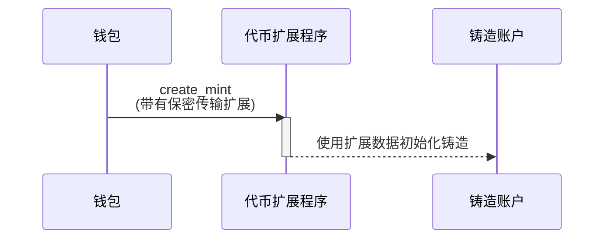

## 如何创建带有保密传输扩展的铸造

保密传输扩展通过向铸造账户添加额外状态来实现私密代币转账。本节将解释如何创建启用此扩展的代币铸造。

以下图表展示了创建带有保密传输扩展的铸造所涉及的步骤：



### 保密传输铸造状态

该扩展向铸造账户添加了
[ConfidentialTransferMint](https://github.com/solana-program/token-2022/blob/efd0c957fefbd79882d77df5fb2dac88c001249c/program/src/extension/confidential_transfer/mod.rs#L48-L69)
状态：

```rust title="Confidential Mint State"
#[repr(C)]
#[derive(Clone, Copy, Debug, Default, PartialEq, Pod, Zeroable)]
pub struct ConfidentialTransferMint {
    /// Authority to modify the `ConfidentialTransferMint` configuration and to
    /// approve new accounts (if `auto_approve_new_accounts` is true)
    ///
    /// The legacy Token Multisig account is not supported as the authority
    pub authority: OptionalNonZeroPubkey,

    /// Indicate if newly configured accounts must be approved by the
    /// `authority` before they may be used by the user.
    ///
    /// * If `true`, no approval is required and new accounts may be used
    ///   immediately
    /// * If `false`, the authority must approve newly configured accounts (see
    ///   `ConfidentialTransferInstruction::ConfigureAccount`)
    pub auto_approve_new_accounts: PodBool,

    /// Authority to decode any transfer amount in a confidential transfer.
    pub auditor_elgamal_pubkey: OptionalNonZeroElGamalPubkey,
}
```

这个 *rs`ConfidentialTransferMint`* 包含三个配置字段：

* **authority**: 有权更改铸造保密传输设置并在自动批准被禁用时批准新保密账户的账户。

* **auto\_approve\_new\_accounts**：当设置为 true 时，用户可以创建默认启用机密转账的代币账户。当设置为 false 时，授权方必须在每个新代币账户用于机密转账前批准它。

* **auditor\_elgamal\_pubkey**：一个可选的审计员，能够解密机密交易中的转账金额，在保持对公众隐私的同时提供合规机制。

### 必需指令

创建启用机密转账的代币需要在单个交易中执行三个指令：

1. **创建代币账户**：调用系统程序的
   *rs`CreateAccount`*&#x6307;令来创建代币账户。

2. **初始化机密转账扩展**：调用代币扩展程序的
   [ConfidentialTransferInstruction::InitializeMint](https://github.com/solana-program/token-2022/blob/efd0c957fefbd79882d77df5fb2dac88c001249c/program/src/extension/confidential_transfer/processor.rs#L48)指令来配置代币的
   *rs`ConfidentialTransferMint`* 状态。

3. **初始化代币**：调用代币扩展程序的 *rs`Instruction::InitializeMint`*
   指令来初始化标准代币状态。

虽然你可以手动编写这些指令，但 `spl_token_client` crate提供了一个 `create_mint`
方法，该方法可以在单个函数调用中构建并发送包含全部三个指令的交易，如下面的示例所示。

### 示例代码

以下代码演示了如何创建具有机密传输扩展的代币铸造。

要运行此示例，请使用以下命令从主网克隆代币扩展程序启动本地验证器。您必须安装Solana
CLI才能启动本地验证器。

```terminal
$ solana-test-validator --clone-upgradeable-program TokenzQdBNbLqP5VEhdkAS6EPFLC1PHnBqCXEpPxuEb --url https://api.mainnet-beta.solana.com -r
```

<Callout type="info">
  在撰写本文时，默认本地验证器上尚未启用机密传输功能。您必须克隆主网上的代币扩展程序才能
  运行示例代码。
</Callout>

<CodeTabs flags="r">
  ```rust !! title="main.rs"
  use anyhow::{Context, Result};
  use solana_client::nonblocking::rpc_client::RpcClient;
  use solana_sdk::{
      commitment_config::CommitmentConfig,
      signature::{Keypair, Signer},
  };
  use spl_token_client::{
      client::{ProgramRpcClient, ProgramRpcClientSendTransaction},
      spl_token_2022::id as token_2022_program_id,
      token::{ExtensionInitializationParams, Token},
  };
  use std::sync::Arc;

  #[tokio::main] async fn main() -> Result<()> { // 创建连接到本地测试验证器 let
  rpc_client = RpcClient::new_with_commitment(
  String::from("http://localhost:8899"), CommitmentConfig::confirmed(), );

      // 加载默认的Solana CLI密钥对作为费用支付者
      // 这将是支付交易费用的钱包
      // 使用Arc防止密钥对被多次克隆
      let payer = Arc::new(load_keypair()?);
      println!("Using payer: {}", payer.pubkey());

      // 生成一个新的密钥对作为代币铸造的地址
      let mint = Keypair::new();
      println!("Mint keypair generated: {}", mint.pubkey());

      // 为Token客户端设置程序客户端
      let program_client =
          ProgramRpcClient::new(Arc::new(rpc_client), ProgramRpcClientSendTransaction);

      // 铸造的小数位数
      let decimals = 9;

      // 为Token-2022程序创建一个代币客户端
      // 这提供了代币操作的高级方法
      let token = Token::new(
          Arc::new(program_client),
          &token_2022_program_id(), // 使用Token-2022程序（带扩展的新版本）
          &mint.pubkey(),           // 新代币铸造的地址
          Some(decimals),           // 小数位数
          payer.clone(),            // 交易费用支付者（克隆Arc，而非密钥对）
      );

      // 创建扩展初始化参数
      // ConfidentialTransferMint扩展启用代币的机密（私密）传输
      let extension_initialization_params =
          vec![ExtensionInitializationParams::ConfidentialTransferMint {
              authority: Some(payer.pubkey()), // 可以修改机密传输设置的权限
              auto_approve_new_accounts: true, // 自动批准新的机密账户
              auditor_elgamal_pubkey: None,    // 可选的审计员ElGamal公钥
          }];

      // 创建并初始化带有ConfidentialTransferMint扩展的铸造
      // 这会发送一个交易来创建新的代币铸造
      let transaction_signature = token
          .create_mint(
              &payer.pubkey(),                 // 铸造权限 - 可以铸造新代币
              Some(&payer.pubkey()),           // 冻结权限 - 可以冻结代币账户
              extension_initialization_params, // 添加ConfidentialTransferMint扩展
              &[&mint],                        // 需要铸造密钥对作为签名者
          )
          .await?;

      // 打印结果供用户验证
      println!("Mint Address: {}", mint.pubkey());
      println!("Transaction Signature: {}", transaction_signature);

      Ok(())

  }

  // 从默认的Solana
  CLI密钥对路径(~/.config/solana/id.json)加载密钥对 // 这使得可以使用与Solana
  CLI工具相同的钱包fn load_keypair() -> Result<Keypair> {
  // 获取默认密钥对路径 let keypair_path = dirs::home_dir() .context("Could not
  find home directory")? .join(".config/solana/id.json");

      // 使用serde_json直接将密钥对文件读入字节
      // 密钥对文件是一个字节的JSON数组
      let file = std::fs::File::open(&keypair_path)?;
      let keypair_bytes: Vec<u8> = serde_json::from_reader(file)?;

      // 从加载的字节创建密钥对
      // 这将字节数组转换为密钥对
      let keypair = Keypair::from_bytes(&keypair_bytes)?;

      Ok(keypair)

  }

  ```

  ```toml !! title="Cargo.toml"
  [package]
  name = "confidential-transfer"
  version = "0.1.0"
  edition = "2021"

  [dependencies]
  [package]
  name = "confidential-transfer"
  version = "0.1.0"
  edition = "2021"

  [dependencies]
  solana-client = "2.2.2"
  solana-sdk = "2.2.2"
  spl-associated-token-account = "6.0.0"
  spl-token-client = "0.14.0"
  spl-token-confidential-transfer-proof-extraction = "0.2.1"
  spl-token-confidential-transfer-proof-generation = "0.3.0"

  anyhow = "1.0.95"
  dirs = "6.0.0"
  serde_json = "1.0.135"
  tokio = { version = "1.44.2", features = ["full"] }
  ```
</CodeTabs>
