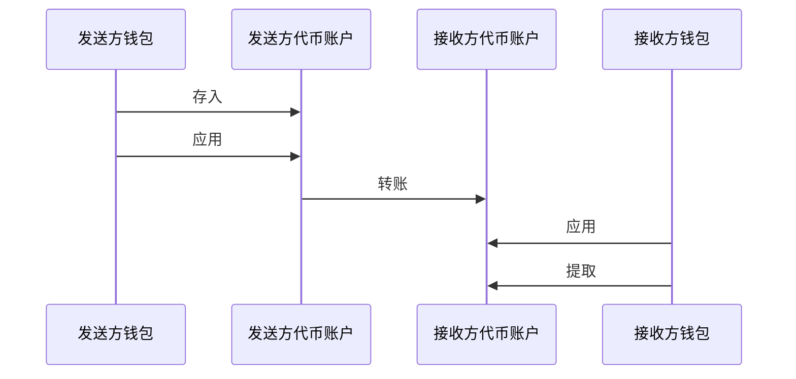
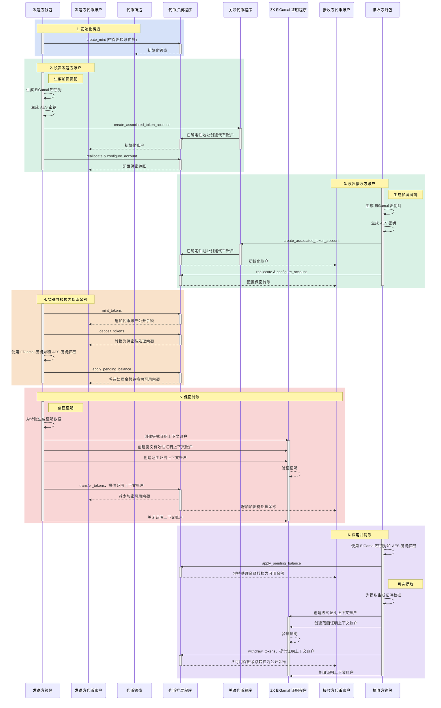

## 什么是保密转账？

保密转账使您能够在代币账户之间转移代币，而无需透露转账金额。这对于保护隐私的交易非常有用。只有转账金额和代币余额是私密的。代币账户地址仍然是公开的。

* [协议概述](https://www.solana-program.com/docs/confidential-balances/overview) - 底层加密协议的详细信息
* [快速入门指南](https://www.solana-program.com/docs/confidential-balances#setup) - 设置和基本CLI命令
* [保密余额使用指南](https://github.com/solana-developers/Confidential-Balances-Sample) - 如何使用保密转账扩展的代码片段

### 它是如何工作的？

保密转账扩展为代币扩展程序添加了
[指令](https://github.com/solana-program/token-2022/blob/efd0c957fefbd79882d77df5fb2dac88c001249c/program/src/extension/confidential_transfer/instruction.rs#L29)
，允许您在账户之间转移代币而不透露转账金额。



保密代币转账的基本流程如下：

1. 创建带有保密转账扩展的铸造账户。
2. 为发送方和接收方创建带有保密转账扩展的代币账户。
3. 向发送方账户铸造代币。
4. **存入** 发送方的公开余额到 **保密待处理余额**。
5. **应用** 发送方的待处理余额到 **保密可用余额**。
6. 保密地**转账**代币从发送者代币账户到接收者代币账户。
7. **应用**接收者的待处理余额到**保密可用余额**。
8. **提取**接收者的保密可用余额到**公开余额**。

有关保密转账流程各步骤的更多详情，请参阅相应页面：

<Cards>
  <Card title="创建铸币账户" href="/docs/tokens/extensions/confidential-transfer/create-mint">
    如何创建带有保密转账扩展的铸币账户
  </Card>

  <Card title="创建代币账户" href="/docs/tokens/extensions/confidential-transfer/create-token-account">
    如何配置带有保密转账扩展的代币账户
  </Card>

  <Card title="存入代币" href="/docs/tokens/extensions/confidential-transfer/deposit-tokens">
    如何将代币存入保密待处理余额
  </Card>

  <Card title="应用待处理余额" href="/docs/tokens/extensions/confidential-transfer/apply-pending-balance">
    如何将待处理余额应用到可用保密余额
  </Card>

  <Card title="提取代币" href="/docs/tokens/extensions/confidential-transfer/withdraw-tokens">
    如何从保密可用余额中提取代币
  </Card>

  <Card title="转账代币" href="/docs/tokens/extensions/confidential-transfer/transfer-tokens">
    如何在代币账户之间进行保密转账
  </Card>
</Cards>

下图展示了保密代币转账基本流程的详细序列：



### 示例代码

下面的 Rust 示例展示了与前面图表对应的保密代币转账步骤。这些步骤被分解为辅助函数以便于理解。

要运行此示例，请使用以下命令启动一个从主网克隆的带有代币扩展程序的本地验证器。您必须安装 Solana
CLI 才能使用本地验证器。

```terminal
$ solana-test-validator --clone-upgradeable-program TokenzQdBNbLqP5VEhdkAS6EPFLC1PHnBqCXEpPxuEb --url https://api.mainnet-beta.solana.com -r
```

<Callout type="信息">
  在撰写本文时，保密转账功能尚未在默认的本地验证器上启用。您必须克隆主网的代币扩展程序以运行示例代码。
</Callout>

<CodeTabs flags="代码">
  ```rust !! title="main.rs"
  use anyhow::{Context, Result};
  use solana_client::nonblocking::rpc_client::RpcClient;
  use solana_sdk::{
      commitment_config::CommitmentConfig,
      signature::{Keypair, Signer},
      transaction::Transaction,
      pubkey::Pubkey
  };
  use spl_associated_token_account::{
      get_associated_token_address_with_program_id, instruction::create_associated_token_account,
  };
  use spl_token_client::{
      client::{ProgramRpcClient, ProgramRpcClientSendTransaction},
      spl_token_2022::{
          extension::{
              confidential_transfer::{
                  instruction::{configure_account, PubkeyValidityProofData},
                  account_info::{WithdrawAccountInfo, TransferAccountInfo},
                  ConfidentialTransferAccount,
              },
              BaseStateWithExtensions, ExtensionType,
          },
          id as token_2022_program_id,
          instruction::reallocate,
          solana_zk_sdk::encryption::{auth_encryption::*, elgamal::*},
      },
      token::{ExtensionInitializationParams, Token},
  };
  use spl_token_confidential_transfer_proof_extraction::instruction::{ProofData, ProofLocation};
  use spl_token_confidential_transfer_proof_generation::withdraw::WithdrawProofData;
  use std::sync::Arc;

  /// 定义一个代币客户端的类型别名以简化类型签名 type TokenClient =
  Token<ProgramRpcClientSendTransaction>;

  /// 演示保密代币的完整生命周期：/// - 创建带有保密转账扩展的代币 /// - 创建配置为保密转账的代币账户 /// - 铸造代币 /// - 将代币从公共余额存入保密待处理余额 /// - 将待处理余额应用为可用余额 /// - 在代币账户之间保密转账代币 /// - 从保密可用余额中提取代币到公共余额 #[tokio::main]
  async fn main() -> Result<()> {
  // 创建与本地测试验证器的连接，使用确认的承诺级别 // 这确保交易在继续之前已被确认 let
  rpc_client = Arc::new(RpcClient::new_with_commitment(
  String::from("http://localhost:8899"), CommitmentConfig::confirmed(), ));

      // 加载默认的 Solana CLI 密钥对以用作费用支付者
      let payer = Arc::new(load_keypair()?);
      println!("支付者: {}", payer.pubkey());

      // 为代币生成一个新的密钥对
      // 此公钥将是代币的地址
      let mint = Keypair::new();
      println!("生成的代币密钥对: {}", mint.pubkey());

      // 代币的小数位数
      // 这决定了代币的最小单位（例如，2 位小数表示最小单位为 0.01）
      let decimals = 2;

      // 创建一个程序客户端
      let program_client = ProgramRpcClient::new(rpc_client.clone(), ProgramRpcClientSendTransaction);

      // 创建一个代币客户端
      // 此客户端提供与代币程序交互的高级方法
      let token = Token::new(
          Arc::new(program_client),
          &token_2022_program_id(),
          &mint.pubkey(),
          Some(decimals),
          payer.clone(),
      );

      // 创建一个带有保密转账扩展的代币
      // 这初始化了启用保密转账的代币
      create_mint(&token, &mint, payer.clone()).await?;

      // 创建第一个代币账户（发送者）
      // 此账户将用于保密发送代币
      let (sender_pubkey, sender_elgamal_keypair, sender_aes_key) = create_token_account(
          rpc_client.clone(),
          payer.clone(),
          &mint,
          payer.clone(),
          &token_2022_program_id(),
      )
      .await?;

      // 创建第二个代币账户（接收者），并分配一个新所有者
      // 此账户将保密接收代币
      let recipient_owner = Arc::new(Keypair::new());
      println!("接收者所有者: {}", recipient_owner.pubkey());

      // 为接收者所有者账户提供 SOL
      // 这确保接收者可以支付交易费用
      fund_account(
          rpc_client.clone(),
          payer.clone(),
          &recipient_owner.pubkey(),
          10_000_000, // 0.01 SOL in lamports
      )
      .await?;

      // 创建接收者代币账户
      // 此账户将从发送者接收代币
      let (recipient_pubkey, recipient_elgamal_keypair, recipient_aes_key) = create_token_account(
          rpc_client.clone(),
          recipient_owner.clone(),
          &mint,
          recipient_owner.clone(),
          &token_2022_program_id(),
      )
      .await?;

      // 铸造代币到发送者账户
      // 这创建了新的代币并增加了发送者代币账户的公共余额
      let amount = 100 * 10u64.pow(decimals as u32); // 100 tokens
      mint_tokens(&token, &sender_pubkey, &payer, amount).await?;

      // 存入代币到保密待处理余额
      // 这将公共余额转换为保密待处理余额
      deposit_tokens(&token, &sender_pubkey, &payer, amount, decimals).await?;

      // 应用待处理余额以使资金可用
      // 这将保密待处理余额转换为保密可用余额
      apply_pending_balance(
          &token,
          &sender_pubkey,
          &payer,
          &sender_elgamal_keypair,
          &sender_aes_key,
      )
      .await?;

      // 从发送者转账代币到接收者
      // 这将代币从发送者代币账户保密发送到接收者代币账户
      let transfer_amount = 50 * 10u64.pow(decimals as u32); // 50 tokens
      transfer_tokens(
          &token,
          &sender_pubkey,
          &payer,
          &sender_elgamal_keypair,
          &sender_aes_key,
          &recipient_pubkey,
          recipient_elgamal_keypair.pubkey(),
          transfer_amount,
          payer.clone(),
      )
      .await?;

      // 应用接收者代币账户的待处理余额
      // 这将保密待处理余额转换为保密可用余额
      apply_pending_balance(
          &token,
          &recipient_pubkey,
          &recipient_owner,
          &recipient_elgamal_keypair,
          &recipient_aes_key,
      )
      .await?;

      // 从接收者的保密可用余额中提取一半代币
      // 这将保密可用余额转换为公共余额
      let withdraw_amount = 25 * 10u64.pow(decimals as u32); // 一半的 50 tokens
      withdraw_tokens(
          &token,
          &recipient_pubkey,
          &recipient_owner,
          &recipient_elgamal_keypair,
          &recipient_aes_key,
          withdraw_amount,
          recipient_owner.clone(),
          decimals,
      )
      .await?;

      println!("\n所有操作已成功完成！");
      println!("发送者账户: {}", sender_pubkey);
      println!("接收者账户: {}", recipient_pubkey);

      Ok(())

  }

  ```

  ```toml !! title="Cargo.toml"
  [package]
  name = "confidential-transfer"
  version = "0.1.0"
  edition = "2021"

  [dependencies]
  solana-client = "2.2.2"
  solana-sdk = "2.2.2"
  spl-associated-token-account = "6.0.0"
  spl-token-client = "0.14.0"
  spl-token-confidential-transfer-proof-extraction = "0.2.1"
  spl-token-confidential-transfer-proof-generation = "0.3.0"

  anyhow = "1.0.95"
  dirs = "6.0.0"
  serde_json = "1.0.135"
  tokio = { version = "1.44.2", features = ["full"] }
  ```
</CodeTabs>

## 保密转账指令

保密转账扩展的完整指令列表[指令](https://github.com/solana-program/token-2022/blob/efd0c957fefbd79882d77df5fb2dac88c001249c/program/src/extension/confidential_transfer/instruction.rs#L29)如下：

| 指令                                 | 描述                                                                                       |
| ---------------------------------- | ---------------------------------------------------------------------------------------- |
| *rs`InitializeMint`*               | 为保密转账设置铸币账户。此指令必须与*rs`TokenInstruction::InitializeMint`*&#x6307;令包含在同一交易中。               |
| *rs`UpdateMint`*                   | 更新铸币的保密转账设置。                                                                             |
| *rs`ConfigureAccount`*             | 为保密转账设置代币账户。                                                                             |
| *rs`ApproveAccount`*               | 如果铸币要求对新代币账户进行批准，则批准代币账户进行保密转账。                                                          |
| *rs`EmptyAccount`*                 | 清空待处理和可用的保密余额，以允许关闭代币账户。                                                                 |
| *rs`存入`*                           | 将公开代币余额转换为待处理的机密余额。                                                                      |
| *rs`提取`*                           | 将可用的机密余额转换回公开余额。                                                                         |
| *rs`转账`*                           | 在代币账户之间进行机密转账。                                                                           |
| *rs`应用待处理余额`*                      | 在存款或转账后将待处理余额转换为可用余额。                                                                    |
| *rs`启用机密入账`*                       | 允许代币账户接收机密代币转账。                                                                          |
| *rs`禁用机密入账`*                       | 阻止接收机密转账，但仍允许公开转账。                                                                       |
| *rs`启用非机密入账`*                      | 允许代币账户接收公开代币转账。                                                                          |
| *rs`禁用非机密入账`*                      | 阻止常规转账，使账户只接收机密转账。                                                                       |
| *rs`TransferWithFee`*              | 在代币账户之间进行保密转账并收取费用。                                                                      |
| *rs`ConfigureAccountWithRegistry`* | 使用*rs`ElGamalRegistry`*&#x8D26;户而非*rs`VerifyPubkeyValidity`*&#x8BC1;明来配置代币账户进行保密转账的替代方式。 |
