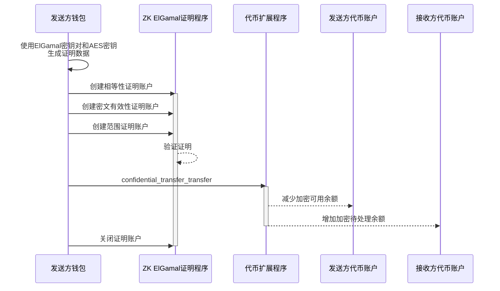

## 如何保密地将代币从一个代币账户转移到另一个账户

要保密地将代币从一个代币账户转移到另一个账户，发送方和接收方必须都拥有配置了
*rs`ConfidentialTransferAccount`*
状态并已批准进行保密转账的代币账户。发送方的代币账户还必须有可用的保密余额用于转账。

要保密转账代币：

1. 在客户端创建
   [三种证明](https://github.com/solana-program/token-2022/blob/d073cb89dbcd430387b5c6fb4b7157911351e4a3/confidential-transfer/proof-generation/src/transfer.rs#L35)：

   **相等性证明 ([CiphertextCommitmentEqualityProofData](https://github.com/anza-xyz/agave/blob/8b33d6d311c95780362a7d235919e7b8d2345939/zk-token-sdk/src/instruction/ciphertext_commitment_equality.rs#L56))**：验证转账后的新可用余额密文与其对应的
   [Pedersen承诺](https://en.wikipedia.org/wiki/Commitment_scheme)相匹配，确保源账户的新可用余额被正确计算为
   `new_balance = current_balance - transfer_amount`。

   **密文有效性证明 ([BatchedGroupedCiphertext3HandlesValidityProofData](https://github.com/anza-xyz/agave/blob/8b33d6d311c95780362a7d235919e7b8d2345939/zk-token-sdk/src/instruction/batched_grouped_ciphertext_validity/handles_3.rs#L63))**：验证转账金额密文为所有三方（源账户、目标账户和审计员）正确生成，确保转账金额在每一方的公钥下都被正确加密。

   **范围证明 ([BatchedRangeProofU128Data](https://github.com/anza-xyz/agave/blob/8b33d6d311c95780362a7d235919e7b8d2345939/zk-token-sdk/src/instruction/batched_range_proof/batched_range_proof_u128.rs#L37))**：验证新的可用余额和转账金额（分为低/高位）均为非负数且在指定范围内。

2. 对于每个证明：

   * 调用ZK ElGamal证明程序来验证证明数据。
   * 将特定证明的元数据存储在证明"上下文状态"账户中，以便在其他指令中使用。

3. 调用
   [ConfidentialTransferInstruction::Transfer](https://github.com/solana-program/token-2022/blob/efd0c957fefbd79882d77df5fb2dac88c001249c/program/src/extension/confidential_transfer/processor.rs#L604)
   指令，提供证明上下文状态账户。

4. 关闭证明上下文状态账户以回收用于创建它们的SOL。

以下图表展示了从发送方的代币账户向接收方的代币账户转账所涉及的步骤。



### 必需指令

要机密地将代币从一个代币账户转移到另一个账户，您必须：

* 在客户端生成相等性证明、密文有效性证明和范围证明
* 调用Zk ElGamal证明程序来验证证明并初始化"上下文状态"账户
* 调用
  [ConfidentialTransferInstruction::Transfer](https://github.com/solana-program/token-2022/blob/efd0c957fefbd79882d77df5fb2dac88c001249c/program/src/extension/confidential_transfer/processor.rs#L604)
  指令，提供三个证明账户。
* 关闭三个证明账户以回收租金。

`spl_token_client`库提供以下方法：

* `confidential_transfer_create_context_state_account`方法，用于创建证明账户。
* `confidential_transfer_transfer`调用`Transfer` 指令的方法。
* `confidential_transfer_close_context_state_account`关闭证明账户的方法。

### 示例代码

以下示例演示了如何在代币账户之间进行保密转账。

要运行此示例，请使用以下命令启动从主网克隆的带有代币扩展程序的本地验证器。您必须安装 Solana
CLI 才能启动本地验证器。

```terminal
$ solana-test-validator --clone-upgradeable-program TokenzQdBNbLqP5VEhdkAS6EPFLC1PHnBqCXEpPxuEb --url https://api.mainnet-beta.solana.com -r
```

<Callout type="info">
  在撰写本文时，保密转账功能尚未在默认的本地验证器上启用。您必须克隆主网代币扩展程序以运行示例代码。
</Callout>

<CodeTabs flags="r">
  ```rust !! title="main.rs"
  use anyhow::{Context, Result};
  use solana_client::nonblocking::rpc_client::RpcClient;
  use solana_sdk::{
      commitment_config::CommitmentConfig,
      signature::{Keypair, Signer},
      transaction::Transaction,
  };
  use spl_associated_token_account::{
      get_associated_token_address_with_program_id, instruction::create_associated_token_account,
  };
  use spl_token_client::{
      client::{ProgramRpcClient, ProgramRpcClientSendTransaction},
      spl_token_2022::{
          extension::{
              confidential_transfer::{
                  account_info::{TransferAccountInfo, WithdrawAccountInfo},
                  instruction::{configure_account, PubkeyValidityProofData},
                  ConfidentialTransferAccount,
              },
              BaseStateWithExtensions, ExtensionType,
          },
          id as token_2022_program_id,
          instruction::reallocate,
          solana_zk_sdk::encryption::{auth_encryption::*, elgamal::*},
      },
      token::{ExtensionInitializationParams, Token},
  };
  use spl_token_confidential_transfer_proof_extraction::instruction::{ProofData, ProofLocation};
  use spl_token_confidential_transfer_proof_generation::withdraw::WithdrawProofData;
  use std::sync::Arc;

  #[tokio::main] async fn main() -> Result<()> { // 创建与本地测试验证器的连接 let
  rpc_client = Arc::new(RpcClient::new_with_commitment(
  String::from("http://localhost:8899"), CommitmentConfig::confirmed(), ));

      // 加载默认的 Solana CLI 密钥对作为费用支付者
      // 这将是支付交易费用的钱包
      // 使用 Arc 防止密钥对的多次克隆
      let sender = Arc::new(load_keypair()?);
      println!("发送者: {}", sender.pubkey());

      // 生成一个新的密钥对作为代币铸币地址
      let mint = Keypair::new();
      println!("生成的铸币密钥对: {}", mint.pubkey());

      // 为代币客户端设置程序客户端
      let program_client = ProgramRpcClient::new(rpc_client.clone(), ProgramRpcClientSendTransaction);

      // 铸币的小数位数
      let decimals = 9;

      // 为 Token-2022 程序创建代币客户端
      // 这提供了代币操作的高级方法
      let token = Token::new(
          Arc::new(program_client),
          &token_2022_program_id(), // 使用 Token-2022 程序（带有扩展的新版本）
          &mint.pubkey(),           // 新代币铸币的地址
          Some(decimals),           // 小数位数
          sender.clone(),            // 交易的费用支付者
      );

      // 为铸币创建扩展初始化参数
      // ConfidentialTransferMint 扩展启用代币的保密（私密）转账
      let extension_initialization_params =
          vec![ExtensionInitializationParams::ConfidentialTransferMint {
              authority: Some(sender.pubkey()), // 可以修改保密转账设置的权限
              auto_approve_new_accounts: true, // 自动批准新的保密账户
              auditor_elgamal_pubkey: None,    // 如果没有审计员则为 None
          }];

      // 使用 ConfidentialTransferMint 扩展创建并初始化铸币
      // 这会发送一个交易来创建新的代币铸币
      let transaction_signature = token
          .create_mint(
              &sender.pubkey(),                 // 铸币权限 - 可以铸造新代币
              Some(&sender.pubkey()),           // 冻结权限 - 可以冻结代币账户
              extension_initialization_params, // 添加 ConfidentialTransferMint 扩展
              &[&mint],                        // 需要签名的铸币密钥对
          )
          .await?;

      println!("铸币地址: {}", mint.pubkey());
      println!(
          "创建铸币交易签名: {}",
          transaction_signature
      );

      // ===== 为保密转账创建并配置发送者代币账户 =====
      println!("\n创建并配置发送者代币账户");

      // 获取所有者的关联代币账户地址
      let sender_token_account_pubkey = get_associated_token_address_with_program_id(
          &sender.pubkey(),          // 代币账户所有者
          &mint.pubkey(),           // 铸币
          &token_2022_program_id(), // 代币程序 ID
      );
      println!("发送者代币账户地址: {}", sender_token_account_pubkey);

      // 第一步: 创建关联代币账户
      let create_associated_token_account_instruction = create_associated_token_account(
          &sender.pubkey(),          // 资金账户
          &sender.pubkey(),          // 代币账户所有者
          &mint.pubkey(),           // 铸币
          &token_2022_program_id(), // 代币程序 ID
      );

      // 第二步: 重新分配代币账户以包括 ConfidentialTransferAccount 扩展的空间
      let reallocate_instruction = reallocate(
          &token_2022_program_id(),                      // 代币程序 ID
          &sender_token_account_pubkey,                         // 代币账户
          &sender.pubkey(),                               // 支付者
          &sender.pubkey(),                               // 代币账户所有者
          &[&sender.pubkey()],                            // 签名者
          &[ExtensionType::ConfidentialTransferAccount], // 重新分配空间的扩展
      )?;

      // 第三步: 为代币账户生成 ElGamal 密钥对和 AES 密钥
      let sender_elgamal_keypair = ElGamalKeypair::new_from_signer(&sender, &sender_token_account_pubkey.to_bytes())
          .expect("无法创建 ElGamal 密钥对");
      let sender_aes_key = AeKey::new_from_signer(&sender, &sender_token_account_pubkey.to_bytes())
          .expect("无法创建 AES 密钥");

      // 在 ApplyPendingBalance 指令必须执行之前，
      // 最大的 Deposit 和 Transfer 指令数量可以增加 pending_balance
      let maximum_pending_balance_credit_counter = 65536;

      // 初始代币余额为 0
      let sender_decryptable_balance = sender_aes_key.encrypt(0);

      // 客户端生成证明数据
      let proof_data = PubkeyValidityProofData::new(&sender_elgamal_keypair)
          .map_err(|_| anyhow::anyhow!("无法生成证明数据"))?;

      // 指示证明包含在同一交易中
      let proof_location =
          ProofLocation::InstructionOffset(1.try_into()?, ProofData::InstructionData(&proof_data));

      // 第四步: 创建指令以配置账户以进行保密转账
      let configure_account_instructions = configure_account(
          &token_2022_program_id(),               // 程序 ID
          &sender_token_account_pubkey,                  // 代币账户
          &mint.pubkey(),                         // 铸币
          &sender_decryptable_balance.into(),            // 初始余额
          maximum_pending_balance_credit_counter, // 最大 pending_balance 信用计数器
          &sender.pubkey(),                        // 代币账户所有者
          &[],                                    // 额外签名者
          proof_location,                         // 证明位置
      )?;

      // 合并所有指令
      let mut instructions = vec![
          create_associated_token_account_instruction,
          reallocate_instruction,
      ];
      instructions.extend(configure_account_instructions);

      // 创建并发送交易
      let recent_blockhash = rpc_client.get_latest_blockhash().await?;
      let transaction = Transaction::new_signed_with_payer(
          &instructions,
          Some(&sender.pubkey()),
          &[&sender],
          recent_blockhash,
      );

      let transaction_signature = rpc_client
          .send_and_confirm_transaction(&transaction)
          .await?;
      println!(
          "创建发送者代币账户交易签名: {}",
          transaction_signature
      );

      // 铸造一些代币到新创建的代币账户
      // 这为账户提供了一些代币以供使用
      let mint_signature = token
          .mint_to(
              &sender_token_account_pubkey,            // 目标账户
              &sender.pubkey(),                  // 铸币权限
              100 * 10u64.pow(decimals as u32), // 数量 (100 个代币)
              &[&sender],                        // 签名者
          )
          .await?;

      println!("铸造代币到发送者代币账户交易签名: {}", mint_signature);

      // 将代币存入保密状态
      // 这将公共代币余额转换为保密 pending_balance
      println!("将代币存入保密状态 pending_balance");
      let deposit_signature = token
          .confidential_transfer_deposit(
              &sender_token_account_pubkey,            // 代币账户
              &sender.pubkey(),                  // 账户的权限 (所有者)
              100 * 10u64.pow(decimals as u32), // 存款金额 (100 个代币)
              decimals,                         // 代币的小数位数
              &[&sender],                        // 签名者 (所有者必须签名)
          )
          .await?;

      println!(
          "保密转账存款签名: {}",
          deposit_signature
      );

      // 将 pending_balance 应用到可用余额
      println!("将 pending_balance 应用到可用余额");
      let apply_signature = token
          .confidential_transfer_apply_pending_balance(
              &sender_token_account_pubkey,    // 代币账户
              &sender.pubkey(),          // 账户的权限 (所有者)
              None,                     // 可选的 ApplyPendingBalanceAccountInfo，如果未提供则生成
              sender_elgamal_keypair.secret(), // 用于解密的 ElGamal 私钥
              &sender_aes_key,                 // 用于加密余额和转账金额的 AES 密钥
              &[&sender],                // 签名者 (所有者必须签名)
          )
          .await?;
      println!("应用 Pending Balance 签名: {}", apply_signature);

      // ===== 从保密可用余额中提取一半代币 =====
      println!("\n从保密可用余额中提取代币到公共余额");

      // 计算提取金额 (存款金额的一半)
      let withdraw_amount = 50 * 10u64.pow(decimals as u32); // 存款的 100 个代币的一半

      // 获取代币账户数据以访问保密转账扩展
      let token_account = token.get_account_info(&sender_token_account_pubkey).await?;

      // 解包代币账户数据的 ConfidentialTransferAccount 扩展部分
      let extension_data = token_account.get_extension::<ConfidentialTransferAccount>()?;

      // 构造 Withdraw 指令所需的保密转账扩展信息
      let withdraw_account_info = WithdrawAccountInfo::new(extension_data);

      // 为证明账户创建密钥对
      let equality_proof_context_state_keypair = Keypair::new();
      let equality_proof_context_state_pubkey = equality_proof_context_state_keypair.pubkey();
      let range_proof_context_state_keypair = Keypair::new();
      let range_proof_context_state_pubkey = range_proof_context_state_keypair.pubkey();

      // 创建提取证明数据
      let WithdrawProofData {
          equality_proof_data,
          range_proof_data,
      } = withdraw_account_info.generate_proof_data(
          withdraw_amount,  // 从保密可用余额中提取的金额
          &sender_elgamal_keypair, // 用于加密的 ElGamal 密钥对
          &sender_aes_key,         // 用于加密的 AES 密钥
      )?;

      // 生成等式证明账户
      println!("创建等式证明上下文状态账户...");
      let equality_proof_signature = token
          .confidential_transfer_create_context_state_account(
              &equality_proof_context_state_pubkey, // 新的等式证明上下文状态账户的公钥
              &sender.pubkey(), // 可以关闭上下文状态账户的权限
              &equality_proof_data, // 用于等式证明验证的证明数据
              false, // False: 在一个交易中合并账户创建和证明验证
              &[&equality_proof_context_state_keypair], // 新账户的签名者
          )
          .await?;
      println!(
          "等式证明上下文状态账户签名: {}",
          equality_proof_signature
      );

      // 生成范围证明账户
      println!("创建范围证明上下文状态账户...");
      let range_proof_signature = token
          .confidential_transfer_create_context_state_account(
              &range_proof_context_state_pubkey, // 新的范围证明上下文状态账户的公钥
              &sender.pubkey(),                   // 可以关闭上下文状态账户的权限
              &range_proof_data,                 // 用于范围证明验证的证明数据
              true, // True: 将账户创建和证明验证分成单独的交易 (用于大证明)
              &[&range_proof_context_state_keypair], // 新账户的签名者
          )
          .await?;
      println!(
          "范围证明上下文状态账户签名: {}",
          range_proof_signature
      );

      // 执行提取
      println!("执行提取交易...");
      let withdraw_signature = token
          .confidential_transfer_withdraw(
              &sender_token_account_pubkey, // 提取的代币账户
              &sender.pubkey(),       // 代币账户的所有者
              Some(&spl_token_client::token::ProofAccount::ContextAccount(
                  equality_proof_context_state_pubkey, // 等式证明账户的引用
              )),
              Some(&spl_token_client::token::ProofAccount::ContextAccount(
                  range_proof_context_state_pubkey, // 范围证明账户的引用
              )),
              withdraw_amount,             // 从保密可用余额中提取的金额
              decimals,                    // 代币的小数精度
              Some(withdraw_account_info), // 用于证明验证的保密转账扩展数据
              &sender_elgamal_keypair, // 用于加密的 ElGamal 密钥对
              &sender_aes_key,         // 用于加密的 AES 密钥
              &[&sender],        // 所有者必须签署交易
          )
          .await?;
      println!("提取交易签名: {}", withdraw_signature);

      // 关闭上下文状态账户以回收租金
      println!("关闭等式证明上下文状态账户...");
      let close_equality_signature = token
          .confidential_transfer_close_context_state_account(
              &equality_proof_context_state_pubkey, // 要关闭的等式证明上下文状态账户
              &sender_token_account_pubkey,                // 将接收 lamports 的账户
              &sender.pubkey(),                      // 被允许关闭账户的权限
              &[&sender],                            // 权限必须签名
          )
          .await?;
      println!(
          "关闭等式证明账户签名: {}",
          close_equality_signature
      );

      println!("关闭范围证明上下文状态账户...");
      let close_range_signature = token
          .confidential_transfer_close_context_state_account(
              &range_proof_context_state_pubkey, // 要关闭的范围证明上下文状态账户
              &sender_token_account_pubkey,             // 将接收 lamports 的账户
              &sender.pubkey(),                   // 被允许关闭账户的权限
              &[&sender],                         // 权限必须签名
          )
          .await?;
      println!(
          "关闭范围证明账户签名: {}",
          close_range_signature
      );

      println!("\n保密转账成功完成！");
      println!("发送者代币账户: {}", sender_token_account_pubkey);
      println!(
          "接收者代币账户: {}",
          recipient_token_account_pubkey
      );

      Ok(())

  }

  // 从默认的 Solana
  CLI 密钥对路径 (~/.config/solana/id.json) 加载密钥对 // 这使得可以使用与 Solana
  CLI 工具相同的钱包 fn load_keypair() -> Result<Keypair> {
  // 获取默认密钥对路径let keypair_path = dirs::home_dir()
  .context("无法找到主目录")? .join(".config/solana/id.json");

      // 使用 serde_json 直接将密钥对文件读取为字节
      // 密钥对文件是一个字节数组的 JSON
      let file = std::fs::File::open(&keypair_path)?;
      let keypair_bytes: Vec<u8> = serde_json::from_reader(file)?;

      // 从加载的字节创建密钥对
      // 这将字节数组转换为密钥对
      let keypair = Keypair::from_bytes(&keypair_bytes)?;

      Ok(keypair)

  }

  ```

  ```toml !! title="Cargo.toml"
  [package]
  name = "confidential-transfer"
  version = "0.1.0"
  edition = "2021"

  [dependencies]
  solana-client = "2.2.2"
  solana-sdk = "2.2.2"
  spl-associated-token-account = "6.0.0"
  spl-token-client = "0.14.0"
  spl-token-confidential-transfer-proof-extraction = "0.2.1"
  spl-token-confidential-transfer-proof-generation = "0.3.0"

  anyhow = "1.0.95"
  dirs = "6.0.0"
  serde_json = "1.0.135"
  tokio = { version = "1.44.2", features = ["full"] }
  ```
</CodeTabs>
