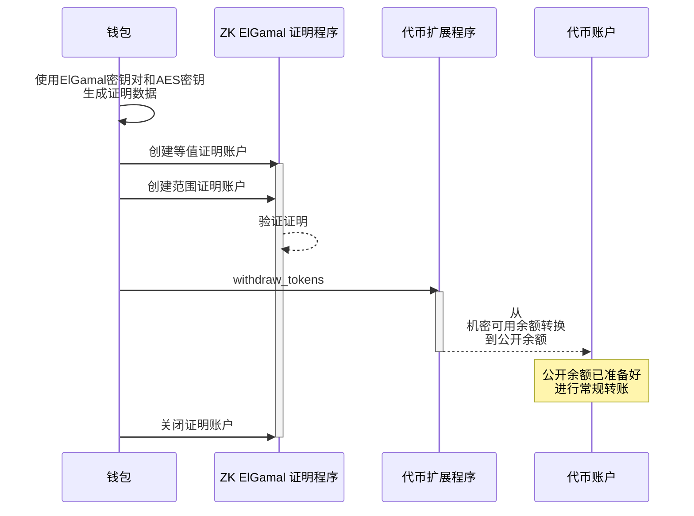

## 如何从机密可用余额中提取代币

要从机密可用余额提取代币到公开余额：

1. 在客户端创建
   [两个证明](https://github.com/solana-program/token-2022/blob/efd0c957fefbd79882d77df5fb2dac88c001249c/confidential-transfer/proof-generation/src/withdraw.rs#L22)：

   **相等性证明 ([CiphertextCommitmentEqualityProofData](https://github.com/anza-xyz/agave/blob/8b33d6d311c95780362a7d235919e7b8d2345939/zk-token-sdk/src/instruction/ciphertext_commitment_equality.rs#L56))**：验证提款后剩余的可用余额密文与其对应的
   [Pedersen 承诺](https://en.wikipedia.org/wiki/Commitment_scheme)相匹配，确保账户的新可用余额被正确计算为
   `remaining_balance = current_balance - withdraw_amount`。

   **范围证明 ([BatchedRangeProofU64Data](https://github.com/anza-xyz/agave/blob/8b33d6d311c95780362a7d235919e7b8d2345939/zk-token-sdk/src/instruction/batched_range_proof/batched_range_proof_u64.rs#L37))**：验证提款后的剩余可用余额为非负数且在指定范围内。

2. 对于每个证明：

   * 调用 ZK ElGamal 证明程序来验证证明数据。
   * 将特定于证明的元数据存储在证明"上下文状态"账户中，以便在其他指令中使用。

3. 调用
   [ConfidentialTransferInstruction::Withdraw](https://github.com/solana-program/token-2022/blob/efd0c957fefbd79882d77df5fb2dac88c001249c/program/src/extension/confidential_transfer/processor.rs#L493)
   指令，提供两个证明账户。

4. 关闭证明账户以回收用于创建它们的 SOL。

以下图表展示了从机密可用余额提取代币到公开余额的步骤：



### 所需指令

要从机密可用余额提取代币到公开余额，您必须：

* 在客户端生成等值证明和范围证明
* 调用Zk ElGamal证明程序来验证证明并初始化"上下文状态"账户
* 调用
  [ConfidentialTransferInstruction::Withdraw](https://github.com/solana-program/token-2022/blob/efd0c957fefbd79882d77df5fb2dac88c001249c/program/src/extension/confidential_transfer/processor.rs#L493)
  指令，提供两个证明账户。
* 关闭两个证明账户以回收租金。

`spl_token_client` crate提供以下方法：

* `confidential_transfer_create_context_state_account` 方法，用于创建证明账户。
* `confidential_transfer_withdraw` 方法，用于调用 `Withdraw` 指令。
* `confidential_transfer_close_context_state_account` 方法，用于关闭证明账户。

### 示例代码

以下示例演示了如何从机密可用余额提取代币到公开余额。

要运行此示例，请使用以下命令启动本地验证器，该验证器从主网克隆了代币扩展程序。您必须安装Solana
CLI才能启动本地验证器。

```terminal
$ solana-test-validator --clone-upgradeable-program TokenzQdBNbLqP5VEhdkAS6EPFLC1PHnBqCXEpPxuEb --url https://api.mainnet-beta.solana.com -r
```

<Callout type="info">
  在撰写本文时，机密转账功能在默认的本地验证器上尚未启用。您必须克隆主网代币扩展程序才能运行示例代码。
</Callout>

<CodeTabs flags="r">
  ```rust !! title="main.rs"
  use anyhow::{Context, Result};
  use solana_client::nonblocking::rpc_client::RpcClient;
  use solana_sdk::{
      commitment_config::CommitmentConfig,
      signature::{Keypair, Signer},
      transaction::Transaction,
  };
  use spl_associated_token_account::{
      get_associated_token_address_with_program_id, instruction::create_associated_token_account,
  };
  use spl_token_client::{
      client::{ProgramRpcClient, ProgramRpcClientSendTransaction},
      spl_token_2022::{
          extension::{
              confidential_transfer::{
                  account_info::WithdrawAccountInfo,
                  ConfidentialTransferAccount,
                  instruction::{configure_account, PubkeyValidityProofData},
              },
              BaseStateWithExtensions, ExtensionType,
          },
          id as token_2022_program_id,
          instruction::reallocate,
          solana_zk_sdk::encryption::{auth_encryption::*, elgamal::*},
      },
      token::{ExtensionInitializationParams, Token},
  };
  use spl_token_confidential_transfer_proof_extraction::instruction::{ProofData, ProofLocation};
  use spl_token_confidential_transfer_proof_generation::withdraw::WithdrawProofData;
  use std::sync::Arc;

  #[tokio::main] async fn main() -> Result<()> { // 创建连接到本地测试验证器 let
  rpc_client = Arc::new(RpcClient::new_with_commitment(
  String::from("http://localhost:8899"), CommitmentConfig::confirmed(), ));

      // 加载默认的Solana CLI密钥对作为费用支付者
      // 这将是支付交易费用的钱包
      // 使用Arc防止密钥对被多次克隆
      let payer = Arc::new(load_keypair()?);
      println!("Using payer: {}", payer.pubkey());

      // 生成一个新的密钥对作为代币铸造地址
      let mint = Keypair::new();
      println!("Mint keypair generated: {}", mint.pubkey());

      // 为Token客户端设置程序客户端
      let program_client = ProgramRpcClient::new(rpc_client.clone(), ProgramRpcClientSendTransaction);

      // 铸造的小数位数
      let decimals = 9;

      // 为Token-2022程序创建一个代币客户端
      // 这提供了代币操作的高级方法
      let token = Token::new(
          Arc::new(program_client),
          &token_2022_program_id(), // 使用Token-2022程序（带扩展的新版本）
          &mint.pubkey(),           // 新代币铸造的地址
          Some(decimals),           // 小数位数
          payer.clone(),            // 交易费用支付者
      );

      // 为铸造创建扩展初始化参数
      // ConfidentialTransferMint扩展启用代币的机密（私密）转账
      let extension_initialization_params =
          vec![ExtensionInitializationParams::ConfidentialTransferMint {
              authority: Some(payer.pubkey()), // 可以修改机密转账设置的权限
              auto_approve_new_accounts: true, // 自动批准新的机密账户
              auditor_elgamal_pubkey: None,    // 可选的审计员ElGamal公钥
          }];

      // 创建并初始化带有ConfidentialTransferMint扩展的铸造
      // 这会发送一个交易来创建新的代币铸造
      let transaction_signature = token
          .create_mint(
              &payer.pubkey(),                 // 铸造权限 - 可以铸造新代币
              Some(&payer.pubkey()),           // 冻结权限 - 可以冻结代币账户
              extension_initialization_params, // 添加ConfidentialTransferMint扩展
              &[&mint],                        // 需要铸造密钥对作为签名者
          )
          .await?;

      // 打印结果供用户验证
      println!("Mint Address: {}", mint.pubkey());
      println!(
          "Mint Creation Transaction Signature: {}",
          transaction_signature
      );

      // ===== 创建并配置用于机密转账的代币账户 =====
      println!("\nCreate and configure token account for confidential transfers");

      // 获取所有者的关联代币账户地址
      let token_account_pubkey = get_associated_token_address_with_program_id(
          &payer.pubkey(),          // 代币账户所有者
          &mint.pubkey(),           // 铸造
          &token_2022_program_id(), // 代币程序ID
      );
      println!("Token Account Address: {}", token_account_pubkey);

      // 步骤1：创建关联代币账户
      let create_associated_token_account_instruction = create_associated_token_account(
          &payer.pubkey(),          // 资金账户
          &payer.pubkey(),          // 代币账户所有者
          &mint.pubkey(),           // 铸造
          &token_2022_program_id(), // 代币程序ID
      );

      // 步骤2：重新分配代币账户空间，为ConfidentialTransferAccount扩展留出空间
      let reallocate_instruction = reallocate(
          &token_2022_program_id(),                      // 代币程序ID
          &token_account_pubkey,                         // 代币账户
          &payer.pubkey(),                               // 支付者
          &payer.pubkey(),                               // 代币账户所有者
          &[&payer.pubkey()],                            // 签名者
          &[ExtensionType::ConfidentialTransferAccount], // 需要重新分配空间的扩展
      )?;

      // 步骤3：为代币账户生成ElGamal密钥对和AES密钥
      let elgamal_keypair = ElGamalKeypair::new_from_signer(&payer, &token_account_pubkey.to_bytes())
          .expect("Failed to create ElGamal keypair");
      let aes_key = AeKey::new_from_signer(&payer, &token_account_pubkey.to_bytes())
          .expect("Failed to create AES key");

      // 在必须执行ApplyPendingBalance指令之前，
      // 可以为pending_balance增加信用的Deposit和Transfer指令的最大数量
      let maximum_pending_balance_credit_counter = 65536;

      // 初始代币余额为0
      let decryptable_balance = aes_key.encrypt(0);

      // 在客户端生成证明数据
      let proof_data = PubkeyValidityProofData::new(&elgamal_keypair)
          .map_err(|_| anyhow::anyhow!("Failed to generate proof data"))?;

      // 指示证明包含在同一交易中
      let proof_location =
          ProofLocation::InstructionOffset(1.try_into()?, ProofData::InstructionData(&proof_data));

      // 步骤4：创建配置账户用于机密转账的指令
      let configure_account_instructions = configure_account(
          &token_2022_program_id(),               // 程序ID
          &token_account_pubkey,                  // 代币账户
          &mint.pubkey(),                         // 铸造
          &decryptable_balance.into(),            // 初始余额
          maximum_pending_balance_credit_counter, // 最大待处理余额信用计数器
          &payer.pubkey(),                        // 代币账户所有者
          &[],                                    // 额外签名者
          proof_location,                         // 证明位置
      )?;

      // 合并所有指令
      let mut instructions = vec![
          create_associated_token_account_instruction,
          reallocate_instruction,
      ];
      instructions.extend(configure_account_instructions);

      // 创建并发送交易
      let recent_blockhash = rpc_client.get_latest_blockhash().await?;
      let transaction = Transaction::new_signed_with_payer(
          &instructions,
          Some(&payer.pubkey()),
          &[&*payer],
          recent_blockhash,
      );

      let setup_signature = rpc_client
          .send_and_confirm_transaction(&transaction)
          .await?;
      println!(
          "Token Account Setup Transaction Signature: {}",
          setup_signature
      );

      // 向新创建的代币账户铸造一些代币
      // 这给账户提供一些可以使用的代币
      let mint_signature = token
          .mint_to(
              &token_account_pubkey,            // 目标账户
              &payer.pubkey(),                  // 铸造权限
              100 * 10u64.pow(decimals as u32), // 数量（100个代币，带小数精度）
              &[&payer],                        // 签名者
          )
          .await?;

      println!("Token Minting Transaction Signature: {}", mint_signature);

      // 将代币存入机密状态
      // 这将常规代币转换为机密代币
      println!("Deposit tokens to confidential state pending balance");
      let deposit_signature = token
          .confidential_transfer_deposit(
              &token_account_pubkey,            // 代币账户
              &payer.pubkey(),                  // 账户的权限（所有者）
              100 * 10u64.pow(decimals as u32), // 存入金额（100个代币）
              decimals,                         // 代币的小数位数
              &[&payer],                        // 签名者（所有者必须签名）
          )
          .await?;

      println!(
          "Confidential Transfer Deposit Signature: {}",
          deposit_signature
      );

      // 应用待处理余额使资金可用
      println!("Apply pending balance to available balance");
      let apply_signature = token
          .confidential_transfer_apply_pending_balance(
              &token_account_pubkey,    // 代币账户
              &payer.pubkey(),          // 账户的权限（所有者）
              None,                     // 可选的新可解密可用余额
              elgamal_keypair.secret(), // ElGamal密钥加密
              &aes_key,                 // 用于加密的AES密钥
              &[&payer],                // 签名者（所有者必须签名）
          )
          .await?;

      println!("Apply Pending Balance Signature: {}", apply_signature);

      // ===== 从机密状态中提取一半的代币 =====
      println!("\nWithdraw tokens from confidential available balance");

      // 计算提取金额（存入金额的一半）
      let withdraw_amount = 50 * 10u64.pow(decimals as u32); // 存入的100个代币的一半

      // 获取代币账户数据以访问机密转账扩展
      let token_account = token.get_account_info(&token_account_pubkey).await?;

      // 解包代币账户数据中的ConfidentialTransferAccount扩展部分
      let extension_data = token_account.get_extension::<ConfidentialTransferAccount>()?;

      // 构建"提取"指令所需的机密转账扩展信息
      let withdraw_account_info =
          WithdrawAccountInfo::new(
              extension_data,
          );

      // 为证明账户创建密钥对
      let equality_proof_context_state_keypair = Keypair::new();
      let equality_proof_context_state_pubkey = equality_proof_context_state_keypair.pubkey();
      let range_proof_context_state_keypair = Keypair::new();
      let range_proof_context_state_pubkey = range_proof_context_state_keypair.pubkey();

      // 创建提取证明数据
      let WithdrawProofData {
          equality_proof_data,
          range_proof_data,
      } = withdraw_account_info.generate_proof_data(
          withdraw_amount,  // 从机密状态提取的金额
          &elgamal_keypair, // 用于加密的ElGamal密钥对
          &aes_key,         // 用于加密的AES密钥
      )?;

      // 生成等式证明账户
      println!("Create equality proof context state account");
      let equality_proof_signature = token
          .confidential_transfer_create_context_state_account(
              &equality_proof_context_state_pubkey, // 新等式证明上下文状态账户的公钥
              &payer.pubkey(), // 可以关闭上下文状态账户的权限
              &equality_proof_data, // 等式证明验证的证明数据
              false, // False：在一个交易中合并账户创建和证明验证
              &[&equality_proof_context_state_keypair], // 新账户的签名者
          )
          .await?;
      println!(
          "Equality Proof Context State Account Signature: {}",
          equality_proof_signature
      );

      // 生成范围证明账户
      println!("Create range proof context state account");
      let range_proof_signature = token
          .confidential_transfer_create_context_state_account(
              &range_proof_context_state_pubkey, // 新范围证明上下文状态账户的公钥
              &payer.pubkey(),                   // 可以关闭上下文状态账户的权限
              &range_proof_data,                 // 范围证明验证的证明数据
              true, // True：将账户创建和证明验证拆分为单独的交易（用于大型证明）
              &[&range_proof_context_state_keypair], // 新账户的签名者
          )
          .await?;
      println!(
          "Range Proof Context State Account Signature: {}",
          range_proof_signature
      );

      // 执行提款
      println!("Execute withdrawal transaction");
      let withdraw_signature = token
          .confidential_transfer_withdraw(
              &token_account_pubkey, // 要从中提取的代币账户
              &payer.pubkey(),       // 代币账户的所有者
              Some(&spl_token_client::token::ProofAccount::ContextAccount(
                  equality_proof_context_state_pubkey, // 等式证明账户的引用
              )),
              Some(&spl_token_client::token::ProofAccount::ContextAccount(
                  range_proof_context_state_pubkey, // 范围证明账户的引用
              )),
              withdraw_amount,             // 从机密状态提取的金额
              decimals,                    // 代币的小数精度
              Some(withdraw_account_info), // 来自机密转账扩展的数据，用于证明验证
              &elgamal_keypair, // 用于加密的ElGamal密钥对
              &aes_key,         // 用于加密的AES密钥
              &[&payer],        // 所有者必须签署交易
          )
          .await?;
      println!("Withdraw Transaction Signature: {}", withdraw_signature);

      // 关闭上下文状态账户以恢复租金
      println!("Close equality proof context state account");
      let close_equality_signature = token
          .confidential_transfer_close_context_state_account(
              &equality_proof_context_state_pubkey, // 要关闭的等式证明上下文状态账户
              &token_account_pubkey,                // 将接收lamports的账户
              &payer.pubkey(),                      // 允许关闭账户的权限
              &[&payer],                            // 权限必须签名
          )
          .await?;
      println!(
          "Close Equality Proof Account Signature: {}",
          close_equality_signature
      );

      println!("Close range proof context state account");
      let close_range_signature = token
          .confidential_transfer_close_context_state_account(
              &range_proof_context_state_pubkey, // 要关闭的范围证明上下文状态账户
              &token_account_pubkey,             // 将接收lamports的账户
              &payer.pubkey(),                   // 允许关闭账户的权限
              &[&payer],                         // 权限必须签名
          )
          .await?;
      println!(
          "Close Range Proof Account Signature: {}",
          close_range_signature
      );
      Ok(())

  }

  // 从默认的Solana
  CLI密钥对路径（~/.config/solana/id.json）加载密钥对 // 这使得可以使用与Solana
  CLI工具相同的钱包fn load_keypair() -> Result<Keypair> {
  // 获取默认密钥对路径 let keypair_path = dirs::home_dir() .context("Could not
  find home directory")? .join(".config/solana/id.json");

      // 使用serde_json直接将密钥对文件读入字节
      // 密钥对文件是一个字节的JSON数组
      let file = std::fs::File::open(&keypair_path)?;
      let keypair_bytes: Vec<u8> = serde_json::from_reader(file)?;

      // 从加载的字节创建密钥对
      // 这将字节数组转换为密钥对
      let keypair = Keypair::from_bytes(&keypair_bytes)?;

      Ok(keypair)

  }

  ```

  ```toml !! title="Cargo.toml"
  [package]
  name = "confidential-transfer"
  version = "0.1.0"
  edition = "2021"

  [dependencies]
  solana-client = "2.2.2"
  solana-sdk = "2.2.2"
  spl-associated-token-account = "6.0.0"
  spl-token-client = "0.14.0"
  spl-token-confidential-transfer-proof-extraction = "0.2.1"
  spl-token-confidential-transfer-proof-generation = "0.3.0"

  anyhow = "1.0.95"
  dirs = "6.0.0"
  serde_json = "1.0.135"
  tokio = { version = "1.44.2", features = ["full"] }
  ```
</CodeTabs>
